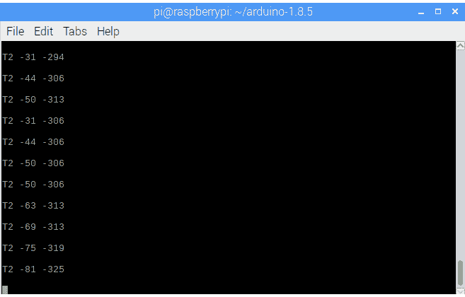

# 现成的黑客:Linux 串行线的怪癖

> 原文：<https://thenewstack.io/off-shelf-hacker-quirks-linux-serial-line/>

我们还没怎么讨论的是我的最新项目产生的数据，机器人头骨赫德利。没错，在内心深处，赫德利是一个“物联网”设备。他有传感器，这些传感器产生数据，然后可以用于分析，活动记录，并作为应用程序或其他设备的输入。

例如，当我带赫德利去参加我的下一次技术讲座时，我想制作一些便携式联网聚光灯，可以随身携带。他会坐在房间前面的一张小桌子上，当我在舞台上走动时跟踪我。如果有几盏聚光灯跟着我，岂不是很酷？或者，也许一个机器人摄像机，来记录我的会议。在我演讲的过程中，来自赫德利的数据可以将这两个小工具引导到正确的位置。嘿，我是独角戏，利用最新的技术来完成工作。

现在，赫德利的主要数据生产者是 [JeVois 智能机器视觉摄像机](http://jevois.org/)。它提供增强的 USB 视频输入和硬件串行线路输出。根据当时运行的特定车载视觉分析应用程序，增强视频对于监控传感器正在解释的内容非常有用。硬件串行线将位置数据发送到 Arduino，然后 Arduino 移动连接到头骨的伺服系统，使相机保持在其感兴趣的点上。

USB 电缆上还有一个软件串行馈送。这是流经硬件串行线的镜像，您可以用它来馈送其他应用程序和设备。今天，我们将集中精力整理 USB 串行线设置，这样我们就可以实际获取有用的数据。

## MQTT 和 Python 脚本的前奏

不久前，我探索了使用 MQTT 发布-订阅模型在机器、设备和服务器之间传送数据的[。对我来说，MQTT 代表了一个很好的头骨通信协议，因为它是一对多和多对一的模型。换句话说，skull 可以通过管道传输其 USB 串行数据，可能通过 Python 程序传输到 MQTT 服务器和多个客户端，然后这些客户端可以根据需要获取和使用数据。](https://thenewstack.io/off-shelf-hacker-lightweight-inter-device-messaging-mqtt/)

使用 MQTT 还抽象了数据的来源。聚光灯是从头骨还是从我手中拿着的一个电池供电的 ESP8266 点击器获得指向数据并不重要。其中一个或两个都可以与 MQTT 一起工作。不仅如此，由于我们可以在闭环反馈中向两个方向发送数据，纠错也是可能的。例如，只需将数据从聚光灯发布回 MQTT 服务器，并让 skull 对这些数据做些事情。

Python 通过库对 MQTT 提供了很好的支持，所以编写程序来自动化我们如何使用数据以及将数据发送到哪里，肯定会是赫德利的未来。最棒的是，因为 skull 有一个 Raspberry Pi 3，我们可以简单地在那里安装一个 MQTT 服务器。而且，Python 也很容易获得。

我们将在接下来的故事中讨论 MQTT。在我们让串行数据处理可靠地工作之前，一切都是空谈。

## 古怪的 Linux 串行线和 JeVois 相机命令

让串行数据流入/流出 JeVois 传感器并通过 Raspberry Pi 是一件棘手的事情。首先，你需要告诉传感器运行什么样的神经网络应用程序。最简单的方法是运行 [guvcview](http://guvcview.sourceforge.net/) 命令并选择合适的分辨率。当然，显示器、键盘和树莓皮需要连接到 JeVois 设备上，这样才能工作。

一旦摄像机开始运行，并且您正在监控视频馈送，您可能会认为您只需在 Pi 的一个终端上键入一个简单的命令，就可以输出数据流，因为 Linux 中的所有东西，包括设备，都被认为是文件。但是，不！

例如，有时我会输入'**cat/dev/tty ACM 0【T3]'，但什么也没有得到。命令行只是静静地坐在那里嘲笑我。**

解决方法是使用 **[stty](https://www.computerhope.com/unix/ustty.htm)** 命令来配置串口。stty 有很多选项，尽管我们只需要几个。在 skull 的 Raspberry Pi 终端中，我刚刚输入了以下内容。

```
sudo stty  -raw  -F  /dev/ttyACM0  115200

```

**[sudo](https://linuxacademy.com/blog/linux/linux-commands-for-beginners-sudo/)** 用于避免与 **/dev** 文件权限冲突。-raw 选项来回传输数据，没有任何修改或过滤。F 指定设备，在本例中为 **/dev/ttyACM0** 。最后，115200 设置串行线速度。

一旦 **stty** 命令执行，像 **cat** 这样的运行命令应该是一帆风顺的。

没那么快。您必须显式设置 JeVois 传感器，以便从 USB 串行端口发送数据。这很容易做到，从 Raspberry Pi 发送数据到串行端口。

由于 JeVois 传感器实际上是一个运行在设备中 ARM 处理器上的小型 Linux 机器，它有一个用于配置的[基本命令行](http://jevois.org/doc/UserCli.html)。你可以发送一些命令来改变相机的分辨率(它将运行哪个神经网络程序)，获取关于设备的信息等等。只需通过 USB 串行线向它发送一个命令。

实际命令的形式是'<command></command> <parameter><value>'。</value></parameter>

在这里，它被卷起，将命令发送到 JeVois，然后通过 cat 命令返回最终的相机数据输出。

```
sudo bash  -c  "echo 'setpar serout All' &gt; /dev/ttyACM0";  cat  /dev/ttyACM0

```

再次**须藤**负责权限。然后，我们在 bash shell 下运行 echo 命令，并将“setpar serout All”文本字符串发送到 **/dev/ttyACM0** 串行端口。这是一个连接到 JeVois 摄像头。最后，第二个命令 **cat** 用于显示从串口返回的内容。在这种情况下，它是来自 JeVois 摄像机的位置数据。

在 setpar 命令中使用“All”选项很重要，因为这将打开硬件串行线和 USB 串行输出的数据流。

下面是一些数据的截图。



在 Raspberry Pi 3 终端显示器上看到的 JeVois 传感器数据

连接到 Raspberry Pi USB 串行端口的 JeVois 传感器的一个特别奇怪的行为是，当数据没有被发送时，视频馈送偶尔会冻结。

不过，这很容易解决。只需执行另一个 cat 命令。视频将再次开始，串行数据也将出现在终端屏幕上。

## 下一步是什么

这是一次快速浏览 Linux USB 串行线配置和使用迷宫的旅程。请记住，虽然您可以在命令行上将数据重定向或传输(分别使用 Linux redirect ' **>** '和 pipe ' **|** '符号)到其他应用程序和设备，但在后台运行的 Python 程序是完成我们的自动化任务的更实用的方法。

你必须先爬后走，因此消除项目中的串行线部分始终是一项重要的开发练习。如果你能把数据传送到终端显示器上，你就一定能把它输入程序或传送到网络上。

请务必在不久的将来[关注赫德利的 MQTT 安装和 Python 脚本开发](/tag/off-the-shelf-hacker/)。

由 [Christopher Burns](https://unsplash.com/photos/dzejyfCAzIA?utm_source=unsplash&utm_medium=referral&utm_content=creditCopyText) 在 [Unsplash](https://unsplash.com/?utm_source=unsplash&utm_medium=referral&utm_content=creditCopyText) 上拍摄的特征图像。

<svg xmlns:xlink="http://www.w3.org/1999/xlink" viewBox="0 0 68 31" version="1.1"><title>Group</title> <desc>Created with Sketch.</desc></svg>