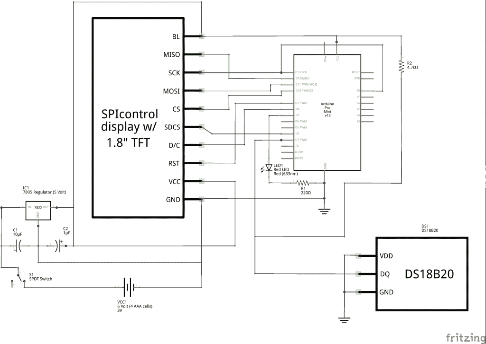
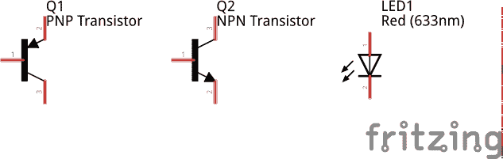

# 现成的黑客:像专家一样阅读原理图

> 原文：<https://thenewstack.io/off-shelf-hacker-read-schematics-like-pro/>

物理计算黑客需要能够阅读和创建原理图。这是一项必备技能。

需要记录布线布局、电子元件、传感器、电机驱动器、电源和其他连接。拥有你的设备的记录是很棒的，这样你就可以出售计划，写下你的项目，或者只是回忆一个月前你的设备的制造细节。当你给现有的家用电器添加物联网(IoT)功能时，以及当我写一个新的现成黑客故事时，能够阅读原理图也很方便。

像其他事情一样，一旦你掌握了窍门，阅读和绘制原理图是一项不难学习的技能。

## **什么是原理图？**

原理图是电子设备的符号布线路线图。原理图的作用是告诉你如何把所有东西连接起来。这些年来，普遍理解的符号和实践已经演变，所以无论行业或商业，如果你能读懂一个，你就能读懂全部。

这是我的蒸汽朋克徽章的示意图:

示意图-蒸汽朋克会议徽章 1.0 版

这些器件包括一个 Arduino Pro-Mini 微控制器、一个 1.8 英寸彩色 TFT LCD 显示器、一个 DS18B20 数字温度传感器、一个 7805 稳压器、一个 6 伏电池、几个电阻、几个电容、一个红色 LED 和一个 SPDT 开关。

原理图上有所有这些部件。这还不算太糟，是吗？

## **基本零件&符号**

让我们更详细地了解一些器件。

### 电线

在示意图中，电线被表示为线。在示例中，您可以看到它们将各种分立器件连接在一起。我们希望尽可能方便地布线，同时仍然使连接(和原理图)可读。使用直线 X-Y 方向也很好。有角度的线条很好，在这个例子中有一两条。为了清晰起见，尽量减少斜线是一个很好的做法。

交叉电线是另一个方面，你应该知道。连接的交叉线用点突出显示。未连接的交叉线显示为不带点。旧的示意图经常显示一个带有小驼峰的交叉导线，就像一根导线向上弯曲并覆盖在另一根导线上。那种交叉的电线已经不多见了。

尽管线的粗细可以表示导线的尺寸，但原理图中的所有导线通常以相同的粗细绘制。图纸上的注释和材料清单中的参考是查找电线细节的地方。

同样，彩色导线通常不会在原理图中使用。

### 电阻器

在原理图上，电阻表示为短锯齿形状，两端各有一根直导线。在示例中，电阻器#1 (R1)是 220 欧姆的器件，而电阻器#2 (R2)是 4.7K 欧姆的器件。请注意，电阻值靠近每个电阻器及其编号。这些值对应于零件列表和材料清单中的值。

### 电容器

电容显示为一条短直线，旁边是一条短曲线，中间有一点间隙。曲线用于电解电容器，具有极性。陶瓷无极性敏感电容用短的平行直线表示。调压器附近的两个电容器是电解电容器。

### 微控制器、集成电路和专用设备

原理图有点复杂，有微控制器、集成电路和特殊器件。

示例原理图将 Arduino 微控制器抽象为一个模块，仅显示输入、输出、电源和通信连接。事实上，Arduino 有自己的原理图，有微处理器、晶体、电容器、电阻器、led 等等。

出于我们的目的，将 Arduino 表示为组件的“模块”是可以的。在更大的项目中使用 Arduino 时，我们不需要知道 Arduino 板上有什么。在我们的项目中包含 Arduino Pro-Mini 板的原理图会使整个绘图变得复杂，这是不必要的。为了可读性和简单性，将你的设备抽象为只包括外部连接。

集成电路和片上系统(SoC)也是如此。这些设备通常是抽象的，因此也只显示了设备的外部连接。彩色 TFT 液晶显示器就是一个很好的例子。

晶体管在工程中还是很常见的。很多时候，它们被用作放大器或开关，显示为一个圆圈，有三条线从器件中引出。这些导线被标为基极、集电极和发射极。组件的箭头部分隐喻性地表示它是一种半导体。

作为半导体，很像晶体管，LED 符号是一条垂直线，一边是导线，另一边是箭头:

晶体管和发光二极管

您还会注意到 DS18B20 数字温度传感器。它有三个连接点，就像晶体管一样。它甚至通常封装在 TO-92 外壳中，这种外壳也经常用于放置晶体管。有一个好的放大镜可以防止你把它们弄混。内部电路由许多不同的元件组成，比简单的晶体管复杂得多。一个简单的方形盒子，有三根电线和适当的标签，完全适合我们的目的。

### 理由

接地、电源的公共端和负端(通常)用一系列由大到小的水平线表示，顶部有一根电线。两个接地符号出现在示例原理图中。习惯上使用接地符号作为电压连接的公共负极的快捷方式。这样你就不会到处都是地线或公共线，尽管实际上可能是这样。

## 下一步是什么

我们已经探讨了 schematics 基础知识，并讨论了一些用于绘制它们的实践和传统。当我设计一个项目的原型时，我经常在纸上画一个快速的示意图。这是很好的实践，你应该试着为你自己的项目画一些原理图。你已经具备了所需的基础知识。

自然，有一种更好的方法，叫做[烧结](http://fritzing.org)。这个桌面应用程序可以在 Linux、Windows 和 Mac 机器上运行。它基本上是一个电子项目的图形编辑器。你不仅可以用 Fritzing 绘制原理图，它还有试验板和印刷电路板视图。这三个视图是交叉引用的，所以符号和物理连接总是同步的。在一种模式下绘制，它在另一种模式下显示。相当酷。

在你的机器上安装 [Fritzing](http://fritzing.org/download/) ，过几个星期再回来学习教程。

<svg xmlns:xlink="http://www.w3.org/1999/xlink" viewBox="0 0 68 31" version="1.1"><title>Group</title> <desc>Created with Sketch.</desc></svg>