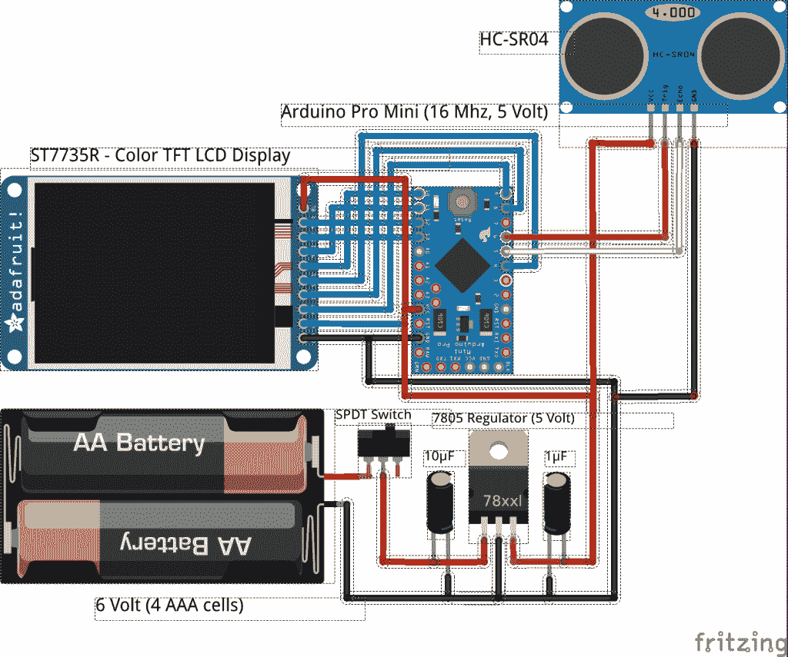

# 现成的黑客:重新利用你的 DIY 项目

> 原文：<https://thenewstack.io/off-shelf-hacker-repurpose-projects/>

正如我在以前的[现成黑客](/tag/off-the-shelf-hacker/)专栏中提到的，我非常喜欢将我的项目模块化，这样我就可以根据需要混合和匹配各个部分。去年圣诞节，我女儿给了我一个小小的 [1.8 英寸彩色 TFT 显示屏](https://www.adafruit.com/products/358)。用了一个小时左右才让它和 Arduino 一起工作。从那时起，小屏幕已经在我的蒸汽朋克会议徽章原型系列中使用，使用简单的 Arduino，Yun 甚至 Raspberry Pi。

前阵子，我从亚马逊收到了一个 [HRC-SR04 超声波测距仪模块](https://www.amazon.com/gp/offer-listing/B004U8TOE6/ref=sr_1_1_olp?ie=UTF8&qid=1450978701&sr=8-1&keywords=ultrasonic+range+finder&condition=new)。正如你所料，测距仪发现自己以某种便携式格式连接到 1.8 英寸 Arduino/TFT 屏幕组合只是时间问题。将快速的概念验证放在一起相当容易。我刚刚从蒸汽朋克徽章的[版本 1 中盗版了 Arduino Pro-Mini、电池和纳米调节器模块，配置了软件，很快就可以用声音测量距离了。](https://thenewstack.io/wearable-computing-electro-matic-conference-personality-identification-device/)

让我们看看如何让 HC-SR04 读取距离并将这些值输出到 TFT 显示器。下周，我们将看看如何在项目中使用和包装这项技术。

## **重新规划您的项目**

基本的 Arduino Pro-Mini 可以作为许多有趣项目的基础。

看看下面的示意图。我删除了 DS18B20 数字温度传感器和红色 LED 功能(从原理图)，然后用 HC-SR04 超声波测距仪取代它们。添加电线和传感器总共花了 15 分钟。

[](https://thenewstack.io/wp-content/uploads/2015/12/pro-mini-lcd-ultrasonic.png)

arduino Pro-Mini/LCD/超声波传感器示意图

否则，原理图与[旧徽章项目](https://thenewstack.io/hacking-hardware-the-never-ending-saga-of-steampunk-name-badge-development/)相同。

这就是模块设计和在项目中使用微控制器的美妙之处。在这种情况下，Arduino Pro-Mini 和 TFT 显示器组合可以完成多项工作，只需连接不同的传感器和输出设备，然后修改代码。

说到代码，读取超声波传感器也不是太复杂。

```
// ------------------------------------------------------------
// Example NewPing library sketch that does a ping about 
// 20 times per second.
// ------------------------------------------------------------

#include &lt;NewPing.h&gt;
#include &lt;SPI.h&gt;
#include &lt;TFT.h&gt;

#define TRIGGER_PIN  6
#define ECHO_PIN     5
#define MAX_DISTANCE 450 // Maximum distance (in centimeters)
#define sd_cs  4   // define tft display pins
#define lcd_cs 10
#define dc     8
#define rst    9

TFT TFTscreen  =  TFT(lcd_cs,  dc,  rst);  //init tft display

char distanceVal[4];  //char string - sonar-to-text conversion

NewPing sonar(TRIGGER_PIN,  ECHO_PIN,  MAX_DISTANCE);  
//initialize sonar sensor

void setup()  {
  Serial.begin(115200);  // Open serial monitor at 115200 baud

  TFTscreen.begin();
  TFTscreen.background(0,0,0);
  TFTscreen.setTextSize(2);
}

void loop()  {

  String distance  =  String(sonar.ping_in());  //send ping (in.)
  distance.toCharArray(distanceVal,4);  //convert int to char

  Serial.print(distance);    //diagnostics to serial monitor
  Serial.println(" inches");

  TFTscreen.stroke(255,255,255); //set text to white
  TFTscreen.text(distanceVal,10,50); //print distance @ 10,50
  TFTscreen.text("   inches",10,50);
  delay(200);
  TFTscreen.stroke(0,0,0); //set text to black
  TFTscreen.text(distanceVal,10,50); //erase old text
  TFTscreen.text("   inches",10,50);    
}

```

为了这个项目，我使用了 NewPing Arduino 库。

首先，我们将经历定义引脚、设置变量以及初始化超声波传感器和串行通信的常见初始化步骤。出于诊断目的，我通常喜欢在开发代码时包含串行输出。在一切运行正常后，您可以随时删除 println 语句等。还要记住，大多数 Arduinos 都有大约 32 KB 的程序空间。自然，一种节省空间的技术是消除任何额外的、不必要的串行文本生成代码。

最后，主循环读取超声波传感器，将其整数输出转换为字符串，并将其发送到 TFT 显示器。使用黑色背景，距离和“英寸”打印在屏幕上的位置(10，50)。然后用黑色打印相同的字符串，擦除白色文本，之后重复该循环。有必要用黑色文本擦除文本，这样值就不会堆积在一起，最终导致屏幕上只有白色方块。这是一种蛮力，虽然它很有效。使用最少 29 毫秒的脉冲间隔，以确保获得良好的读数。我将延迟设置为 200，因为当使用更小的值时，屏幕上的数字闪烁越来越快，这变得很烦人。

你会注意到，在上面的开始图片中，该设备使用 4 节 AAA 电池。这是蒸汽朋克徽章的延续，将在可穿戴项目中很好地工作。确保在连接 USB 转串行电缆进行编程时，开关处于关闭状态。我也喜欢把电池从支架里拿出来，以防不小心把开关留在了开的位置，或者把设备塞进我的电脑包里。

是的，我知道，达拉斯 DS18B20 仍然挂在图片上。随着我的截稿日期的临近，我选择在另一个时间搁置那个“特写”。现成的黑客总是梦想着接下来会发生什么，但是最好控制潜在的项目进展，以免对下游工作流产生不良影响。

## **总结**

能够测量从 1 英寸到大约 10 英尺的距离在物理计算领域有着真正的应用。将它连接起来并把代码放在一起也非常简单。

下周，我将介绍我在网络上发现的一些有趣的应用，例如，如何使用反射器增加范围，以及如何使用声纳传感器找到车库门的位置。我们还将讨论将声纳融入可穿戴设备的方法。

在那之前，愿各种酷的物理计算硬件在你的圣诞袜中实现。

<svg xmlns:xlink="http://www.w3.org/1999/xlink" viewBox="0 0 68 31" version="1.1"><title>Group</title> <desc>Created with Sketch.</desc></svg>