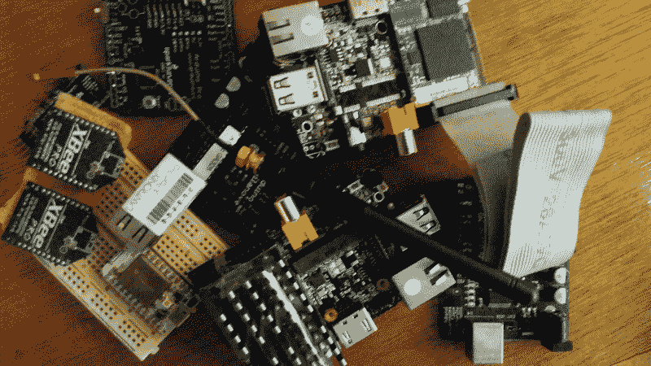

# 现成的黑客:在哪里为你的下一个项目寻找零件

> 原文：<https://thenewstack.io/off-shelf-hacker-scrounge-parts-next-project/>

成为一名现成的黑客需要足智多谋和想象力。我们使用完整的物理计算体系。这意味着不仅要了解项目的软件方面，还要了解电气、电子、机械、工程和与人相关的方面。为了实际构建项目的原型，您需要能够找到部件并根据您的需求调整组件。

我的目标是帮助你找到这些零件。

对于刚开始从事黑客项目的人来说，去哪里找零件并不总是显而易见的。不要难过，我肯定遇到过很多资深黑客，他们会说“哇，Torq 博士，我没有想到去那里看看！”运气好的话，你会开始找到自己独特的零件来源。一定要和其他现成的黑客分享这些特别的地方。

## **大型 DIY 电子零件销售商**

在 DIY/创客运动世界中，三个最大的零件屋是 [Adafruit](https://www.adafruit.com/) 、 [Sparkfun](https://www.sparkfun.com/) 和 [Maker Shed](http://www.makershed.com/) 。所有公司都拥有 DIY 项目、组件、微控制器、电路板和工具的丰富产品线。他们的网站也塞满了教程和论坛，涵盖了他们的产品和如何使用它们。

正如你所料，互联网上充斥着不计其数的其他零件来源。虽然可能不如三大巨头知名，但这些供应商在 ESP8266 模块、树莓 Pi、连接器、电池和几乎所有你能想象到的奇异工具上都提供了很好的价格。登上 MCM 的目录清单，从他们的塑料外壳、烙铁和音频设备的完整系列中获得灵感。同样， [Banggood](http://www.banggood.com/) 大量销售 8266，以及你在中国科技领域可能会买到的几乎所有东西……甚至更多。很多时候，他们甚至包括运费。

[Amazon](https://www.amazon.com/) 和 Element14 也是可靠的组件供应商(或经销商)。

## **寻找物理机构零件**

物理计算项目需要物理部件。十年前，我们称之为机器人或硬自动化。你从哪里得到螺栓、英寸×1 英寸的钢材、一台轻型(或重型)焊接机和许多管道胶带？

我认为现成的黑客应该定期访问他们当地的家得宝和洛斯。你不仅可以方便地找到五金、木材、塑料、混凝土、电气和管道供应品，这也是一个在过道中漫步并思考你的项目的绝佳机会。我称之为“通过四处走动获得想法”只是四处游荡，做着梦。

参观任何北方工具或[港口货运](http://www.harborfreight.com/)，你将进入一个完全不同的可能性世界。在那里，您可以找到小型金属制造工具、点焊机、拖车车轮轴承组件、12 伏绞盘、工作服、发电机、水泵、液压缸和各种空气压缩机。

你需要黄铜螺母和螺栓来突出你最新的蒸汽朋克会议演示机吗？我做到了。所以，我就去了当地的[王牌五金](http://www.acehardware.com/)店。他们实际上有四排 30 英尺长的公制和英制螺纹螺母、螺栓和垫圈、弹簧、铜制接线片、支架和各种“五金店”类型的硬件。有这样一个选择，你可能会想偶尔侦察一下，这样你就有了一个在哪里寻找某个特定部分的心理地图。为什么不与工程师同事或你的黑客空间同事一起计划一次实地考察呢？

也不要忽视满是灰尘的旧社区当地五金店。偶尔去那里朝圣，也许和你的 STEAM(科学、技术、工程、艺术和数学)启发的孩子们一起。这些有 100 年历史的地方充满了历史和文化…加上可能不止一些潜在的物理宝石，隐藏在一个长期被遗忘的小房间里。

## **一次性信号源**

我们今天要讨论的最后一类零件来源是我所说的“一次性商店”。

这些是迎合目标市场的利基市场。我承认，对于大多数人来说，这些商店是一个延伸，看看他们如何能有所帮助。

破产后仍在营业的永无止境的收音机商店是找到基本电子元件和工具的好地方，如果你知道你在做什么。在我看来，商店员工从未对实际的技术理论或操作有过深入的了解。幸运的是，他们通常会让你独自翻箱倒柜，为你的项目找到最合适的部分。把你的奖金拿到柜台，拒绝给他们你的地址和电话号码，然后用现金支付。任务完成。

也检查一下你当地的商店。我们在奥兰多有一家 30 多年历史的公司，名为 [Skycraft](http://www.skycraftsurplus.com/) 。他们有一排排疯狂的专业“硬件”他们将其列为剩余产品，显然许多零件原本是用于军事部门或太空飞行的。尽管如此，他们有各种工业强度的连接器、紧固件、开关、电源、变压器、变速箱、电机等等。

Skycraft 还提供了令人惊讶的电线和电缆选择，当您等待时，它们可以切割成所需的长度。在你的区域搜索一个相似类型的商店，然后去探索一个小时。你一定会想出一些很棒的项目点子。哦，是的，不要被工作人员拒之门外。他们总是散发出那种暴躁和冷漠的氛围。他们是好人，他们的客户服务品牌增加了这个地方的魅力。

这是我买的一对专用按钮开关的图片，用在我的有线蒸汽朋克演示机点击器上。我为每一个开关支付了 2 美元，我的会议听众被他们给出的外观和感觉迷住了，一头扎进了点击器:

蒸汽朋克点击器

另外，当地的特产店是[铰链](http://www.hingevintagehardware.com/)。他们供应古董铜和黄铜配件，紧固件，旋钮和各种 20 世纪初的小工具。这些事情对你的 MVP(最小可行产品)来说可能并不重要。但是当你向观众演示时，恰当地完成你的项目美学肯定会使你的创作变得有趣。

Hinge 的 20，000 英尺陈列室是完美的，每样东西都有很好的标记，并放在适当的位置。工作人员友好且知识渊博。当然，随着我对蒸汽朋克的兴趣，Hinge 将成为我最喜欢的去处之一，因为他们有大量我可以在我的项目中使用的部件。

最后，我想提一下老派汽车配件商店。当您需要一个物理硬件部件时，它们会非常有用和方便。我的家乡有个地方叫[科迪汽车配件](https://www.facebook.com/pages/Codys-Auto-Parts/117117018349409)。不用说，当我建造热棒的时候，我在那里呆了很长时间。

早期，我会进去找一个能胜任某项工作的零件。不可避免的“哪一年哪一款”的问题随之而来，对此我的回答是，“我没有哪一年哪一款，我只是需要能做这个的东西…”过了一会儿，店主指了指后面，说我要去找我的零件了。不要在一个大箱子的汽车配件商店尝试这个。你永远不会有同样的非正式的，家乡的客户体验。

在老派商店里，你还可以找到焊接设备、螺栓和各种汽车零件。箱子里还藏着 12 伏的螺线管、阀门、压力传感器、重型继电器和各种金属管道。他们也有各种橡胶或塑料软管，低压灯和电机。当您原型开发更雄心勃勃和复杂的物理计算项目时，您可能会需要许多这样的部件。

## **去找你的零件**

构建物理计算原型需要对资源有一个相当全面的展望。我希望，除了在所有明显的地方寻找，我希望你受到启发，探索替代和一次性的地方，找到你的项目需要的零件。还有，一定要试试我的“四处走走获得灵感”技巧。

专题图片:[海口](https://commons.wikimedia.org/wiki/File:Hardware_store_in_Haikou_01.jpg)五金店，Anna Frodesiak，获 [cc0](https://creativecommons.org/publicdomain/zero/1.0/deed.en) 许可。

<svg xmlns:xlink="http://www.w3.org/1999/xlink" viewBox="0 0 68 31" version="1.1"><title>Group</title> <desc>Created with Sketch.</desc></svg>