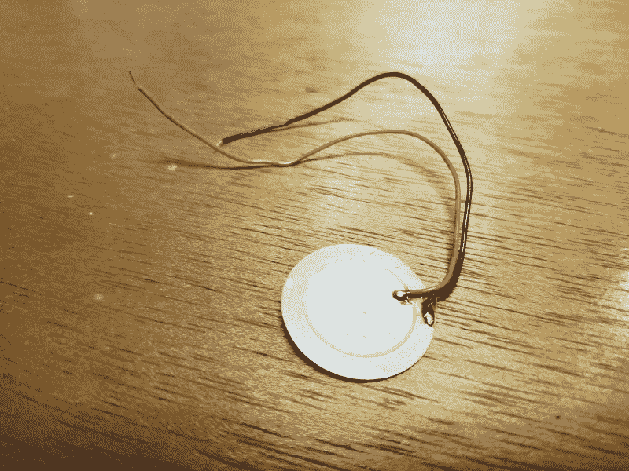

# 现成的黑客:传感器 101

> 原文：<https://thenewstack.io/off-shelf-hacker-sensors-101/>

微控制器通过来自传感器的输入对环境做出反应。数十家供应商提供数千种不同的传感器，其类型、尺寸、风格、功能和价格各不相同。我们还有不同类型的数字、模拟和混合传感器，可输出各种数值或数据。从哪里开始？

一个很好的起点是传感器基础知识，这将是本期[现成黑客](/tag/off-the-shelf-hacker/)专栏的主题。

## 什么是传感器？

传感器是一种机械装置，它将其对应变、光、温度、磁场等的反应转换成电信号，由测量装置读取。传感器可以是有源的或无源的，这意味着它们可以在有源的情况下产生自己的信号，或者在无源的情况下改变它们的信号或值。

主动传感器的一个例子可能是一个压电按钮，当用手指敲击时，它会产生一个短暂的电脉冲。

普通压电传感器

无源传感器的一个例子可能是光敏电阻，其值随着照射到其前表面的光量而变化。

微控制器能够捕捉这些脉冲，并测量其输入引脚上的值变化。有时信号太小，微控制器输入引脚无法直接检测到。例如，热电偶(两种不同金属在末端熔合以测量温度)的输出非常小，需要驱动板才能获得任何可用数据。这一切都很好，因为驱动板将来自各种热电偶的信号标准化，因此它们的行为非常标准且可预测。软件库也使得使用带传感器的驱动程序变得相当容易。

## 数字、模拟还是混合？

我喜欢将传感器分为三大类:数字、模拟和混合。

首先，有一个数字传感器，像一个按钮。按钮是二进制的。他们只是坐在那里，在你项目的前面板上关注他们自己的事情，他们两个联系人之间没有任何联系。你一按下按钮，触点就连在一起，形成电连接。您可以将无连接或打开位置视为零(0)值，而按下或关闭按钮位置则为一(1)。我们通常将按钮连接在 3.3 伏和微控制器的通用输入/输出引脚之间。一个小电阻(比如 10K 欧姆)也连接在输入引脚和地之间。当输入有效开路时，该电阻确保输入引脚保持逻辑值 0。一旦按钮被按下，引脚读取 3.3 伏的正电压，并在其输入端记录逻辑 1 值。

微控制器上的大多数通用输入引脚可以读取数字信号。输入引脚可以处理的电压因处理器而异。一些输入引脚可以安全地读取 5.0 伏，而其他引脚只能处理 3.3 伏的信号。像 [BeagleBone](http://beagleboard.org/bone) 这样的电路板额定电压不超过 1.8 伏。请务必查看微控制器的规格表，了解引脚电压能力。

微控制器也可以非常快速地读取它们的管脚。Arduino 上的常规输入引脚速度非常快，它可以检测到按钮上的触点几乎接触到，微小的火花跳过了间隙。在实际建立牢固的连接之前，这种情况可能会发生几次。它被称为开关弹跳，通常在微控制器上运行的软件中被滤除。对于大多数微控制器来说，每秒读取数字传感器 1000 次是轻而易举的事情。

第二类传感器是模拟传感器。这些东西要么产生一个小电压，要么在设备运行时改变它们的值。然后，微控制器上的输入引脚读取可变电压或值。

这一点很重要，因为并非所有微控制器都具有模拟输入能力。称为模数转换器(ADC)的额外硬件内置在微控制器中，用于解释这种变化。请注意，Raspberry Pi 及其克隆产品的输入引脚是严格的数字引脚。其他微控制器，如 Arduino、ESP8266 芯片和 BeagleBone 系列，有一到十二个模拟输入引脚可用。

光敏电阻是一种无源模拟器件。它的电阻根据照射在电池上的光量而变化。您可以像按按钮一样连接模拟器件，但 ADC 不会记录 0 或 1，而是解释电压，为 10 位模拟输入分配 0 至 1023 之间的比例值。在微控制器上运行的软件中，您必须将该引脚指定为模拟或数字输入。只有选择引脚可以处理模拟输入。

最后一类传感器我称之为混合传感器。上述热电偶，而模拟设备将是一个混合体。通过驱动板路由的输出实际上是数字数据，由微控制器内置的若干数据总线之一读取。与常规热电偶配合使用的 [MAX31855 驱动板](https://www.adafruit.com/product/269?gclid=EAIaIQobChMI0a2D0OC02QIVgiWBCh3xEwWXEAAYAiAAEgIdLPD_BwE)通过 SPI 总线输出数据，SPI 总线使用 3 个 GPIO 引脚。这种类型输出数据，与数字类型的 0 或 1 (0 或 3.3 伏)值或模拟类型的可变值或电压相反。

另一种混合设备是相对较新的 [JeVois 智能机器视觉传感器](http://jevois.org/)。这个东西是一个连接到 ARM 处理器的小型摄像机，运行轻量级版本的 Linux。它抓取视频帧，通过一些人工智能算法运行它们，然后通过串行线和 USB 连接发送数据。该数据包含传感器在其视野中找到的对象的位置坐标，以及 USB 视频馈送中对象的叠加轮廓。在机器人中，你可以用串行数据来驱动伺服系统或步进器。视频馈送信息可以被发送到另一个计算设备，以进行额外的分析或记录功能。一些混合传感器似乎是寻找解决问题的解决方案，这是全新技术的常见情况。这项技术要成熟并有效融入日常生活还需要时间。

## 现在怎么办？

我们只是简单介绍了传感器的基础知识。我们有被动和主动。还有数字，模拟和混合。我预计，随着更快的处理器和编写越来越复杂软件的聪明人的出现，混合动力车将会扩大。

然而，数字和模拟传感器总是很重要。按钮、光电池和其他简单的传感器是微控制器对环境做出反应的可靠方法。

特征图像:小光电池。

<svg xmlns:xlink="http://www.w3.org/1999/xlink" viewBox="0 0 68 31" version="1.1"><title>Group</title> <desc>Created with Sketch.</desc></svg>