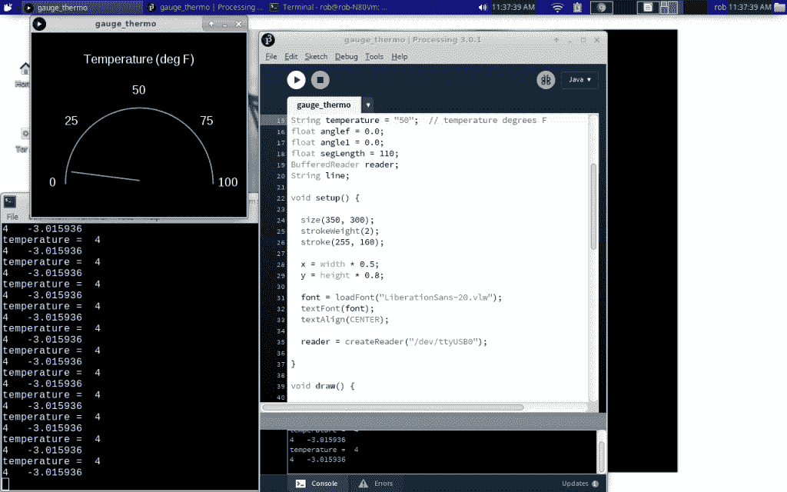

# 现成的黑客:在“模拟”表上显示温度

> 原文：<https://thenewstack.io/off-shelf-hacker-showing-temperatures-analog-gauge/>

物理计算的一大好处是，一旦你掌握了一些基础知识，你将开始看到如何将“模块”组合在一起，并提出新的项目。凑成几个“模块”，你就有了自己的小[现成的](/tag/off-the-shelf-hacker/)有用的小工具，用于各种工作。开始把模块想成软件、固件、硬件、网络、机制、美学等等。或者上述的任何/全部。

在上周用[超声波测距计](https://thenewstack.io/off-shelf-hacker-use-processing-build-screen-gauge/)获得不错的运气后，我认为尝试显示一些其他值会很有用。本周，我将旧的热电偶模块连接到 Linux 笔记本上，看看一个基于语言的[处理程序](https://processing.org/)如何处理温度。

我使用的热电偶(和放大器)通过 SPI 总线连接到 Arduino Duemilanove。Arduino 然后通过标准 USB 电缆连接到 Linux 笔记本电脑。使用 USB 使得“模块”可以在笔记本电脑、树莓派和芯片电脑之间移植。测距仪连接到 Arduino Pro Mini，然后连接到会议徽章上的 Raspberry Pi。Linux 正在吞噬世界！

在任何机器上使用 USB 端口都有点棘手，所以让我们从这个话题开始讨论。

## 理顺串行端口

安装新版 Linux 时，普通用户通常无法直接读写 USB 端口。您可以使用 **chmod** 命令更改权限，尽管这有点麻烦，并且会随着您插入和拔出端口而改变。

获得访问权最简单的方法是将用户(在我的例子中是 rob)添加到“拨出”组。你需要使用 sudo，它才能工作。

```
rob%  sudo usermod  -a  -G  dialout rob

```

一旦完成，重新启动机器，清除任何旧的、疯狂的权限并重新登录。

```
rob%  sudo shutdown  -r  now

```

回到桌面后，打开终端并执行 stty 命令。这将设置端口速度。如果端口速度与来自 Arduino 的数据速率不匹配，您将看不到使用“cat”命令输入的数据。此外，仪表上的指示线也不会显示:

```
rob%  stty  -icrnl  -F  /dev/ttyUSB0  11520

```

当您测试从 USB 端口输入的数据时，使用以下快速检查:

准备好 USB 端口后，是时候让 Arduino 上的固件工作了。

## 读取最大热电偶

在去年的[年底，我谈到了在我的厨房烤箱中使用](https://thenewstack.io/avoid-burning-christmas-turkey-thermocouples/)[标准 K 型热电偶](https://www.adafruit.com/product/270)和[放大器](https://www.adafruit.com/product/3263)来测量温度值。

Arduino 的代码来自 MAX3156 示例。我做了一点修改，去掉了一些不需要的“println”语句，并添加了一个摄氏到华氏的转换。我喜欢看我的华氏温度。还要注意，我在转换中添加了一个“int”类型赋值。我们并不真的需要模拟仪表的小数，所以整数温度值是好的，使输出更容易阅读。

如果您使用的是 Duemilanove Arduino，继续编译，然后将固件上传到主板。如果您正在使用其他 Arduino，如 Pro Mini 或 Uno，请确保在“工具”和“主板”下拉菜单中指定正确的主板。

```
#include &lt;SPI.h&gt;
#include &lt;Adafruit_MAX31856.h&gt;

// use hardware SPI, pass in the CS pin
Adafruit_MAX31856 max  =  Adafruit_MAX31856(10);

void setup()  {
  Serial.begin(115200);

  max.begin();

  max.setThermocoupleType(MAX31856_TCTYPE_K);

  switch  (  max.getThermocoupleType()  )  {
    case MAX31856_TCTYPE_B:  break;
    case MAX31856_TCTYPE_E:  break;
    case MAX31856_TCTYPE_J:  break;
    case MAX31856_TCTYPE_K:  break;
    case MAX31856_TCTYPE_N:  break;
    case MAX31856_TCTYPE_R:  break;
    case MAX31856_TCTYPE_S:  break;
    case MAX31856_TCTYPE_T:  break;
    case MAX31856_VMODE_G8:  break;
    case MAX31856_VMODE_G32:  break;
    default:  break;
  }

  // mlx.begin(); 

}

void loop()  {

  // thermocouple temp measured by MAX amp board

  Serial.print(int(Celcius2Fahrenheit(max.readThermocoupleTemperature())));  

  uint8_t fault  =  max.readFault();
  if  (fault)  {
    if  (fault  &amp;  MAX31856_FAULT_CJRANGE)  Serial.println("Cold Junction Range Fault");
    if  (fault  &amp;  MAX31856_FAULT_TCRANGE)  Serial.println("Thermocouple Range Fault");
    if  (fault  &amp;  MAX31856_FAULT_CJHIGH)  Serial.println("Cold Junction High Fault");
    if  (fault  &amp;  MAX31856_FAULT_CJLOW) Serial.println("Cold Junction Low Fault");
    if  (fault  &amp;  MAX31856_FAULT_TCHIGH)  Serial.println("Thermocouple High Fault");
    if  (fault  &amp;  MAX31856_FAULT_TCLOW) Serial.println("Thermocouple Low Fault");
    if  (fault  &amp;  MAX31856_FAULT_OVUV)    Serial.println("Over/Under Voltage Fault");
    if  (fault  &amp;  MAX31856_FAULT_OPEN)    Serial.println("Thermocouple Open Fault");
  }

  Serial.println();
  delay(100);  //sample duration - adjusted - gives 1 second per sample with this code
}

double Celcius2Fahrenheit(double celsius)
{
  return  1.8  *  celsius  +  32;
}

```

测试代码是否能与 Arduino IDE 内置的串行监视器一起工作。或者，关闭 Arduino IDE 并使用 **cat** 命令。

有时，我的 Arduino IDE 设置无法正确释放 USB 端口。我还没有完全解决这个问题，所以如果你在读取 USB 端口时仍然有问题，注销并重启机器。只是提醒一下。

## 在仪表上显示温度

在[超声波测距仪计量项目](https://thenewstack.io/off-shelf-hacker-use-processing-build-screen-gauge/)中，Arduino Pro Mini 将距离值发送至加工计量代码，记录范围为 0 至 100 英寸。你可以让你的 Arduino 输出任何你喜欢的范围。只是数据而已。

我使用的特殊热电偶可以感应大约-340 到+900 华氏度的温度。这意味着连接到热电偶的 Arduino 可以通过 USB 端口发送该范围内的值。

现在，超声波测距仪处理量规程序只会将指针从 0 摆动到 100。事实上，这足以证明热电偶可以显示仪表上的值，对于这个项目，我甚至没有费心修改范围。我想展示如何通过最小的改变来混合搭配“模块”,并且仍然能得到一些有用的东西。

我只是把“距离”变量换成了“温度”在仪表的表面，我还把“距离(英寸)”改成了“温度(华氏度)”其他一切都很正常。

这里的教训是让一个新项目的 1.0 版本(即使是把模块插在一起)正常工作。然后，您可以随时返回并更改代码以获得更多的功能和能力。不要试图一次改变太多事情。将文件保存在版本控制程序中，或者只是增加名称，这样，如果偏离了轨道，您可以随时返回到工作代码。

下面是被黑的处理代码。

```
/**
 * Gauge 
 * 
 * The angle of each segment (in radians) is controlled by input from the 
 * serial port (/dev/ttyUSB0, /dev/ttyS0, etc.).
**/

import processing.net.*;

PFont font;
float  x,  y;
String angle  =  "10";  // angle in degrees
String temperature  =  "50";  // temperature degrees F
float anglef  =  0.0;
float angle1  =  0.0;
float segLength  =  110;
BufferedReader reader;
String line;

void setup()  {

  size(350,  300);
  strokeWeight(2);
  stroke(255,  160);

  x  =  width *  0.5;
  y  =  height *  0.8;

  font  =  loadFont("LiberationSans-20.vlw");
  textFont(font);
  textAlign(CENTER);

  reader  =  createReader("/dev/ttyUSB0");

}

void draw()  {

  background(0);
  try  {
    line  =  reader.readLine();
  }  catch  (IOException  e)  {
    e.printStackTrace();
    line  =  null;
  }
  if  (line  ==  null)  {
    // Stop reading because of an error or file is empty
    noLoop();  
  }  else  {
    println("temperature = ",  line);
  }

  temperature  =  line;

  if  (angle  !=  null)  {
    anglef  =  (180-(float(temperature))*1.8)*3.1416/180*-1;
    // scale the distance to an angle for the gauge

    println(temperature,  " ",  anglef);  //in radians
  }
  pushMatrix();
  segment(x,  y,  anglef);  
  popMatrix();

  text("Temperature (deg F)",  175,  50);
  text("0",  35,  250);
  text("25",  65,  150);
  text("50",  175,  100);
  text("75",  285,  150);
  text("100",  320,  250);

  noFill();
  arc(175,  245,  240,  245,  PI,  TWO_PI);

  delay  (100);
}

void segment(float  x,  float  y,  float  a)  {
  translate(x,  y);
  rotate(a);
  line(0,  0,  segLength,  0);

}

```

在处理 IDE 中加载代码，点击“运行”按钮，在屏幕上显示仪表。

如前所述，不要忘记让 USB 端口处于正确的状态，否则，您将看不到仪表上的指针。

这是我冰箱里热电偶/温度计读数的截图。华氏四度！也许我应该把它调高一点，这样可以省电。嗯，冰淇淋永远不会变得粘稠。



我冰箱的温度读数。

## 更进一步

这个项目有大量的升级机会。

显然，扩大测量范围是一个良好的开端。当烤箱升温时，看着指针从室温摆动到华氏 350 度，不是很有趣吗？

另一个想法可能是修改处理代码，使仪表充满整个笔记本屏幕。我可以在我们的一次“用新的堆栈来拥有一个短堆栈”早餐小组讨论中，使用这种功能在笔记本电脑或辅助投影仪屏幕上显示煎饼机器人煎锅的温度。

将处理量规程序转换成 Python 可能也是有意义的。Python 可以在大多数 Linux 机器上运行，包括 Raspberry Pi 和 CHIP computer。程序从命令行运行，不需要 IDE 环境，像处理。当然，您目前可以创建一个在处理之外运行的“应用程序”。在英特尔 Linux 笔记本电脑或 Raspberry Pi 上运行相同的代码，我得到了不同的结果。我认为 Python 更具有跨平台能力。

<svg xmlns:xlink="http://www.w3.org/1999/xlink" viewBox="0 0 68 31" version="1.1"><title>Group</title> <desc>Created with Sketch.</desc></svg>