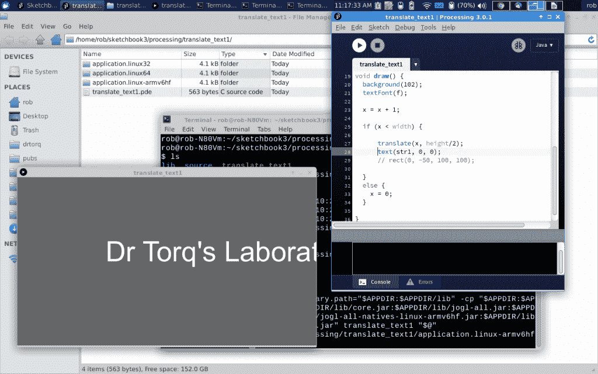

# 现成的黑客:旋转文本和滚动处理对象

> 原文：<https://thenewstack.io/off-shelf-hacker-spin-text-scroll-objects-processing/>

继上周[介绍](https://thenewstack.io/off-shelf-hacker-expand-projects-processing-sketchbook/)到[处理](https://processing.org/)速写本之后，本周在[现成黑客](/tag/off-the-shelf-hacker/)中，我们将更深入一点，涵盖几个制作文本和形状动画的例子。这些技术对于显示、用户通知和数字标牌非常有用。这些技术适用于我的基于 [Raspberry Pi 的演示机器](https://thenewstack.io/off-shelf-hacker-push-button-slides-pi/)。不要忘记，处理映射到 Arduino 和物理计算环境中，因此您可以轻松地将逻辑用于 Raspberry Pi 和 Arduino 项目。

[](https://thenewstack.io/wp-content/uploads/2015/12/processing3-move-text-shapes.png)

## **让我们旋转一些文字**

```
PFont  f;
String message  =  "Dr. Torq's Laboratory";
float theta,  deg;

void setup()  {
  size(200,  200);
  // fullScreen();
  f  =  createFont("Arial",20,true);
}

void draw()  {  
  background(255);
  fill(0);
  textFont(f); // Set the font
  translate(width/2,height/2); // Translate to the center
  rotate(theta); // Rotate by theta in radians
  // rotate(radians(deg)); // Rotate by degrees using the radians function
  textAlign(CENTER);            
  text(message,0,0);  
  theta  +=  0.01; // Increase rotation by radians
  // Increase rotation by degrees
  // deg += 1;
  delay(50);  // Control rotational speed via milliseconds delay
}

```

草图在桌面(或您的 Raspberry Pi 连接的 HDMI 屏幕)上打开一个窗口，并使用 rotate()函数显示围绕其中心轴旋转的文本。请记住，旋转需要以弧度度量的角度，从 0 到 2π。要使用度数，请用“deg”代替标准的 rotate()度量。通过减小旋转角度来更改旋转方向。

您还会注意到底部的 delay()函数。取决于你的处理器，文本可能旋转得太快，没有用。添加延迟提供了旋转速度的灵活性，并以毫秒为单位进行测量。

函数是一个新特性，出现在 Processing 3 中。注释掉 size()行，取消全屏行的注释。

旋转文本的一个有趣的附加功能可能是添加逻辑，将文本从小字母扩展到大字母，重复。在这种情况下，您可以在 createFont()函数中操作 size 变量。

如何使用一个连接到 Arduino 的传感器，根据传感器的测量结果在 Linux 笔记本电脑屏幕上旋转文本？

## **现在让我们滚动一些对象**

让文本或正方形在窗口中间移动怎么样？

```
/**
 * Translate. 
 * 
 * The translate() function allows objects to be moved
 * to any location within the window. The first parameter
 * sets the x-axis offset and the second parameter sets the
 * y-axis offset. 
 **/

PFont  f;
float  x;
String str1  =  "Dr Torq's Laboratory";

void setup()  {
  size(640,  360);
  f  =  createFont("Arial",60,true);
}

void draw()  {
  background(102);
  textFont(f);

  x  =  x  +  1;

  if  (x  &lt;  width)  {

      translate(x,  height/2);
      // text(str1, 0, -30);
      rect(0,  -50,  100,  100);

  }
  else  {
    x  =  0;
  }

}

```

该草图打开一个新窗口，并使用 translate()函数在屏幕上移动一个文本字符串。在 translate 函数中，文本通过将屏幕高度一分为二并将其用作 y 坐标而居中。

您还会注意到被注释掉的 rect()函数，它紧跟在 text()函数之后。翻译对象，如矩形，就像翻译文本一样简单。在这种情况下，一个 100 x 100 像素的框将在屏幕上从左向右滚动。其他对象，如圆形、照片和线条也可以被替换。

## 独立运行

我今天要讲的最后一个主题是从一个处理草图创建一个独立的应用程序。通常，您会开发代码并在处理集成开发环境(IDE)中运行它。点击编辑窗口顶部的大右箭头运行程序，方块停止它。

有时候，能够运行您的草图，而不需要启动 IDE，这可能会很好。它可以是演示前播放的一些动画。它可能是响应按钮按压或传感器输入的显示器。我们将在以后的专栏中讨论这些主题。

构建一个独立的应用程序非常简单。

启动处理 IDE 并调出草图。接下来，单击“文件”，然后单击“导出应用程序”。将出现一个“导出选项”窗口，您可以在其中选择您的平台(Windows、Mac 或 Linux)，是否希望应用程序全屏运行或有一个停止按钮，以及是否希望 Java 运行时与应用程序捆绑在一起。我通常会选择 Linux，让它自己发挥作用。处理将发挥其神奇的作用，在很短的时间内，文件管理器屏幕将显示几个目录，其中包含 X86 32 和 64 位环境以及 ARM (Raspberry Pi)平台的文件。

只需将 cd 放入适当的目录，然后从命令行运行脚本。

```
     rob%  cd  /home/rob/sketchbook3/processing/translate_text1/

```

我喜欢在我的 Linux 笔记本上画草图，然后把它们传到私人助理那里，主要是因为我在笔记本上打字比私人助理的便携式键盘快得多。显然，如果您要创建使用 Raspberry Pi 通用 I/O 引脚(GPIO)的草图，在 Pi 上开发是有意义的。请记住，访问 Pi 的 GPIO 引脚的程序通常需要使用 sudo 来执行，否则会出现权限错误。我们也将在以后的文章中更深入地探讨这个主题。

像往常一样，只需输入 ctrl-c 就可以停止绘制草图。

## **包装完毕**

我喜欢处理，因为我是在 C 语言环境中长大的，所以它非常熟悉、结构化且符合逻辑。它有[吨的库](https://processing.org/reference/libraries/)用于各种视觉效果，并且可以很好地集成在 Raspberry Pi 和 Arduino 平台上。

尝试一些你的动画展示工作，让我知道他们是如何工作的。

特征图像:来自 Dextro 的非线性代码可视化，使用处理。

<svg xmlns:xlink="http://www.w3.org/1999/xlink" viewBox="0 0 68 31" version="1.1"><title>Group</title> <desc>Created with Sketch.</desc></svg>