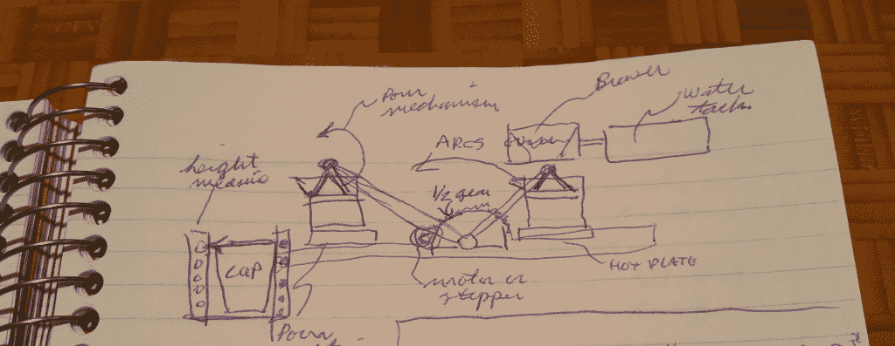

# 现成的黑客:思考机器人咖啡机

> 原文：<https://thenewstack.io/off-shelf-hacker-thinking-robotic-coffee-maker/>

最近，一个开发机器人咖啡机的请求在晚餐时浮出水面。我们需要一些东西来赞美“Stackie”，这是新 Stack 的 PancakeBot，一种用于在会议上推广播客和煎饼早餐的 3D 煎饼打印机。将一个引人注目的自动化咖啡递送设备与 Stackie 配对，可以帮助人们在清晨的播客小组讨论中进行交谈。

将这个模糊的概念转化为一个可行的物理计算装置是一个挑战。

解决方案:应用[现成的黑客](/tag/off-the-shelf-hacker/)技术！

## 最小可行原型 101

不管是有意识的还是无意识的，我总是在通往一个功能性的最小可行原型(MVP)的路上经历以下步骤:

*   头脑风暴/研究。
*   初始设计和布局。
*   原型。
*   测试。
*   公开演示/使用。
*   反馈、分析、最佳实践、操作方法文章、讲座、事后分析。
*   决定新功能/变化，对于 2.0 版，从第 1 步开始重复。

请记住，这个过程经常在不同的主题之间摇摆，当然不是一个线性过程。当你经历这个过程的各个步骤时，给自己梦想的自由，让想法在你的头脑中滚动。养成在“黑客笔记本”上记录自己想法的习惯记录想法、对话、设计并做笔记。在你的超级手机上使用高分辨率摄像头。我故事中的许多图片都来自于在项目的探索和构建阶段用我的手机快速拍摄的照片。

在开发咖啡机器人时，我们将松散地遵循现成的黑客 MVP 列表。

## 我们能改变什么吗？

扎实的研究和头脑风暴要求我们检查并看看世界上是否有现有的小工具可以满足需求。使用“现有技术”是由来已久的黑客传统。虽然网络可能会也可能不会带来完美甚至可能的解决方案，但探索产品和其他人的发明是帮助你集思广益设计和考虑可能性的好方法。确保在你的黑客笔记本上记下笔记和缩略图，这样你就不会忘记一些有趣的事情。

咖啡机器人最近已经进入了公众的视野。例如，CNET 在一月份的 2017 年[消费电子展](http://www.ces.tech/)上有一个关于咖啡服务机器人的[故事](https://www.cnet.com/news/the-battle-of-the-ces-2017-coffee-and-tea-robots/)。博世、奥博、电装用大臂和各种接口为与会者冲咖啡。这些机器只是有点太远了，无法与我们卑微的斯塔基煎饼打印机相匹配。

[Hackaday 发表了一篇文章](https://hackaday.com/tag/coffee-maker/)讲述了在[俄亥俄州黑客 OHI/O 24 小时黑客马拉松](http://hack.osu.edu/)上的一些人，他们制作了一个可爱的小咖啡机器人，有几个伺服系统，一个树莓派和一个 Arduino。他们计划在某个时候将 Alexa 集成到设备中。机器的顶部有一张脸，盖子会自动打开，有点像嘴。它还将过滤器插入到机器中，带有伺服系统，因此设计更接近我认为我们想要的。

在 [Hackster](https://www.hackster.io/) 社区论坛上，一些用户展示了一台 [Alexa 指导的咖啡机](https://www.hackster.io/bastiaan-slee/coffee-machine-amazon-alexa-raspberry-pi-cbc613)实际上可以工作。他们用的是树莓派和飞利浦 Senseo 咖啡机。构建相当复杂，需要在 Senseo 内部的 Pi 和电路板之间进行大量黑客攻击。他们做得很好，尽管我认为我们需要一些更生动的东西。

在我的初步研究中，我有了一个倒咖啡臂的灵感。下面是一个手臂的想法，它可以摆动和倾斜玻璃瓶，使用现有的商业滴煮咖啡机。该臂也可以插入/取出过滤器。

我的思维也进入了一个用光电二极管(作为传感器)和发光二极管(作为光束)测量杯子高度的“栅栏”。这些想法记在了我的笔记本上。

咖啡机器人手臂设计缩略图绘图

除了上面的例子，我在谷歌上粗略搜索了一下，没什么可看的。我也找不到任何功能的蒸汽朋克机器人咖啡机。蒸汽朋克吸引眼球。我们必须有蒸汽朋克！

## 要求

从一张白纸，或者在这个案例中，一张写有问题的餐巾纸，创造一些东西，会导致“可能性瘫痪”我的思绪飞来飞去，很难想象 MVP。我们当然不能永远梦想未来。嗯…我想我们可以。但迟早，我们必须把这些碎片拧在一起，并在人们面前展示我们的创作。下一个煎饼播客就在眼前。

和往常一样，写下我们想要完成的事情是明智的。是的，回到清单上。清单缩小了我们的范围，让我们可以管理，更重要的是，可以做。将清单分成几个主题，尽可能具体可行。

这是我在咖啡制作机器人列表中的第一个片段:

### 无形的（不可捉摸的）东西

*   吸引注意力并开始对话。
*   与煎饼机器人一起工作。
*   实际上是冲咖啡的。
*   建立并推广新的 Stack 品牌。
*   推广现成的黑客和物理计算堆栈。

### 技术的

*   安全的 110，220 伏操作——机器人必须在美国和海外工作。
*   紧凑且独立。
*   通过航空托运行李轻松运输—物理尺寸限制。
*   可能会和煎饼机器人装在同一个盒子里。
*   使用现成(OTS)微控制器，传感器，电机，伺服，冷却机制。

### 应用蒸汽朋克主题

*   越稀奇古怪越好，为了吸引眼球。
*   支持探索物理计算堆栈，非常有趣。
*   添加到现成的黑客蒸汽朋克小工具库存。
*   将故事和主题联系在一起。

## 现在怎么办？

我还没准备好清理工作台，开始将电线和铜管焊接在一起。

看看其他人如何构建他们的咖啡机器人，并概述我们的一般要求，这对于在我们构建之前缩小范围至关重要。

您还需要了解对构建有用的可用部件。显然，我将使用 Arduino、Raspberry Pi 或 BeagleBone Black board 作为微控制器。我需要不断更新可用原材料的心理库存。这是我漫无目的地在家得宝、Ace 五金店和社区旧货店里走来走去的一个原因。我可能会遇到一些我可以立即使用或在未来项目中使用的东西。这是现成黑客的一个持续的习惯。

我想过买一个便宜的滴滤式咖啡机，把里面的东西拿出来，设计一个新的蒸汽朋克外壳，加入机械臂。这个手臂可能来自于一个现成的黑客项目。

百得为美国和欧洲市场生产两种类似的产品，型号分别是 [BCM1411B](https://www.amazon.com/Black-Decker-BCM1411B-Coffee-CANADA/dp/B01G5ZWB4G) 和 [CM1160B](https://www.amazon.com/BLACK-DECKER-CM1160B-Programmable-Stainless/dp/B01GJOMWVA/ref=sr_1_fkmr1_2?s=home-garden&ie=UTF8&qid=1489671354&sr=1-2-fkmr1&keywords=110+volt+coffee+black+decker+12+cup) 。它们的功能是相似的，在引擎盖下很可能是相同的。根据我们使用咖啡机器人的地方，可能只是更换加热元件。

我很可能会将商业部分改造成一个定制的蒸汽朋克外壳，可能会有一个活动臂，因此使东西可以互换(用于 110 或 220 伏操作)是一个非常容易满足的要求。

另一种可能性是研究来自中国制造商的裸露的咖啡机部件，然后制作蒸汽朋克外壳并围绕这些部件。我们很可能不会走这条路。

现在是时候让这个想法酝酿一下了。下一期咖啡机器人专栏将总结头脑风暴/研究阶段，并进入设计决策和布局。

<svg xmlns:xlink="http://www.w3.org/1999/xlink" viewBox="0 0 68 31" version="1.1"><title>Group</title> <desc>Created with Sketch.</desc></svg>