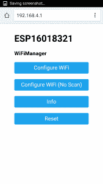
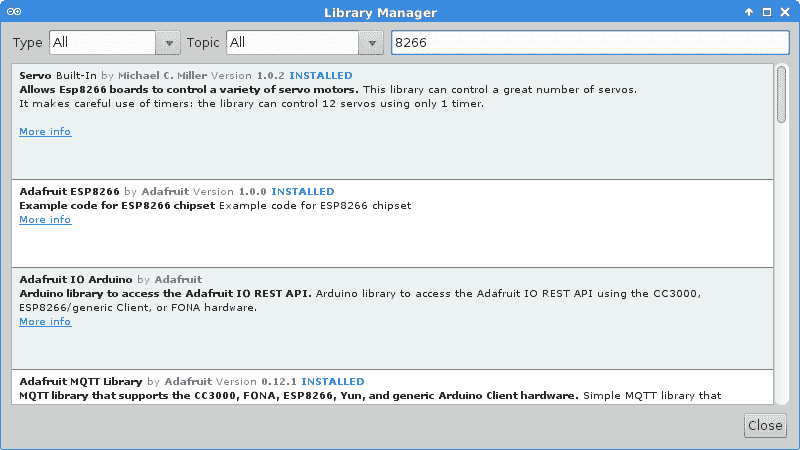

# 现成的黑客:了解 Arduino IDE

> 原文：<https://thenewstack.io/off-shelf-hacker-tooling-around-arduino-ide/>

你最近看过 Arduino IDE 吗？

当前的 1.6.7 版本是一个很好的工具。你不仅可以为所有 Arduino 板开发，还可以为支持 WiFi 的 [ESP8266 系列微控制器“芯片”编写和上传代码](http://www.esp8266.com/)尽管它们是微小的、最小组件的电路板，我还是喜欢称它们为芯片。

说到 8266，读者可能已经注意到它已经充斥了微控制器领域，它的 32 位处理器，完整的 802.11n WiFi 堆栈和相当有吸引力的 3 到 8 美元的价格。大约有十几种型号，从简单的双输入/输出(I/O)引脚“01”型号到多 I/O“07”型号。想要更远的射程？“07”也有一个插座，这样你就可以连接可选的外部天线，甚至定向天线。

IDE 与 8266 的结合将物理计算堆栈带入了一个新的方向。该社区已经加快步伐，使向现有设备添加复杂的 WiFi 功能变得容易，并能够从头开始构建有用的小尺寸物联网。

为了了解我们已经走了多远，请看一下示例程序。

## 有趣的例子

Arduino IDE 的主要特点是它非常全面和易于使用的例子。转到“文件”,点击“示例”,调出新菜单。根据安装的库，可能有几十个示例程序可供选择。

从基本的 LED 闪烁和渐变程序，到通过智能手机在新网络上配置支持 ESP8266 WiFi 的设备，应有尽有。

8266 智能手机网络应用程序–在 Android 上

后一个名为“AutoConnectWithFeedback”的程序启动 8266 设备，如果它以前使用过网络，只需连接并运行你编程到芯片中的任何 Arduino 代码。

如果芯片以前从未连接到本地网络，它会以“接入点”模式启动，然后初始化一个 Web 服务器和简单的文本应用程序，然后等待用户提供的本地网络信息。

通过将您的智能手机 WiFi 连接指向独立的 8266 接入点(通常具有 192.168.4.1 的 IP)及其内置网页，可以输入本地网络配置数据。

一旦本地数据被输入，8266 重新启动，连接到本地网络，然后继续它的快乐之路。

仅仅一两年前，你能想象一个“X 1”芯片的这种能力吗？

## 图书馆经理

Arduino IDE 库管理器进一步推动了物理计算堆栈模型。在版本 1.6.2 之前，您必须四处搜寻，然后在正确的目录中加载新的库。有了库管理器，你可以在 Arduino IDE 中选择大量的库“包”。

Arduino IDE 库管理器窗口

单击“草图”，然后单击“包含库”，最后单击“管理库”以打开菜单窗口。在那里你可以找到构建“音频频率计”、控制“伺服系统”或使用“TFT”显示器的库。在搜索框中键入“8266”，在屏幕上方会弹出十几个不同的库，支持 8266 芯片上的各种功能。

想运行一个小型网络服务器吗？使用“ESP8266WebServer”库。建立一个 WiFi 网状网络怎么样？只需安装“ESP8266WiFiMesh”库即可。

说到安装，虽然这些库显示在库管理器中，但默认情况下它们都没有安装。库名称旁边的文本“Installed”和版本号表示它已经加载并可以使用了。否则，只需点击库标题，一个“安装”按钮将出现在右下角。单击该按钮，库管理器将上网，下载最新的代码并将其安装在 IDE 中。

回到例子中，你会在列表中看到你可以使用的示例程序。点击一个程序，在编辑窗口中打开它，你会惊奇地发现你可以使用的代码。我通常会打开几个示例程序，并将我需要的功能剪切/粘贴在一起。不要忘记在速写本中以新的名称保存文件。

## 探索

Arduino IDE 和 ESP8266 是一个强大的组合。而且，不要忘记 8266 芯片售价仅为 3.13 美元，有时甚至包括运费。Arduino IDE 总是可以免费下载的。

部署酷的新网络项目、产品和服务的障碍继续减少。

现在是时候跳到物理计算堆栈上来享受乐趣了。

<svg xmlns:xlink="http://www.w3.org/1999/xlink" viewBox="0 0 68 31" version="1.1"><title>Group</title> <desc>Created with Sketch.</desc></svg>