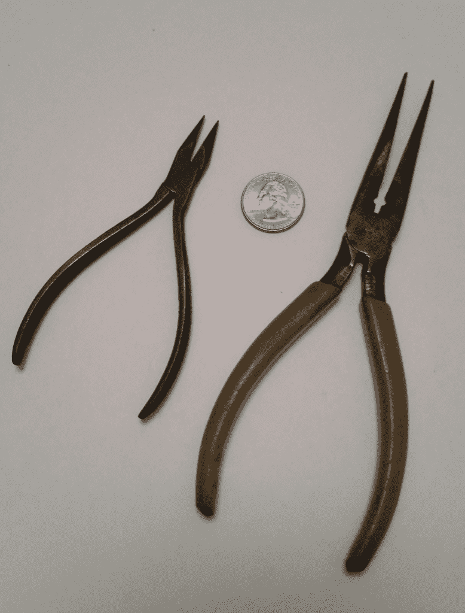
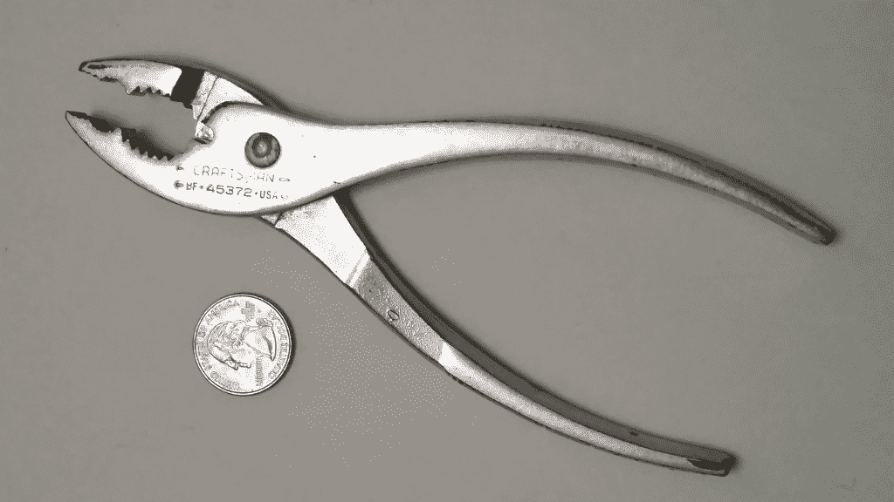
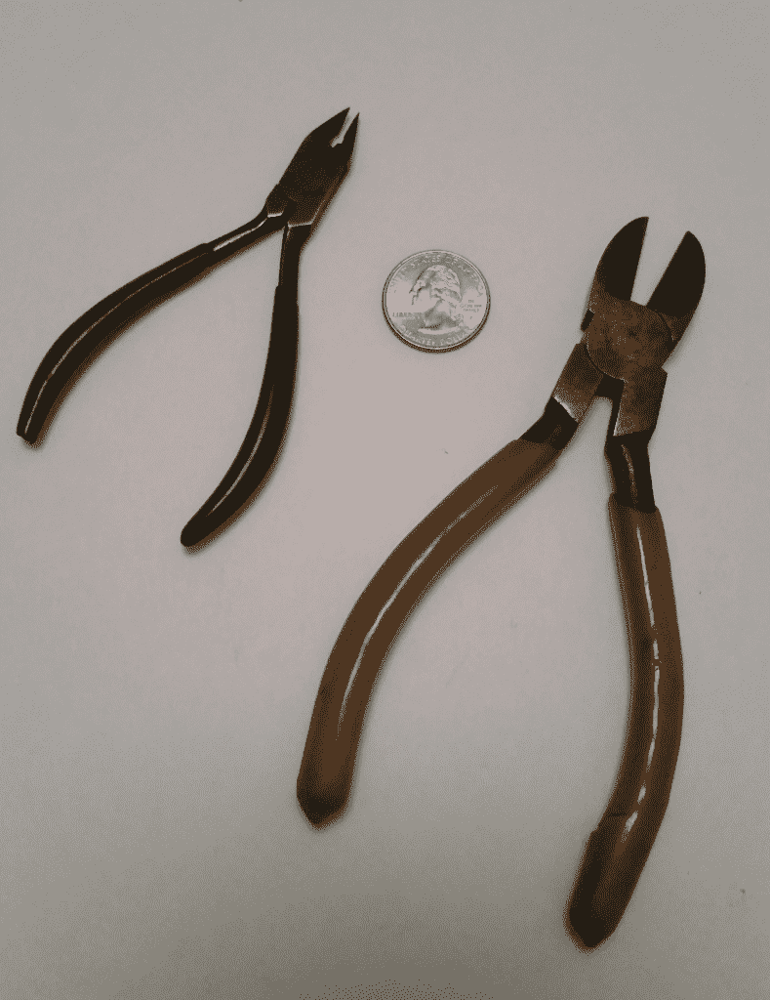

# 了解你的工具:硬件黑客的钳子和刀具

> 原文：<https://thenewstack.io/off-shelf-hacker-tools-101-pliers-cutters/>

作为一名现成的黑客，很大一部分是不仅要有能力开发软件和硬件，还要有能力从一张白纸上创造东西。用铜管、螺母和螺栓、电线、传感器和微控制器板等材料制作工作原型既是一门科学，也是一门艺术。

你还需要工具。

需要什么工具？这就是今天专栏的主题。我将从基础开始，然后在未来的专栏中讨论更多高级设备，您可以将它们添加到您的收藏中。我在以前的文章中提到过我的一些工具[，深入一点可能会有意义，包括在哪里购买以及如何维护它们。除了钳子和螺丝刀之类的手工工具，读者还应该利用一些最新的省力的电动工具，比如凿子和电钻。](https://thenewstack.io/off-shelf-hacker-tools-carry-everywhere/)

今天，我们将看看我在最近的每个项目中使用的一些工具。

## 用钳子夹住

对于构建基于微控制器的项目来说，几把钳子是必不可少的。我最常用的两种是针鼻型的。

尖嘴钳

左边的一对在微型设备上看到的动作最多，比如当我将 24 号线焊接到 Arduino Pro Mini 或 ESP8266 板上的连接器时。薄爪非常适合在电线上做小弯曲或引导元件引线穿过小孔。

较小的那双已经有 50 多年的历史了，是由德国一家名为 [Knipex](http://www.knipex.com/en/the-company/our-history/) 的公司制造的。我叔叔在 1967 年把它们给了我，因为我喜欢做收音机之类的东西。虽然有点贵，但类似的型号在亚马逊上有售。不要太在意价格。今天投资 35 美元，在接下来的 50 年里以每年 0.70 美元的价格分期偿还。

> 一个干燥的，偶尔上油的工具不会生锈，可以用一辈子。

保留一个工具那么久，意味着你必须尊重他们。

大约一年一次，我简单地取一点轻油，涂在钳子上。让它浸泡一分钟左右，然后用纸巾擦掉。另外，记得保持你的工具清洁干燥。如果它们因为某种原因变湿了，一定要及时擦干水分，并擦干。一个干燥的，偶尔上油的工具不会生锈，可以用一辈子。

长一点的尖嘴钳用得不太频繁，尽管我几乎在每个项目中都使用这种工具。有各种尺寸适合工作是很好的。选择一个小的模型进行精细的工作，然后逐步升级到更大的模型，因为你需要更大的保持力，并且正在处理更大的零件。大约 30 年来，我只有长一点的。

你肯定需要一把普通的标准五金/汽车零件钳，如下图所示:

结实的普通五金钳

虽然你可以通过 Knipex 购买一套，但我要说的是，你不会错过在[西尔斯](http://www.sears.com/)零售店常见的[工匠](https://www.craftsman.com/products/hand-tools)品牌。工匠手工工具在[王牌五金](http://www.acehardware.com/home/index.jsp)店也有卖。照片中的那一对也是 30 岁左右。保持干净，干燥，上油。

年轻时，我为老马修斯先生工作。他有一家柴油卡车修理公司。他留着平头，非常老派。他和他的妻子有五个儿子和四个女儿，他们都在店里工作。我记得在一天结束时，其中一个孩子会用水管冲走一整车的工具。空气软管的快速喷射和少量油的快速喷射为第二天做好了一切准备。您的日常工具维护由您决定。

## 切割和剥离

侧切刀

侧切刀是你绝对需要的另一种钳子。过去，每个人都称它们为“堤坝”，是斜口铣刀的缩写。

在完成焊接连接后，侧钳可以让你切断电线和夹断尾部。我通常使用最小的线对来清理穿过印刷电路的电阻或电线的引线。钳口通常向下倾斜到切割边缘，因此称为对角切割器。刀片与钳子另一侧的外部齐平，切割后几乎没有电线伸出电路板表面。

较小的一双是由 Kraeuter 和公司制造的，并印有“101”型号。我不确定它的年代，虽然我是和旧尖嘴钳同时收到它们的。这些年来，我接触过一两次尖端技术。这种特殊的线对仅适用于柔软的细铜线。我在易贝看到过几款类似的复古款，价格在 20 美元左右。

几年前，我还发现了偏口钳的另一种用途:如果你在距离电线末端约 1/8 英寸的地方轻轻抓住绝缘层并轻轻拉动，你就可以将它从非常细的电线上剥离下来。这一招适用于 22 到 26 号的尺寸。可能需要几次尝试才能获得准确的压力，以便整齐地切割绝缘层。

图片还显示了一个更大尺寸的侧铣刀。

这些是用来砍电线从 20 规格下降到约 8 规格。在我的一些蒸汽朋克设计中，我用粗的 8 号和 10 号线做支架和制作铜环。你也可以用金属钳切断粗电线。在靠近钳口的枢轴点附近有几个凹口，专门用于此目的。

## 下一步是什么

我们刚刚触及了构建现成的黑客物理计算项目所需的一些基本手工工具。你可能已经开始收集了。

你将不得不决定如何吝啬你的工具。我发现其他人，甚至是家人，经常不小心使用我的工具，甚至经常在使用后忘记放回原处。你可能不得不把它们锁起来，或者买一台其他人都可以用的二手(便宜)电视机。

如果你小心保管，避免丢失，你的工具可以用很长时间。

在接下来的专栏中，请继续关注对其他工具的探索，以及如何使用它们。

特色图片:工匠巡边钳。

<svg xmlns:xlink="http://www.w3.org/1999/xlink" viewBox="0 0 68 31" version="1.1"><title>Group</title> <desc>Created with Sketch.</desc></svg>