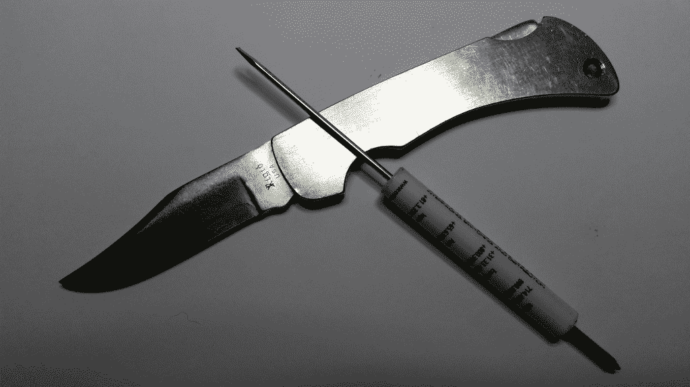

# 现成的黑客:你应该随身携带的工具

> 原文：<https://thenewstack.io/off-shelf-hacker-tools-carry-everywhere/>

上周，我谈到了你可以用来保持动力和处理逆境的工具。它们并不完全以硬件为中心。作为[现成的黑客](/tag/off-the-shelf-hacker/)，我们可以灵活地解决问题，无论是使用手、力量、逻辑、编程、隐喻还是精神工具。

本周，我将介绍我在会议技术讲座中使用的工具。当然，这也适用于我在公司外工作(Panera Bread)，在奥兰多机器人和创客会议或度假时。这个收藏不会占用太多空间，当你需要修理一个项目、写一篇故事或者修理你的有线电视/互联网连接时，它肯定能帮你节省开支。

我已经将我的极简主义移动工具集分类成组。可以根据需要增减一些东西。很多时候，我只是把较大的物品塞进塑料袋，然后卷紧。加几根好的橡皮筋，让它保持紧凑。这可以保持物品的清洁和干燥。你甚至可以包括一个额外的塑料袋，只是因为。

## **螺丝刀组**

我通常喜欢装一把 6 英寸大小的一字螺丝刀和一把十字螺丝刀。它们可以很舒服地放进我的电脑包里。

在处理 Arduino、Raspberry Pi 和 8266 项目时，钢笔螺丝刀绝对是无价之宝。

你可以在任何电器或五金店买到它们。它们的一端有一个小直刀片，另一端有一个小十字。身体是塑料的，通常有一个口袋夹，像一支笔。我的热门建议是，当你在下一次技术会议上巡视展厅时，要密切注意这些赃物。抓一把，你就可以吃很多年了。

## **钳子组**

*   尖嘴钳
*   微型侧铣刀
*   剥皮钳
*   虎钳

一把小尖嘴钳可以让你拿起微小的螺母和螺栓，弯曲端子周围的电线，并在橡皮筋的帮助下充当即兴的零件支架。同样，如果需要的话，一对侧刀非常适合修剪通孔焊接线，甚至剥离绝缘层。普通的剥线钳也很方便。很多时候，他们有一个内置的钢丝钳和钳子。大约在 1967 年，我叔叔给了我一个小小的针鼻和偏口钳。好好照顾它们，它们会伴随你一生。

去年冬天，我在一次会议的新闻发布室，我的一位长期公关朋友在一天结束时正在拆卸他的设备。他的伸缩式展示架不会因为卡住的调节环而倒塌。我从我的项目箱里拿出虎钳，我们一起解开了项圈。人们总是感激并记住那些乐于助人的人。

## **焊接组**

*   25 瓦烙铁
*   焊料

我总是随身携带一个 25 瓦的小烙铁和一小卷焊锡。几年前，我在 OSCON 吃午饭时，话题转到了硬件上。我提到了我关于微控制器的演讲，餐桌上的一位客人评论说，做演示一定很伤脑筋，尤其是用 DIY 硬件。我马上说:“只要确保你手边有烙铁，并做好一切准备。”那个人回答道，“哦，你带了烙铁来参加会议？”说着，我从口袋里拿出我的烙铁……举起来给桌子上的每个人看。每个人都被那个笑话逗得哈哈大笑。

更大的教训是，它让我在信誉部门提升了几个级别，并标志着我是一个真正的“携带工具”的极客。如果你要成为一名真正的现成黑客，你还不如好好生活。

## **绑定组**

*   管道胶带
*   透明胶带
*   拉链
*   3 英尺长的实芯 5 类电缆

管道胶带、透明胶带和拉链对于很多移动时的临时修理来说肯定是很方便的。想在会议上以极客的身份脱颖而出？别忘了胶带。

3 英尺长的 5 类电缆实际上是四对 22 号线。那是 24 英尺长的潜在捆绑线。必要时，我在现场用它来固定电缆，拉上行李箱的拉链，修理会议设备的连接。当然，在需要的时候，你也可以用它来快速修复你的微控制器项目。

## 杂项工具组

*   小折刀
*   P38
*   8 英尺延长线—为三脚插头定制

当我在本地时——意思是我参加的活动在开车的距离内——我总是带着一把小刀。几十年来，我有一把阿肯色州一家名为“刚性”的刀具公司生产的近乎古董的不锈钢锁刃。它没有生锈，非常耐用。但永远不会有锋利的刀刃。从那以后，我就把这把刀作为传家宝退役了。

20 世纪 70 年代的不锈钢刚性锁片。

去年圣诞节，我女儿给了我一把史密斯和韦森公司的普通老式钢制锁刃。它的大小和刚性的相似，有一个铝把手。这东西保持着可怕的锋利，只需要厨房钢刀轻轻敲打几下。

一个 [P38 开罐器](https://en.wikipedia.org/wiki/P-38_can_opener)，来自一家陆军海军商店，是你钥匙圈的一个很好的补充，可以方便地打开罐头，拧螺丝和许多其他工作。

别忘了带一根便宜的 8 英尺 10 英尺的延长线。我把末端的小标签剪掉，这样一个三脚插头就可以插入其中一个插座。我不知道有多少次，当我的一个同事或我的另一根电线只差几英尺时，它救了我一命。

## **为什么扛？**

现成的黑客有很多机会去领导和帮助需要帮助的人。您可能需要修复一些小工具或演示设备。你可能需要用胶带粘住你的树莓派演示机，这样它就不会从讲台上滑落。或者，当一个同事想要赶飞机回家时，你可以帮他一把，他的衣领被卡住了。准备好最简单的工具包，知道自己可以解决大多数常见问题，这有助于增强你的自信。帮助别人是很棒的，他们肯定会感激你的努力。

<svg xmlns:xlink="http://www.w3.org/1999/xlink" viewBox="0 0 68 31" version="1.1"><title>Group</title> <desc>Created with Sketch.</desc></svg>