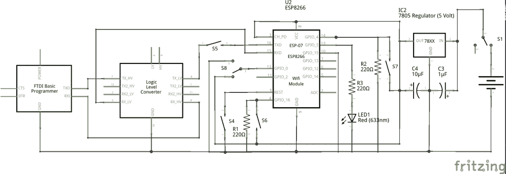

# 现成的黑客:与 ESP8266 的双向通信

> 原文：<https://thenewstack.io/off-shelf-hacker-two-way-comms-esp8266/>

随着人们对物联网(IoT)的广泛讨论，ESP8266 WiFi 片上系统(SoC)无疑是这类项目的理想选择。它很容易编程，占用空间小，而且价格低廉。ESP8266 模块的物联网应用可能包括传感器、执行器、指示器和需要远程双向通信的项目。

我正在开发 PIR(被动红外)区域监视器、网络照明系统、远程环境传感器和用于我的 LibreOffice Impress 演示的无线点击器。所有这些都使用远程节点(ESP8266 设备)与我的局域网、服务器、云或用户应用程序之间的近实时双向通信。

在这一期中，我将介绍 ESP8266-07 模型的基本通信方案。请随意扩展概念以创建您自己的物联网项目。

## 框架和设置

正如我们在早先的[现成黑客](/tag/off-the-shelf-hacker/)故事中讨论的那样，ESP8266 芯片是使用多种语言和框架编程的。我个人喜欢 Arduino IDE。代码语法对我来说很有意义，函数库相当全面，对于 8266s、Arduino 和处理项目工作来说，环境是相同的。请务必回顾之前的[“像专家一样阅读原理图”](https://thenewstack.io/off-shelf-hacker-read-schematics-like-pro/)、[“使用 ESP8266 将 WiFi 连接添加到您的 DIY 项目”](https://thenewstack.io/off-shelf-hacker-programming-tips-tricks-esp8266-wifi-module/)和[“ESP8266 WiFi 芯片的分裂个性”](https://thenewstack.io/off-shelf-hacker-split-personality-esp8266/)新堆栈故事。

使用 ESP8266-07 的设置类似于-01 版本，除了-07 有一个外部天线连接器和更多的通用输入/输出(GPIO)引脚。物理跳板看起来相当复杂。

电路实际上非常简单，如图所示。



ESP8266-07 双向通信示意图

## 易管理的代码——第 1 部分

库是 Arduino IDE 环境中节省人力的现代设备。毫不奇怪，我从一个 ESP WiFi 库中抓取了代码来开始我的双向通信程序。

代码分为两部分，连接到接入点(AP)和处理 GPIO。

第 1 部分处理加入接入点的问题，来自“WiFiManager”类别下的“AutoConnectWithFeedback”示例程序。如果 8266 设备之前没有连接到特定的接入点，它会启动自己的接入点，并在其 Web 服务器(http://192.168.4.1)上发布一个页面，为配备 WiFi/浏览器的设备(如 Galaxy 5 超级手机)上的用户提供选择加入哪个 AP 的选项。此时，8266 设备和电话之间有一个临时局域网。然后，该页面提示用户输入 AP 访问密码。8266 将进行复位，并在关闭临时局域网和网络服务器的同时连接到选定的局域网。如果 wifi manager . reset settings()；行被注释掉了，它会记住 AP 凭证，所以您不必每次都输入 SSID 和密码。在编程和故障排除期间，取消对该行的注释以重置设置。

在代码的 WiFi 部分初始化之后，我们继续第 2 部分。

这是第 1 部分的代码。

```
#include &lt;ESP8266WiFi.h&gt;
#include &lt;DNSServer.h&gt;
#include &lt;ESP8266WebServer.h&gt;
#include &lt;WiFiManager.h&gt;

void configModeCallback  (WiFiManager *myWiFiManager)  {
Serial.println("Entered config mode");
Serial.println(WiFi.softAPIP());
//if you used auto generated SSID, print it
Serial.println(myWiFiManager-&gt;getConfigPortalSSID());
}

const int ledPin  =  5;
const int buttonPin4  =  4;
int buttonState4  =  0;
WiFiServer server(1337);

void printWiFiStatus();

void setup(void)  {
  Serial.begin(115200);

  WiFiManager wifiManager;
  wifiManager.resetSettings();
  wifiManager.setAPCallback(configModeCallback);

  if(!wifiManager.autoConnect())  {
    Serial.println("failed to connect and hit timeout");
    ESP.reset();
    delay(1000);
  }  

  // Configure GPIO2 as OUTPUT.
  pinMode(ledPin,  OUTPUT);
  pinMode(buttonPin4,  INPUT);

  // Start TCP server.
  server.begin();

```

## 易管理的代码——第 2 部分

第 2 部分处理读取按钮、向远程机器(比如我的 Galaxy superphone 或 Linux 笔记本)发送消息，以及可选地打开或关闭 LED。

有趣的是，第 2 部分自然地出现在固件的循环部分，它实际上完成了设备的工作。额外的功能很可能被插入到这个部分中。

这是第 2 部分的代码。

```
void loop(void)  {

  // Check if module is still connected to WiFi.
  if  (WiFi.status()  !=  WL_CONNECTED)  {
    Serial.println("WiFi connected inside void loop");
    while  (WiFi.status()  !=  WL_CONNECTED)  {
      Serial.println("WiFi.status connected loop");
      delay(500);
    }
    // Print the new IP to Serial.
    printWiFiStatus();
  }

  WiFiClient client  =  server.available();

  if  (client)  {
    Serial.println("Client connected.");

    while  (client.connected())  {

      buttonState4  =  digitalRead(buttonPin4);
        // Serial.println(buttonState4);
        if  (buttonState4  ==  HIGH)  {
          // digitalWrite(5, HIGH);
          Serial.println("Button pushed");
          client.write("Button pushed\n");
        }

      if  (client.available())  {  

        char command  =  client.read();
        if  (command  ==  'H')  {
          digitalWrite(ledPin,  HIGH);
          Serial.println("LED is now on.");
          client.write("LED is now on.");
        }
        else if  (command  ==  'L')  {
          digitalWrite(ledPin,  LOW);
          Serial.println("LED is now off.");
          client.write("LED is now off.");
        }
 }
    }
    Serial.println("Client disconnected.");
    client.stop();
  }
}

void printWiFiStatus()  {
  Serial.println("");
  Serial.print("Connected to ");
  // Serial.println(ssid);
  Serial.print("IP address: ");
  Serial.println(WiFi.localIP());
}

```

代码并不复杂。当远程客户端连接时，它建立连接并启动服务器。远程客户端可能是一个应用程序，甚至是类似网络终端的程序， [netcat](https://www.digitalocean.com/community/tutorials/how-to-use-netcat-to-establish-and-test-tcp-and-udp-connections-on-a-vps) 。在编写这个故事时，我在 Linux 笔记本和 Galaxy 5 手机上都使用了 netcat。当按钮被按下时，8266 向远程客户端机器发送“按钮被按下”文本消息。如果远程机器向 8266 设备发送一个“H”字符，它会点亮 LED。同样，发送“L”字符会关闭 LED。根据您的功能需求制作您的信息。

printWiFiStatus()代码只是向串行终端发送状态信息，对于开发和故障排除非常有用。

## 更进一步

一个基本的双向通信方案是一个合理的扩展起点，有更多的按钮、传感器、输出等等。由于局域网配置代码是使用库函数内置的，所以在不同的位置使用该设备也很容易，只需很少的额外工作。一点点的计划和逻辑可以使今天概述的概念扩展到具有多种设备和位置的更大的项目。

一旦你有了按钮或传感器和输出设备，就很容易通过修改和上传新的固件来改变行为。

您可以查看 ESP8266WiFiMesh 和 ESP8266WiFi 示例，了解更多项目想法。

<svg xmlns:xlink="http://www.w3.org/1999/xlink" viewBox="0 0 68 31" version="1.1"><title>Group</title> <desc>Created with Sketch.</desc></svg>