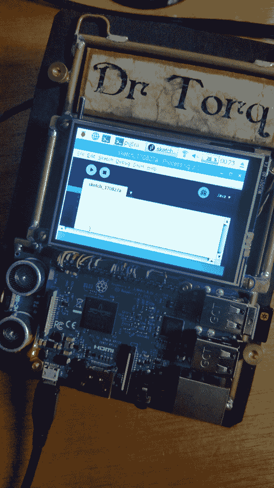

# 现成的黑客:使用处理编程语言来构建屏幕上的标尺

> 原文：<https://thenewstack.io/off-shelf-hacker-use-processing-build-screen-gauge/>

上周[我们看了使用伺服作为一个衡量标准](https://thenewstack.io/off-shelf-hacker-use-servo-gauge/)。这个项目有它的困难:我把伺服系统的疯狂运行归因于时间问题。

由于无法保持足够的独立，我考虑使用我的一个用[处理](https://processing.org/)编程语言编写的旧计量器程序，来取代我的蒸汽朋克会议徽章中基于伺服的计量器。屏幕上的响应要好得多，尽管有一个物理模拟型仪表仍然很有趣，在徽章的前面上下扫动它的小手。

为了让屏幕上的仪表工作，我们需要改变一些东西。许多物理计算项目的酷之处在于，如果你聪明地使用硬件，许多行为和特性很容易通过软件更新来改变。 [](https://store.arduino.cc/usa/arduino-pro-mini)

首先，我们必须修改伺服代码，一点点，为 Arduino Pro Mini 。然后，我们必须在 Raspberry Pi 3 上加载处理语言。最后，还有仪表代码的小问题。

我喜欢[处理](https://processing.org/)，因为它易于使用，并且是为可视化应用而设计的。它运行在 Linux 上，在笔记本和树莓 Pi 上都可以运行。开发环境和代码结构也与我们用来编程 Arduino Pro Mini 的相同。如果你能为一个 Arduino 编码，你当然能在处理中编码。

## 从 Pro 迷你伺服代码开始

让 servo gauge 项目中的 Arduino 代码与屏幕上的 gauge 一起工作相当简单。更改以粗体突出显示。

```
/*
HC-SR04 Ping distance sensor]
VCC to arduino 5v; GND to arduino GND
Echo to Arduino pin 7; Trig to Arduino pin 8
*/

#include &lt;Servo.h&gt;

Servo myservo;  // create servo object to control a servo

#define echoPin 8
#define trigPin 7
int val;

void setup()  {
  Serial.begin  (115200);
  pinMode(trigPin,  OUTPUT);
  pinMode(echoPin,  INPUT);
  myservo.attach(9);
}

void loop()  {
  // send a pulse on the trigger pin to initiate measurement
  digitalWrite(trigPin,  LOW);
  delayMicroseconds(2);
  digitalWrite(trigPin,  HIGH);
  delayMicroseconds(10);
  digitalWrite(trigPin,  LOW);

  // the length of the pulse on the echo pin is proportional to the distance
  long duration  =  pulseIn(echoPin,  HIGH);
  long distance  =  (duration  /  2)  /  29.1  *  .3937  ;

  if  (distance  &gt;=  200  ||  distance  &lt;=  0)  {
    <strong>// Serial.println("Out of range");</strong>
  }
  else  {
    Serial.println(distance);
    <strong>// Serial.println(" in");</strong>
  }

  val  =  map(distance,  1,  70,  0,  180); // scale it to use it with the servo (value between 0 and 180) 
  myservo.write(val);
  <strong>// Serial.println(val);</strong>

  delay(300);
}

```

我对 Arduino 代码所做的唯一真正的更改是注释掉“超出范围”、“进入”和“val”串行打印语句。这些信息被用来使输出对人类可读。当通过串行线路向 Raspberry Pi 和处理程序发送距离值时，我们不需要包含这些内容。

我把伺服系统的代码留在了程序中，想着将来可能会回来试着修改它。通过简单地从连接器上拔下伺服系统，我们不会浪费宝贵的电池能量，而且在代码中留下这些行也不会有什么损失。我喜欢使用连接器和插座来为我的项目添加硬件组件。把东西焊接在一起需要一点额外的时间，但是调整你的设计更容易。

这里有一个三线伺服连接器的镜头，上面有一片胶带，以防止短路。


3 线伺服连接器，用透明胶带绝缘

修改之后，我使用通常的技术编译并上传代码到 Pro Mini。我通过启动 Arduino 的嵌入式串行控制台来检查来自串行端口的数据。

## 在 Pi 3 上安装处理

在使用屏幕上的探头代码之前，处理包必须安装在 Pi 3 上。我在命令行使用 **wget** 到[下载 3.3 (ARM)版本](https://processing.org/download/)到 Pi:

```
pi%  cd  /home/pi
pi%  wget http://download.processing.org/processing-3.3-linux-armv6hf.tgz

```

一旦文件在 Pi 上，使用 tar 将其解压到一个目录:

```
pi%  tar  -xzvf processing-3.3-linux-armv6hf.tgz

```

使用 Processing 非常简单，但有一点需要注意:首先必须设置串行端口，以便通过串行端口传入的数据符合程序的预期，尤其是比特率。

很多次，我发出了 **cat** 命令来读取串行线路(或 USB)上的数据流，结果只是坐在那里想知道为什么没有任何值向下滚动到屏幕上。我选择了 115，200 的比特率。您可以使用任何您喜欢的速度，只要您将串行线(使用 **stty** )以及 Arduino 和加工量规代码设置为相同的值。如果串行线路速度或代码中的内容被关闭，你将得到一堆有趣的字符，最好的情况下或者根本没有，最坏的情况下。在开始加工程序前不发出 **stty** ，会导致量规不显示指针。

```
pi%  sudo stty  -icrnl  -F  /dev/ttyS0  115200

```

完成后，进入目录并启动处理交互开发环境(IDE)。它的工作方式与 [Arduino IDE](https://www.arduino.cc/en/Main/Software) 相同。

```
pi%  cd processing-3.3
pi%  ./processing

```



在 Raspberry Pi 3 屏幕上处理 IDE。

单击文件下拉菜单，然后单击“新建”菜单项。

因为我在我的 Linux 笔记本上开发了处理代码，所以我必须把代码交给 Pi。最简单的方法就是简单地将 **scp** 的代码从笔记本转移到 Pi 上。

```
pi%  scp  /home/rob/sketchbook/processing/gauge2/gauge2.pde pi@192.168.1.102/home/pi/gauge2.pde

```

读者可以从这个故事中复制/粘贴文本，到一个新的处理文件中，然后将其保存到 sketchbook 中。

以下是 Pi 屏幕仪表的处理代码:

```
/**
Gauge code for the ARM chip in the Raspberry Pi 3\. 

The angle of each segment (in radians) is controlled by the data streaming in from the serial line. 
**/

import processing.net.*;

PFont font;
float  x,  y;
String angle  =  "0";  // angle in degrees
String distance  =  "0";  // distance in inches
float anglef  =  0.0;
float angle1  =  0.0;
float segLength  =  110;
BufferedReader reader;
String line;

void setup()  {

  size(350,  300);
  strokeWeight(2);
  stroke(255,  160);

  x  =  width *  0.5;
  y  =  height *  0.8;

  font  =  loadFont("LiberationSans-20.vlw");
  textFont(font);
  textAlign(CENTER);

  reader  =  createReader("/dev/ttyS0");

}

void draw()  {

  background(0);
  try  {
    line  =  reader.readLine();
  }  catch  (IOException  e)  {
    e.printStackTrace();
    line  =  null;
  }
  if  (line  ==  null)  {
    // Stop reading because of an error or file is empty
    noLoop();  
  }  else  {
    // println("distance = ", line);
  }

  distance  =  line;

  if  (angle  !=  null)  {
    anglef  =  (180-(float(distance))*1.8)*3.1416/180*-1;
    // scale the distance to an angle for the gauge

    // println(distance, " ",  anglef);  //in radians
  }
  pushMatrix();
  segment(x,  y,  anglef);  
  popMatrix();

  text("Distance (in)",  175,  50);
  text("0",  35,  250);
  text("25",  65,  150);
  text("50",  175,  100);
  text("75",  285,  150);
  text("100",  320,  250);

  noFill();
  arc(175,  245,  240,  245,  PI,  TWO_PI);

}

void segment(float  x,  float  y,  float  a)  {
  translate(x,  y);
  rotate(a);
  line(0,  0,  segLength,  0);

}

```

代码中有几个值得注意的地方。

在版本 3 之前，Raspberry Pi 上的有线串行端口被指定为/dev/ttyAMA0。Raspberry Pi 3 将这个名字重新分配给了蓝牙接口。相反，对 Pi 上的有线串行端口使用/dev/ttyS0，一切都会正常工作。当然，如果你想从 USB 连接的设备中获取数据，可以使用常规的/dev/ttyUSB0、/dev/ttyUSB1 等。名字。

关于这个程序的另一个有趣的事情是角度测量是以弧度计算的，而不是以度。我必须缩放距离，从 0 到 200 英寸，到 0 到 180 度，这是手从水平左(0 度)到水平右(180 度)的扫动。值 1.8 将测量范围从 0-180 扩大到 0-200。

最后，仪表上读数的刻度值放在带有“文本”线的仪表面上，靠近程序的底部。我只是选择了 X 和 Y 值，使它看起来正确。当然，有一点尝试和错误，以获得正确的。

将程序保存为文件名，如“gauge ”,然后按下处理 IDE 中的“运行”箭头按钮。在短暂的等待之后，液位计应该出现在 LCD 屏幕上，并根据超声波测距仪检测到的距离扫过一个弧。在开始处理之前，确保 Arduino 已通电，并且不要忘记那个 **stty** 语句。

这种仪表工作得很好，反应也很灵敏。把我的手放在徽章前面大约一英尺的地方，显示出大约 12 英寸，在仪表上。徽章放在我的桌子上，仪表显示大约 70 英寸，这是到天花板的距离。

## 下一步是什么

屏幕上的仪表比伺服模型好得多。读数一致且快速。而且，硬件基本上没有变化。这就是物理计算堆栈的魅力所在。

我的原型小工具旨在通过古怪的设计，彩色视频屏幕，有时灯光和强烈的蒸汽朋克氛围来吸引注意力。当然，它们也是我在[现成黑客专栏](/tag/off-the-shelf-hacker/)中使用的各种真实世界物理计算想法的测试平台。

当我们可以制造出你可以佩戴、触摸和展示给人们的东西时，为什么要在只会存在于工作间的项目上使用无聊的旧白色塑料试验板呢？

<svg xmlns:xlink="http://www.w3.org/1999/xlink" viewBox="0 0 68 31" version="1.1"><title>Group</title> <desc>Created with Sketch.</desc></svg>