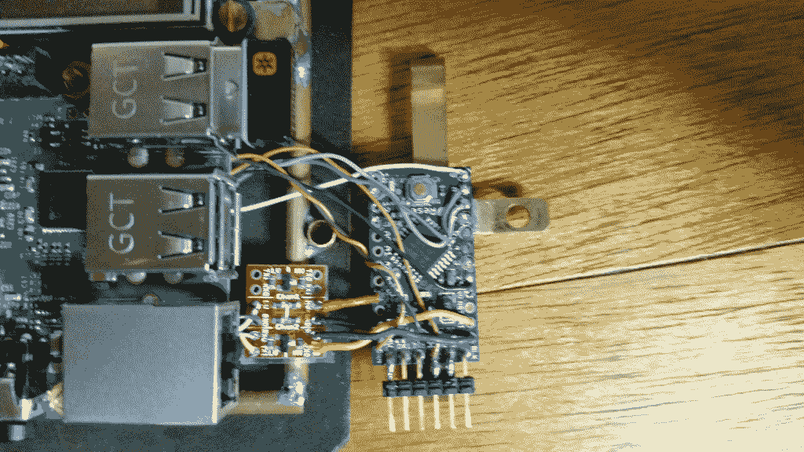
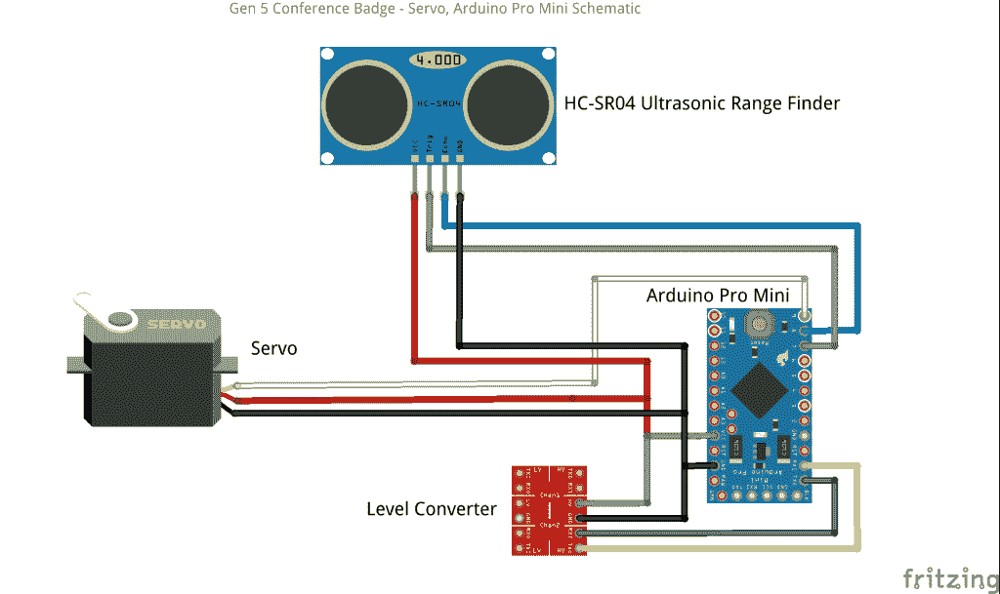
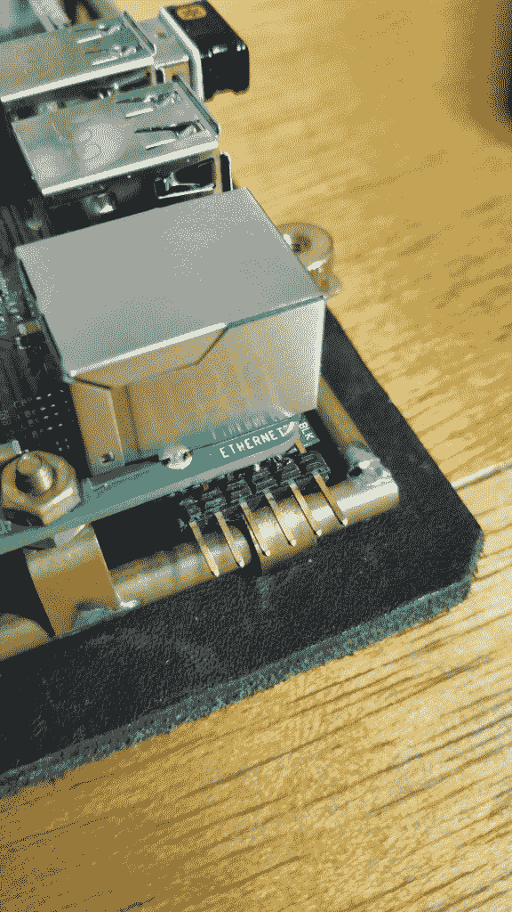

# 现成的黑客:使用伺服作为衡量标准

> 原文：<https://thenewstack.io/off-shelf-hacker-use-servo-gauge/>

对于硬件黑客和蒸汽朋克项目来说，仪表是很有价值的视觉输出设备。从最基本的意义上来说，量规是一个测量事物的组件，它以数字或视觉的方式表示所测量的事物的大小。

我的周末家庭项目原型结合了这两个主题，所以我认为这是一个很好的时间来实际上把一个项目的标准。

例如，对于我的下一个[蒸汽朋克会议徽章](https://thenewstack.io/hacking-hardware-the-never-ending-saga-of-steampunk-name-badge-development/)的彩色液晶显示屏，我认为用软件创建一个简单的计量器是一件很容易的事情。

事实证明，设计屏幕上的仪表比我想象的要复杂。首先，我找不到 Python 的任何“标准”库，Python 是 Raspberry Pi 最常用的编程语言。[处理](https://thenewstack.io/off-shelf-hacker-expand-projects-processing-sketchbook/)是一个选项，因为有一些不错的旋钮库。对于过去的项目，我已经将其中的一些例子转化成了可用的量表。当然，处理必须首先安装在 Pi 上。我已经很久没有看这些程序了，所以决定暂时把“屏幕上的”量表放在一边。

为什么不用伺服作为标尺？这是手表和汽车制造商使用的。会有多难呢？

给你个提示。很大程度上取决于传感器和时间。本周，我们将看看伺服量规如何在您的项目中发挥作用，以及学到的经验和面临的挑战。

## 吸引注意力

我的会议徽章旨在吸引注意力，并在活动中引发话题。

我在我的下一个“第五代”徽章上放了一个超声波测距仪，因为它不仅看起来有趣，还可以充当“社交互动干扰仪”传感器。这是一个虚构的蒸汽朋克技术术语，用来测量我和另一个人之间的距离，以及我们的互动水平。

如果我前面没有人，护林员会报告一个很高的数字，甚至是“超出范围”的值。正常、随意的转换可能会返回 36 英寸的值。12 英寸或更小的尺寸意味着我们正在进行一场激烈的讨论。

为了提供视觉反馈，我认为徽章前面的移动标尺会随着距离的变化而变化，这会引发一些疑问。

在会议徽章的情况下，超声波测距仪连接到辅助 Arduino Pro Mini 微控制器上的几个引脚。Pro Mini 向 Raspberry Pi 发送串行数据，然后 Raspberry Pi 在终端中显示文本值。对于基本的 Arduino 代码，我使用了传感器库中的 ping 示例。



辅助 Arduino Pro Mini 从 Raspberry Pi 板下卸下

测距仪数据也可以直接馈入连接到 Pro Mini 的伺服系统，只需对 ping 代码进行一些修改。

以下是超声波传感器、伺服系统和 Arduino Pro Mini 的基本电路图连接:



超声波传感器、伺服系统和 Arduino Pro Mini 的基本连接

## 反映输入数据

ping 代码相当简单。发出一个 ping，测量返回时间，将时间转换为距离，然后打印结果。运行伺服所需的额外代码以粗体显示。

```
/*
HC-SR04 Ping distance sensor]
VCC to arduino 5v; GND to arduino GND
Echo to Arduino pin 7; Trig to Arduino pin 8
*/

<strong>#include &lt;Servo.h&gt; 
Servo myservo;  // create servo object to control a servo</strong>

#define echoPin 8
#define trigPin 7
<strong>int val;</strong>

void setup()  {
  Serial.begin  (115200);
  pinMode(trigPin,  OUTPUT);
  pinMode(echoPin,  INPUT);
  <strong>myservo.attach(9);</strong>
}

void loop()  {
  // send a pulse on the trigger pin to initiate measurement
  digitalWrite(trigPin,  LOW);
  delayMicroseconds(2);
  digitalWrite(trigPin,  HIGH);
  delayMicroseconds(10);
  digitalWrite(trigPin,  LOW);

  // the length of the pulse on the echo pin is proportional to the distance
  long duration  =  pulseIn(echoPin,  HIGH);
  long distance  =  (duration  /  2)  /  29.1  *  .3937  ;

  if  (distance  &gt;=  200  ||  distance  &lt;=  0)  {
    Serial.println("Out of range");
  }
  else  {
    Serial.print(distance);
    Serial.println(" in");
  }

  val  =  map(distance,  1,  70,  0,  180); // scale it to use it with the servo (value between 0 and 180) 
  myservo.write(val);

  delay(300);
}

```

伺服代码也并不复杂。

首先，include 语句从标准伺服库中引入函数，而 servo 语句初始化用于控制伺服的对象。

我们必须添加一个变量 **val** ，用于根据伺服控制程序的需要，将测距仪的距离值换算成角度值。

接下来， **myservo.attach** 语句将伺服分配给 Arduino Pro Mini 上的引脚 9。

之后，map 函数将距离缩放到伺服机构的角度，然后将该值写入伺服机构，使其移动。

我确保在 Arduino IDE 的工具菜单下将主板设置为“Pro Mini”。如果您忘记使用不同的主板编译代码，当您尝试将固件上传到 Pro Mini 时，将会出现**“STK 500 _ getsync()**”错误。切换到正确的板，一切都会正常工作。使用 **sudo** 启动 Arduino IDE，以避免 USB 端口权限
的问题

```
pi%  cd ard*1.6.5
pi%  sudo  ./arduino  

```

代码是在我的 Linux 笔记本上开发的，并使用 USB 转串行接口电缆上传。在代码被编译并上传到 Arduino 后，我拔掉了电缆并重启了会议徽章上的 Pi。一旦 Pi 启动并运行，我打开 Arduino 的电源，伺服系统立即开始移动。



串行到 USB 接头连接到辅助 Arduino Pro Mini

## 徽章上的伺服仪表可行吗？

结果有点令人失望。伺服有点工作，但它的行动是相当不稳定的。

在观看来自串行终端的数据后，当超声波测距仪将数据馈送到 Pro Mini 并试图用伺服系统跟踪它时，很明显时间是一个主要问题。

超声波传感器使用两条数据线。一个向传感器上的转换器发送数字脉冲。连接到传感器接收器的另一条线监听返回的数字脉冲，然后 Arduino 将脉冲的往返时间转换为距离。

Arduino 还生成特定宽度的脉冲，告诉伺服移动到某个位置。

小小的 Arduino 似乎无法同时为超声波传感器和伺服系统准确地生成和读取这些脉冲。更糟糕的是，任何导致代码执行延迟的事情都会导致进一步的计时问题。**改变 delay()** 函数值甚至增加打印语句对伺服跟踪有负面影响。

另一个问题可能是来自伺服电机的噪声影响到+5 伏电源线上的超声波传感器的功率。一些滤波或单独的伺服电源可能会有所帮助。

我的结论是，在这种配置下，同时使用超声波测距仪和伺服仪，对于我的特定应用来说是一个有问题的组合。

用 Arduino 的模拟输入引脚读取电位计，然后根据数值移动伺服系统(比如仪表),这是非常可靠的。对于远程控制项目，我已经多次使用这种技术。模拟引脚上的电位计并不关心脉冲宽度和时序问题。结果是一致的，快速和跟踪是相当不错的。如果你的传感器没有很强的时间要求，使用伺服作为一个衡量将在许多情况下工作。

在将伺服系统添加到徽章之前，测距仪愉快地沿着它的路线前进，以每秒几次的速度跟踪距离，同时在终端窗口中以文本流的形式输出值。数值一致、快速且准确。你可以使用一个测距仪，让 Arduino 管理时间，一个伺服表，连接到一个输出引脚。你也可以调查一个[外部基于 I2C 的伺服驱动板](https://www.adafruit.com/product/815)。不过，我对这些方法表示怀疑。

## 什么会更好？

我想在 Gen 5 徽章上加一个三色 LED“臭氧管”已经有一段时间了。即使 LED 由脉冲宽度(PWM)输出值控制，它也可能作为可视输出设备工作。想象一下，当有人靠近徽章时，LED 会从蓝色变为绿色，再变为橙色，然后变为红色。我们必须试一试。

或者，也许屏幕上的计量器终究会更好。我不认为计时问题会影响 LED 屏幕上显示的仪表。也许破解我的一个旧的处理测量程序(在 Pi 上)来读取从 Pro Mini 输入 Pi 串口的测距数据是有意义的。这个选项是未来专栏的一个很好的候选。

[现成的黑客](/tag/off-the-shelf-hacker/)经常经历错误的开始和重来。这是游戏的本质，也是我们学习的方式。经验丰富的设计人员当然知道使用微控制器时的时序挑战，并采取相应的行动。

专业硬件制造商和周末硬件制造商在知识和理解上存在巨大差距。环顾四周，看看你是否能找到关于定时、传感器和微控制器的真实世界的讨论。

<svg xmlns:xlink="http://www.w3.org/1999/xlink" viewBox="0 0 68 31" version="1.1"><title>Group</title> <desc>Created with Sketch.</desc></svg>