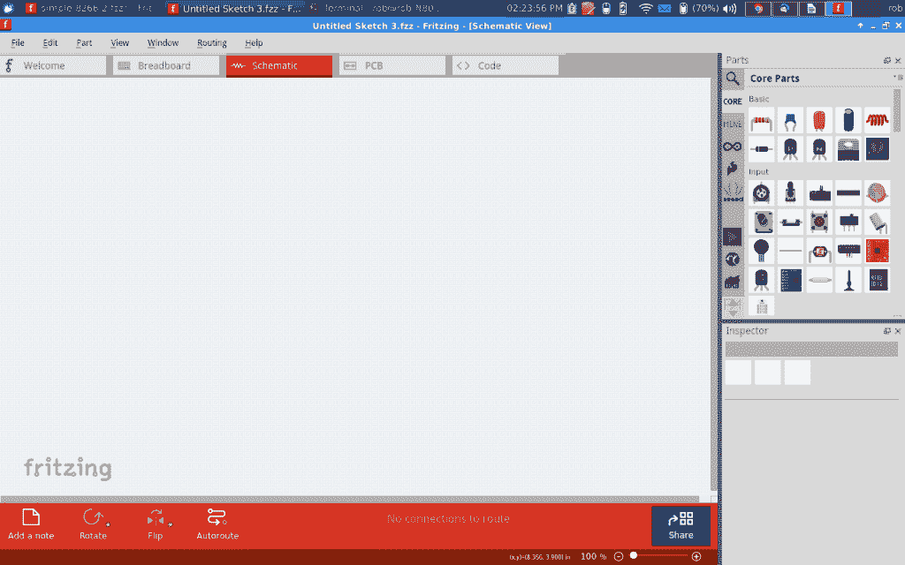

# 现成的黑客:Fritzing 应用程序的虚拟面包板

> 原文：<https://thenewstack.io/off-shelf-hacker-virtual-breadboarding-fritzing/>

几周前，[现成的黑客](/tag/off-the-shelf-hacker/)查看了[原理图的基础](https://thenewstack.io/off-shelf-hacker-read-schematics-like-pro/)。本周我们将介绍如何使用 Fritzing 应用程序来绘制自己的原理图。我建议手工画几个原理图，只是为了练习。用[烧结](http://fritzing.org)绘制原理图肯定会加快进程。这是一个适度的学习曲线，随着练习肯定会变得更容易和更快。Fritzing 在 Maker 社区中随处可见，当您需要记录您的电路设计时，它是您的首选。

如果你还没有安装 Fritzing，只需按照下面的步骤开始。

## **烧结安装**

下载适合您的操作系统的版本。我使用的是 [Linux-64 版本](http://fritzing.org/download/0.9.2b/linux-64bit/fritzing-0.9.2b.linux.AMD64.tar.bz2)(下载链接)，它被复制到我的~/Downloads 目录中。我扩展了 tar 文件，并使用以下命令行启动 Fritzing 程序。

```
rob%  cd  ~
rob%  cp  ~/Downloads/fritzing-0.9.2b.linux.AMD64.tar.bz2  .

```

不要忘记命令末尾的点号。它只是用相同的文件名将它复制到当前目录中。

```
rob%  tar  -xvf fritz*bz2
rob%  cd fritz*
rob%  ./Fritzing

```

主熔块屏幕如下所示:

[](https://thenewstack.io/wp-content/uploads/2016/01/fritzing-main-screen.png)

烧结主屏幕

## 让我们开始吧

单击“文件”和“新建”创建一个新文件默认情况下，空白草图会出现在“试验板”视图中，右侧是标准长度的试验板和零件列表。

Fritzing 中有三种视图模式。试验板视图(默认)允许您设计具有物理外观的组件。

[](https://thenewstack.io/wp-content/uploads/2016/01/breadboard-view.png)

试验板视图

示意图显示了带有传统原理图符号的电路。

[](https://thenewstack.io/wp-content/uploads/2016/01/schematic-view.png)

示意图

PCB 视图允许您在印刷电路板上物理排列元件。我们今天的讨论将局限于示意图，因此请单击该选项卡。如您所料，在您设计时，这三个视图会保持同步。请注意，您经常需要在各种视图中手动排列组件，以使它们整洁有序。你可以随意探索其他两种观点。

让我们使用“[像专业人士一样阅读原理图”文章中的例子来设计一个基本电路。](https://thenewstack.io/off-shelf-hacker-read-schematics-like-pro/)

[](https://thenewstack.io/wp-content/uploads/2016/01/banner.png)

简单电路

点击零件清单上的“旧件”标签。会出现一堆输入、输出、微控制器的标准件。向下滚动到“输出”组，选择 DC 电机。单击并将其拖到空白原理图上。

接下来，移动到“电源”部分，选择电池。单击并将其拖到原理图上。

最后，向上滚动并在“输入”下找到拨动开关单击并将其拖到原理图上。

将各部分排列整齐，就像我上面的画一样。

连接部件非常简单。单击组件导线的末端，将连接(导线)拖到另一个组件上，将其挂接到所需的连接。例如，将一根电线从蓄电池的负极(短杆)连接到电机上的一根电线。在连接之前，你需要让电线的末端非常靠近组件的电线。如果导线看起来像是在空间中结束，请再次高亮显示导线末端，并稍微移动它，直到它“咔哒”一声或“连接”到另一根导线。

将电机的另一端连接到拨动开关的一个端子上。然后，将拨动开关的另一端连接到蓄电池正极(长杆)上。当然，我们总是希望有一个完整的电路。

## **让您的图解生活更轻松**

抓取零件，将它们放在原理图上并连接在一起。这就是用 Fritzing 绘制原理图的全部内容。神奇之处在于能够找到正确的部分，说明所有的连接，并使绘图整洁。

始终使用最新版本。我使用的是 64 位版本 fritzing-0.9.2b。最新版本包括来自大型硬件供应商的相当最新的零件库。这意味着，如果你使用 Fritzing 的当前版本，你将不必在互联网上寻找你的原理图需要的部分。

例如， [Sparkfun](https://www.sparkfun.com/) 销售 Arduino Pro Mini。我在我的一些项目中使用过它们。向下滚动并点击 Sparkfun 零件选项卡。你会在“其他”组中找到 Mini。

您也可以使用零件列表顶部的搜索栏来查找零件。输入“pro mini”就能得到一堆零件。显然，许多零件的标签列表中都有“pro mini”字样。您需要向下滚动一点，才能在列表中找到它。

如果找不到需要的零件怎么办？只要找一个合适的。网上的 fzz 文件。熔结零件是由供应商和第三方在。fzz 格式，可以很容易地导入到应用程序中。我最近需要一个 ESP8266-01 器件用于一个新的无线项目。于是，我在谷歌搜索了“esp8266-01”和“fzz”。弹出了几个网站。我点击下载了一个。fzz 文件到我的下载目录。这些文件通常不是很大。

To use the file, start Fritzing and click the “core” tab on the parts list. On the right side of the “Core Parts” bar, you’ll see a little configuration drop-down. Click the drop-down and select “Import”. It should be at the top of the list. Go to the directory where the .fzz was downloaded. Click on the .fzz file and it will be imported into your parts list, probably under the “mine” parts tab. Simply drag it into the schematic, as usual.

Another important tip is that you can manipulate the parts once they’re in your schematic. Left click on a part, then right-click to get a menu of things you can do to the part. For example, if the battery symbol has the positive terminal on the wrong side, just flip it horizontally (or vertically), so you can minimize long, complicated wire runs and unnecessary cross-overs. It takes a little practice to arrange parts, so the schematic is easy to read and unambiguous.

Other functions on parts include rotating it 90 degrees clockwise/counter-clockwise, raising/lowering (in front of or behind other parts) in the drawing and copying/pasting. Take full advantage of these features and make your schematics neat and tidy. People looking at the schematic will appreciate your efforts. You’ll thank yourself too when you finally cycle back around to that back-burner project you were working on a month ago.

## **Go Forth And Draw**

Fritzing is much like most other vector-based drawing applications. Remember that you are working with objects, as opposed to bits of color and you should be fine. Explore the program a bit and take advantage of the labor saving features, to create awesome schematics.

Also, Fritzing is the perfect complement to the other important tools in the Off-The-Shelf Hacker’s tool box, like the Arduino IDE, Linux, Processing, Raspberry Pi and so on. It also has a strong following in the Maker community, so it’s as good as a standard.

<svg xmlns:xlink="http://www.w3.org/1999/xlink" viewBox="0 0 68 31" version="1.1"><title>Group</title> <desc>Created with Sketch.</desc></svg>