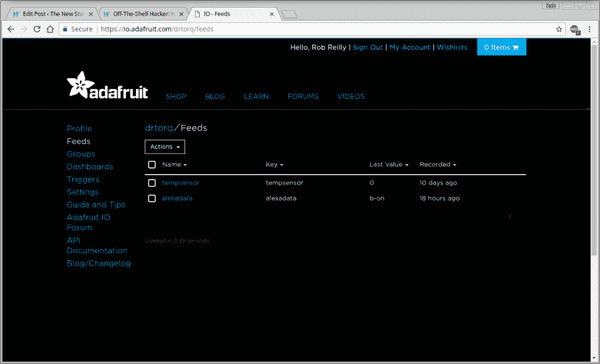
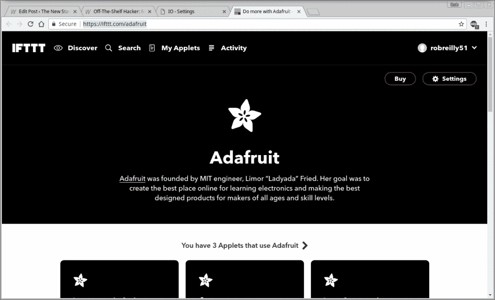
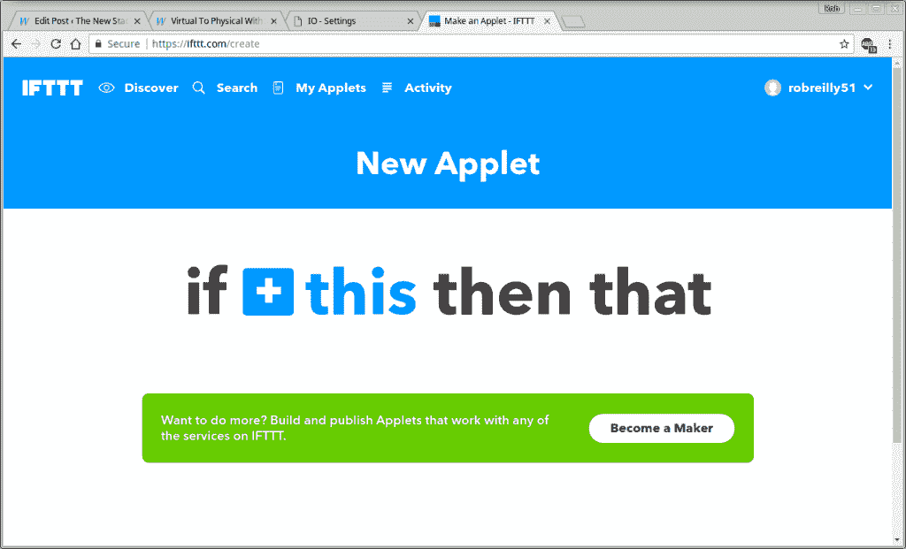

# 现成的黑客:虚拟到物理与 Alexa 使用 3 互联网服务

> 原文：<https://thenewstack.io/off-shelf-hacker-virtual-physical-alexa-using-3-internet-services/>

几周前，我买了一个亚马逊回声点。只需询问 Echo Dot 内置的虚拟助手 Alexa，就可以获得时间、天气预报或收听网络电台。虽然这一切都很有趣，但我私下里想知道 Alexa 是如何控制身体的。

本月早些时候，[写了关于通过数据中心](https://thenewstack.io/add-basic-visual-interface-data-hub/)连接 Alexa 的文章，我称之为 MuG， [Mosquitto MQTT broker](https://mosquitto.org/) 应用程序在 glass 下作为服务器运行。玻璃？它比任何东西都更具装饰性，是我对蒸汽朋克运动兴趣的颂歌。似乎是看待世界的新旧方式。它将虚拟空间与现实世界联系起来。语音命令充当连接桥梁。

MuG 是一台芯片计算机，配置为独立的 WiFi 接入点，Mosquitto MQTT broker 应用程序作为服务器运行。一个装饰性的玻璃纸带风格的圆顶容纳了该设备，而一个铰接的铜管支架支撑着一个三色 led，它极大地照亮了芯片电路板的前面。Mosquitto 订阅客户端和 Python 中的 [Adafruit](https://www.youtube.com/user/adafruit) 通用输入/输出(GPIO)库调用，驱动连接到 LED 的芯片引脚。坐在我的桌子上，这个杯子是我的物理计算堆栈的无线可视接口。

让 Alexa 闪烁杯子的 LED 是今天的主题。你可能会说这是 Alexa 的“Hello，World”练习，体现了 C 和 Unix 的优良传统。

## 将零件拉在一起

成功地让 Alexa 改变马克杯的 LED 颜色有很多活动部件。有些是虚拟的，有些是本地的，有些发生在软件中。毫无疑问，是物理计算堆栈。

除了圆点和马克杯，我们还将使用三种互联网服务来完成这项工作。我们需要一个亚马逊账户、一个 If-This-Then-than(If TTT)账户和一个 Adafruit IO 账户。亚马逊处理 Alexa。Adafruit IO 被用作 MQTT 代理。IFTTT 充当中介。这是第一轮原型过程，实际上是可行的。这个过程将随着时间的推移而成熟。

如果你的 Dot 是可操作的，你就已经创建了一个亚马逊账户，并与 Alexa 进行了对话。如果你需要的话，这里有三个账户设置页面。

先说 Adafruit IO 配置。

## 连接到 Adafruit MQTT 代理

Adafruit 友好地提供 REST 和 MQTT API 来帮助客户开发他们的项目。我们将使用 MQTT API，它是基于云的 MQTT 代理的前端。它目前处于测试阶段，所以您可以自行决定使用它。对于 Alexa 到 MuG 的原型过程来说，它看起来相当稳定和响应迅速。

请务必在项目笔记本中记录您的 Adafruit IO 值、用户名、AIO 键等等，以供将来参考和方便访问。

登录你的 Adafruit IO 账户，点击“Feeds”菜单项。单击“操作”下拉菜单列表中的“创建新订阅源”项目。输入提要名称和描述，然后单击“创建”按钮。我的信息叫做“alexadata”



Adafruit IO 馈送页面

切换到 Linux 终端，使用 Mosquitto pub 命令来测试 Adafruit IO“Alexa data”提要。下面是我使用的命令行。根据需要代入您的值。

我在我的 Linux 笔记本上的一个终端中使用了下面的命令行，看看是否可以更新 Adafruit IO“Alexa data”提要。

```
mosquitto_pub  -p  1883  -h  io.adafruit.com  -u  [your Adafruit IO user name]  -P  [your Adafruit IO password]  -t  [your Adafruit IO user name]/f/[your feed name]  -m  [your data value]

```

点击“Feeds”页面上的“reload”时，feed 值应该会改变。

Adafruit IO 概述页面解释了该网站的许多细节。

## 连接 Alexa 和 IFTTT

接下来，仍然在 Adafruit IO 站点上，转到“设置”页面。点按“已连接的帐户”设置下的“已连接到 IFTTT.com”。该操作将您带到 Adafruit IFTTT 连接页面，在这里我们可以设置更改 Adafruit 数据提要值的触发器。使用您的 IFTTT 登录信息登录网站。



Adafruit IO — IFTTT 连接页面

进入后，点击页面顶部的“我的小程序”按钮。单击右侧的“新建小程序”按钮。



IFTTT 新建子视图页面

在 applet 创建页面上，点击页面中间的蓝色“+ this”文本。搜索并选择“亚马逊 Alexa”。在“选择触发器”页面上，选择“说出特定短语”框。填写“什么短语”文本。我的是“蓝色的”。“Alexa，触发蓝色”，然后将启动 Alexa 到 MuG 过程中的动作链。您将返回到 IFTTT 主页，现在应该会看到蓝色的“+ that”文本。

单击“+ that”文本。搜索并单击 Adafruit IO 框。点击“向 Adafruit IO 发送数据”框。将您之前创建的提要名称添加到“提要名称”位置。现在输入一个馈送值，MuG 的 Python 程序将识别该值，这样它就可以对芯片的 GPIO 引脚采取适当的行动。我用的值是“b-on”确保最后点击“创建操作”按钮。下一页将在一个小框中总结这个小程序。

所有这些工作的方式是，每次我对 Dot 点按“Alexa trigger blue on”时，它都会启动一个 IFTTT 作业，将值“b-on”发送到 Adafruit IO MQTT 代理，然后它会发布该值。MuG 上的 Python 程序将通过订阅 Adafruit IO broker 来获取代码中的值。当然，在 Alexa 命令生效之前，Python 程序需要在 MuG 上运行。

MuG 上的 Python 脚本(名为 subalexa2.py)从下面的命令行开始。

```
chip%  sudo Python subalexa2.py

```

我在 techtutorialsx.com[网站](https://techtutorialsx.com/2017/04/23/python-subscribing-to-mqtt-topic/)的 MQTT 订阅脚本中添加了一些 GPIO 代码，用来读取消息和控制杯子的三色 LED。

```
#!/usr/bin/python
import CHIP_IO.GPIO as GPIO
import paho.mqtt.client as mqttClient
import time

GPIO.cleanup()

GPIO.setup("XIO-P0",  GPIO.OUT)
GPIO.setup("XIO-P2",  GPIO.OUT)
GPIO.setup("XIO-P4",  GPIO.OUT)
GPIO.output("XIO-P0",GPIO.HIGH)  #HIGH actually turns LED off since operating as current sink
GPIO.output("XIO-P2",GPIO.HIGH)
GPIO.output("XIO-P4",GPIO.HIGH)

def on_connect(client,  userdata,  flags,  rc):

    if rc  ==  0:

        print("Connected to broker")

        global Connected                #Use global variable
        Connected  =  True                #Signal connection 

    else:

        print("Connection failed")

def on_message(client,  userdata,  message):
    print  "Message received: "  +  message.payload
    # print(msg.topic+" "+str(msg.payload))
    if str(message.payload)  ==  "b-on":
 GPIO.output("XIO-P0",GPIO.LOW)
    elif str(message.payload)  ==  "b-off":
 GPIO.output("XIO-P0",GPIO.HIGH)
    elif str(message.payload)  ==  "r-on":
 GPIO.output("XIO-P2",GPIO.LOW)
    elif str(message.payload)  ==  "r-off":
 GPIO.output("XIO-P2",GPIO.HIGH)
    elif str(message.payload)  ==  "g-on":
 GPIO.output("XIO-P4",GPIO.LOW)
    elif str(message.payload)  ==  "g-off":
 GPIO.output("XIO-P4",GPIO.HIGH)
    elif str(message.payload)  ==  "wow":
 wow()
    else:
 print(message.payload)
def wow():
    x  =  0
    while  (x  &lt;  10):
 GPIO.output("XIO-P0",GPIO.LOW)
 time.sleep(.2)
 GPIO.output("XIO-P0",GPIO.HIGH)
 time.sleep(.2)
 GPIO.output("XIO-P2",GPIO.LOW)
 time.sleep(.2)
 GPIO.output("XIO-P2",GPIO.HIGH)
 time.sleep(.2)
 GPIO.output("XIO-P4",GPIO.LOW)
 time.sleep(.2)
 GPIO.output("XIO-P4",GPIO.HIGH)
 time.sleep(.2)
 x  =  x  +  1  

Connected  =  False #global variable for the state of the connection

broker_address=  "io.adafruit.com"  #Broker address
port  =  1883                        #Broker port
user  =  "[my user name]"            #Connection username
password  =  "[my password (aka: AIO key)]"          #Connection password

client  =  mqttClient.Client("Python") #create new instance
client.username_pw_set(user,  password=password)    #set username and password
client.on_connect=  on_connect                      #attach function to callback
client.on_message=  on_message                      #attach function to callback

client.connect(broker_address,  port=port)          #connect to broker

client.loop_start()        #start the loop

while Connected  !=  True:    #Wait for connection
    time.sleep(0.1)

client.subscribe("[my user name]/f/alexadata")

try:
    while True:
        time.sleep(1)

except KeyboardInterrupt:
    print  "exiting"
    client.disconnect()
    client.loop_stop()

```

注意“wow”功能。这是我做的一点小把戏。当我们收到来自 Adafruit IO 代理的“wow”消息时，它会以 0.2 秒的延迟时间连续闪烁 10 次，循环显示蓝色、红色和绿色。

我承认这个过程有点笨拙，因为每个动作短语都需要一个单独的 IFTTT 触发器，比如“blue on”或“show wow”。

当我说“Alexa trigger show wow”时，我妻子认为这很酷，杯子闪烁着 10 个蓝、红、绿周期。

## 更进一步

我刚刚谈到了 Alexa 语音命令的基本原理。我们可以很容易地发送不同的值来移动伺服系统或启动马达。

Amazon Web Services 可能是另一个值得探索的领域，因为他们似乎有某种 MQTT 代理。走这条路线可能会消除 IFTTT 步骤。互联网上还有其他免费和付费的 MQTT 服务，可以满足我们的数据消息传递需求。

语音命令是未来的潮流吗？谁知道呢。

我要去把 Alexa 安装在我的第五代蒸汽朋克会议徽章上。

<svg xmlns:xlink="http://www.w3.org/1999/xlink" viewBox="0 0 68 31" version="1.1"><title>Group</title> <desc>Created with Sketch.</desc></svg>