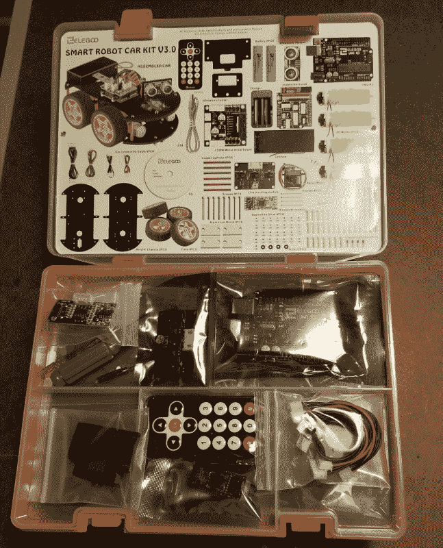
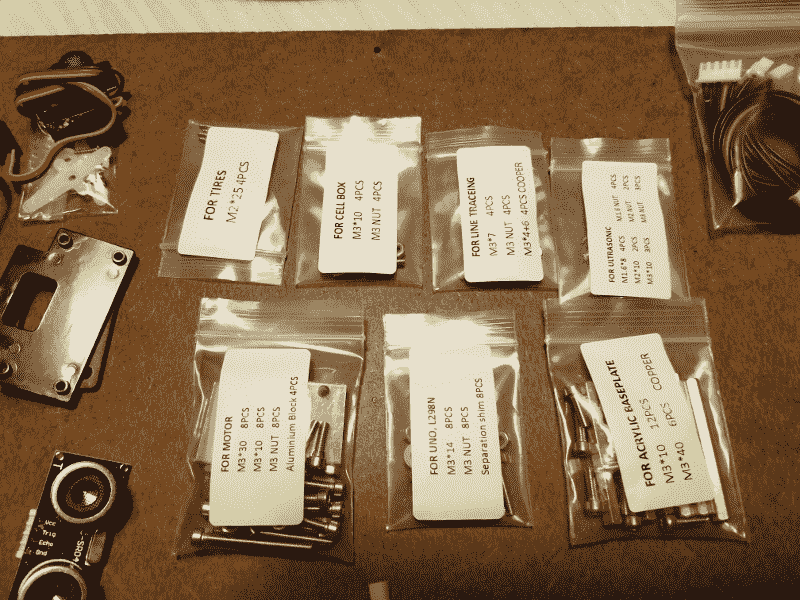
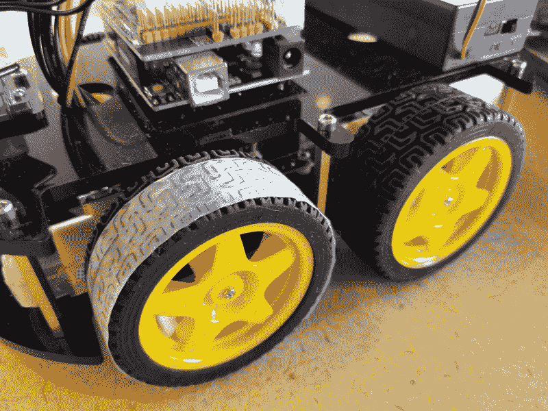

# 现成的黑客:看看 Elegoo 智能机器人汽车套件

> 原文：<https://thenewstack.io/off-the-shelf-hacker-a-look-at-the-elegoo-smart-robot-car-kit/>

Elegoo 主动向我发送了其智能汽车套件，供我进行产品评估。我凭什么拒绝看起来有趣的硬件？

我更喜欢用现成的零件制作小玩意。对许多人来说，从一张白纸开始，到最终有所作为，是一件具有挑战性的事情，有时甚至是压倒性的。如果你想从事物理计算，你必须克服学习中的疑惑和障碍。有很多事情要做，也有很多梦想。有时候你会偏离轨道。关键是继续前进，从失误中吸取教训。

对于许多技术主题来说，开始学习的一个非常有效的方法是制作工具包。

几十年前，我开始从事技术工作，制造卫生设备，拆卸旧收音机。在我十几岁的时候， [Radio Shack kits](https://www.ebay.com/itm/Vintage-Science-Fair-160-in-One-Electronic-Project-Kit-Radio-Shack/264031647769?hash=item3d79833819:g:AYgAAOSwo2xbzSDV:rk:28:pf:0) 为我提供了无尽的学习基础电子理论和组装技术的乐趣。

现在，我们在 2018 年底，有像 Elegoo 智能汽车这样的套件。时代变了。他们现在有吗？

## 里面是什么？

任何目前被认为是“智能”的东西都意味着该设备包含某种形式的计算能力。该定义通常提供由用户编程或修改设备行为的能力。它可能会也可能不会使用人工智能(AI)算法，这取决于应用程序。Elegoo 工具包有一个 Arduino UNO，您可以对其进行编程和修改，以实现基本的设备行为。这个版本中没有人工智能功能。

好消息是，一旦你熟悉了基础知识，你现在就可以开始探索人工智能了。也许只需在生产线的某个地方添加一个 [JeVois 智能机器视觉传感器](http://jevois.org/)。我当时唯一知道的人工智能是哈尔 9000(可悲的是，哈尔的机器人声音道格拉斯·雷恩最近在他的星际之旅中把我们这些凡人抛在了身后)。

该套件包装整齐(可拆卸),装在一个带小把手的橙色塑料盒中。主要结构部件和轮子在底部，而微控制器和其他一些部件在可移动的顶部托盘中。



Elegoo 智能车载套件(未组装)

螺丝、支架、螺母和零星的硬件被分在小塑料袋里，并标明了它们各自的用途。我认为这是一个很好的细节，使组装相当简单。



零件放在有标记的袋子里

锂离子电池、电子模块和螺丝刀都包含在工具包中，因此您只需打开盒子，就可以开始将所有东西组装在一起。

你会发现一个标准的 HC-SR04 型超声波测距仪前面坐在一个微型伺服电机的顶部。它被用来探测障碍物。在底盘底部的测距仪下面是一个 LED 传感器板，用于检测机器人可以跟随的线路。有四个齿轮电机和橡胶轮来移动和转动机器人。电机驱动板位于齿轮电机中间的底部底盘上。最上面是 Arduino UNO 和电池座。Arduino 顶部有一个子板，提供将短电缆连接到各个电气/电子组件的连接器。一切都是即插即用，所以不需要焊接技能来组装汽车。子板上还安装了一个红外(IR)接收器，可以检测来自内置红外遥控键盘的命令。还有一个蓝牙收发器，可以插入子板，方便与智能手机应用程序进行通信。

套件中附带了一张 CD，其中包含组装说明和各种示例程序，用于对所有板载组件进行练习和故障排除。

## 体验和改装汽车

这款车设计坚固，制造质量非常好。有了适当的照顾，我会期待合理的生活，即使在教室设置。

如果你熟悉这些部件，组装是很简单的。物理计算新手可以查阅汇编文档，用多种语言帮助他们组装汽车。大量的图片和图形将引导你通过这个过程。虽然当你第一次打开盒子时，它看起来像一吨的单独零件，但成品汽车是干净整洁的，具有最少但功能丰富的组件集合。

编程很容易。插入附带的 USB 电缆，只需调出光盘上的一个演示示例。Arduino IDE 的最新版本 1.8.5 将自动启动。唯一的问题是，您可能需要将您的 Linux 用户名(在您的 Linux 笔记本上)添加到“拨出”用户组中。在将程序上传到机器人的 Arduino 之前，使用 usermod 命令启用 USB 写入权限。

```
rob%  sudo usermod  -a  -G  dialout rob

```

或者，您可以使用以下命令临时更改 USB 端口的权限:

```
rob%  sudo chmod  777  /dev/ttyACM0

```

我上传了本文的避障程序示例。它使用测距仪并向前驾驶汽车，直到检测到道路上的物体。测距仪将左右扫描，然后决定新的方向。有时，护林员不会检测到有角度的、小的或柔软的物体，汽车在与物体接触后只会毫无意义地旋转车轮。在程序中，我增加了障碍物探测距离值，从 20 增加到 40，减少了碰撞和燃烧事故。

轮胎抓地力很强。因此，开箱后转向不是很好。我的解决方案是简单地在每个前轮上加一条塑料带，这样光滑的一面就接触到了地面。它在我的强化地板上效果很好。



帮助机器人转向的轮胎模型

我可能还会增加从电池盒到子板的线径。我怀疑，现有的小 24 号线直径不允许足够的电流流向电机驱动板，并有助于我的麻烦了。

使用开箱即用的小型遥控红外键盘控制汽车，当然还有新的程序上传。因为 IR 接收器在子板上面向后，所以从后面将键盘指向汽车非常重要。

线跟踪和蓝牙/智能手机控制将在以后的文章中探讨。蓝牙可能会很有趣，特别是如果我们在一个配套的 Raspberry Pi 上进行计算/规划/监控。我假设数据可以双向流动。

## 结论

Elegoo 智能汽车是一个不错的入门移动机器人套件。它易于组装，并且拥有您开始学习实用物理计算原理所需的一切。提供了所有必要的工具，基于连接器的设置允许开箱即可完成项目。不过，新手现成的黑客肯定希望在职业生涯的早期学习焊接技能。

我想知道智能汽车是否可以作为探索 JeVois 视觉传感器移动应用的平台。也许我会拿起第二台相机，这样我就不用从头骨的赫德利的右眼窝里抓拍了。

也可能有机会用 ESP8266 无线模块替换 Arduino UNO。也许可以开发一种方法，让机器人汽车根据 [MQTT 数据](https://thenewstack.io/mqtt-protocol-iot/)修改操作行为。

我们将来会考虑这些可能性。

<svg xmlns:xlink="http://www.w3.org/1999/xlink" viewBox="0 0 68 31" version="1.1"><title>Group</title> <desc>Created with Sketch.</desc></svg>