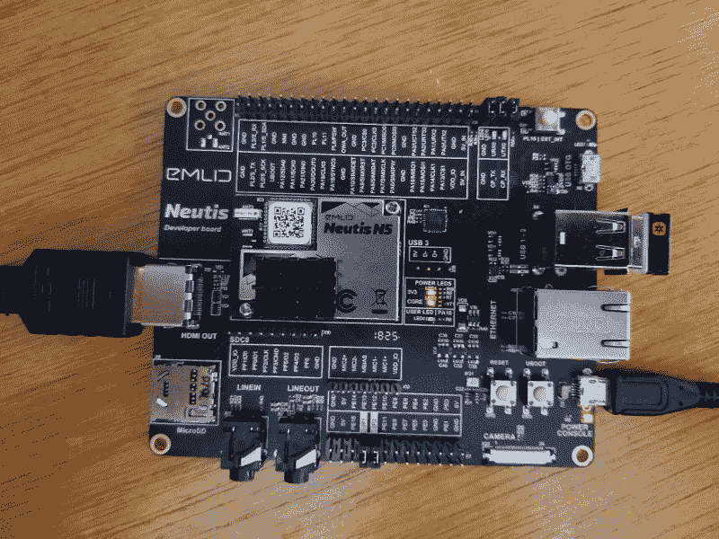

# 现成的黑客:看看 Neutis N5 微控制器

> 原文：<https://thenewstack.io/off-the-shelf-hacker-a-look-at-the-neutis-n5-microcontroller/>

作为一名演讲者、未来学家和专栏作家，我的工作是寻找新技术并将其介绍给观众，以便他们可以在自己的项目中利用它。我通常通过建立和写我喜欢的项目来做这件事。其他时候，我会拿到新的小玩意，简单地插上电源，看一眼。

本周关于 [Neutis N5 微控制器](https://neutis.io/)的专栏就是如此。

目前，我不构建商业产品，通常专注于一次性的原型。类似 Arduino 和基于 Linux 的设备如 Raspberry Pi 满足了我的物理计算需求。它们非常可靠和坚固。我在观众面前使用过这两个平台，当时设备必须启动并为演示工作。您完全可以用这些平台构建一些极其复杂的项目，尽管它们通常不被认为是“商业”或“生产”主流。

Neutis N5 是通向商业世界的一扇窗户。 [Emlid](https://emlid.com/) ，该板背后的公司，非常友好地给我发了一个开发工具包来探索。该模块旨在集成到产品中。

## 还记得英特尔爱迪生公司吗？

首先，一点历史。

英特尔爱迪生公司的模块计算机将彻底改变物联网世界。爱迪生被设计成其他产品的组件。它有一个运行速度为 500 MHz 的双核 Atom 处理器和一个运行速度为 100 MHz 的 32 位 Quark 微控制器。额外的处理器在实时操作系统下卸载了外设和 GPIO 引脚的管理，独立于 Atom 上的 Yocto。夸克在内部与原子相连，用于来回发送数据。还有各种常见的微控制器接口，包括串行、I2C、SPI 等。该板有 2GB 的内存，WiFi 和蓝牙。

Edison 上的第二个处理器起到了与 [BeagleBone](https://beagleboard.org/bone) 上的实时处理单元(rpu)类似的作用。这就像一个 Arduino 和一个 Raspberry Pi 在同一个模块上。

BeagleBone、Raspberry Pi 和 Edison 之间的巨大差异在于包装。Edison 使用一对直插式连接器将其安装在项目中。在设计产品的电路板时，会使用与爱迪生连接器相匹配的插座。爱迪生不支持试验板，也没有像其他电路板那样的跳线。它是为嵌入商业产品而设计的。

可悲的是，爱迪生已于 2017 年停产。正如你所料，很多人都很沮丧。

## 制造一个开关

位于俄罗斯圣彼得堡的 Emlid 公司在其[精密 GPS 接收器](https://emlid.com/reachrs/)系列中使用了爱迪生。显然，在英特尔停产后，它不得不争先恐后地寻找替代品。

该公司的解决方案是开发自己的模块化计算机，名为 Neutis N5。

安装在显影分线板上的 Neutis N5

Neutis 模块是一款四核 64 位 ARM Cortex A53 处理器，运行频率高达 1.3GHz，具有 512MB 内存、8 GB 板载存储、WiFi、蓝牙和 HDMI 功能。该器件还具有 60 个通用输入/输出(GPIO)引脚、5 条 UART(串行)线、两条 I2C 线、两条 PWM 线、麦克风输入/输出端口、一个摄像头输入端口以及各种其他接口。我还没有注意到一个额外的处理器，像爱迪生的夸克，所以将不得不在这方面深入一点。也许在中性里不需要。

与 Edison 非常相似，Neutis 使用一对连接器来匹配分线板或商用电路板上的插座。

Emlid 在他们的 GPS 接收器中使用 Neutis，其精度为 1 厘米。很尖锐。看看这个[视频](https://www.youtube.com/watch?v=3nkkaIZY_V8)关于他们的产品线设备:

[https://www.youtube.com/embed/3nkkaIZY_V8?feature=oembed](https://www.youtube.com/embed/3nkkaIZY_V8?feature=oembed)

视频

将 Neutis 模块放在那里让其他人购买并集成到他们自己的产品中是有意义的。

## 插上电源并通电

我收到了标准开发套件，其中 Neutis 模块计算机安装在一个 4”x 6”的分线板上。包装中还包含几根 USB 电缆、一些跳线和一个带状电缆摄像头模块。

按照“快速启动”指南，我将分线板连接到我的 Linux 笔记本上，并按照指示开始刻录最新的固件。我没有想到在刻录固件之前，简单地将模块插入 HDMI 显示器，看看它是否会预订。

不管怎样，在按照启动说明操作后，我从笔记本上取下，转到了 HDMI 显示器上。一个普通的 5 伏 2.0 安培三星手机充电器似乎可以很好地为 Neutis 供电。我还插上了可靠的罗技无线键盘/鼠标垫。

主板正常启动，我看到了正常的命令行登录。我输入“root ”,然后按回车键进入命令行提示符。不需要密码。

当我插上电缆时，有线以太网工作正常，我可以毫无问题地远程 ssh 到 Neutis。快速入门指南[概述了通过无线](https://docs.neutis.io/connectivity/wifi/)连接，我用它连接到我的接入点，没有任何问题。

我检查了 8GB 板载存储的可用空间。Linux 和任何相关软件占用了大约 420MB，还有 6.1GB 用于其他用途。

Python 也是开箱即用的，这可能是我在 Neutis 上编写应用程序的第一站。[网页](https://docs.neutis.io/)有各种基本功能示例，用于试验 GPIO 引脚、音频、摄像头等。

不用说，您应该能够熟练地使用 Linux 命令行，并且熟悉 Linux 机器的常规操作和配置，以便有效地探索。

## 对未来竖起大拇指

Neutis 肯定是为商业产品开发者准备的。Linux 和将 Neutis 模块放在电路板上对于业余爱好者或刚开始的现成黑客来说无疑是一个挑战。

请记住，虽然技术仍在快速发展，但有一天，拥有一个可以从少量接口接收大量数据、将其全部浓缩并提供 1 厘米精度的位置数据的商业计算模块可能会在您的产品中有用。中等先进的现成黑客正在使用相当便宜的电路板设计服务来采购他们自己的多层板产品。这已经持续了好几年了。

无论您处于物理计算之旅的哪个阶段，了解哪些是现成的，哪些可能是趋势，总是有好处的。

我正在研究 Neutis N5 如何给我的机器人头骨[赫德利](https://thenewstack.io/off-the-shelf-hacker-adjusting-my-robotic-skulls-vision/)增加功能。突破板视觉可以想象到适合我的蒸汽朋克主题。我还没有考虑过商业版的赫德利。

保持好奇，我的朋友们。你永远不知道这些东西在现成的生活方式中会走向何方。

<svg xmlns:xlink="http://www.w3.org/1999/xlink" viewBox="0 0 68 31" version="1.1"><title>Group</title> <desc>Created with Sketch.</desc></svg>