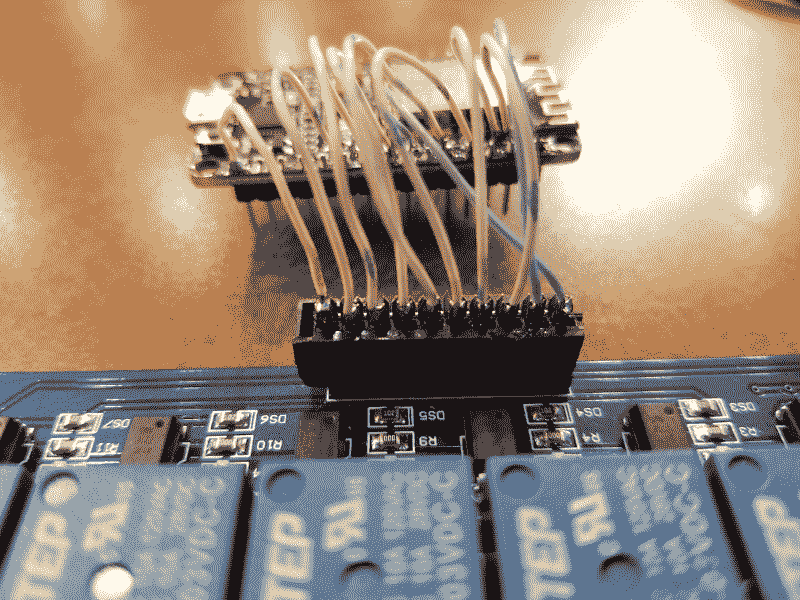
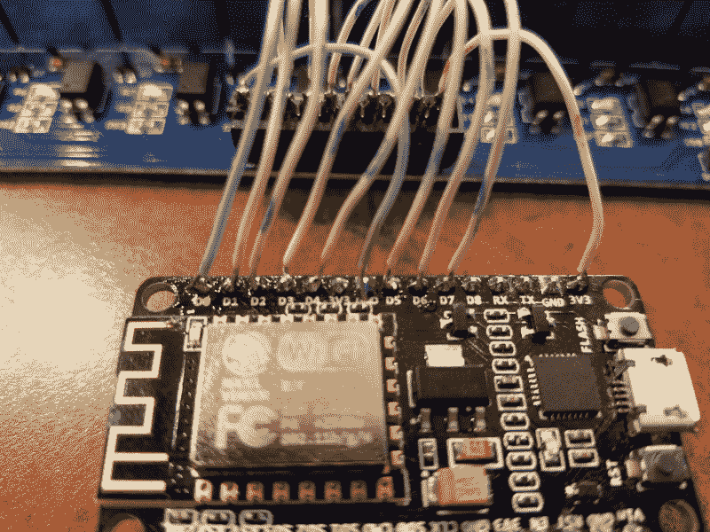

# 现成的黑客:自动化庭院浇水项目

> 原文：<https://thenewstack.io/off-the-shelf-hacker-automated-yard-watering-project/>

我的最新项目[自动庭院浇水系统](/off-the-shelf-hacker-a-methodology-for-automated-yard-watering/)的[八通道继电器板](https://www.banggood.com/5V-8-Channel-Relay-Module-Board-For-Arduino-PIC-AVR-DSP-ARM-p-74110.html?rmmds=buy&cur_warehouse=CN)最近已经放在我的工作台上。我还没有一个 [Raspberry Pi Zero W 模块](https://www.sparkfun.com/products/14277)，所以与此同时，我认为看看一个支持 Wi-Fi 的 Arduino 克隆(称为 [NodeMCU](https://www.banggood.com/3Pcs-NodeMcu-Lua-WIFI-Internet-Things-Development-Board-Based-ESP8266-CP2102-Wireless-Module-p-1121409.html?rmmds=search&cur_warehouse=CN) )能完成什么可能会很有趣。

我花了大约 15 美元从 Banggood 买了三个这样的设备。它们是小小的 ESP8266 板，将通用输入/输出(GPIO)输出到试验板友好的引脚，同时添加了稳压器和 USB 通信电路。一个无线(基于 ESP8266-01)[双中继模块](https://www.banggood.com/5V-ESP8266-Dual-WiFi-Relay-Module-Internet-Of-Things-Smart-Home-Mobile-APP-Remote-Switch-p-1270421.html?rmmds=search&cur_warehouse=CN)可用于即插即用，价格约为 8 美元。

总结这个项目，我想用一个微控制器，一个继电器板和几个 24 伏的洒水电磁阀来控制我的院子里的洒水器。我们在最近的一个故事中讨论了这个过程。

今天，我们将看看如何将继电器板连接到微控制器，并使用一个程序来测试基本的继电器操作。下一篇文章将集成控制软件来驱动螺线管。当我得到一个 Raspberry Pi Zero W 时，我们将把它替换为 NodeMCU 模块，并尝试一下该配置。能够使用多种解决方案，稍加调整，是现成黑客需要开发的一项重要技能。

## 建立联系

理想情况下，我们应该有一个间距为 0.1 mm 的 10 引脚连接器，用于将继电器板连接到微控制器。没有一个方便的，所以我把通常过时的硬盘驱动器电缆连接器减少到 10 个引脚，并将电线焊接到位。只需将连接器夹在老虎钳中，并用小锯或 Dremel 研磨盘切割塑料连接器。这是连接器的特写。



继电器板上使用的被黑客攻击的硬盘电缆连接器

我发现最好是在试图连接之前，将焊料“接触”到引脚和导线的末端。老派黑客称这一过程为“[镀锡](https://www.mediacollege.com/misc/solder/tinning.html)”焊料中的助焊剂清洁引脚表面，并使焊料适当流动。然后将线的末端靠在引脚上，用最小的热量进行焊接。尽可能快地焊接针脚，否则针脚会熔化连接器中的塑料，并可能一起短路。

为了进行初步测试，我将所有的电线都削减到大约两英寸长，并使用一个小试验板来连接 NodeMCU 板。一旦我确定继电器板工作正常，我就从试验板上取下电线，将它们焊接到 NodeMCU 模块引脚的顶部。这个操作有点棘手，因为引脚之间的空间非常小。



焊接到 NodeMCU 模块的导线

当处理试验板和原型项目时，我更喜欢使用 22 号实心线。将绞合线推入试验板时，它总是会分离。直的、实心的电线末端非常容易进入，并最大限度地减少短路或开路的可能性。

在网上找到八通道继电器板的好文档有点粗略。我不确定该板是在 3.3 伏还是 5.0 伏逻辑下工作。常规 Arduino 模块使用 5.0 伏逻辑，而 Raspberry Pi 和 ESP8266 板(NodeMCU)都使用 3.3 伏逻辑。事实证明这无关紧要。我只是把它挂起来试了一下。看看继电器板的通用[内部原理图](http://wiki.sunfounder.cc/index.php?title=8_Channel_5V_Relay_Module)。

我将中继板上的接地引脚连接到 NodeMCU 板上的 GND 引脚。同样，继电器板上的 VCC 引脚连接到 NodeMCU 上的一个 3.3 伏引脚。13 个数字 GPIO 引脚中的 8 个连接到继电器板以供使用和测试，因此您可以将剩余的引脚用于其他目的。还有一个标为 A0 的模拟输入引脚，我们目前没有使用。

谷歌有大量的 [NodeMCU 引脚排列图片](https://www.google.com/search?q=nodemcu+pinout&ie=utf-8&oe=utf-8&client=firefox-b-1-ab)供你参考和娱乐。

确保继电器板右下侧的配置跳线(连接器面向前中心，继电器在后面)位于 VCC 和 JDVcc 引脚之间。忽略相邻的 Gnd 引脚。这个设置应该也适用于 Raspberry Pi。对于 NodeMCU 和中继板来说，这是再简单不过的布局了。在编程阶段，将 USB 电缆连接到 Linux 笔记本电脑。

## 上传测试固件

NodeMCU 使用 [Lua 编程语言](https://en.wikipedia.org/wiki/Lua_(programming_language))，并且已经加载到固件中。IBM 有一个关于 NodeMCU 的[小介绍，如果你对他们的开发工具包和使用 Lua 感兴趣，你可以看看。我对这门语言没有任何经验，所以我选择为这个项目的这一部分编写常规的旧 Arduino 代码。也许，我们会在以后的文章中研究 Lua，因为我还有另外两个 NodeMCU 模块可以试验。它看起来很容易使用。](https://developer.ibm.com/tutorials/iot-nodemcu-open-why-use/)

Arduino IDE 的当前版本支持 NodeMCU 模块。我在华硕 Linux 笔记本上下载安装了[1 . 8 . 7 版](https://www.arduino.cc/en/Main/Software)。确保选择“ESPduino (ESP-13 模块)”作为板卡类型，否则固件上传将会失败。

接下来，我编写了 ESP8266 闪烁程序的示例代码，基本上使继电器板上的八个继电器闪烁。这是代码。

```
/*
  NodeMCU - relay board test program
  Sequentially turns each relay on and off for 2 seconds, loops forever
*/

// the setup function runs once when you press reset or power the board
void setup()  {

  pinMode(16,  OUTPUT);
  pinMode(5,  OUTPUT);
  pinMode(4,  OUTPUT);
  pinMode(0,  OUTPUT);
  pinMode(2,  OUTPUT);
  pinMode(14,  OUTPUT);
  pinMode(12,  OUTPUT);
  pinMode(13,  OUTPUT);

  digitalWrite(16,  HIGH);
  digitalWrite(5,  HIGH);
  digitalWrite(4,  HIGH);
  digitalWrite(0,  HIGH);
  digitalWrite(2,  HIGH);
  digitalWrite(14,  HIGH);
  digitalWrite(12,  HIGH);
  digitalWrite(13,  HIGH);
}

// the loop function runs over and over again forever
void loop()  {

  digitalWrite(16,  LOW); // LOW lights optoisolator LED to ground - turns on relay
  delay(2000); // wait for a 2 seconds

  digitalWrite(16,  HIGH);  // HIGH kills optoisolator LED - turns OFF relay
  delay(2000); // wait for a 2 seconds

  digitalWrite(5,  LOW);    // LOW lights optoisolator LED to ground - turns on relay
  delay(2000); // wait for a 2 seconds

  digitalWrite(5,  HIGH); // HIGH kills optoisolator LED - turns OFF relay
  delay(2000); // wait for a 2 seconds

  digitalWrite(4,  LOW);    // LOW lights optoisolator LED to ground - turns on relay
  delay(2000); // wait for a 2 seconds

  digitalWrite(4,  HIGH); // HIGH kills optoisolator LED - turns OFF relay
  delay(2000); // wait for a 2 seconds

  digitalWrite(0,  LOW);    // LOW lights optoisolator LED to ground - turns on relay
  delay(2000); // wait for a 2 seconds

  digitalWrite(0,  HIGH); // HIGH kills optoisolator LED - turns OFF relay
  delay(2000); // wait for a 2 seconds

  digitalWrite(2,  LOW);    // LOW lights optoisolator LED to ground - turns on relay
  delay(2000); // wait for a 2 seconds

  digitalWrite(2,  HIGH); // HIGH kills optoisolator LED - turns OFF relay
  delay(2000); // wait for a 2 seconds

  digitalWrite(14,  LOW); // LOW lights optoisolator LED to ground - turns on relay
  delay(2000); // wait for a 2 seconds

  digitalWrite(14,  HIGH);  // HIGH kills optoisolator LED - turns OFF relay
  delay(2000); // wait for a 2 seconds

  digitalWrite(12,  LOW); // LOW lights optoisolator LED to ground - turns on relay
  delay(2000); // wait for a 2 seconds

  digitalWrite(12,  HIGH);  // HIGH kills optoisolator LED - turns OFF relay
  delay(2000); // wait for a 2 seconds

  digitalWrite(13,  LOW); // LOW lights optoisolator LED to ground - turns on relay
  delay(2000); // wait for a 2 seconds

  digitalWrite(13,  HIGH);  // HIGH kills optoisolator LED - turns OFF relay
  delay(2000); // wait for a 2 seconds
}

```

我们首先用 pinMode 语句初始化引脚，然后开始引脚高电平状态。将引脚切换到低电平会打开继电器，因此默认情况下，引脚为高电平(+3.3 伏)，意味着关闭。此时我们不需要任何特殊的库，因为我们只是打开和关闭 GPIO 管脚。稍后在集成 wifi 和 MQTT 功能时，我们将需要一些。

只要电路板接通电源，digitalWrite 语句就会通过引脚步进，使继电器打开两秒钟，然后关闭两秒钟。

将固件上传到 NodeMCU 后，您应该会看到每个 LED 相继亮起，并听到继电器启动时发出的咔嗒声。

## 包裹

我们已经看到了将 NodeMCU 连接到一个八通道中继板。布线简单明了。测试很容易，用一个强力眨眼程序。每个继电器中的开关触点可以处理 10 安培的 240 伏交流电或 10 安培的 30 伏 DC，使设置适合各种电源开/关工作。我会用它来切换 24 伏的洒水螺线管在大约半安培。继电器的开关端与逻辑端完全隔离。

在接下来的文章中寻找升级设置以连接到我的本地网络并通过 MQTT 接收命令的内容。稍后，我们将换上一个树莓派 Zero W，以获得更多的黑客乐趣。

<svg xmlns:xlink="http://www.w3.org/1999/xlink" viewBox="0 0 68 31" version="1.1"><title>Group</title> <desc>Created with Sketch.</desc></svg>