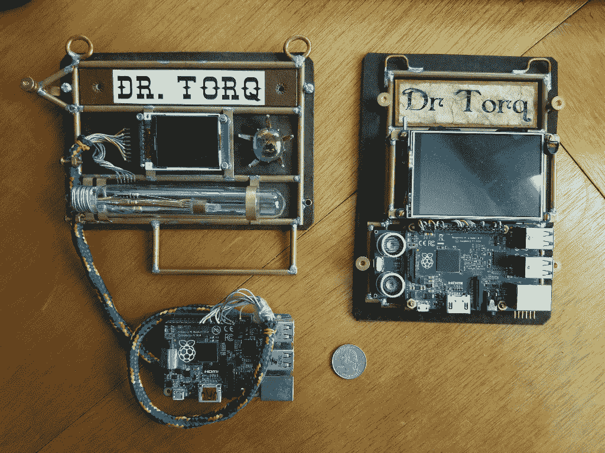
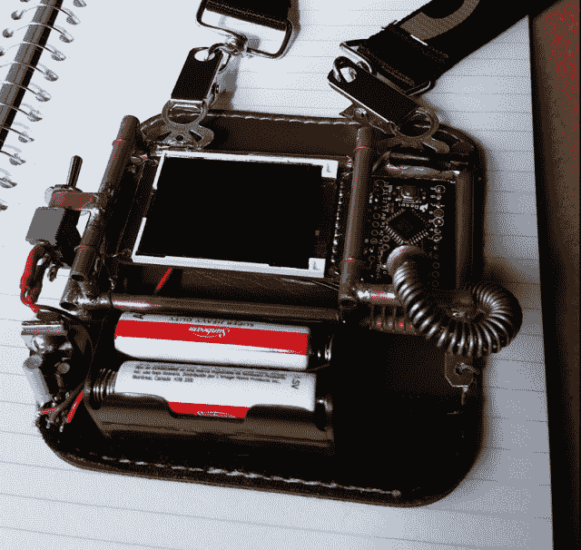
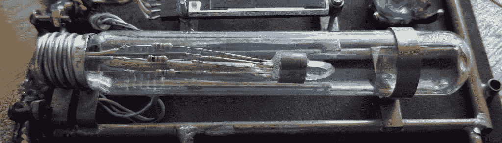
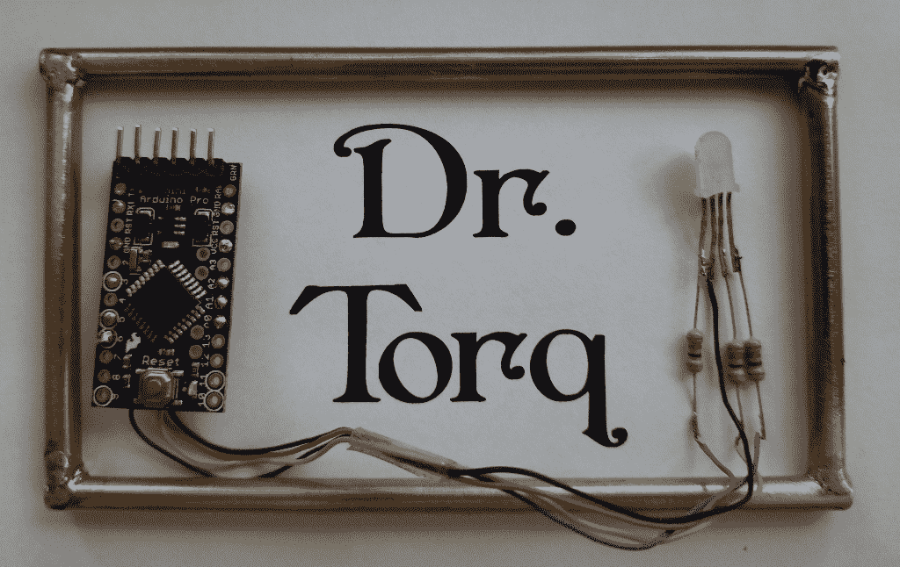

# 现成的黑客:建立一个低成本的会议徽章

> 原文：<https://thenewstack.io/off-the-shelf-hacker-build-a-low-cost-conference-badge/>

最近的一次会议问我关于为他们的一个活动创建一个蒸汽朋克徽章制作工作室的问题。经过一番讨论后，组织者认为，50 名与会者每人 165 美元的现成零件成本超出了她的预算。不仅如此，scratch 构建一个基于 Raspberry Pi 的徽章，带有工作彩色 LCD、网络、“臭氧管”和蒸汽朋克主题，这有点太复杂，不适合常规的两天会议研讨会。当时，我没有更合适的东西。

作为一名推广者、展示者和演讲者，我专注于确保我自制的装备吸引注意力。但我意识到有时候我应该低调很多。例如，不久前，当我作为一名媒体记者报道一次会议时，我走进一个新闻发布室，一位名人正在与一群记者分享他深刻的见解。我站在那里，我的花哨，明亮的圆形徽章站在后面，感觉像一个鞋跟。我很快就躲开了。舞台上的那个家伙值得关注。那是他的聚光灯。

因此，我开始考虑一个“日常”的会议徽章，它仍然很有趣，使用物理计算，但又很低调。它也应该比我系列中的其他产品更小、更简单、更便宜。我们今天会看看最初的计划。

## 尺寸很重要

第五代徽章高 7-1/4 英寸，宽 5-1/2 英寸。名称图形为 1-1/4 英寸 x 3-3/4 英寸。第四代版本的尺寸为 5 英寸 x 7-1/4 英寸，水平方向的名称图形大小相似。看到人们注意到我翻领上的 40 多平方英寸的徽章是很有趣的。水平方向的那个真正吸引了他们的注意力。

第四代和第五代徽章并排

对于日常徽章，各种徽章尺寸将需要修改。名称图形中的字体大小非常完美，但整体徽章的高度和宽度需要小得多。我的经验是，名字字体需要至少 5/16 英寸高，并且在大约 8 英尺外容易阅读。另一方面，整体尺寸应该是更实用的 4-1/4 英寸 x 2-1/2 英寸或略大于 10-1/2 平方英寸。幸运的是，通过使用不同的微控制器、三色 LED 并将“Dr .”放在名称图形中“Torq”的上方，字母可以保持相同的大小。与所有其他徽章一样，电源线将连接到藏在口袋中的电池组。

## 微控制器和视觉效果

第一代蒸汽朋克会议徽章使用 Arduino Pro Mini、小彩色 LCD 和红色 LED。红色 LED 从一个小小的弹簧状支架上照亮了 Arduino，这个支架突出在电路板前面大约一英寸。Arduino 甚至可以循环播放安装在 LCD 板背面的 micro-SD 存储卡中的一系列 JPEG 图形文件。

第一代蒸汽朋克徽章

第五代徽章上我一直喜欢的一个特征是“臭氧管”的外观它使用三色 LED 热粘在一个小石英晶体上，并通过一根铜管悬挂在一个 4-1/2 英寸长的玻璃灯泡内。我在当地机器人俱乐部的一个朋友告诉我，他不想碰徽章，害怕受到巨大的静电放电冲击。嘿，这是臭氧管，对吧？想想看，在我的一个蒸汽朋克项目中，某种小型等离子球会很酷。不过，把它放在徽章上可能是个挑战。虽然臭氧管在大徽章上看起来很棒，但这样的灯泡不适合这个大小的徽章。

臭氧管特写

10 平方英寸的徽章当然也没有足够的空间来放置哪怕是一个 1.8 英寸的彩色液晶显示器，就像我在第一代徽章上使用的那样。

幸运的是，当它连接到 Pro Mini 时，我们可以以多种方式改变三色 LED 的行为。对于一个基本的姓名徽章来说，这可能已经足够令人兴奋了。也许一个看起来机械的水晶支架可以代替一个更小的玻璃管。

我正在编写一些代码来循环红绿蓝颜色，并将在以后的故事中推出。使颜色变亮、变暗以及从一种颜色过渡到另一种颜色是一个简单的效果。我们也可以上下“环绕”一种颜色，比如蓝色，来模拟一个工作中的“原子”晶体电源。这自然很符合蒸汽朋克主题。

## 微妙的蒸汽朋克

这里有一个简单的方形铜管框架、Arduino Pro Mini 和三色 LED 的模型，我将用于“日常”徽章。

小型会议徽章的模型

该名称图形使用 Penshurst 字体和 66 号字体印刷在 LibreOffice 的标准镭射纸上。你可以创造一个非常酷的纸张老化效果，方法是粗略地撕开字母，然后将纸张浸入咖啡或茶中。当它吸收污渍时，把纸弄皱，然后展开几次，让它看起来有一种风化的感觉。用吹风机吹干后，风化和蒸汽朋克风格的字体看起来很棒，然后用一层透明指甲油完成它。我将在以后的故事中回顾整个过程。

你甚至可以自己制作手工纸，将报纸和水一起放入搅拌机中磨碎，然后在一块窗纱上风干一薄层。显然，染色只是简单的浸泡，没有起皱的过程。

我还计划在名称图形、Arduino 和 LED 后面加一块深色皮革。可能会在背面制作一个弹簧夹，将徽章固定在口袋或翻领上。将我的蒸汽朋克徽章别在衬衫或服装上的方法一直是个挑战。与普通的纸/塑料徽章相比，它们很重，并且容易在附着点处将衣服向下拉。你可以把它挂在中间的挂绳上，我已经把第五代徽章挂上了。我希望“日常”徽章放在左侧翻领的传统位置。R&D 将继续这个问题。

## 下一步是什么

一个小巧、简单、便宜的会议徽章将是我收藏的一个不错的补充。基于 Arduino 使得软件修改相当容易，同时保留了相当多的功能。未来的“日常”型号可能能够使用 ESP8266 或 ESP32 平台。也许我甚至可以改变我的三星 Galaxy 8+的徽章特征。

围绕“日常”会议徽章建立一个研讨会系列可能对未来的会议提案有用。至少我会有一个低调的徽章，我可以戴着它参加各种活动和聚会。我也可以把这个简单的设计卖给那些想要一次性的、一致的队徽的小组。

我将在近期的未来报道中更新这个版本。

<svg xmlns:xlink="http://www.w3.org/1999/xlink" viewBox="0 0 68 31" version="1.1"><title>Group</title> <desc>Created with Sketch.</desc></svg>