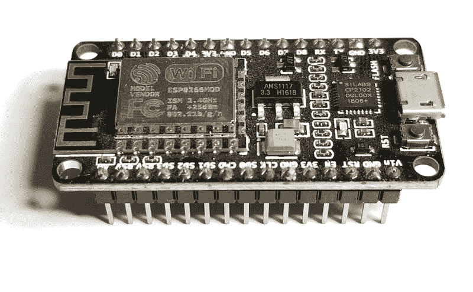
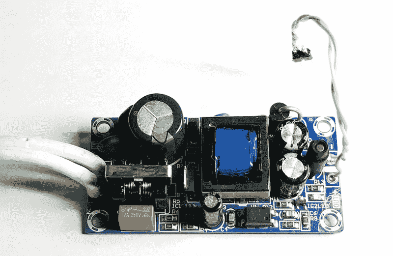

# 现成的黑客:建立一个传感器系统来监视后院

> 原文：<https://thenewstack.io/off-the-shelf-hacker-build-a-sensor-system-to-watch-the-backyard/>

早在 2016 年，我使用裸露的 ESP8266 WiFi 板制作了一个[室外被动红外(PIR)传感器](/off-shelf-hacker-create-early-warning-detector-passive-infrared-sensors/)的原型。他们工作得很好，尽管他们有点杂乱，我从来没有真正对结果感到高兴。当时，裸露的 ESP8266 板很难使用。将壁瘤塞进项目中，也不是很有趣，尤其是当试图将所有东西都装进一个紧凑的项目案例中时。我自己开发的客户机/服务器网络通信方案当然不是标准的或可移植的。

随着时间的推移，物理计算世界发生了很大的变化。

今天，我们将首先看看我的新的和改进的 PIR 码传感器的原型。我们将总结项目，探索各个部分，并讨论后续步骤。

## 全视之眼

正如你所料，我们有一个家庭监控报警系统，所有的门上都有锁，以防止坏人进入。如果知道有人在凌晨 3 点正朝前门走来或者刚刚翻过后院的栅栏，难道不是很有帮助吗？我们会有一点额外的时间来举办一个不错的欢迎会。

不仅如此，如果我们可以记录对财产的“入侵”，特别是当没有人在家或在凌晨时，我们可能会看到可疑行为的模式，并能够采取适当的预防措施。

我最近从一家大型互联网供应商那里买到了几块新型的 [NodeMCU WiFi 板](https://www.banggood.com/3Pcs-NodeMcu-Lua-WIFI-Internet-Things-Development-Board-Based-ESP8266-CP2102-Wireless-Module-p-1121409.html?rmmds=search&cur_warehouse=CN)。同一批货给我带来了几块微型 5 伏电源板。在过去的几年中，我还研究了 MQTT 的基础知识，这是一种简单而标准的方法，可以在机器之间传输数据，这些数据很容易在固件和应用程序中使用库来访问。

现在，随着电子产品的更新，对设备如何相互通信的更好理解，以及容易获得、易于使用的部件，也许我的高科技财产监控系统将成为现实。

## 简化你的原型

该项目只有三个主要组成部分。节点 MCU、PIR 传感器和电源。在某些时候，我们会添加一个继电器来开关泛光灯。

NodeMCU 基本上是一个裸露的 ESP8266 model 12E 模块，具有 3.3 伏稳压器和 USB 接口电路，所有这些都集成在一个易于使用的 1 英寸 x 2 英寸印刷电路板封装中。可以把 ESP8266 想象成一个内置 WiFi 的 Arduino。使用任何当前的 Arduino IDE 都可以无缝编码，尽管在上传任何固件之前，必须将板类型更改为“NodeMCU 1.0 (ESP-12E 模块)”。通用输入/输出(GPIO)引脚支持 3.3 伏或 5 伏逻辑，没有任何问题。它需要从 USB 电缆或电压输入引脚获得稳定的 5.0 伏电源。在这项工作中，我经常使用手机壁灯。

NodeMCU 板

我对这个小小的 5 伏手机墙疣又爱又恨。它们非常适合快速 Arduino 或 Raspberry Pi 的原型制作。使用标准 USB 转 micro-USB 电缆可以轻松地为项目供电。

另一方面，在一个已完成的项目中使用一个壁式电源插座，或者将它放在一个耐候的盒子里，这是一种拙劣的做法。你必须把它们插到某个地方的插座、电源板或延长线上。它们通常只能泵出 1.0 到 1.5 安培的电流。这对于一个树莓派 3 来说是微不足道的。当 WiFi 无线电发射时，ESP8266 项目通常需要大约 700 mA。钩在几个发光二极管等，我们可以很容易地运行在重负载下电流低，迫使复位或其他错误的操作。

幸运的是，从各种 DIY 零件插座中有各种各样的微型 5 伏电源可供选择。我从 Banggood 买了三包 5 伏 2.0 安培的电路板，价格不到 10 美元。它们将接受 85 到 264 伏的交流电输入。它们将可靠地提供 5.0 伏、2.0 安培的连续电压和高达 3.0 安培的浪涌电流。这些电源非常适合为 NodeMCU 板供电。

5 伏电源

对于这个项目，我只是将电源的输出连接到 NodeMCU 上的 Vin 和接地引脚。我在交流电源输入端使用了普通的日常灯线和插头。当需要把院子里的传感器放入它的永久性室外外壳时，我会简单地拔掉插头，把迷你系统接入后院的照明电路。因为传感器会 24/7 运行，所以我会让墙上的开关一直开着。

[PIR 传感器模块](https://www.sparkfun.com/products/13285)是很久以前从 Sparkfun 购买的。它属于集电极开路类型，当检测到物体时记录低(0)值，当什么也看不到时记录高(1)值。我将传感器报警线布线到 NodeMCU 上的 GPIO 引脚 10。负极传感器引脚接地，正极传感器引脚连接+5 伏。

## 下一步是什么

我很快会将 MQTT 添加到 Arduino 代码中。MQTT 是在机器之间传输数据的成熟协议。它允许一对多和多对一的消息。它是轻量级的，可以使用库轻松集成到 NodeMCU 固件和服务器数据分析应用程序中。您只需在代码顶部添加一个对库的引用，然后在主程序循环中向下调用适当的函数。我已经在其他几个项目中成功地使用了它，效果很好。我们将在接下来的故事中回顾这段代码。

<svg xmlns:xlink="http://www.w3.org/1999/xlink" viewBox="0 0 68 31" version="1.1"><title>Group</title> <desc>Created with Sketch.</desc></svg>