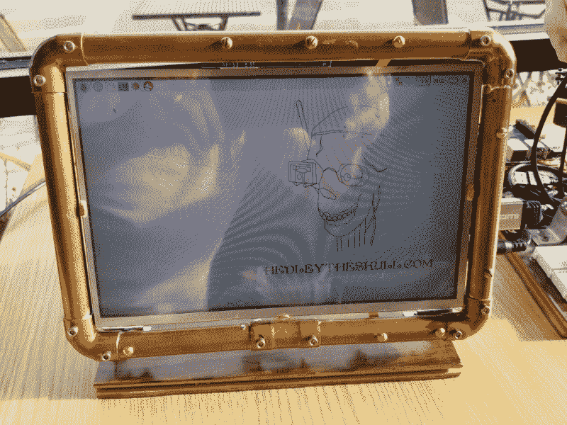
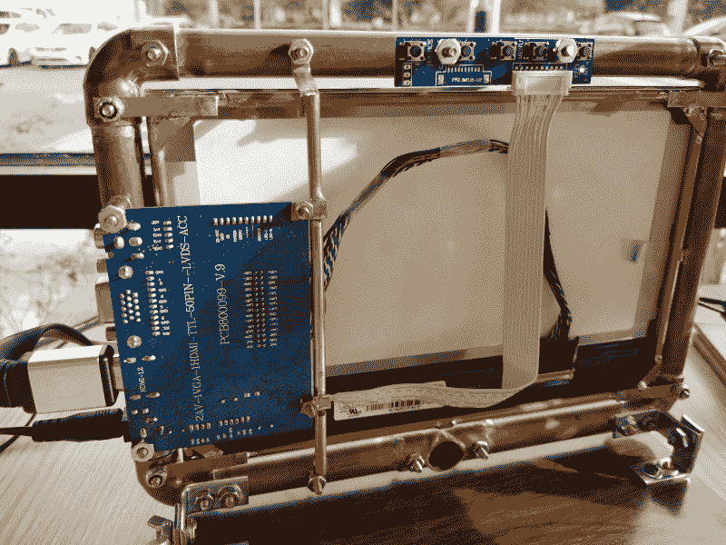
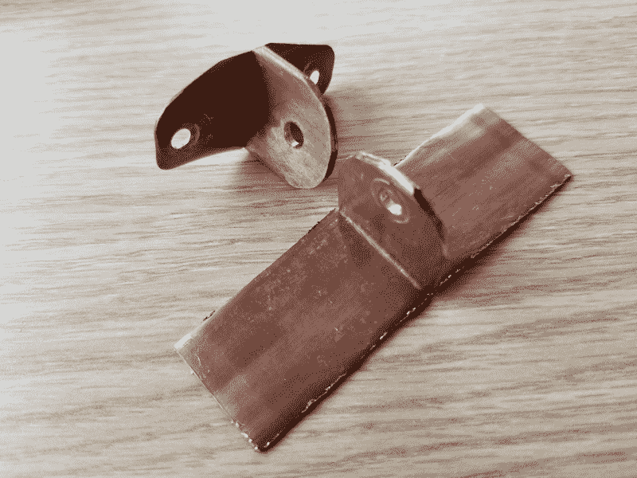
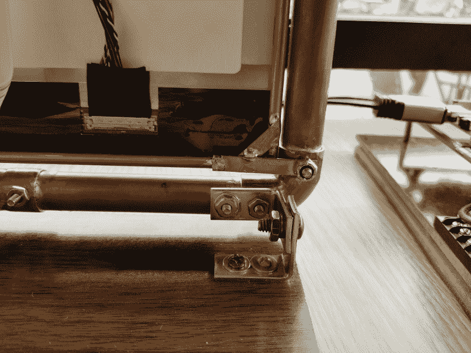

# 现成的黑客:建立头骨顶部电脑显示器

> 原文：<https://thenewstack.io/off-the-shelf-hacker-building-the-skull-top-computer-monitor/>

作为一个实验，在我最近的嵌入式系统会议旅行中，我没有带 Linux 笔记本电脑。相反，我依靠可靠的 Galaxy 8+ superphone 收发电子邮件和上网。

我可以通过 HDMI 线把我的机器人头骨插在酒店房间的大屏幕电视上，在演出前做一些最后的调整。虽然大多数现代酒店房间都有支持 HDMI 的电视，但也有可能没有。如果你需要做真正的工作，你就不走运了。在咖啡店也很难对头骨做任何开发或编程。当然，他们有时提供交流电源插座，我还没有在每张桌子上看到个人 HDMI 显示器。

对于一个真正的“骷髅电脑”，一个小的便携式显示器是正确的选择。这适用于任何使用 Raspberry Pi 或任何其他 nano-Linux 设备的项目，尤其是如果您想在办公室或实验室之外进行开发工作。我正在进行一项单人运动，将纳米 Linux 机器集成到物理计算设备中。

## 监控构建详细信息

你可以相当便宜地买到小型显示器。亚马逊有一台价格约为 100 美元的[T3。他们还有一台](https://www.amazon.com/d/Computers-Accessories/Monitor-Screen-Camera-Security-System/B00OOF3JVE)[型号](https://www.amazon.com/Raspberry-Inch-Monitor-HDMI-SunFounder/dp/B01J52TWD4)的显示器，只需多花一点钱就可以搭配树莓酱使用。圆周率安装在背面。

在最近的一篇文章[中，我介绍了如何在机器人的树莓 Pi 上使用一块裸露的 LCD 面板和驱动板。你可以一直带着散件到处走，尽管它会很快变旧。即兴或基于酒吧的演示绝对是一个好看的独立便携式显示器的领域。](https://thenewstack.io/off-the-shelf-hacker-run-a-lcd-display-with-a-raspberry-pi/)

我最终建立了我的显示器，以配合蒸汽朋克主题的头骨。

监视器前视图

1/2 英寸的铜管非常适合用作结构框架，因为它易于加工和焊接。将管道焊接在一起，为连接显示器、驱动板和底部铰链创造了一个坚固的平台。帽螺钉有助于完成外观，同时保持简单。

LCD 框架是使用通常的 3/16 英寸直径铜管和 1/16 英寸 X 1/4 英寸黄铜扁钢制成的。你可以用一个便宜的切管机切割管子。扁平的原料很容易用航空锡剪定型。使用黄铜完全符合蒸汽朋克主题，并且非常容易焊接。我注意到，业余爱好商店不再像以前那样备有 3 英尺长的存货了。寻找在线供应商可能需要列入待办事项清单。我还建立了从铜管和单位股票驱动板支撑。

监视器后视图

最初的计划是使用铜管和弯管来支撑旋转臂上的显示器。手臂会固定在头骨的底部并伸出一边。模型肘部旋转不太好，手臂的水平部分需要相当长，可能会导致头骨因重量而翻倒。

我还考虑了一个中心安装点，使用扁平铜管作为显示器的倾斜铰链。事实证明，铜支架太脆弱，所以我最终放弃了整个手臂安装显示器的方法。

废弃的铜铰链支架

相反，我从 Ace Hardware 采购了四个钢角支架，并将其用在显示器枢轴框架的底端。这种模式使建筑非常坚固结实。

底部角钢支架铰链详图

我使用一块复合木地板作为显示器的安装底座，类似于我用于头骨的底座。用军刀锯很容易就能把榫槽地板的边缘锯掉。底部甚至覆盖有橡胶衬垫，因此显示器不会四处滑动或刮伤桌面。

我还把头骨在底座上旋转了 180 度，所以树莓皮现在在后面。我更喜欢把显示器放在头骨的左侧，这样做可以让所有的电缆都很好地排列起来。把板子放在后面也让整个装备看起来更整洁。

## 进一步增强

用头骨使用显示器现在是一种乐趣。设置和启动大约需要两分钟。一切都完美地符合赫德利的旅行箱。

我可能会建立一个铜管基地使用，而不是木制的。铜管非常蒸汽朋克，我认为它会看起来很棒，重量略有减少。

15，000 毫安时的电池安装仍然悬而未决，至于它是挂在显示器上还是挂在机器人底座上更好。我需要拿起几个汽车充电器插头，将电池的 12 伏电压降至 5 伏，以便为 Pi、Arduinos 和 JeVois 传感器供电。我打算把这些设备从它们的盒子里拿出来，想出一个方便的安装方式，这样我就可以把各种电缆接到它们的 USB 插座上。充电器板将被硬连线到电池和 12 伏显示驱动板输入之间的连接器中。

我想我可以用那个波纹状的泡沫塑料板做一个封底，用来做政治候选人院子的标志。这种材料很容易用 Exacto 刀切割，可以热粘合在一起，并涂上装饰性的主题设计和颜色。

敬请关注即将到来的细节。

<svg xmlns:xlink="http://www.w3.org/1999/xlink" viewBox="0 0 68 31" version="1.1"><title>Group</title> <desc>Created with Sketch.</desc></svg>