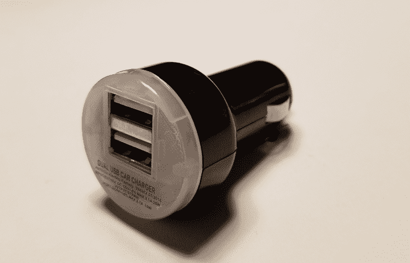
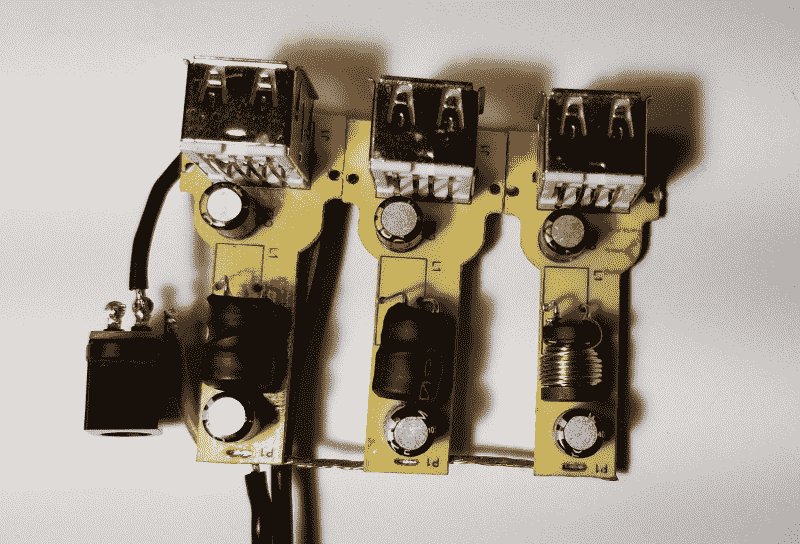
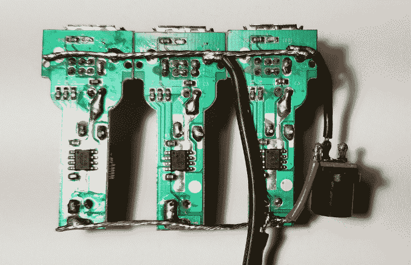

# 现成的黑客:构建自己的紧凑型便携式电源模块

> 原文：<https://thenewstack.io/off-the-shelf-hacker-building-your-own-compact-portable-power-brick/>

向便携式或移动物理计算设备供电可能非常具有挑战性。幸运的是，现代现成的零件价格合理，所以你几乎可以得到你需要的任何东西。诀窍在于，你必须自己建造它。

例如，我需要一个便携式电源给机器人头骨[赫德利](/hedley-the-robotic-skulls-orthognathic-surgery/)。去年 7 月，我被安排在波特兰当地的一家酒吧做现场演示。赫德利和我的笔记本都需要 110 伏交流电。遗憾的是，我没有带一根 100 英尺长的延长线去会场。我试着用我笔记本上的 USB 接口和外部电源模块来运行赫德利。没有骰子。演示有点令人失望。

我决定想出一个便携式的解决方案，这样我就可以在没有电源插座的情况下运行赫德利。他需要为他的主要 Raspberry Pi 3 微控制器、 [JeVois 智能视觉传感器](http://jevois.org/)、用于平移伺服的 Arduino Duemilanove 和用于下颚伺服的 Arduino Nano 供电。Raspberry Pi 和 JeVois 传感器都在 5 伏电压下运行。我还用的是便携式 [10.1 寸彩色 HDMI 显示器](https://thenewstack.io/off-the-shelf-hacker-building-the-skull-top-computer-monitor/)配赫德利，需要 12 伏。我的要求要求至少三个标准的 5 伏 USB 端口和一个 12 伏的连接来为显示器供电。

## 一个大而轻的电池

我从 Banggood 订购了一个[15000 mAh 超级聚合物锂离子电池](https://www.banggood.com/DC-12V-15000mAh-Super-Rechargeable-Protable-Lithium-ion-Battery-Pack-p-970196.html?rmmds=search&cur_warehouse=CN#jsReviewsWrap)开始建设。它的尺寸约为 5×3 英寸×2 英寸厚，并且出奇的轻。它有标准的母充电和公输出桶连接器。电池配有一个 12.6 伏的充电器和一个欧式双头插头。我一直在用一个 12 伏的壁式电源插座给电池充电，可能很快就会插入一个标准的美国 110 伏插头。

电池在显示器开箱后就能正常工作。我把它插在驱动板上，显示器立刻活跃起来。电池在电源线的对面有一个开/关开关。说明书上说给电池充电时，你应该把开关转到开的位置。

## USB 端口丰富

小 USB 电源很容易买到，也不贵。亚马逊有一套五块电路板，价格约为 9 美元。它们的输入电压为 4.5 至 24 伏，输出电压为 1.8 至 12 伏，最大电流为 3 安培。其他供应商也有类似的主板。

我没有从亚马逊订购，而是在当地的一元树旁停下来，买了三个 12 伏转 USB 汽车充电器插头。自然，它们是 1 美元一个。每个都有两个 USB 端口，额定电流为 2.1 安培。

1 美元车载充电器

带切割轮的 Dremel 快速移除了塑料外壳，这样我就可以释放充电板了。然后，用大约 16 号绞线和一个可安装在面板上的母筒连接器连接三块电路板就很简单了。连接器上的中心引脚连接到电路板的正极电源输入侧，而外部连接器外壳接地。电池上的公输出连接器直接插入 USB 充电器板母连接器。我用电池开关打开/关闭电路板的电源。我还从一个旧的壁式电源插座上回收了一根 12 英寸长的双线电缆，带有一个插头，可以插入 10.1 英寸的显示器并为其供电。

三个 USB 充电器焊接在一起(俯视图)

三个 USB 充电器焊接在一起(仰视图)

## 它是如何工作的

电池与赫德利和显示器配合得很好。我把他带到我的办公室，Panera Bread，他和显示器用电池运行了几个小时，没有任何问题。我注意到当所有的电子设备都启动并运行时，Raspberry Pi 3 偶尔会在显示器上显示“低电压”警告符号。

Pi 3 对 USB 线的质量非常敏感。使用高质量的电缆，Pi 会很高兴。廉价电缆中的小直径电线和劣质连接器根本无法通过所需的电流量。使用短电缆也是一个好主意。

我将不得不忍受使用赫德利，显示器和电池一段时间，看看系统的表现如何。一个小型音频放大器正在工作中，用来驱动赫德利口腔顶部的扬声器。听到赫德利说话的同时看到他的嘴在动，这不是很酷吗？这将增加电池的负载，我很想看看在做“便携式”演示时它是如何工作的。期待不久的更新。

<svg xmlns:xlink="http://www.w3.org/1999/xlink" viewBox="0 0 68 31" version="1.1"><title>Group</title> <desc>Created with Sketch.</desc></svg>