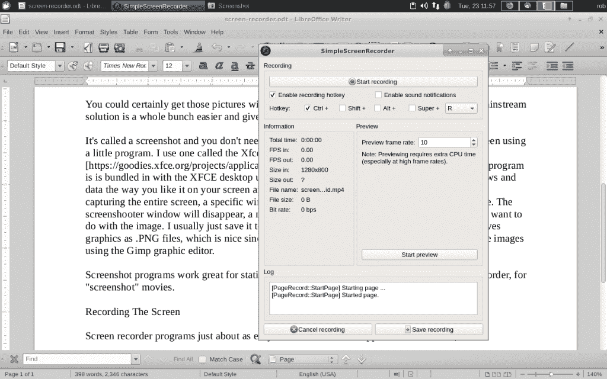

# 现成的黑客:捕捉视频屏幕演示

> 原文：<https://thenewstack.io/off-the-shelf-hacker-capture-a-screen-demo-on-video/>

编者按:一位读者指出，如果您使用的 Linux 版本默认为 Wayland，那么简单的屏幕记录器就会失败。读者可能希望针对他们的个人情况进行调查并找到替代方案。

用你的手机摄像头记录一个物理计算设备的运动是非常简单的。将摄像机对准你的项目，启动你的机电一体化杰作，点击“录制”按钮开始播放电影，完成后点击“停止”按钮。将视频上传到你的 Linux 笔记本或直接上传到 YouTube，然后嵌入到你的文章中，供读者查看。上周的[现成黑客文章](/off-the-shelf-hacker-add-demo-videos-to-wordpress-on-linux/)涵盖了将视频放入在线文本的基础知识。

如果你想显示一个软件程序中特定的步骤序列呢？在 LibreOffice 中编辑文本。或者，也许向读者展示如何使用 Arduino IDE 中的功能？

对于这种类型的工作，你应该使用屏幕录制程序。我们今天将讨论这个话题。

## 屏幕截图 101

还记得过去故事中所有那些桌面和应用程序中各种窗口的光滑静止图片吗？我用它们来澄清我在文章中涉及的事情。可能是为了显示应用程序中的一个特性。或者，可以在终端窗口中显示一些有趣数据的快照。

你当然可以用手机摄像头拍下这些照片，对准笔记本电脑屏幕。一个更主流的解决方案要容易得多，效果也更好。

它被称为截图，你甚至不需要相机。只需使用一个小程序捕捉屏幕截图。我用的是一个叫做[的 Xfce4 截屏软件](https://goodies.xfce.org/projects/applications/xfce4-screenshooter)。如你所料，这个程序捆绑在 Xubuntu Linux 下的 XFCE 桌面中。首先，在屏幕上按照你喜欢的方式排列所有的窗口和数据，然后启动截图程序。有选择捕捉整个屏幕，一个特定的窗口或区域。然后点击“确定”抓取图像。Xfce4 Screenshooter 窗口将会消失，一个新的窗口将会显示您捕获的屏幕，您可以选择您想要对图像做什么。我一般只是保存到当前工作文章目录。Xfce4 Screenshooter 将图形保存为。PNG 文件。这很好，因为文件很小，我不需要使用 [Gimp 图形编辑器](https://www.gimp.org/)缩小图像。

Xfce4 截屏程序的屏幕截图

截图程序对静态图片非常有效。对于“截屏”电影，类似的过程与屏幕记录器一起工作。

## 录制屏幕

屏幕录制程序和截图程序一样容易使用。我用的是一个叫做 [SimpleScreenRecorder](https://www.maartenbaert.be/simplescreenrecorder/) 的，它可以安装在 Xubuntu Linux 下，使用你最喜欢的应用程序管理器。屏幕记录器捕捉你的互动，在你的笔记本屏幕上。结果是你的鼠标移动的电影，出现或消失的窗口，以及当你使用程序时在显示器上发生的变化。SimpleScreenRecorder 输出一个可以在大多数视频查看应用程序上查看的. MP4 文件。你还可以将. MP4 上传到 YouTube，甚至在 [KDEnlive](https://kdenlive.org/en/) 之类的视频编辑程序中进行编辑。

SimpleScreenRecorder 主菜单屏幕

启动程序后，你会看到最初的视频捕获屏幕。您可以在这里设置视频分辨率、您想要捕捉的屏幕部分、帧速率和其他重要参数。

简单屏幕记录器配置文件屏幕

如果您对捕获选项感到满意，请按底部的“继续”按钮进入个人资料屏幕。在这里，您可以为您的电影设置文件名和目录。我使用了容器类型、比特率和音频编解码器的默认值。按“继续”进入录制屏幕。

录制视频屏幕

你会在顶部中间看到“开始录制”按钮。按下按钮开始演示。当然，您会注意到录制屏幕仍然可见，这可能是您不希望在完成的视频中看到的。录制屏幕上的“热键”解决了这个问题。在点击“开始录制”之前，最小化或移动录制屏幕到不同的桌面。回到你想录制的屏幕，输入热键组合。我使用了默认的 <ctrl>r。系统托盘中的 SimpleScreenRecord 图标会变成红色，表明它处于录制模式。这将开始视频录制。若要暂停录制，请再次键入热键组合。图标将变为绿色，表示已暂停。转到录制屏幕，点击“保存录制”按钮完成操作。你可以用像 [VLC](https://www.videolan.org/index.html) 这样的程序打开视频文件来检查你的作品。</ctrl>

上传和嵌入视频的方式与我们使用手机录制视频的方式相同，就像我们上周讨论的。

## 包裹

请记住，分辨率和帧速率的值会影响将要制作的视频的质量和大小。较低的分辨率可能有点模糊，但文件大小可能是合理的，如果录制 10 分钟或更长的应用程序演示会话，您应该考虑这一点。我为这个故事拍摄的 31 秒视频，分辨率为 1280×800，每秒 30 帧，大小约为 20MB。质量很好，文件大小也易于管理。

[https://www.youtube.com/embed/5TG5G8umAD4?feature=oembed](https://www.youtube.com/embed/5TG5G8umAD4?feature=oembed)

视频

我建议将你的会话编写成脚本或故事板，并练习几次，这样你就不用在录制过程中到处寻找按钮、文本框和功能。仔细观看我的视频，你会看到我在几个按钮上来回移动光标，没有明显的原因。进行几次拍摄将确保您的应用程序屏幕演示流畅。

赶上【Torq 博士的 [现成黑客专栏](https://thenewstack.io/tag/off-the-shelf-hacker/)，每周六，只上新栈！直接联系他，在[doc@drtorq.com](mailto:doc@drtorq.com)或 407-718-3274 咨询和委托项目。

<svg xmlns:xlink="http://www.w3.org/1999/xlink" viewBox="0 0 68 31" version="1.1"><title>Group</title> <desc>Created with Sketch.</desc></svg>