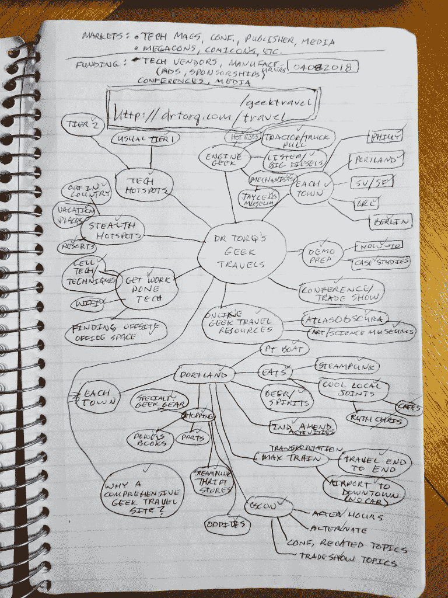
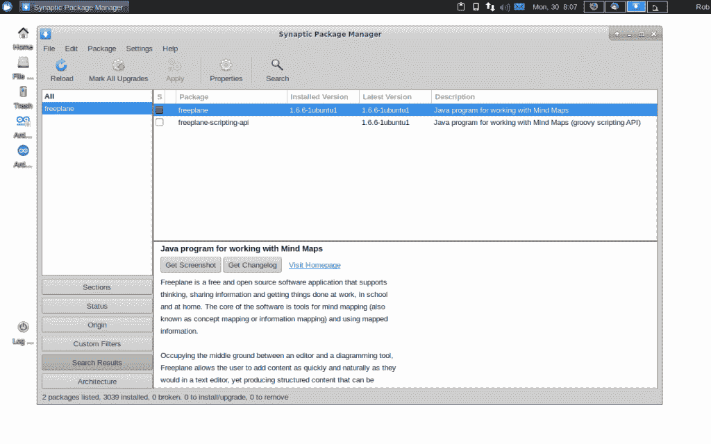
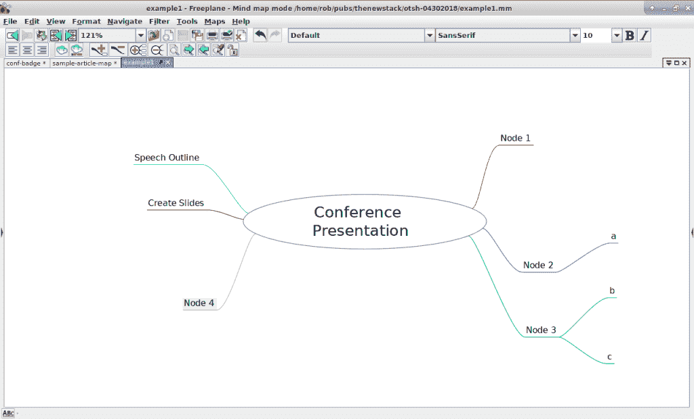

# 现成的黑客:用思维导图捕捉你的 DIY 想法

> 原文：<https://thenewstack.io/off-the-shelf-hacker-capture-your-diy-ideas-with-a-mind-map/>

记录有价值的想法对个人和团队来说都是一个挑战。但是，在白板或纸上做一个大脑转储，虽然有用，但不适合编辑或分享。

对于我的项目，我使用一种叫做 T2 思维导图的技术。你从页面中央的一个大图片标签开始，发展分支来代表不同层次的细节。这是我最近在咖啡店等候时，在我可信赖的蓝色笔记本上潦草写下的思维导图:



手绘思维导图

我喜欢老式的纸笔。一旦你习惯了这个过程，你不会相信它有多快。这幅画花了大约 15 分钟。最好的方法是让想法自由飞翔，不加评判或批评，尽可能快地记录下来。这样做你的思维导图一开始很难。熟能生巧，随着时间的推移，你会发现它变得越来越容易和快速。

你也可以走高科技路线，轻松地允许编辑和发送文件给他人的能力。为此，我使用了[自由平面](https://www.freeplane.org/wiki/index.php/Home)。

## 安装自由平面

思维导图是一种组织思维的可视化方法。它有一个层次，把一个部分和另一个部分联系起来。我用这种技术来提出新的故事想法和整合项目。

Freeplane 的网页宣称，它可以在任何装有最新版本 Java 的操作系统上运行。大多数现代的 Linux 包管理器都可以加载 Freeplane。我在 Linux 笔记本上使用 Xubuntu 下的 [Synaptic](http://www.nongnu.org/synaptic/) 。启动 Synaptic 并按下“Reload”按钮以确保所有的库列表都是最新的。然后搜索“Freeplane”并标记安装。接下来，点击“标记所有升级”最后，点击“应用”按钮。



新立得软件包管理器

您也可以在命令行中使用 apt-get 将程序放在您的 Linux 机器上:

```
rob%  sudo apt-get update
rob%  sudo apt-get install freeplane

```

根据您的系统，您可以从桌面主菜单或命令行启动程序。

## 描绘你的想法

要创建新地图，请选择“文件”菜单项下的“新建地图”。对于默认模板，请按“确定”。

双击鼠标左键，用你的主要项目创意替换“新地图”文本。例如，您可以键入“会议演示文稿”

要添加节点，请按键盘上的“Ins”键。主气泡的右侧将出现一个空白节点。为节点添加描述，如“演讲大纲”再次按“Ins”将另一个节点添加到“演讲大纲”节点。

单击主“会议演示”气泡上的 back，键入“Ins ”,在“演讲大纲”主题下添加一个新节点。类似于“创建幻灯片”可能是合适的。

新节点将交替出现在主气泡的两侧。您可以通过将鼠标滚动到节点的头部并抓住出现的小循环来移动节点。左键单击以抓取节点，将其移动到另一个点。当你移动你选择的节点时，FreePlane 会推动其他节点，这很烦人。根据需要，只需抓取其他节点并移动它们。

如果你想删除一个节点，将鼠标移到它上面，然后按“Del”键。在“编辑”菜单下有一个“撤销”按钮，可以修复任何无意的删除。

主气泡上的交替节点行为有时是以逻辑方式对思想进行不规则的分组。解决方案非常简单。将鼠标滚动到一个节点上，然后键入向左或向右箭头键。该节点将神奇地转换立场。如果您愿意，可以使用这种技术将所有节点放在地图的右侧。



快速思维导图示例

同样，如果你想上下、垂直地移动节点，抓住它，根据你的小心脏的需要上下移动。

假设你在一个节点下有一个思想分支，它们应该在不同的节点下。没问题。抓取节点，这次将鼠标放在文本上，并将其拖动到另一个节点上。释放鼠标按钮，它将连接到新节点。

这有多简单？

## 结论

思维导图是一种很好的组织你的想法的技术。我用它来集思广益新的技术文章，并找出如何建立一个项目。Freeplane 有大量的选择。您可能希望在地图中使用图形或形状以及文本节点。不同的文字字体和线条颜色可以增强清晰度。FreePlane 相当全面，也很好用。

当然，你总是可以在旅途中狂热地手绘思维导图，然后再把它放进 Freeplane。

在你的下一个项目中试试 Freeplane。

<svg xmlns:xlink="http://www.w3.org/1999/xlink" viewBox="0 0 68 31" version="1.1"><title>Group</title> <desc>Created with Sketch.</desc></svg>