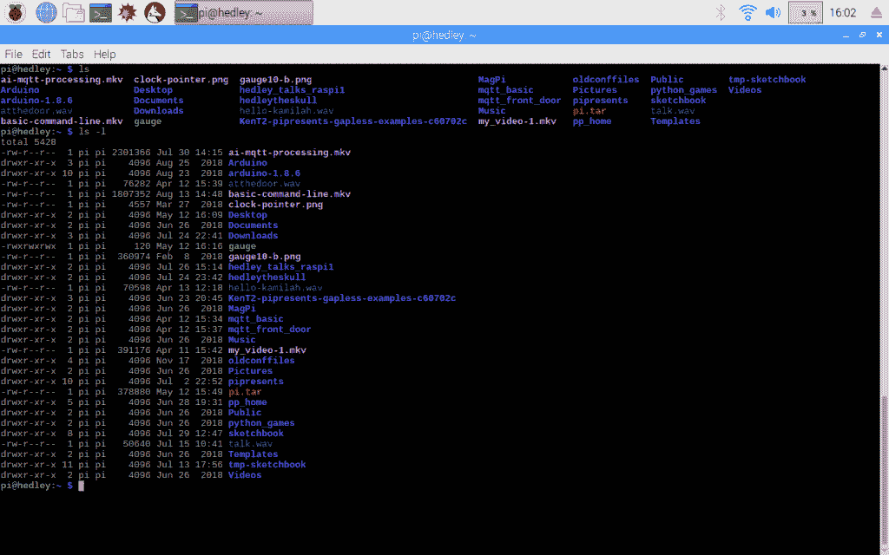

# 现成的黑客:拥抱 Linux 命令行

> 原文：<https://thenewstack.io/off-the-shelf-hacker-embrace-the-linux-command-line/>

树莓派是一个非常棒的物理计算平台。将它连接到 HDMI 显示器上，添加一个键盘/鼠标，你就会有一个漂亮的，虽然很轻的桌面计算设备。它有几个通用(数字)输入/输出引脚，用于收集数据和控制输出小发明。只要稍加想象，Pi 就能为各种物理计算项目增添智慧。

Pi 运行在 Linux 上，使用基于文本的命令行作为默认用户界面。当然，只要有适当的权限和良好的判断力，您可以从命令行执行任何程序、控制每个进程和执行任何任务。

但是，许多 Pi 用户害怕使用命令行。它是陌生的，外行人认为它“不方便使用”忽略这一切。通过一些指导和练习并不难学会。我强烈建议现成的黑客投资学习命令行，因为这是在基于 Linux 的系统上工作的一项基本的、节省时间的技能。

命令行是通过终端访问的。两者都是老派的，快速而有效。

## 大学终端

对于 Linux 命令行来说，终端只不过是一个文本窗口，无论是硬件还是虚拟的。

我在[普渡大学](https://polytechnic.purdue.edu/degrees/mechanical-engineering-technology)的早期，我们使用物理硬件终端连接到大学机器上运行的 Unix 操作系统。这些[旧的阴极射线管(CRT)显示器盒](https://en.wikipedia.org/wiki/Computer_terminal)底部有发光的绿色文本和键盘。他们坐在长长的桌子上，在各种巨大的校园建筑昏暗的地下室里。你可以坐在开放终端的折叠椅上，使用分配给你的 Unix 用户名/密码对登录，然后调用古老的 vi 文本编辑器输入你的代码。你编译并运行你的程序，然后满怀希望地看着你的输出文本在屏幕上滚动。如果程序编译了，这总是一项成就。有时程序甚至可以正常工作。

现代的 Linux 终端窗口就像学校里的显示器一样，除了你在桌面显示器上观看。您可以打开任意多个终端窗口，尽管我很少一次使用超过五个或十个。像 Unix 一样，Linux 是一个多任务、多用户的操作系统。如果你愿意，你可以用多个用户运行许多独立的进程。通常，只有一个用户(您)在 Pi 上运行多个流程。

我使用终端和命令行已经很长时间了。

## 与终端一起使用命令行

首先要做的实际上是打开一个终端。在正在运行的 Raspberry Pi 桌面上，点击终端图标(带有“> _”符号的黑色小窗口)，会弹出一个新的终端窗口。单击最大化符号(窗口右上角的小方框)将终端扩展到几乎全屏。你也可以抓住一个角，左键点击它来拖动窗口到一个更大的尺寸。

请注意命令行提示。我的 Raspberry Pi，运行 Raspbian Linux 版本 9 (stretch)显示“pi@hedley:~$”提示符。pi 部分是用户，hedley 是主机(机器)名称。~表示我们位于 pi 用户的主目录。目录只是文件系统树形结构中的一个分支。让我们进一步探讨那个话题，好吗？

## 您的第一个命令行程序

ls(“list”)是一个基本的命令行程序，它给出了当前目录中的文件列表。如果您在命令行键入“ **ls** ”，然后按“Enter”键，您将得到如下所示的简单打印输出。

Raspberry Pi Linux 终端窗口中的 ls 命令

您还可以添加命令行选项，使命令的行为有所不同。键入"**ls–help**"以获得 ls 命令的帮助。或者，您可以键入一个“ **ls -l** ”来显示一长串文件。选项显示在“帮助”下。

左侧是文件权限。第一列中的“-”表示常规文件，而“d”表示目录。第 5 列中的数字表示以字节为单位的文件大小，后面是显示文件或目录的创建/最后更改日期的列。右栏是文件名或目录名。我一直用不同口味的 ls。

[cd](http://man7.org/linux/man-pages/man1/cd.1p.html) (“更改目录”)是一个改变你的文件目录的命令。就像 ls 一样，如果您键入一个"**cd-help**"您将获得 CD 命令的帮助。

还记得那些用 **ls -l** 命令显示的目录吗？只需输入 **cd** 和目录名，就可以遍历到一个目录。例如“ **cd sketchbook** ”会将您向下移动到 sketchbook 目录。您可以使用" **cd..**“上移回到您当前所在的上一级目录。如果你在/home/pi 目录下并且下载到 sketchbook。**光盘..**"将返回到/home/pi 目录。只需键入“ **cd** ”本身就会把你传送到你的主目录，通常是/home/pi。使用“ [pwd](https://linux.die.net/man/1/pwd) ”命令找出您当前的工作目录。

虽然有几个选项，但我通常不使用任何带有 **cd** 的选项。

本次会议的最后一个命令行程序是[cat](http://man7.org/linux/man-pages/man1/cat.1.html)(“concatenate”)。**猫**打印一个文件到终端。假设您有一个名为 rob.txt 的文本文件，其中包含一篇现成的黑客短文。我可以输入“**猫抢. txt** ”来查看故事的句子。如果它是一个大文件，并且快速滚动到屏幕底部，你可以抓住终端右侧的窗口滑块，在文件中上下移动。猫的选择不多。一个快捷的“**猫**”和文件名是我用的。

当你完成一个终端窗口时，只需在命令行输入“exit ”,它就会消失。就这么简单。

[https://www.youtube.com/embed/6tiwQijexhw?feature=oembed](https://www.youtube.com/embed/6tiwQijexhw?feature=oembed)

视频

## 无惧科技

担心 Linux 下的命令行当然不应该阻止你发明下一个带有树莓 Pi 的大型物理计算小工具。毕竟你是一个无所畏惧的[现成黑客](https://thenewstack.io/tag/off-the-shelf-hacker/)。技术不会吓倒你！

虽然从终端来看，肯定有可能把事情搞砸，但风险相当低。我将在以后的文章中分享一些个人的不幸。如果您知道应该注意什么，那么随着您获得使用命令行的经验，您会对预期的事情更有信心。

*赶[Torq 博士的](https://twitter.com/robreilly) [现成黑客专栏](https://thenewstack.io/tag/off-the-shelf-hacker/)，每周六，只上新栈！在[doc@drtorq.com](mailto:doc@drtorq.com)或 407-718-3274 直接联系他进行咨询、演讲和委托项目。*

<svg xmlns:xlink="http://www.w3.org/1999/xlink" viewBox="0 0 68 31" version="1.1"><title>Group</title> <desc>Created with Sketch.</desc></svg>