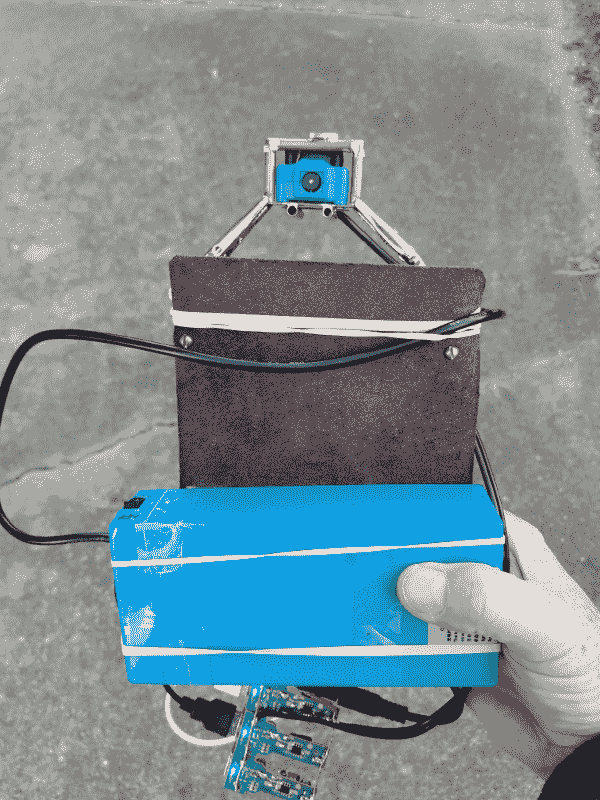
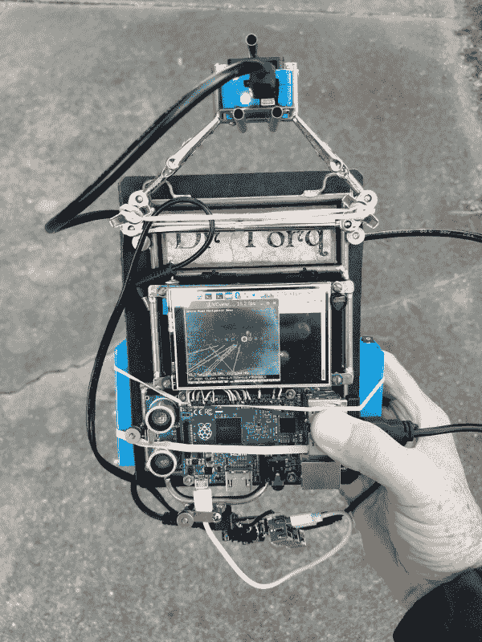
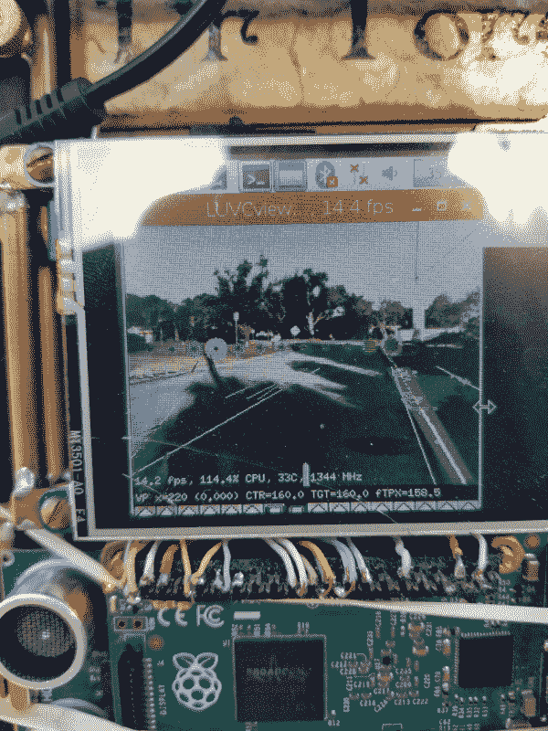
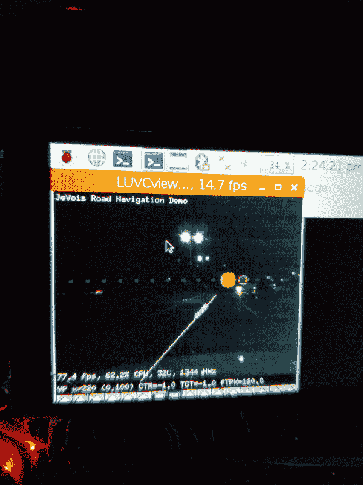

# 现成的黑客:探索 JeVois 视觉传感器算法

> 原文：<https://thenewstack.io/off-the-shelf-hacker-exploring-jevois-vision-sensor-algorithms/>

我的最新项目，[赫德利，机器人头骨，](/off-the-shelf-hacker-hedley-the-robotic-skull-spooks-minneapolis/)在他的右眼窝里有一个 [JeVois 智能机器视觉传感器](http://jevois.org/)。我翻领上的一个 [ArUco](https://www.uco.es/investiga/grupos/ava/node/26) 标记通过启动云台伺服系统使我保持在他的视野中心。他还使用受运动和光源影响的[“显著”算法](http://jevois.org/moddoc/DemoSaliency/modinfo.html)来跟踪我。在会议上，他在桌子上或三脚架上工作很出色。

我想探索[“道路导航”算法](http://jevois.org/moddoc/RoadNavigation/modinfo.html)(在 JeVois 传感器中)已经有一段时间了，把他楔在汽车的仪表板上似乎不是一个好主意。我认为，在一些更容易管理的东西上，熟悉 JeVois 中的一些其他算法会容易得多。在计划将 JeVois 传感器集成到 Elegoo 轮式机器人平台之前，观察“道路导航”算法的行为也是有意义的。我们在过去的一篇文章中介绍过 Elegoo 机器人。

可悲的是，赫德利不得不暂时失去一只眼睛。

作为一名现成的黑客[的一个好处是，由于我们制造自己的小工具，我们也是混合和匹配各种部件以创造新功能的专家。别担心，传感器安装了一个可移动的底座，所以让赫德利再次“看见”是微不足道的。](https://www.thenewstack.io/tag/Off-The-Shelf-Hacker)

我们需要的是一种便携式 JeVois 智能传感器测试设备。

## 手持智能视觉测试设备

碰巧蒸汽朋克会议徽章有足够的马力显示来自 JeVois 的增强现实视频，通过 [luvcview 程序](https://launchpad.net/ubuntu/+source/luvcview)。你可能还记得这个徽章有一个 Raspberry Pi 2 model B 微控制器，一个 3.5 英寸的彩色液晶触摸屏和一个连接到 Arduino Pro Mini 的超声波传感器。它运行在一个 5 伏的手机电池上，基本上是我胸前的一个小桌面。我去年 7 月在 OSCON 运行了徽章上的技术演讲幻灯片。如果分辨率保持在 600×400 以下，luvcview 在小屏幕上也能很好地运行。我用一个小小的 [Rii 拇指键盘/鼠标垫](https://www.banggood.com/Rii-Mini-X1-2_4G-Wireless-Air-Backlit-Keyboard-with-Mouse-Touchpad-p-949958.html?rmmds=search&cur_warehouse=CN)完成了这个“胸顶”包。

看看我对徽章的五分钟修改。

会议徽章/试验台正面

会议徽章/测试台背面

我用一个[【第三只手】](https://www.dx.com/p/helping-third-hand-tool-soldering-stand-with-5x-magnifying-glass-2008773)的部件，用一根粗橡皮筋把 JeVois 传感器固定在徽章的顶部。

额外的橡皮筋将[大 li-po 电源模块](https://thenewstack.io/off-the-shelf-hacker-building-your-own-compact-portable-power-brick/)固定在徽章背面。JeVois 需要相当多的电流，所以我也盗版了 USB 电源插座板，我为便携式蒸汽朋克显示器和大锂电池而建。该板将 12 伏(来自电池)转换为 5 伏 USB 电源。Pi 插入其中一个插座，而 JeVois 电缆插入 Pi 上的一个 USB 端口。JeVois 电缆的辅助尾纤连接到插座板。电缆好像伸出来到处都是。啊，好吧，这并不意味着作为一个完成的项目。

在徽章顶部为 JeVois 传感器建立一个可拆卸的支架，然后在徽章前面有“人”时点亮某种 LED 接口，这可能会很有趣。我们还可以用会议徽章上的 JeVois 做什么？

## 机器视觉道路导航

我最初把徽章挂在后视镜上，用带底座的“第三只手”把 JeVois 传感器放在仪表板上，然后慢慢地沿着我居住的街道行驶。Pi 上的 HDMI 输出连接到座位上的 10.1 英寸 steampunk 便携式显示器。我用仪表板上的 12 伏电源插座给 USB 电源插座板供电。除了 5 伏 USB 电源，插座板还有一个显示器专用的有线连接器。

JeVois 很好地跟踪了道路，速度高达每小时 25 英里。不用说，在最初的临时设置中，我没有走得太远或太快。回到车道后，我将传感器和电池连接起来，以便制作一个手持设备进行测试。当然，现在我需要一个助手来驾驶，同时我要记录算法在不同速度和路况下的行为。时刻注意安全，遵守交通规则。

JeVois 传感器“道路导航”算法用白线跟踪道路边缘，并用绿点标记水平消失点。紫色条表示道路的中心线。增强现实数据也显示在视窗的底部。通常，位置数据也通过串行线路传输，因此机器人汽车或其他设备可以决定转向何处。看看这篇关于 JeVois 创建者 Itti 博士及其同事开发算法的[论文](http://ilab.usc.edu/publications/doc/Chang_etal12iros.pdf)。注意这篇论文是 2012 年的。呀！

在手持会议徽章/测试设备上运行道路导航算法非常简单。我在 LCD 模式下启动徽章，当桌面出现时，我启动终端并从命令行运行 luvcview。luvcview 在 Raspbian Linux 中可用。拇指键盘/鼠标垫比拖着全尺寸的罗技键盘到处跑要好得多。

|  | 

抢%luvcview-fyuvv-s320 x256

 |

luvcview 运行后，我就把键盘塞进了口袋。JeVois 传感器指向徽章的背面，而视频馈送则出现在前置液晶屏幕上。我用手机拍了屏幕的照片，因为我没有手来操作键盘和截图。

道路导航截图—白天时间

请注意，右边的阴影使消失点有点倾斜。良好的读数要求地平线指数点排与实际地平线对齐。

该算法甚至在晚上晚些时候在一些停车位线上的目标停车场中工作。我还没有摆弄增益、对比度或其他传感器设置。我敢肯定，有空间进行最佳检测调整。

道路导航截图—夜间

## 下一步是什么？

在接下来的几周里，我将“生活”在便携式徽章测试设备上，评估 JeVois 机器视觉传感器中嵌入的“道路导航”和其他算法。在某种程度上，我希望将传感器连接到 Elegoo 机器人汽车上，并让它使用 ArUco 标记或道路导航跟随我。

自然地，将 JeVois 放在会议徽章上为那种现成的部件组合的使用开辟了一条全新的意识线。嘿，如果我们还添加了文本到语音转换或指向消失点(道路中心)的伺服会怎么样？这有用吗？

这就是为什么我不担心机器人革命会接管世界。赫德利和他的同道离让人类觉得容易的创造性、发明性、一次性或“啊哈”联系还有很长的路要走。

<svg xmlns:xlink="http://www.w3.org/1999/xlink" viewBox="0 0 68 31" version="1.1"><title>Group</title> <desc>Created with Sketch.</desc></svg>