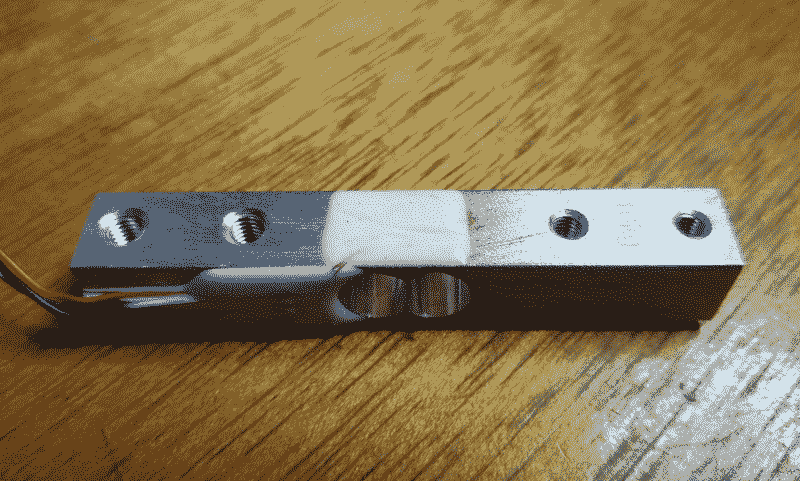
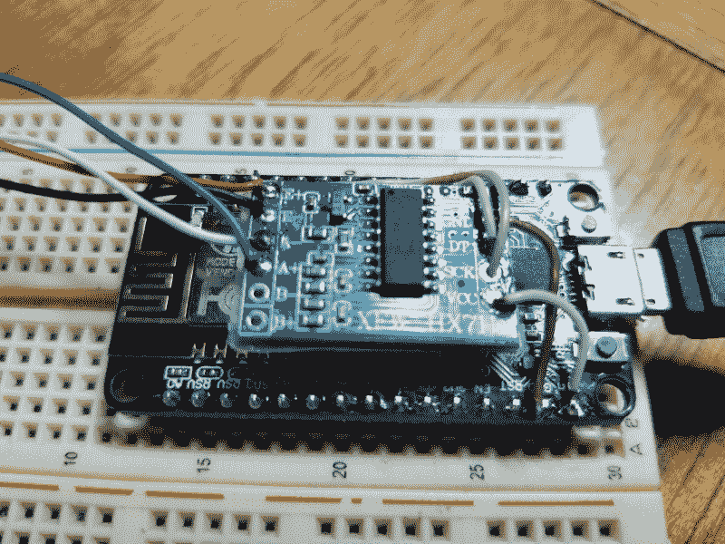
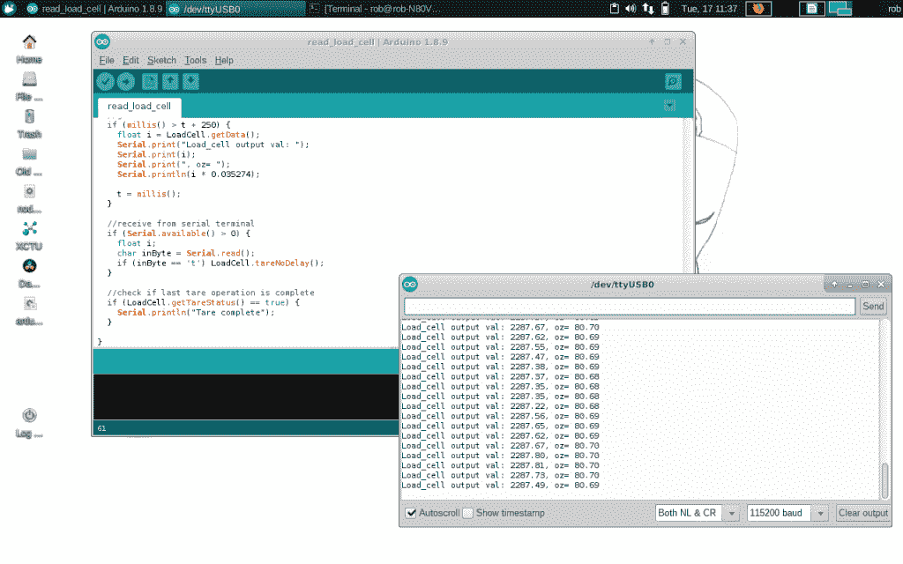

# 现成的黑客:用负荷传感器感受力

> 原文：<https://thenewstack.io/off-the-shelf-hacker-feel-force-with-a-load-sensor/>

当开发和构建物理计算小工具时，我们经常需要测量事物。以前的一篇文章讨论了用[热电偶](/off-the-shelf-hacker-throw-a-thermocouple-on-the-grill/)读取温度。几周前的[“千分尺”故事](/off-the-shelf-hacker-how-to-use-the-dial-caliper-for-extra-precise-measurement/)谈到了捕捉长度，这样我们就可以在 CAD 程序中精确地为零件建模。去年四月，我们还介绍了梁式称重传感器及其基本操作[。](/off-the-shelf-hacker-use-load-cells-to-measure-mechanical-forces/)

这次我将把称重传感器/放大器组合到[节点 MCU 板](https://www.amazon.com/KeeYees-Internet-Development-Wireless-Compatible/dp/B07HF44GBT/ref=sr_1_14?keywords=nodemcu&qid=1568757966&sr=8-14)上，这样我就可以进行远程无线力感测。我们可以利用这种能力来构建便携式数字秤、感应物体并从机械装置中提供可操作的反馈。今天，我们将使用 NodeMCU 板作为 Arduino Nano 进行基本操作，并通过 USB 传输数据。为遥感添加无线代码和网络逻辑将出现在下一篇文章中。

## 称重传感器+节点 MCU =无限乐趣



10 千克称重传感器

之前的称重传感器文章很好地描述了它们是什么以及它们是如何工作的。

它们通常是一个小的矩形铝块，中心钻有一个交叉的空腔，顶部和底部粘有应变仪(薄膜电阻)。电阻器连接到一个放大器，该放大器分析它们的值，并将测得的力值发送到 NodeMCU 或 Arduino 纳米板。

这些负荷传感器的一个很酷的地方是，你可以单独购买 1、10、20、50、200 和 1000 公斤大小的传感器。我的 10 公斤版亚马逊售价 8.50 美元，包括放大器板。甚至还有一款 5000 公斤的[型号](https://www.amazon.com/Pressure-Concrete-Station-Batching-Testing/dp/B07L9S8VCD/ref=asc_df_B07L9S8VCD/?tag=hyprod-20&linkCode=df0&hvadid=344588138627&hvpos=1o1&hvnetw=g&hvrand=16321041789184075272&hvpone=&hvptwo=&hvqmt=&hvdev=c&hvdvcmdl=&hvlocint=&hvlocphy=9051575&hvtargid=pla-848974129677&psc=1&tag=&ref=&adgrpid=69777454699&hvpone=&hvptwo=&hvadid=344588138627&hvpos=1o1&hvnetw=g&hvrand=16321041789184075272&hvqmt=&hvdev=c&hvdvcmdl=&hvlocint=&hvlocphy=9051575&hvtargid=pla-848974129677)，售价约为 124 美元。你可以测量出 11000 磅。拉那个怪物。

所有称重传感器都使用相同的微型 HX711 放大器板。



焊接在 NodeMCU 板上的称重传感器放大器

完成的 node MCU/放大器封装非常紧凑。我使用 20 号实芯线将放大器板“悬浮”在 NodeMCU 板上方。放大器板底部的几片透明胶带防止了短路。随着设计的发展，我们会考虑一个外壳，可能还会考虑一些用于切换到不同称重传感器的插头和插座。

将称重传感器和放大器连接到 NodeMCU 板只需极少的焊接。这里是连接。

HX711 放大器板的称重传感器。

NodeMCU 微控制器的放大器板。

## 在 ESP8266 上运行 Arduino 代码

NodeMCU 板是取代 Nano 的一个很好的选择，因为它有一个内置的 ESP8266 Wi-Fi 无线电。我正在开发易于携带的负载传感器，并能够应用于各种非笔记本电脑或 Raspberry Pi 连接的情况。NodeMCU 将连接到我的网络并通过 wifi 传输数据。

node MCU(esp8266 s)可通过使用 USB 电缆的 Arduino IDE 轻松编程。只需在编译和上传过程中更改电路板类型，就万事大吉了。代码的第一步是通过 USB 发送数据，并使用 Arduino IDE 串行终端查看结果。

让 NodeMCU 或 Nano 板与 HX711 放大器板对话需要一个库。我在 Arduino IDE 中安装了由 Olav Kallhovd 1 . 1 . 5 版库提供的 HX711_ADC。启动 Arduino IDE，进入工具菜单，选择管理库。搜索“HX711 ”,当上述库出现在列表中时，点击“安装”按钮。这还会将示例代码文件放在“文件”->“示例”菜单下。它们被列为 HX711_ADC。

对于这个项目，我只是引入了 Read_1x_load_cell 示例并做了一些修改。

```
//-------------------------------------------------------------------------------------
// HX711_ADC.h
// Arduino master library for HX711 24-Bit Analog-to-Digital Converter for Weigh Scales
// Olav Kallhovd sept2017
// Tested with      : HX711 asian module on channel A and YZC-133 3kg load cell
// Tested with MCU  : Arduino Nano, ESP8266
//-------------------------------------------------------------------------------------
// This is an example sketch on how to use this library
// Settling time (number of samples) and data filtering can be adjusted in the config.h file

#include &lt;HX711_ADC.h&gt;
#include &lt;EEPROM.hh&gt;

//HX711 constructor (dout pin, sck pin):
HX711_ADC LoadCell(5,4);

const int eepromAdress  =  0;

long  t;

void setup()  {

float calValue;  // calibration value
// calValue = 696.0; // uncomment this if you want to set this value in the sketch
calValue  =  245.0;  // uncomment this if you want to set this value in the sketch
#if defined(ESP8266)
//EEPROM.begin(512); // uncomment this if you use ESP8266 and want to fetch the value from eeprom
#endif
//EEPROM.get(eepromAdress, calValue); // uncomment this if you want to fetch the value from eeprom

Serial.begin(115200);  delay(10);
Serial.println();
Serial.println("Starting...");
LoadCell.begin();
long stabilisingtime  =  2000;  // tare preciscion can be improved by adding a few seconds of stabilising time
LoadCell.start(stabilisingtime);
if(LoadCell.getTareTimeoutFlag())  {
Serial.println("Tare timeout, check MCU&gt;HX711 wiring and pin designations");
}
else  {
LoadCell.setCalFactor(calValue);  // set calibration value (float)
Serial.println("Startup + tare is complete");
}
}

void loop()  {
//update() should be called at least as often as HX711 sample rate; &gt;10Hz@10SPS, &gt;80Hz@80SPS
//use of delay in sketch will reduce effective sample rate (be carefull with use of delay() in the loop)
LoadCell.update();

//get smoothed value from data set
if  (millis()  &gt;  t  +  250)  {
float  i  =  LoadCell.getData();
Serial.print("Load_cell output val: ");
Serial.print(i);
Serial.print(", oz= ");
Serial.println(i  *  0.035274);

t  =  millis();
}

//receive from serial terminal
if  (Serial.available()  &gt;  0)  {
float  i;
char inByte  =  Serial.read();
if  (inByte  ==  't')  LoadCell.tareNoDelay();
}

//check if last tare operation is complete
if  (LoadCell.getTareStatus()  ==  true)  {
Serial.println("Tare complete");
}

}

```

第一个 mod，我换了 HX711_ADC 称重传感器(4，5)；值为 5.4。我无意中颠倒了从放大器板到 NodeMCU 的数据输出和 s 时钟连接。我没有拿出烙铁，让事情与示例代码保持一致，而是改变了代码中的引脚。用代码修复某些硬件问题很容易。请注意，如果您不仔细和有组织，这种做法可能会很快失控，特别是在任何接近生产的代码中。

另一个变化是在底部增加了一个打印语句，除了显示千克以外，还显示以盎司为单位的测量力。

最后，我更改了校准值。示例代码指定作者在他的应用中使用 3 kg 称重传感器。我用的是 10 公斤的电池。我通过反复试验得出了我的校准值。下一部分将快速介绍这个过程。

## 弯曲横梁

为了获得力的精确读数，需要对系统进行校准。用已知重量校准传感器非常简单。今天的讨论将假设传感器值随着负载线性上升。当然，如果您需要非常精确的测量，您需要将值从低端(0)映射到高端(10 千克)，以考虑任何变化。

对于测试设置，我将传感器的一端夹在我的桌子上，因此钻孔间隙悬在边缘上。然后，我用一根绳子在传感器的另一端自由悬挂一个 5 磅重的锻炼重物，放在地板上。五磅约为 2.27 公斤或 2270 克。



Arduino IDE 串行终端窗口上显示的称重传感器读数。

我的方法有点粗暴。我更改了代码中的校准值，然后编译并重新上传固件到 NodeMCU，直到 Arduino IDE 串行终端读数上出现正确的值。每次上传固件时，一定要解开重量，否则，你将有效地“清零”5 磅的传感器。我们希望传感器在空载时读数为零。此外，如果你得到负读数，只需将传感器翻转过来，重新夹紧。应变仪的排列使得你可以得到正负读数。这种能力可能会派上用场。有什么想法吗？

无论如何，校准是有点乏味的，虽然它最终工作得很好。升级可能是添加一个小电位计和一些代码，让您通过旋转旋钮或螺丝刀进行校准调整。

[https://www.youtube.com/embed/j3aEAI6lh4c?feature=oembed](https://www.youtube.com/embed/j3aEAI6lh4c?feature=oembed)

视频

## 更进一步

很容易直接从 Arduino IDE 串行终端读取压力值。您也可以在 Linux 终端中使用 cat 命令发送它们，甚至发送到处理模拟仪表程序。我们在过去的文章中讨论过这些话题。

该项目的下一步是增加 Wi-Fi 功能。在接下来的故事中，我将向您展示代码，以及我们如何使用连接到网络的远程负载传感器。将强制值发送给 MQTT 代理可能也很有用。

*赶【Torq 博士的 [现成黑客专栏](https://thenewstack.io/tag/off-the-shelf-hacker/)，每周六，只上新栈！在[doc@drtorq.com](mailto:doc@drtorq.com)或 407-718-3274 联系他咨询、演讲、委托项目。*

<svg xmlns:xlink="http://www.w3.org/1999/xlink" viewBox="0 0 68 31" version="1.1"><title>Group</title> <desc>Created with Sketch.</desc></svg>