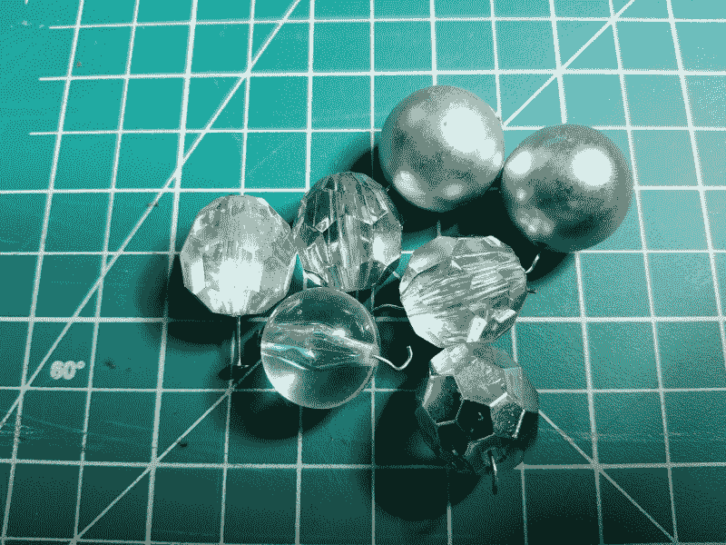
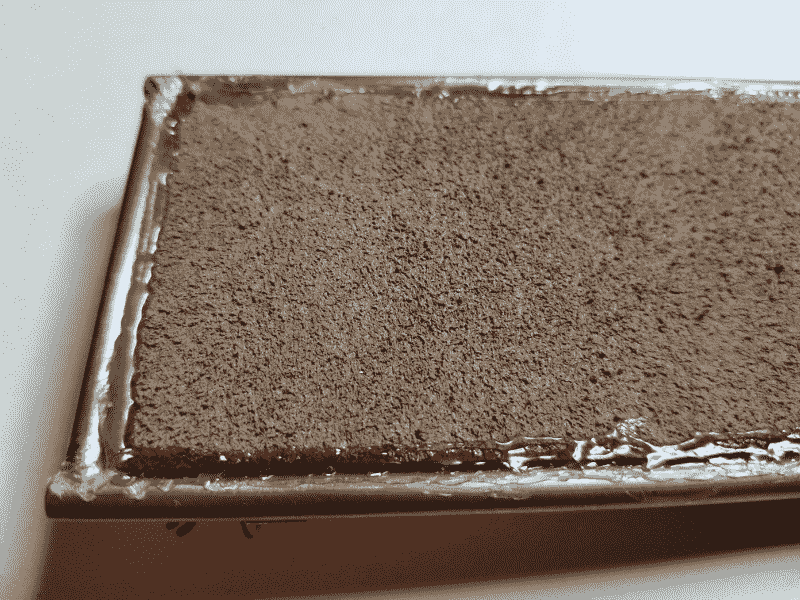
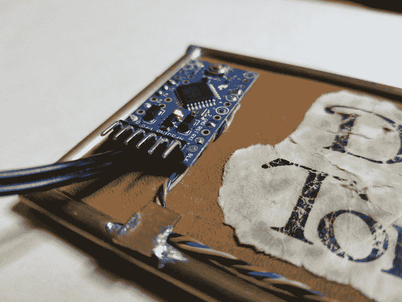
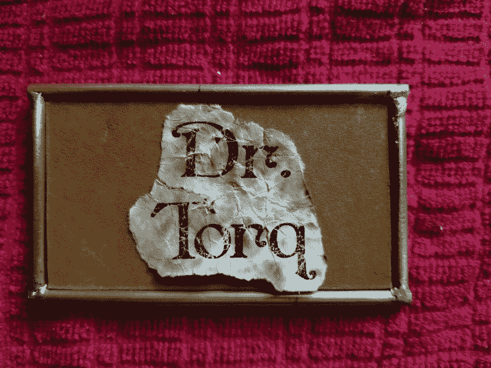

# 现成的黑客:完成低成本会议徽章

> 原文：<https://thenewstack.io/off-the-shelf-hacker-finishing-the-low-cost-conference-badge/>

当我加速驶向 OSCON 的时候，有成千上万的事情要做，为这次旅行做准备。就像文章的截止日期一样，当你和飞机座位的日期越来越近时，你要演示的项目的设计决策也有自己的解决方法。别担心，我在[我的官方技术讲座](https://conferences.oreilly.com/oscon/oscon-or/public/schedule/detail/67363)上使用的徽章已经准备好了。我会在会议上使用三种不同的蒸汽朋克徽章。

几周前，我们讨论了我的[“简单、低成本和低调”物理计算徽章](https://thenewstack.io/off-the-shelf-hacker-build-a-low-cost-conference-badge/)的计划。从那以后，我找到了徽章的“水晶”三色 LED 核动力源，并继续用我的家庭厨房方法老化铭牌纸。

这一次，我们将讨论这些话题并把事情总结一下，这样我就可以带着它去波特兰了。

## 已经做了决定

我不知道你怎么样，但是我经常因为过度思考一个项目的大部分而遭受折磨。这是常见的苦恼。工程极客设想功能、特性和能力的无限可能性。我们希望我们的设计成为宇宙历史上最酷、最复杂、最震撼世界的小玩意。

从实际的角度来看，你只需要在截止日期前做些有用的事情。

我困惑了几个星期，试图想出一个“核动力源晶体”来代替“臭氧管”，我用在我更大的第四代蒸汽朋克徽章上。

在翻找我孩子的一个艺术抽屉时，我发现了一把圆形塑料晶体。有些是银色的，有些是光滑的，有些是透明的。最小的一个被证明是“低成本”徽章的完美尺寸。



核动力晶体

我将晶体夹在一块毛巾布中，并使用钻床慢慢钻出孔，以容纳三色 led。我实际上使用了两个尺寸略有不同的位，使 LED 紧密贴合，然后使用少量热胶将组件固定在一起。

接下来，我将三个电阻和四个连接连接到 Arduino Pro Mini。蓝色 LED 引线连接到引脚 6，绿色连接到引脚 5，红色连接到引脚 3。LED 上的公共引线接地。我使用了一个简单的四节 AA 电池架硬连线到原始引脚和电源接地。很容易拉出一个电池来打开或关闭设备。不需要开关。电源线大概 24 英寸，我正好可以把电池组放在口袋里。

我从 GitHub 获取了这段代码，并更改了 pin 以适应我的 Pro Mini 设置。它以大约 20 秒的周期淡出所有的颜色。使用标准 Arduino IDE 和 Linux 笔记本上的 USB 转串行电缆将其上传到 Pro Mini。

```
const int redPin  =  3;
const int greenPin  =  5;
const int bluePin  =  6;

void setup()  {
  // Start off with the LED off.
  setColourRgb(0,0,0);
}

void loop()  {
  unsigned int rgbColour[3];

  // Start off with red.
  rgbColour[0]  =  255;
  rgbColour[1]  =  0;
  rgbColour[2]  =  0;  

  // Choose the colours to increment and decrement.
  for  (int decColour  =  0;  decColour  &lt;  3;  decColour  +=  1)  {
    int incColour  =  decColour  ==  2  ?  0  :  decColour  +  1;

    // cross-fade the two colours.
    for(int  i  =  0;  i  &lt;  255;  i  +=  1)  {
      rgbColour[decColour]  -=  1;
      rgbColour[incColour]  +=  1;

      setColourRgb(rgbColour[0],  rgbColour[1],  rgbColour[2]);
      delay(40);
    }
  }
}

void setColourRgb(unsigned int red,  unsigned int green,  unsigned int blue)  {
  analogWrite(redPin,  red);
  analogWrite(greenPin,  green);
  analogWrite(bluePin,  blue);
}

```

黄铜框架最终尺寸为 4-1/8 英寸 x 2-1/2 英寸。框架内部是一个很好的模板，用于切割一块浅棕色皮革作为铭牌。皮革与框架的背面齐平，所以我只是用热胶水将它固定在四周。



将皮革铭牌热粘在黄铜框架上

安装 Arduino Pro Mini 也很容易，只需将 1/2 英寸 x 3/4 英寸的皮革条热粘在主板背面，然后粘在铭牌正面。电源线和编程引脚在底部。我使用了一对 3/8 英寸长，1/4 英寸 x 1/16 英寸的黄铜扁钢作为黄铜框架底部的 LED 电缆固定器。



Arduino Pro Mini 安装在皮革铭牌上

我还没有决定到底如何安装三色 LED，核电晶体大会。从现在起到我去波特兰之前，这一切都会发生。

## 老式古董纸

我喜欢蒸汽朋克的一点是它的“旧”和“复古”美学我想效仿我徽章上的外观和感觉。

老化纸非常简单，在这种情况下，我用它作为徽章上的铭牌。

第一步是在图书馆找到一些看起来像是某个时期的印刷品。我喜欢彭赫斯特字体。由于这个徽章比第 5 代小得多，所以我用 66 号字体在两行上印了“Torq 博士”,粗体，居中对齐。印刷必须适合 Arduino 和水晶之间，所以垂直布局是有意义的。将名字打印在标准激光打印纸上。

接下来，撕开字母，使其贴在皮革铭牌上。你可以用剪刀顺利地剪开纸，但那不会给你 19 世纪晚期的样子。

把纸卷成一个球，然后小心地把它再次展平。将纸浸泡在水龙头下，然后在纸巾上将它展平。将少量普通的日常速溶茶撒在纸上。用手指将茶叶轻轻放入纸中，然后在弱水流下仔细冲洗。你可以再次揉皱这张纸，然后展开它，这取决于你想要它看起来有多旧。

如果轻微撕裂也不用担心。当你得到想要的污渍量时，再次将纸铺开放在干纸巾上。印刷应该看起来风化。如果没有，根据需要弄皱并弄平纸张。你可以让纸风干或者用吹风机来加速这个过程。

用埃尔默胶水把纸粘到皮革徽章上。我在第五代徽章的纸上涂了透明指甲油，但在这一张上，我打算让它保持原样。



铭牌上的仿古纸

由于徽章很轻，我将在徽章背面使用粘贴式橡胶磁片。第二个徽章大小的磁片会把徽章固定在我的衬衫里面。

## 包裹

低成本的会议徽章即将面世。我计划在秀场上穿着它，也许在一些社交活动中也会穿。我可能会在顶部放几个铜环，这样我就可以用挂绳把它挂起来。

在 OSCON 找我。


<svg xmlns:xlink="http://www.w3.org/1999/xlink" viewBox="0 0 68 31" version="1.1"><title>Group</title> <desc>Created with Sketch.</desc></svg>