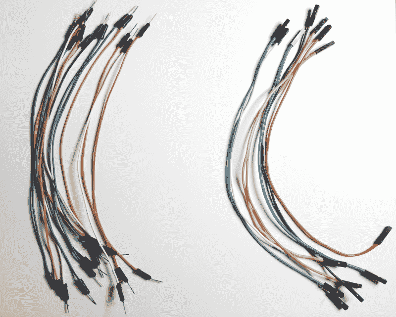
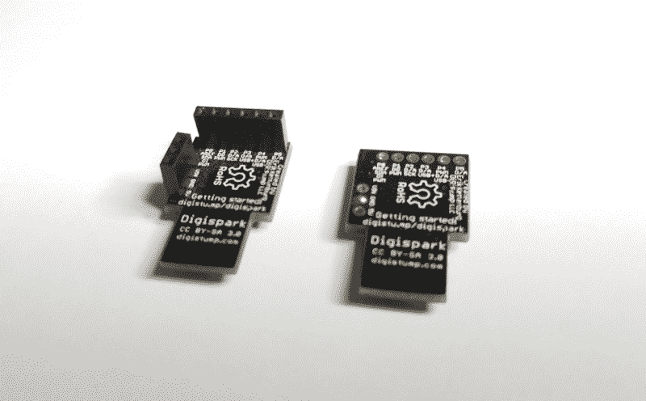
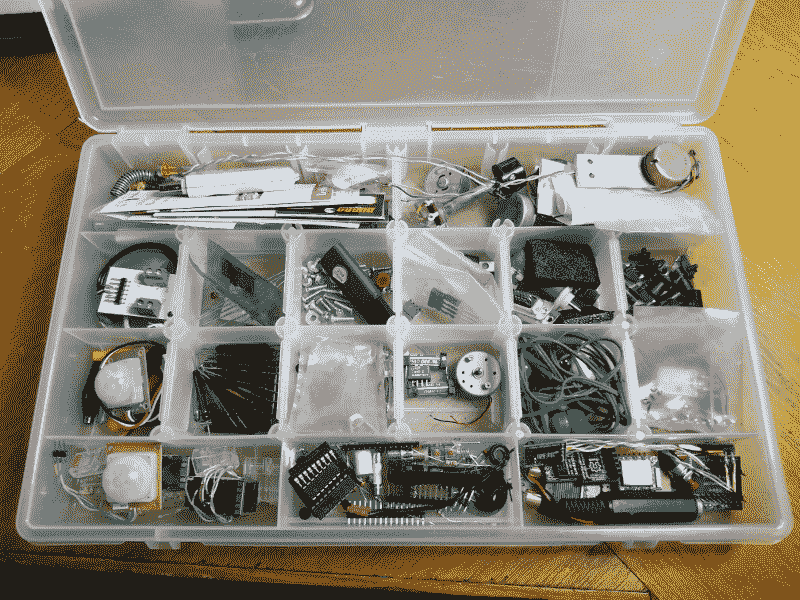

# 现成的黑客:动手快速原型制作

> 原文：<https://thenewstack.io/off-the-shelf-hacker-hands-on-fast-prototyping/>

每周制作一个现成的黑客故事有点麻烦。我从头开始写文章，还得拍摄/编辑每篇文章的小视频。还可以将拷贝上传到内容管理系统(CMS ),附带编辑，可能是临时构建或大量编辑的图形。此外，我们不要忘记在实际的文章起草之前的所有初始项目开发和测试构建。OTSH 故事有很多活动的部分和过程。

因此，我发现了一些有用的技术和过程，可以帮助我在快速的原型制作环境中完成动手制作。写故事是这个项目的后半部分。

让我们来看看我用来在截止日期前完成工作的一些“捷径”。

## 试验板、跳线和模块

许多硬件项目都是从一个[试验板](https://en.wikipedia.org/wiki/Breadboard)开始的。这些是小的 2-1/8 x 3-1/4 英寸的白色硬件实验板，上面有很多小孔。它们的孔间距为 0.1，与 0.1 间距的引脚接头和分立直插式集成电路(IC)一致。我仍然有一个大学时用的更大的试验板，偶尔会用到。哇，那是很久很久以前的事了！我还有一个小巧的透明塑料制的、看起来很有未来感的试验板，它几乎从未被使用过。很难看出电线是否穿进了正确的孔。我更喜欢纯白色的。

集成电路，晶体管，电阻和电容插入试验板，快速创建电路。您可以自己制作跳线，方法是剥去 22 号实心铜线的绝缘层，将试验板上的元件连接在一起。在黑暗时代，我曾经自己制作跳线。你知道十年前。对于使用大量电线的健壮的“临时”构建，我有时会定制跳线，这样我就不会有一个老鼠窝，到处都是蜿蜒的柔性跳线。刚性电线也比松软的 6 英寸长跳线更易于固定。

如今，你可以买一捆预制的公对公和母对母跳线，用它们来连接电路。显然，男性对男性跳线主要用于试验板。当临时连接到接头引脚时，母到母跳线很方便。

预制跳线，公(左)母(右)

对于原型制作，我通常用插头和插座将模块连接在一起，这样我就可以将它们拆开并在其他项目中重新使用。母跳线非常适合将接头引脚连接到接头引脚，有点像柔性试验板。

另一方面，当购买印刷电路板模块时，我喜欢在可能的情况下购买没有安装插头和插座的模块。这样我就可以决定我是想把这个模块严格用于快速原型项目，还是把它半安装或永久安装在一个项目中。一旦一条十几个插头插脚或一个插脚插座被焊接到印刷电路板上，它们就很难被移除。

两个微型 DigiSpark 板，一个带接头(左)，一个不带接头(右)

例如，如果你需要一个健壮的项目在一系列技术讲座上演示，最好是用电线把模块焊接在一起，而不是跳线。跳线在处理时往往会分开，你肯定不希望在你应该上台之前发生这种情况。很多时候，我有一堆插针和插座板，还有一套没有插针和连接器的独立板。这是多一点的现金，但给了我灵活性，这就是生意的本质。

## 那部分在哪里？

对于现成的黑客来说，组织零件是一个持续的过程。商业运作称之为库存控制。我们希望快速完成项目，并且能够随着新想法和项目的实现而交换部件。抱着现成的心态，不断前行。

我喜欢把较小的部件放在不透明的塑料零件盒里。你可以在业余爱好商店比如业余爱好大厅或者迈克尔斯买到这些。在珠绣和十字绣部门四处搜索。在家得宝(Home Depot)和洛斯(Lowes)等家装商店也可以买到小的、分隔开的零件箱。它们出现在存储容器部门。最后，在紧要关头，你可以使用像 Bass Pro 商店这样的地方的塑料鱼饵盒。

分隔的小零件箱

这种类型的组件存储总是可能发生静电损坏。使用静电释放泡沫和袋子实施适当的预防措施。现代组件往往非常坚固，我个人遇到的问题很少。

事实上，不止一次，我从口袋里拿出一个树莓派，把它连接到投影仪、电源和键盘上，然后播放我的幻灯片进行技术演讲。对硬件的信心如何？

> 不要害怕用胶带把零件粘在一起。热熔胶更持久，更坚硬。根据需要，胶带可以撕开或切掉。

对于更大的收藏或更大的部分，我喜欢使用 15 x 11 x 6 英寸的带盖塑料容器。我甚至在去遥远的城市旅行时拍了几张这样的照片。它们可以舒适地放在托运行李中，并且可以用胶带封闭。它们还能很好地叠放，因此很容易存放在你的店里。

一个好的储物策略最重要的部分之一是记住东西放在哪里的能力。对于很多事情，我的记忆就像一个筛子。奇怪的是，我通常能记得在某个地方看到一个非常特殊的螺栓或电子元件，然后能够回到那个地方找到它。定期浏览我收集的各种零件似乎有助于保持精神位置索引的更新。

我真的不知道如何告诉别人开发他们的“部分记忆”很遗憾，我不得不说这次你只能靠自己了。尽你所能增强你对零件的记忆。

https://youtu.be/M3gmopsbIT4

## 反射

还有两件事。透明胶带和热熔胶。

不要害怕用胶带把零件粘在一起。热熔胶更持久，更坚硬。根据需要，胶带可以撕开或切掉。读者在过去的文章中已经看到了这两种情况的例子。原型可能经不起大量使用或无休止的演示。他们确实需要在被召唤时工作，所以根据需要调整你的“构造”。

快速原型要求速度和结果。晚点再说吧。如果有必要的话，让它耐用和坚固。您可以随时在后续版本中重新打包和改进设计，并且随着您对新小工具的使用经验的增加。

让当前版本工作，并在截止日期前发布故事。

*赶【Torq 博士的 [现成黑客专栏](https://thenewstack.io/tag/off-the-shelf-hacker/)，每周六，只上新栈！在[doc@drtorq.com](mailto:doc@drtorq.com)或 407-718-3274 直接联系他咨询、演讲出场和委托项目。*

Pixabay 的 DavidRockDesign 的特征图像。

<svg xmlns:xlink="http://www.w3.org/1999/xlink" viewBox="0 0 68 31" version="1.1"><title>Group</title> <desc>Created with Sketch.</desc></svg>