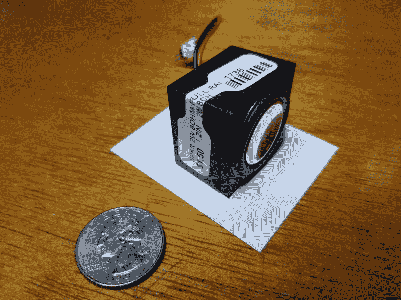
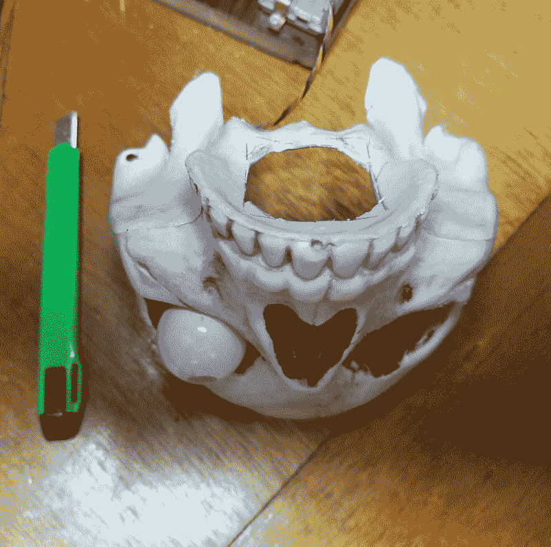
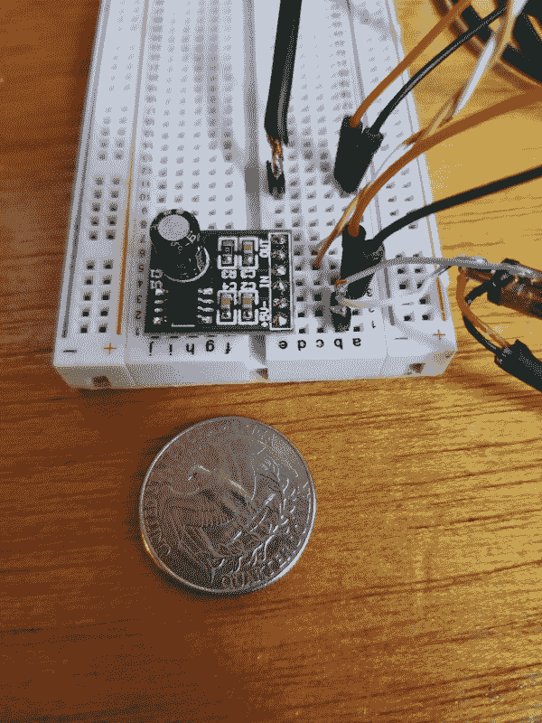
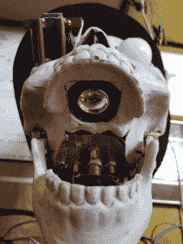

# 现成的黑客:赫德利机器人头骨得到了部分上颌骨切除术

> 原文：<https://thenewstack.io/off-the-shelf-hacker-hedley-the-robotic-skull-gets-a-partial-maxillectomy/>

在感觉像是永远之后，我的最新项目，机器人头骨赫德利终于有了一个安装在他口腔顶部的扬声器。我很难找到一个足够小的，同时还能处理几瓦音频功率的手机。现在说，“啊啊啊！”

事实证明，[当地的一家剩余电器商店](https://skycraftsurplus.com/?SID=sln97teu2n5jamcgq0s7r7vgd4)正好有我们需要的东西。

在将赫德利置于手术刀下(实际上，是 Dremel)进行他的[上颌骨切除术](https://www.oncolink.org/cancers/head-and-neck/treatments/surgical-treatments/surgical-procedures-maxillectomy)后，我通过头骨播放了滚石乐队的[“同情魔鬼”](https://www.youtube.com/watch?v=f47TZePukuQ)，它听起来很不错，是从赫德利的大嘴巴陷阱中发出的。似乎是一个合适的，全面的首次测试。

本周，我将讲述如何将扬声器放入赫德利的耳机中，以及如何通过一个微型音频放大板让声音发出来的细节。未来的故事将会把整个扑颌/声音效果与进行语音到音频分析的[处理](https://processing.org/)程序结合在一起。

## 为什么要做手术？

当赫德利和我在最近的明尼阿波利斯嵌入式系统会议上做技术演讲时，他的下巴在移动，而他板载的 Raspberry Pi 3 上的 HDMI 端口将音频传输到室内音响系统。效果很好。他说了一句话，看起来像是在说话。

我真正想要的是赫德利对着麦克风说话。我想在他面前放一个落地麦克风，让他像正常人一样对着麦克风说话。当他在麦克风拾音模式下移动时，他还会在表演中摇动和倾斜他的头，这将改变声音。再加上精确同步的下颌运动，观众可能会暂时停止相信赫德利是个机器人。

## 张开嘴

扬声器的实际安装并不像我预期的那么难。

当我第一次建造赫德利的时候，我用模块化的方式切开了他的头骨。前面有前额、眼窝、鼻子和上牙。他头骨的后半部分以一种环绕的方式铰接到前部，在右侧用螺栓和销钉固定在一起。帽子覆盖了顶部的所有东西，并用螺丝和几根皮带固定。钳夹是独立的，并连接到钳夹枢轴管。一个内部框架支撑着整个工程，包括内部的平移枢轴轴承。

在拆卸前/后头骨部分之前，我必须从他的右眼窝中取出盖子和 JeVois 智能传感器。传感器支架使用三个销钉将设备定位在正确的位置，并使用一组橡皮筋将设备固定在销钉上。拉开橡皮筋，断开 USB 和串行电缆，传感器就直接出来了。

赫德利还有一个三色的 LED 眼球，压在他的左眼窝里。它留在头骨的前部。我切开了前头骨的后部，以便夹在内颚枢轴轴承管上。这些管子位于他头骨的底部，是脊柱开始的地方，是内部黄铜管道框架的一部分，支撑着颌伺服机构、颌伺服杠杆、JeVois 传感器支架和用于平移伺服机构的 Arduino 板。这些小缺口正好扣在管子上，将头骨固定在内部框架上。很结实。

总是试图让你的小工具(尤其是原型)模块化，这样它们就容易拆卸和修改。模块化包装本身就是一门艺术，也许是另一个故事的主题。

接下来，我在铰链处松开了前后头骨部分的螺栓，这样就可以和前面部分一起工作了。我甚至没有把 LED 眼球从树莓皮上摘下来，因为引线很长，在我的桌子上有足够的空间来做赫德利的手术。我想我们可以称之为门诊手术，而不是在手术室，也就是所谓的车库工作台。那是住院病人。去想想。

该扬声器可以处理大约两瓦的功率，大约是 1.5 英寸的立方体。

安装前的迷你扬声器

更好的是，它们每个只有 1.5 美元。我只是拿着立方体，将扬声器的锥形向下对着赫德利的上颚，并用笔标出轮廓。然后用 Dremel 上的切割轮和美工刀将“骨头”切除。我留下了角“标签”作为连接点。

赫德利口腔顶部的扬声器切口

清理完边缘后，我把扬声器放在头骨内，用热胶把它粘在角落的标签上。扬声器有点重，所以我在背面和侧面使用了额外的热熔胶，将扬声器牢固地固定在头骨内部。

## 给他点音量

不久前，我以 3 美元多一点的价格买了 5 个 5 瓦的单声道音频放大器。你怎么能为了那个价格而出错呢，对吗？

试验板上的 5 瓦音频放大器

令人惊讶的是，音频放大器的尺寸只有 1/2 英寸 X 3/4 英寸。您可以将这些东西放在项目中的任何地方。

我使用一对 0.1 毫米的引脚制作了一根双线延长线，一端插入扬声器连接器，另一端插入试验板。稍后，我将焊接引线，以便进行更永久的设置。

音频输入通过一根盗版音频电缆到达，该电缆一端插入赫德利 Raspberry Pi 的电话连接器，另一端插入试验板一侧的双 0.1 毫米引脚连接器。外部电缆编织层接地，内部导线连接到放大器的音频输入引脚。

电源由一根经过黑客攻击的 USB 电缆提供，该电缆带有一对焊接在正负引线上的 0.1 mm 引脚，位于试验板侧。

我应该提到，虽然 USB 电缆可以直接插入树莓 Pi 并为放大器供电，但从扬声器的失真来看，可能存在[“接地电流”](https://en.wikipedia.org/wiki/Ground_loop_(electricity)#Ground_currents_on_signal_cables)问题。我能够通过将放大器连接到一个完全独立的 5 伏手机电源组来获得干净无失真的声音。理想情况下，我们希望从通用 USB 电源连接器模块运行放大器，尤其是在便携式模式下。我正在寻找并修复根本原因。

## 快点万圣节

这位演讲者在赫德利的口中非常成功。音频放大器有足够的功率以高音量驱动扬声器。它的声音大得足以让房间的另一头也能听到。一旦力量/失真得到解决，一切都顺利进行，我期待着用赫德利作为我的声音，像人类一样的助手的脚本节目让观众眼花缭乱。

现在，我有了一个塑料头骨大小扬声器的供应商，我认为使用匹配的微型音频放大器、树莓 Pi 克隆体、下颌伺服系统，或许还有 Arduino Nano 克隆体来制作其他类似的说话机器人会很有趣。

造一个会说话的狗头骨会有多好玩？或者，一堆互相对话的书？如果邮差在他们上台阶的时候邮箱盖突然和他们说话，你觉得他会吃惊吗？

现在唯一的问题是离万圣节还有 7 个月。我怀疑在那之前，我不会在 Target 货架上看到任何有趣的塑料动物、鸟类或人类头骨。

*每周关注 Torq 博士的[现成黑客](https://thenewstack.io/tag/Off-The-Shelf-Hacker)专栏，独家关注新堆栈。*

<svg xmlns:xlink="http://www.w3.org/1999/xlink" viewBox="0 0 68 31" version="1.1"><title>Group</title> <desc>Created with Sketch.</desc></svg>