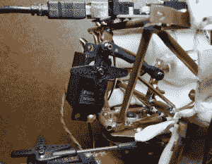

# 现成的黑客:赫德利机器人头骨说话

> 原文：<https://thenewstack.io/off-the-shelf-hacker-hedley-the-robotic-skull-speaks/>

不久前，我们已经报道过给机器人头骨赫德利增加一个[伺服控制颚](https://thenewstack.io/hedley-the-robotic-skulls-orthognathic-surgery/)。事实证明，让颚骨真实地跟踪听觉语言是相当具有挑战性的。人类的声音是由空气在声带上移动而产生的，嘴巴的形状，舌头的位置和口腔内的体积，我们都知道这些都受到下巴开合的影响。不完全是。

张开嘴唱歌或说话，不要动下巴。你可以发出几乎无限多的声音，而不用移动下巴。这是怎么回事？很复杂，对吧？

我们对机器人所做的是通过上下移动头骨的下颌骨来给出语音的视觉队列。它最终变成了一种人类愿意相信的幻觉。

一种方法是通过所谓的拍颚法。这种技术使下颌运动跟随小型麦克风记录的声压峰值和谷值。作为机器人语言化的第一步，这种效果是可以接受的。它当然不是完美的。玩弄机制，Arduino 代码和其他因素为如何进一步完善幻觉铺平了道路。有了一个相当好的幻觉，人类观察者开始心甘情愿地暂停现实，转而开始认为头骨实际上在说话。

## 制作颚瓣

我的头骨设计使用了一个标准的全尺寸业余爱好伺服来上下移动赫德利的下巴。旧的[大嘴比利巴斯会说话的鱼](https://en.wikipedia.org/wiki/Big_Mouth_Billy_Bass)使用 DC 电机和控制器板，在很大程度上相同的作用。

在头骨的例子中，标准 Arduino 电位计到伺服示例草图被修改为使用模拟麦克风将我的声音的声压转换为 0 到 1，023 的值。基础代码位于 Arduino 集成开发环境(IDE)中的示例->伺服->旋钮主题下。Arduino 然后将这些值转换为脉冲宽度值，用于随着声音的变化将伺服臂移动到相应的更高或更低的角度。颚的总角度运动约为 25 度。

这是代码。

```
/*
 Controlling a servo position using a potentiometer (variable resistor)
 by Michal Rinott 
 modified on 8 Nov 2013
 by Scott Fitzgerald
 http://www.arduino.cc/en/Tutorial/Knob
*/

#include 

Servo myservo;  // create servo object to control a servo

int potpin  =  0;  // analog pin used to connect the microphone
int val;    // servo value converted from analog pin input value
int val2;  // limit filtered servo value
int micin;  // microphone level variable

void setup()  {
  myservo.attach(3);  // attaches the servo on pin 3 to the servo object
  Serial.begin  (115200);
  // set up fast ADC mode
  ADCSRA  =  (ADCSRA  &amp;  0xf8)  |  0x04;    // set 16 times division
}

void loop()  {

 if  (Serial.available()  &gt;  0)  {
 micin  =  analogRead(potpin); // reads the value of the microphone level (value between 0 and 1023) 

 // micin = Serial.read();

 val  =  map(micin,700,400,110,135); // scale it to use it with the servo (value between 0 and 180)
 val2  =  constrain(val,  110,  135); // set servo travel limits

 myservo.write(val2);  
 delay(90); // waits for the servo to get there
 }  
}        

```

注意，我添加了一些串行通信代码。虽然麦克风可以用于测试，但真正的目标是最终使用预先录制的音频文件通过扬声器播放，同时向 Arduino 发送数据以移动下巴。我可能会在赫德利的 Raspberry Pi 上使用一个处理脚本，它读取一个 MP3 文件并进行一些过滤，然后输出一个 Arduino 可以通过串行线路读取的数据流。串行线路数据将取代麦克风输入产生的值。我仍在进行这方面的工作，随着事情的进展，我将把它放在以后的操作文章中。

将[驻极体麦克风](https://www.sparkfun.com/products/12758)连接到 Arduino 非常容易，因为它内置了一个前置放大器。分别在 Arduino 上将 VCC 引脚连接到 3.3 伏，将 GND 端子连接到地。然后，输出连接到 Arduino 模拟引脚 0 (potpin)。

## 提示:使机制可调

当我使用 Arduino 代码、伺服角度和值缩放时，很明显伺服响应有点太慢了。你不能在声音和下颌运动之间有任何明显的脱节，否则，视觉排队效果就毁了。

减少主程序循环中的延迟，同时使伺服响应更快，也会导致颌看起来“紧张”90 的值给出了相当好的响应，没有任何抖动。最终，我想到我可以改变伺服和下颚枢轴杠杆的比率，让下颚反应更快。标准尺寸的业余爱好伺服有足够的力量来承受这种水平的扭矩负荷。

[](https://storage.googleapis.com/cdn.thenewstack.io/media/2018/05/830c86a8-adjustable-jaw-pivot.png)

可调伺服和颚枢轴杠杆，带连杆

改变比率意味着我必须使连接在颚枢轴上的驱动杆可调。对于这些快速移动的原型项目，我通常只是根据我过去的制造经验来猜测杠杆和机构的大小和长度。我的猜测偶尔会有偏差，因此一个同样快速的解决方案是为机械调整做准备。在这种情况下，我只是简单地删除了下巴枢轴杠杆和钻了几个孔间隔沿手臂。杠杆被重新安装(并重新焊接)以与伺服杠杆平行对齐。伺服杆也有调整孔，虽然读者会注意到，我已经在使用顶部的孔。

想要更快地移动下巴吗？将伺服侧连杆端保持在同一孔中，并将钳夹杆枢轴端向下移动，靠近枢轴。

## 成功了吗？

使用当前的设置，我可以对着麦克风说话，下巴会很好地跟随我的声音。说话时对气压的敏感是相当明显的。像“p”和“k”这样的硬音会导致下巴移动很多。更多的实验可能会产生更好的性能。

我将尝试将 Raspberry Pi 的音频输入 Arduino 的模拟引脚，看看效果如何。[一组指令](http://www.instructables.com/id/Talking-Arduino-Halloween-Skeleton/)使用一个[波盾](https://www.adafruit.com/product/94?gclid=EAIaIQobChMIkvvNlq2p2wIVFBuBCh29EwINEAAYAiAAEgIf1PD_BwE)连接到 Arduino，作为它的骨骼说话者。看一下视频，你会发现伺服响应有一点滞后。虽然这是一份不错的工作，但我想让赫德利的动作更加自然。

最后，我将把记录在文件中的语音转换成 Arduino 将解释并用于伺服颚控制的值。一成不变的机器人程序和类似 Alexa 的体验将会非常巧妙。

敬请关注进一步的发展…

*每周回来查看新版的[下架黑客](/tag/off-the-shelf-hacker/)，只在新栈上。*

<svg xmlns:xlink="http://www.w3.org/1999/xlink" viewBox="0 0 68 31" version="1.1"><title>Group</title> <desc>Created with Sketch.</desc></svg>