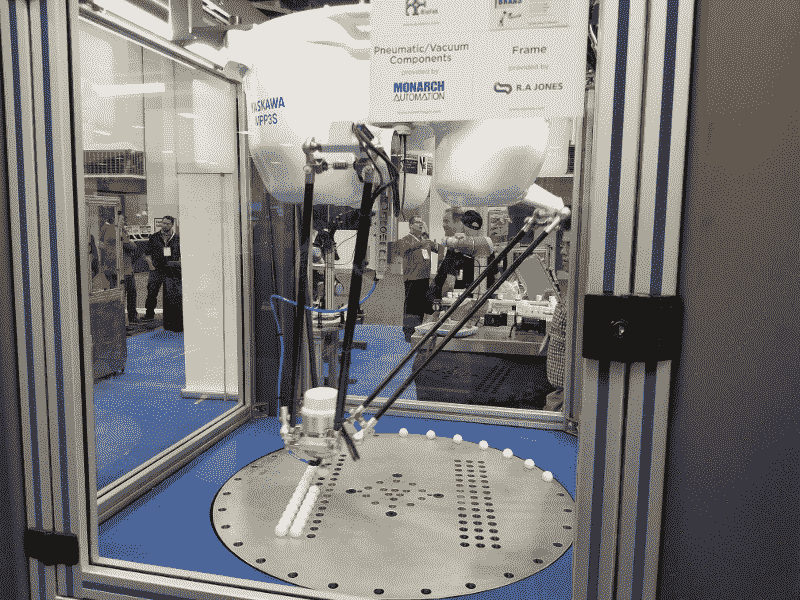
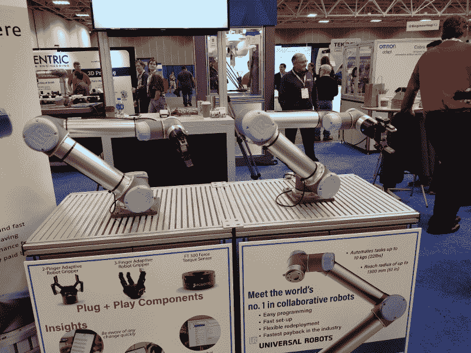

# 现成的黑客:赫德利机器人头骨间谍明尼阿波利斯

> 原文：<https://thenewstack.io/off-the-shelf-hacker-hedley-the-robotic-skull-spooks-minneapolis/>

上周，我和机器人头骨赫德利在明尼阿波利斯的[嵌入式系统会议上发表了我们的演讲](https://escminn.com/)。该活动融合了嵌入式计算、制造和医疗技术。估计有 5000 名与会者，以及 500 多家参展商。

Delta 机器人用大型伺服系统和 PLC 驱动装置在旋转台上堆积弹珠

展厅里到处都是各种各样的机器人手臂、微型印刷金属零件、制造机器和各种各样的小型自动化设备。嵌入式技术的过剩并不奇怪:明尼阿波利斯是制造业和医疗行业的中心，其中许多是地区性或地方性的。

双机械臂

我们自己的演示进行得相当顺利。赫德利的下巴随着我为他录制的脚本短语移动，他可以使用贴在我翻领上的[阿鲁科标记](https://docs.opencv.org/trunk/d5/dae/tutorial_aruco_detection.html)轻松地在舞台上跟踪我。LibreOffice Impress 对幻灯片的表现堪称完美。然而，我想用这个浏览器程序给赫德利一个通过他的 JeVois 机器视觉传感器看到的第一人称视角，但它不配合。我们最后只是回到 Q & A 来结束我们的会议。有几十名观众和一些关于赫德利建筑的问题。总的来说，我认为观众喜欢赫德利和他的故事。

我把笨重的华硕 Linux 笔记本电脑留在家里，用我的 Galaxy 8+手机收发电子邮件和通信。我真的没有太想念笔记本电脑。时间被压缩了，我在周二早上 7 点离开，周四晚上 8 点回到奥兰多的家中。反正没有太多时间摆弄笔记本电脑。我收集了一些新技术，读者会发现这些技术对他们下一次面向硬件的物理计算技术演讲很有用。

## 随身携带您的演出装备

去年 7 月，赫德利作为托运行李前往波特兰。这一次我把他升级到随身携带的状态，因为他必须在明尼阿波利斯参加演出。如果你的机器人助手没有通过你在底特律的中途停留(和换机)，你就不能做演示。

你怎么知道你的随身行李里有什么？

简单。只带你演讲需要的东西。把其他所有东西放在你的托运行李里。

在旅行的前一天，我做了一次全面的彩排，包括赫德利在他的三脚架上做手术。完工后，我简单地拿走了我排练用的所有设备，整齐地装进了赫德利的旅行箱，当然还有赫德利。零件清单包括 USB 集线器的壁式电源插座、Raspberry Pi 的壁式电源插座、三英尺长的 HDMI 电缆、罗技键盘/鼠标垫和三按钮有线遥控器。虽然我没有使用它，但我也把 10.1 英寸的液晶显示器、驱动板和一个 12 伏的小型壁式电源插座塞进了旅行箱。液晶面板在 12 伏电压下运行。也有地方放我的第五代蒸汽朋克会议徽章，一个微型键盘和一个双端口 2200 毫安的电源包。

把赫德利放在一个架子上是有意义的，这样观众在我们表演时就能清楚地看到他。我从 Goodwill 二手商店买了一个超轻的海报架，想做一个小支架，这样赫德利就可以坐在上面了。三脚架不适合放在他的随身箱子或我的托运包里。我想缩短海报架的腿，这样它就可以放进我的手提包里了。

结果是我用了我的旧相机三脚架。它足够短，可以放进我的行李箱，不需要任何改装。重量是一个问题，因为精神航空公司有 40 磅。免费托运行李。我把旅行的所有东西都装进了托运的包里，包括相机三脚架，然后把它拖到 Publix 超市前门的磅秤上，检查重量。总重量约为 30 磅。赫德利和他的手提行李称体重约为 15 磅，所以一切正常。如果三脚架在飞机行李中丢失了，赫德利可以一直坐在讲台上。

你可能会认为一堆电缆、一个机器人头骨和一个时髦的蒸汽朋克旅行箱会引起通过机场安检的注意。没有。我把赫德利放进他的箱子里，把装着我们礼帽的纸箱放在 x 光传送带上，一切顺利，没有一点动静。顺便说一下，这是双向的。也许是我剃得干干净净、剪短发、穿短裤和 t 恤的样子起了作用。世事难料。

总的来说，对于面向硬件的技术演讲，只需将演示所需的东西打包在一个随身携带的包中，以确保您可以进行展示。把其他东西都放在有轮子的格子包里。如果您的托运行李没有及时到达会场，您可以展示您的穿着。

## 舞台上的前舞台

我在开始前一个小时到达了指定的演讲地点。这个区域被称为“工程总部”，是会议厅一端的一个稍微凸起的平台。它有麦克风、讲台和小组讨论桌。观众坐在舞台前面。与在有门的房间里举行的常规会议不同，这个区域的两侧和后部都是开放的，因此与会者可以随意进出。

有一堵幕墙将工程总部区与相邻的展位隔开。我冒昧地把赫德利放在窗帘后面的三脚架上，以免打断我的谈话。我还把墙上的疣连起来，把赫德利的帽子戴在他头上。当我们的表演时间到来时，我只是拿起三脚架，赫德利在上面，把他放在舞台上，给他接上电源和 HDMI 接口。

我强烈建议在做技术演讲时，如果可能的话，提前准备好你的硬件和设备。

前一位演讲者花了很长时间，所以我只有大约五分钟的时间来准备一切。布莱恩，主板技术人员给我接上了麦克风，我们通过 HDMI 电缆测试了赫德利的声音。第一次尝试就成功了。我有点担心粗 HDMI 电缆，所以我们用胶带将它绑在三脚架上，以防止树莓 Pi 上的连接器变形。重新设计赫德利的电缆线路无疑已经提上了议事日程。

穿着戏服，尽可能接近你的真实演出环境，排练几次会指出问题所在，这是你无法预料的。它还会向你展示成功完成演示所需的最低要求。其他的一切都只是额外的重量，你必须四处搬运和担心。精简，同时尽可能涵盖可能的意外事件。

## 包裹

明尼阿波利斯之旅很成功，我认为观众们学到了一些关于如何用嵌入式物理计算技术构建机器人头骨的东西。赫德利表现不错，尽管我们仍然需要智能视觉传感器视频馈送的更稳健的操作。

解决物理计算设备问题的唯一可行方法是构建和测试。在观众面前测试当然会集中你的努力。排练，保持冷静，并有一些替代方案，以防事情败露。

那就做大或者回家。

*注意:嵌入式系统会议支付了 Torq 博士的酒店、机票和会议通行证费用。*

<svg xmlns:xlink="http://www.w3.org/1999/xlink" viewBox="0 0 68 31" version="1.1"><title>Group</title> <desc>Created with Sketch.</desc></svg>