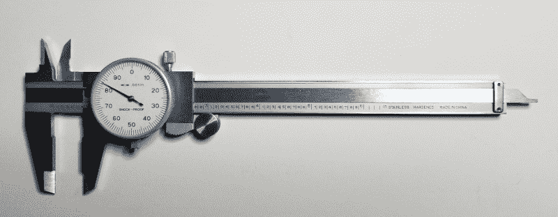
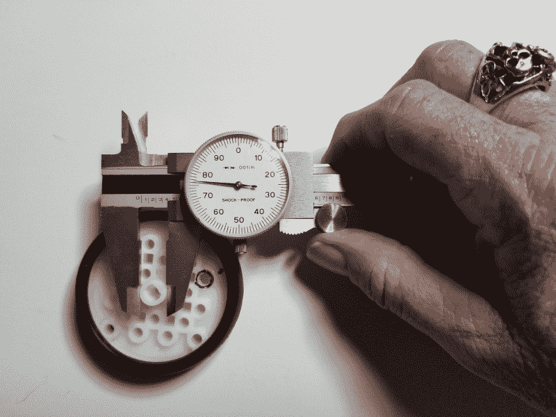
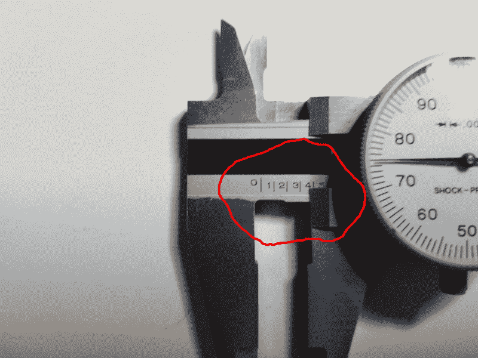

# 现成的黑客:如何使用表盘卡尺进行额外的精确测量

> 原文：<https://thenewstack.io/off-the-shelf-hacker-how-to-use-the-dial-caliper-for-extra-precise-measurement/>

现成的黑客肯定熟悉使用普通的日常卷尺测量零件。如果你做过任何制图或工程设计图，你也知道如何使用[工程师秤](https://en.wikipedia.org/wiki/Scale_ruler#Engineer's_scale)。这些对于测量精确到十分之几英寸的物体非常有用。如果你想测量千分之几英寸范围内的零件，比如制造几个 3D 打印零件，该怎么办？

没问题，只要给你自己一个刻度盘卡钳，它可以提供精确到微米的精度。

## 竖起拇指测量

刻度盘卡钳是一种滑动的 F 形工具，通常由硬化不锈钢制成，零售价约为 20 美元。它可以进行外部、内部和深度测量。测量时，一个小指轮调节工具的钳口，刻度盘显示最小的增量。Northern Tool 的 6 英寸型号多年来为我提供了良好的服务。12 英寸的型号也有售，价格约为 45 美元。

我的 6 英寸型号对于一般制造任务来说是一个很好的尺寸。它装在一个坚固的塑料盒里，里面有保护性的贴身泡沫。不用的时候，卡钳应该放在箱子里，这样它就不会掉落、摔坏或弯曲。

6 英寸刻度盘卡钳

在过去十年左右的时间里，我定期在项目中使用这个工具。最近，我想安装一些定制尺寸的齿轮，给机器人头骨[赫德利](/off-the-shelf-hacker-conversations-with-hedley-the-robotic-skull/)增加新的功能。百分表是测量开槽电机轴、样本齿轮厚度和轮毂直径的完美工具。千分之五或千分之十英寸的精度足以满足我的树脂 3D 齿轮打印需求。人类头发的平均厚度约为千分之四英寸。光线只能以千分之四的速度穿过卡钳钳口的缝隙。

## 内部、外部和深度

当然，我们想要可重复的精度，所以首要任务是“归零”卡尺，以调整任何潜在的磨损。我通常用右手拿着工具，拇指压在底部的拇指轮上。从稍微松开卡钳顶部的锁紧螺钉开始，将滑块(钳口)一直移动到关闭位置。现在，非常轻微地松开刻度盘底部的锁紧螺钉。旋转刻度盘，使指示器指针与零点对齐，然后将底部锁紧螺钉拧紧。前后移动滑块，指针将围绕刻度旋转。完全关闭时，它应该归零。尽管你应该不时地检查一下，但你不应该再把刻度盘归零。

测量外径

进行外部测量是非常自然的。逆时针转动指轮，张开钳夹，使其适合您想要测量的对象。试着握住垂直于物体的卡尺，顺时针转动指轮，轻轻关闭钳夹。这将需要一点实践，以了解如何在拇指轮上施加正确的压力，同时扭动卡钳，以找到尽可能最小的测量值。观察刻度盘上的最低数字。确保您还使用了钳夹的末端或平面部分，而不是靠近滑块的卸荷区。

一旦获得最小的读数，轻轻拧紧顶部的锁紧螺钉，将滑块固定在当前读数上。小心地将测径器从物体上取下，查看载玻片上的测量值。

斜面刻度边缘和测量标记

刻度盘左侧的斜面刻度边缘显示英寸和千分之一英寸的测量值。例如，如果边缘在幻灯片的前 3 和 4 之间，则内部尺寸将在 0.300 和 0.400 英寸之间。如果表盘上的指针指向 75，你可以把它加到线性数字上，得到 375 千分之一或 0.375 英寸。将钳口打开到第一个大的钳口，指针在零上，我们将有 1.000 英寸。在这张幻灯片上，整英寸的数字是从 0 到 6，中间的数字是十万分之一。

内部测量的处理方式类似。内爪在顶部，比底部的外爪小得多。这一次关闭卡尺，并确保表盘读数为零。将内侧夹爪插入您想要测量的间隙。现在逆时针旋转拇指轮来张开内侧的下颚。再次，稍微摆动工具，寻找刻度盘上的最大读数。拧紧顶部锁紧螺钉，从间隙中抽出卡钳夹爪。读取刻度读数，并将其添加到刻度盘读数中，以进行最终的内部测量。

最后，使用幻灯片的末端可以方便地测量深度。假设你想测量一块金属上的一个盲孔。只需在孔的边缘上平衡滑块外侧部分的末端，逆时针移动指轮以延伸可移动滑块的内侧部分，直到其在孔中降至最低点。拧紧顶部锁紧螺钉，像往常一样读取测量值。

[https://www.youtube.com/embed/4eCtp2oka2M?feature=oembed](https://www.youtube.com/embed/4eCtp2oka2M?feature=oembed)

视频

## 符合标准

使用一个刻度盘测径器就差不多了。如果你温柔地对待这个工具，把它放在盒子里，它会用一辈子。对于许多精确的测量功能来说，这是一笔非常小的投资。

现在是困难的部分。将所有这些测量数据转换成 CAD 模型，用于 3D 打印或计算机数控制造。我正在用 FreeCAD 进行我的 3D 建模和齿轮设计。它在旧的华硕双核 Linux 笔记本上运行良好，并具有许多有用的工程功能。逆向工程和空白板零件设计本身就是一门艺术和科学。我们将沿着[现成的黑客](/tag/off-the-shelf-hacker/)之路来看这些主题。

*赶【Torq 博士的 [现成黑客专栏](https://thenewstack.io/tag/off-the-shelf-hacker/)，每周六，只上新栈！在[doc@drtorq.com](mailto:doc@drtorq.com)或 407-718-3274 直接联系他咨询、演讲出场和委托项目。*

<svg xmlns:xlink="http://www.w3.org/1999/xlink" viewBox="0 0 68 31" version="1.1"><title>Group</title> <desc>Created with Sketch.</desc></svg>