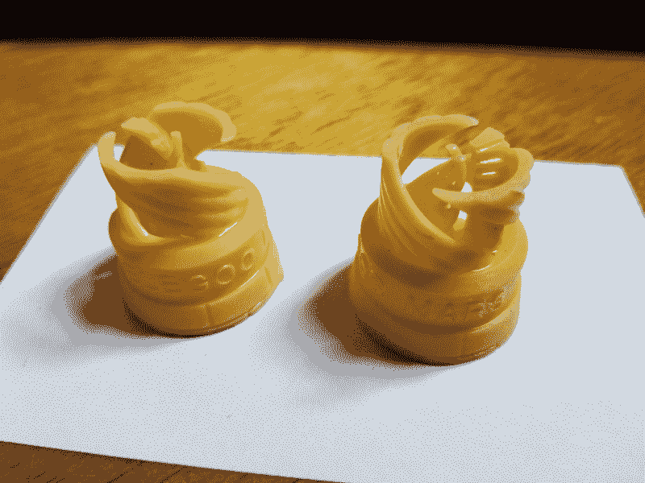
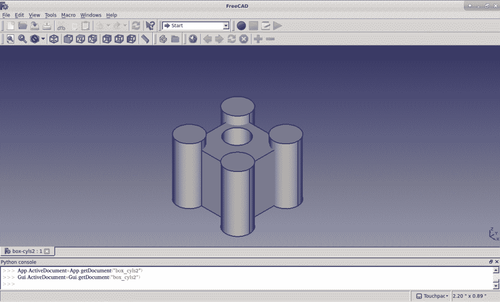
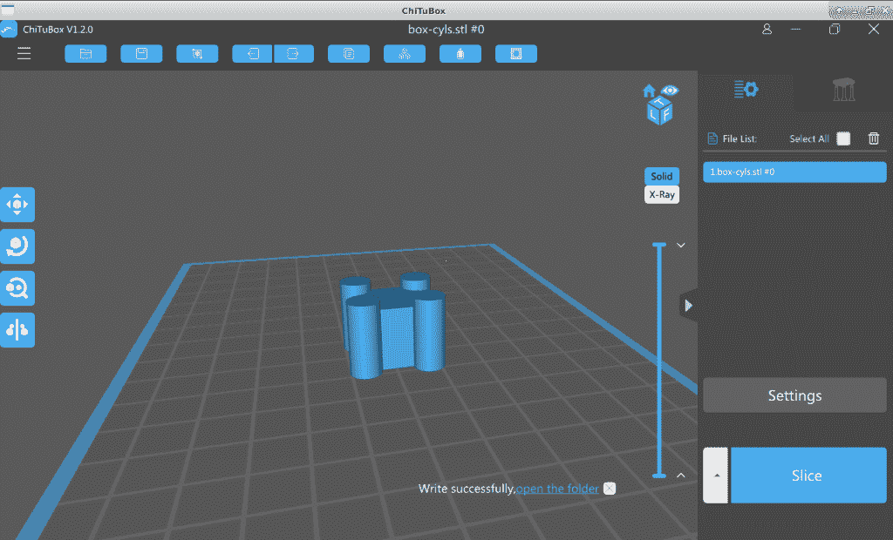
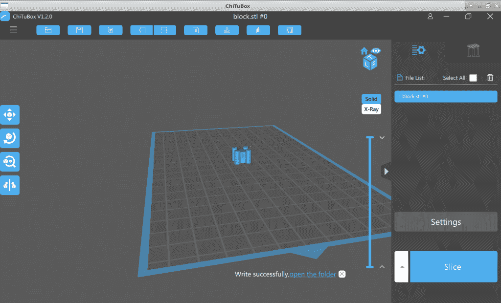
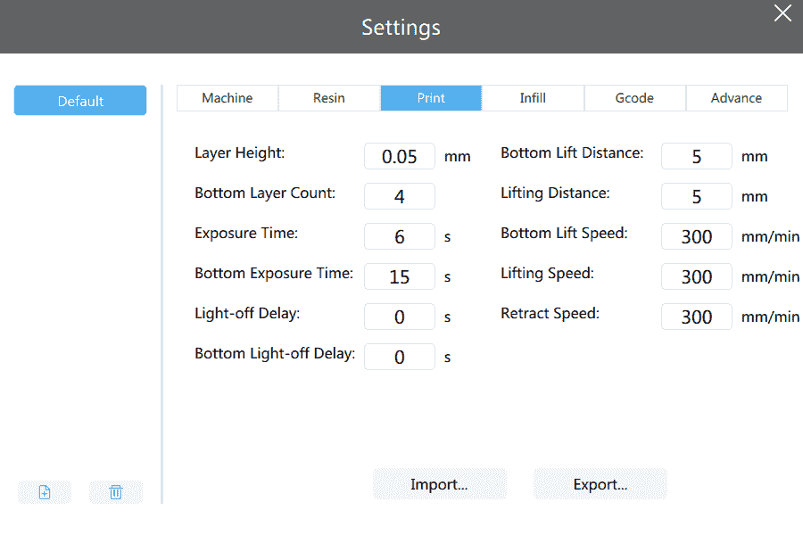
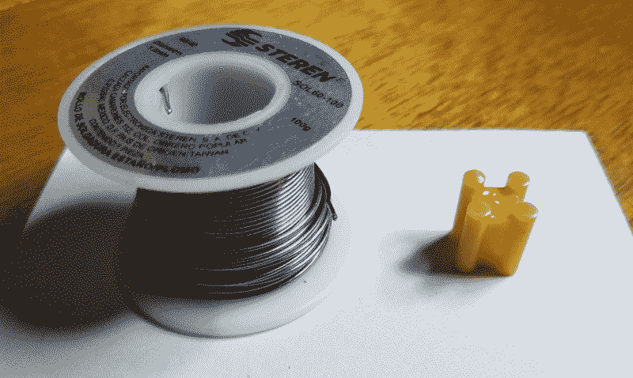

# 现成的黑客:用树脂 3D 打印机制造零件

> 原文：<https://thenewstack.io/off-the-shelf-hacker-making-parts-with-a-resin-3d-printer/>

现成的物理计算使用微控制器、传感器、网络、各种工具、Linux 和设计思维来构建完成有趣工作的小工具。在设计愉快的用户体验时，美学、机制和产品包装当然也是需要考虑的重要方面。软件开发人员努力构建出色的屏幕界面。[现成的硬件](https://www.thenewstack.io/tag/Off-The-Shelf-Hacker)黑客用物理小发明做同样的事情。

Elegoo 最近给我发了一台他们新的树脂 3D 打印机来评测。3D 打印机能够制造支架、齿轮、外壳和一系列装饰性和功能性的物理部件。树脂印刷使用紫外线(UV)光固化桶中的液体，用液晶显示器(LCD)掩盖，在每层上形成形状。

这很好，因为我想将专栏扩展到新的领域，帮助现成的黑客创建他们的物理计算项目。我也有一个新的模块化蒸汽朋克会议徽章的计划，它将被折断并粘在一起。

今天我们将快速浏览一下在 Elegoo Mars 打印机上运行打印。

## 首先，打印一个测试部件

测试打印机最简单的方法是使用包装盒内存储卡上的型号。这个零件是一个 3 英寸高、1 英寸直径的棋子。

设置打印机非常简单。拆箱后，我运行平台到底部位置，并确保它与树脂缸的底部对齐。接下来，我摇了摇树脂瓶，小心翼翼地将大桶装满大约三分之一。接下来，我将存储卡插入机器背面的 USB 插槽，选择“打印”，并从前置触摸屏调出打印示例。快速按下右箭头按钮开始打印操作。

一件很酷的事情是，当它在印刷品上向下移动时，触摸屏显示了面具的小图片。它还显示了层数、正在打印的层、总打印时间和已用时间。印刷品实际上有两个相同的棋子并排。

测试片的预计打印时间为 4 小时多一点。它运行了大约两个小时，我才停止打印。它看起来很好，所以没有必要进行到最后。

1/2 印刷测试棋子

## 打印真实零件

[Thingiverse](https://www.thingiverse.com/) 有一堆你可以下载和打印的预建模型。或者，您可以使用计算机辅助设计(CAD)程序从头开始创建您的模型。

我选择使用来自 [Freecad](https://www.freecadweb.org/) 的标准示例零件。

Freecad 在盒筒零件建模中的应用

Freecad 是众所周知的参数建模器。你不仅可以图形化设计 3D 零件，还可以改变参数(长度、尺寸、角度等。)并且模型将根据需要重新计算。它有一个内置的渲染器，所以你可以看到你的模型在现实生活中的样子。它还可以处理许多不同的图形文件格式。我导出了一个。stl 文件，然后进行 3D 打印处理。为打印准备 3D 模型是切片器的工作。

## 分割您的模型

你必须运行。stl 文件通过切片机，然后才能运送到打印机。

切片器生成用于打印的图层文件。树脂打印机不同于传统的细丝 3D 打印机，因为它在树脂缸中一次打印一整层，而不是引导热端挤出机穿过 X-Y 横截面图案，一次一层。

树脂打印机可以创建令人惊讶的细节打印，几乎没有层线。橡胶手套、眼睛保护和良好的通风很重要，因为树脂可能有毒。

ChiTuBox 切片机应用程序主屏幕

我下载并安装了用于 Linux 64 位机器的 ChiTuBox slicer 程序。还提供其他操作系统的版本。Elegoo 也在附带的 SD 卡上提供该程序。

接下来，我点击“打开文件”按钮(左上角的按钮)，将我的 box-cyls.stl 文件拖入程序中。

载入切片程序后的 Freecad 零件

零件弹出到网格上，我可以用“ctrl-鼠标左键”组合来移动视图。您可以用鼠标滚轮放大/缩小零件。

零件很小，所以我用屏幕左边的“圆形立方体”按钮调出尺寸菜单。此菜单允许您更改 X、Y 或 Z 方向的零件尺寸。我把 Z 尺寸设为 30 mm 左右。

然后我点击“设置”按钮，然后点击“打印”标签来检查数值。

打印机设置屏幕

您可以调整许多值来优化打印。我只是用默认的。我还单击了“Machine”选项卡，并将“mirror”设置更改为“DLP_normal”。快速点击右上角的 X，我回到了主程序屏幕。

最后一项任务是点击右下角的“切片”按钮，将模型切割成层。这个过程大概用了 10 秒钟。弹出一个状态屏幕，我可以点击“导出”并将结果发送到一个文件中。我称之为“box-cyls ”,扩展名为. cbddlp。

文件写完后，我把它复制到一个 u 盘上，然后把它插到打印机上，生产出实际的零件。零件的打印时间略多于一小时。

## 结果

结果相当不错。这里有一张该器件的图片，旁边是一卷焊料，以供比较。

靠近一卷焊料的 Freecad 零件

细节非常好，边缘干净，几乎没有层次感。

请注意，未固化的树脂被认为是有毒的，处理时应戴上手套、护目镜并保持通风。有关树脂打印机注意事项的更多信息，请访问网络。你可以用 99%的酒精清洗零件，然后把它们放在阳光下几分钟，让它们完全固化。

所以你有它。快速浏览用树脂打印机打印零件。随着我对这项技术的经验越来越多，我将更详细地介绍如何在物理计算项目中使用这台机器。我们还将使用 Freecad 程序深入研究 3D 建模。

<svg xmlns:xlink="http://www.w3.org/1999/xlink" viewBox="0 0 68 31" version="1.1"><title>Group</title> <desc>Created with Sketch.</desc></svg>