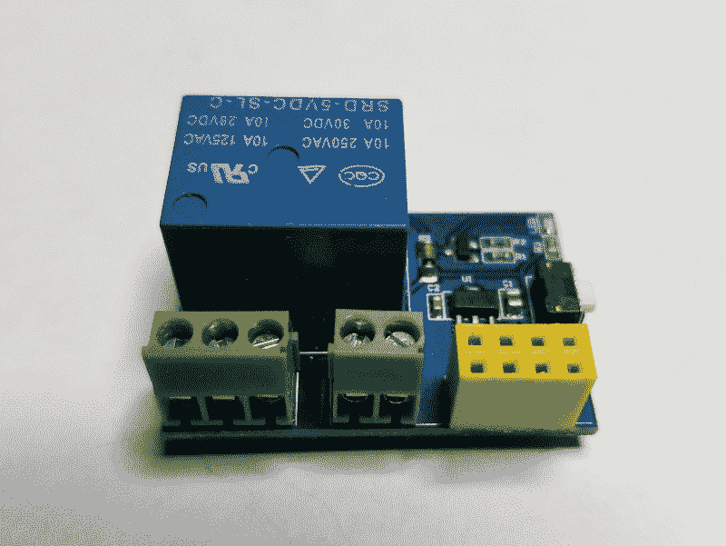

# 现成的黑客:使用 MQTT 的微控制器无线消息传递

> 原文：<https://thenewstack.io/off-the-shelf-hacker-microcontroller-wireless-messaging-with-mqtt/>

我最初构建后院传感器的计划是使用 ESP8266 model 01 无线收发器和匹配的中继板以及无源红外(PIR)设备来检测悄悄经过的温暖物体。我甚至订购了一个单通道继电器板，可以安装微型 ESP8226 和一个 USB 编程器，可以用于刷新固件。

唉，我一直无法让 USB 编程板工作，所以在 01 微控制器上安装固件是一件痛苦的事情。我还忘记了 8266-01 只有两个半可用的通用 I/O (GPIO)引脚。一个用于继电器，另一个用于重置处理器或类似的东西。

对于室外传感器设备，稍大的 NodeMCU 板是更好的选择。该板有大量引脚，只需一根 USB 电缆即可轻松编程。他们每个不到 5 美元。

我们上周讨论了如何将 [PIR 传感器连接到 NodeMCU](/off-the-shelf-hacker-build-a-sensor-system-to-watch-the-backyard/) 无线模块。本周我们将查看代码，它现在合并了 MQTT 消息传递和一个简单的变通方法，将单通道中继板(为 ESP8266-01 设计)与 NodeMCU 一起使用。

## 编码细节

代码从一般的变量、库设置和初始化开始。我们只需要特定于 8266 的 WiFi 和 MQTT 客户机(PubSubClient)的库来使代码工作。

```
#include &lt;ESP8266WiFi.h&gt;
#include &lt;PubSubClient.h&gt;

const char*  ssid  =  "mynet";
const char*  password  =  "123eieio";
const char*  mqtt_server  =  "192.168.5.20";

WiFiClient espClient;
PubSubClient client(espClient);
long lastMsg  =  0;
long lastInput  =  0;
char msg[50];
int value  =  0;

int inputPin  =  10;
int val  =  1;
int calibrationTime  =  5;

void setup_wifi()  {

delay(10);

Serial.println();
Serial.print("Connecting to ");
Serial.println(ssid);

WiFi.begin(ssid,  password);

while  (WiFi.status()  !=  WL_CONNECTED)  {
delay(500);
Serial.print(".");
}

randomSeed(micros());

Serial.println("");
Serial.println("WiFi connected");
Serial.println("IP address: ");
Serial.println(WiFi.localIP());
}

void callback(char*  topic,  byte*  payload,  unsigned int length)  {

if  ((char)payload[0]  ==  '2')  {
digitalWrite(16,  LOW);  // Turn the LED on (Note that LOW is the voltage level
digitalWrite(5,  HIGH);
Serial.println("LED on");
// but actually the LED is on; this is because
// it is acive low on the ESP-01)
}  else  {
digitalWrite(16,  HIGH);  // Turn the LED off by making the voltage HIGH
digitalWrite(5,  LOW);
}

}

void reconnect()  {
// Loop until we're reconnected
while  (!client.connected())  {
Serial.print("Attempting MQTT connection...");
// Create a random client ID
String clientId  =  "ESP8266Client-";
clientId  +=  String(random(0xffff),  HEX);
// Attempt to connect
if  (client.connect(clientId.c_str()))  {
Serial.println("connected");
// Once connected, publish an announcement...
client.publish("mqtt",  "starting");
// ... and resubscribe
client.subscribe("inTopic");
}  else  {
Serial.print("failed, rc=");
Serial.print(client.state());
Serial.println(" try again in 5 seconds");
// Wait 5 seconds before retrying
delay(5000);
}
}
}

void setup()  {
pinMode(16,  OUTPUT);  // Initialize the BUILTIN_LED - GPIO16 pin as an output
pinMode(2,  OUTPUT);
pinMode(5,  OUTPUT);
pinMode(inputPin,  INPUT_PULLUP);  // declare sensor as input
digitalWrite(16,  LOW);
delay(1000);
digitalWrite(16,  HIGH);

Serial.begin(115200);
setup_wifi();
client.setServer(mqtt_server,  1883);
client.setCallback(callback);

// Calibrate sensor
Serial.print("calibrating sensor ");
for(int  i  =  0;  i  500){
Serial.println("Motion detected!");
client.publish("mqtt",  "M1");
}
lastInput  =  now;
}
else  {
// Serial.println(val);
digitalWrite(2,  1);
}
}

```

接下来是连接到我的无线接入点。当然，您将使用自己的 SSID、用户名和密码。WiFi.begin()函数启动无线网络接入。

之后是回调。它根据 MQTT 客户端代码接收的消息来切换 D1 (GPIO 16)引脚的开和关，MQTT 客户端代码在程序的设置部分初始化。每当消息进入 MQTT 客户机时，程序就会跳出主循环，执行回调中的代码。完成后，它会跳回原来的位置并继续。通过向 MQTT 代理上的“inTopic”主题发布“0”或“1”来切换中继。

自然，MQTT 代理需要运行在网络上，MQTT 客户机也需要运行在 NodeMCU 上，这样整个事情才能正常工作。我在我的 Linux 笔记本上使用了 [Mosquitto 服务器](https://mosquitto.org/)(代理)进行测试。不久的某个时候，我将在备用的 Raspberry Pi 克隆上安装一个永久的 MQTT 代理，为洒水控制器和庭院传感器发送消息。

处理 PIR 传感器输入和发送 MQTT 消息是项目中最具挑战性的部分。

PIR 传感器的工作原理是实际比较两个内部热传感器。当一个物体在设备前面移动时，第一个传感器将从人或动物那里获得热量。一瞬间后，第二个传感器也将检测到热量，电子设备将记录两个传感器之间的差异。该设备的前面有一个塑料镜头，可以扩大视野。因此，当有东西在传感器前面移动时，你会得到连续 5 或 10 次的快速“点击”。8266 芯片肯定足够快来接收所有这些点击。

我们绝对不需要在 PIR 传感器每次跳闸时检测和发布 10 或 20 条 MQTT 消息。我们只需要每几秒钟发一条信息。

我的解决方案是发布最初的“有人在这里”MQTT 消息，然后测量连续传感器“命中”之间的时间。如果我们在一定时间内收到另一个输入，在本例中是 500 毫秒，只需忽略它并继续循环，直到没有新的输入被检测到。然后等待下一次“击中”，并通过计时循环，再次一遍又一遍。

在整个过程中，我们可能还会收到一条信息来启动继电器。我任意选择了一个“2”代表开，一个“0”代表关。继电器将为几盏 120 伏的泛光灯供电。泛光灯将在收到 MQTT 经纪人的“2”信号时打开。

代码运行后，让我们看看中继板。

## 黑进中继板

我对如何使用带有 NodeMCU 的 8266-01 模型中继板感到困惑和不解。然后我突然想到。只需用一个 NodeMCU 引脚代替 01 器件。你好…这就是为什么我们称之为现成的黑客专栏。

继电器板如下所示。



ESP8266-01 的单通道继电器板

在更新固件后，我们通常会将 ESP8266-01 板插入黄色连接器。相反，我只是在 NodeMCU 板上的 D1 引脚(GPIO 16)和黄色连接器上的 0 引脚之间做了一个跳线。这对应于 ESP8266-01 板上的 GPIO0。继电器逻辑连接到 GPIO0 引脚。查看端子在顶部的继电器板(继电器在底部)，GPIO0 引脚在底部一行，黄色连接器上左起第二个。当这个装置被固定在一个防风雨的盒子里时，我会在插座里插上一个插销。

当然我们也要把+5 伏和地接到继电器板上才能供电。由于该项目仍处于原型阶段，我只是将它们连接到 NodeMCU 试验板上的现有电源轨。NodeMCU D1 引脚然后根据代码切换开/关，以启动继电器。

很管用。

## 后续步骤

我正稳步走向在我的房子周围部署一系列 MQTT 连接的庭院传感器。下一步是将电子设备装入防水盒中，并将其连接到室内电流和泛光灯上。我在想，所有的东西都可以整齐地装进一个标准的圆形塑料插座盒里。PIR 传感器也必须防水并安装在盒子上。

在不久的将来，寻找一个关于院子报警传感器的综述。

<svg xmlns:xlink="http://www.w3.org/1999/xlink" viewBox="0 0 68 31" version="1.1"><title>Group</title> <desc>Created with Sketch.</desc></svg>