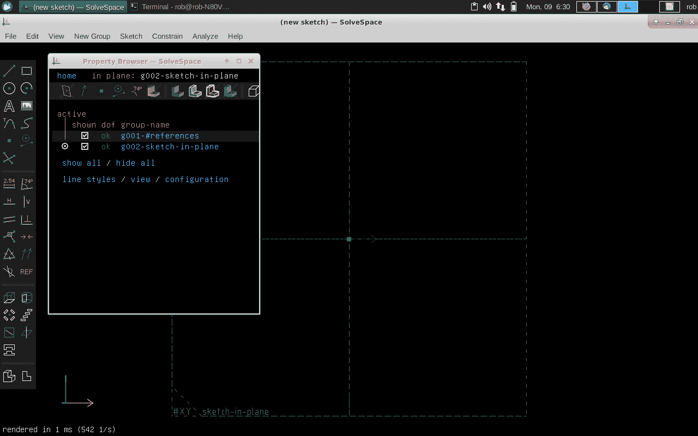
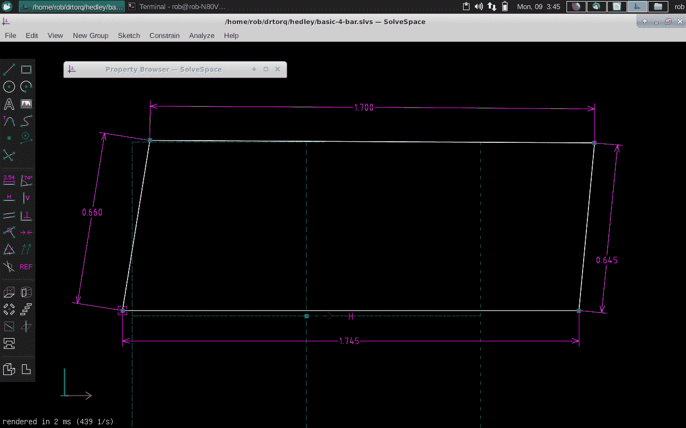
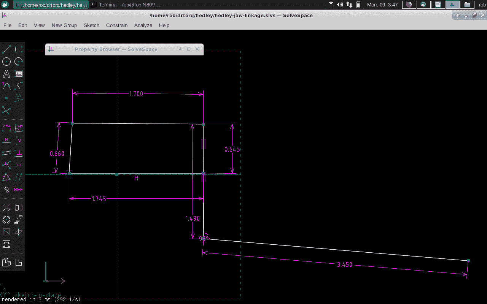

# 现成的黑客:用 SolveSpace 模拟你的机制

> 原文：<https://thenewstack.io/off-the-shelf-hacker-model-your-mechanisms-with-solvespace/>

我们喜欢我们的工具，在[现成的黑客](/tag/Off-The-Shelf-Hacker)。钻床、螺丝刀、烙铁和任何电动或手动工具都是将一次性物理计算设备带入现实的一部分。

我们还使用软件工具，如编程语言、Linux、交互式开发环境(Arduino IDE)和各种利基桌面应用程序。

然后是更奇特的以工程为中心的计算机辅助设计工具，如 [SolveSpace](http://solvespace.com/index.pl) 。这个程序帮助你模拟你的机制，看看你的设计是否如你所想的那样运行。您还可以在构建模型时模拟模型，并调整各种参数以在您的小工具中获得所需的操作。

SolveSpace 是一个相当简单易用的程序，它将向您展示您的机械设备在现实世界中的表现。我喜欢它，因为它是最基本的，你不需要学习一堆额外的图形相关的主题，只是为了看看你的设计可能如何工作。

今天，我们将看看赫德利，我的机器人头骨的[颚机构](/off-the-shelf-hacker-hedley-the-robotic-skull-speaks/)，看看它是如何在 SolveSpace 中工作的。

## 装置

在 Linux 笔记本上安装 SolveSpace 非常简单。在命令行中，首先将 SolveSpace 存储库添加到 apt 软件存储库列表中。

`sudo add-apt-repository ppa:alex-p/solvespace`

接下来，使用 update 选项运行 apt-get，以确保所有的存储库都是最新的。

`sudo apt-get update`

进行安装。

`sudo apt-get install solvespace`

最后，在终端的命令行中运行程序。

`solvespace`

初始 SolveSpace 全屏显示

该程序将从一个空白的施工显示屏开始。工具栏将位于左侧边缘，浮动属性浏览器窗口位于屏幕的左上角。使用窗口右上角的小向上箭头最小化属性浏览器。

## 建立一个基本的四连杆机构

[四连杆机构](https://en.wikipedia.org/wiki/Four-bar_linkage)是工程中常见的机构。它由四根用铰链连接在一起的杆组成。同一连杆上的两个点通常被固定在某个固体上，如地面或主机器人框架。然后将两个链接固定到锚定的链接。这些连杆的另一端可以自由移动。将这些自由移动的连杆末端与另一个连杆连接起来，就得到一个四杆机构。它们可以在二维(2D)或三维(3D)中操作。这次我们将把讨论限制在 2D。四杆可用于转换运动、增加/减少杠杆作用或保持几个连杆平行。

赫德利的四连杆机构将伺服电机的旋转运动转化为他说话时开合下巴的动作。我用[卡尺](/off-the-shelf-hacker-how-to-use-the-dial-caliper-for-extra-precise-measurement/)来测量连杆和枢轴点之间的距离。我没有把赫德利完全分开，所以我尽可能仔细地观察了它的价值。它们在大约千分之五十英寸的范围内。

赫德利四连杆模型

在 SolveSpace 中构建模型遵循传统的计算机辅助设计(CAD)概念，使用线、圆、框、点等。可用元素显示在左侧的工具栏中。

你实际上可以在一次操作中画出所有四个链接。选择工具栏左上角的“线段”框。然后移动到显示空间并左键单击第一个点。将光标垂直向上移动约 1/2 英寸，然后左键单击第二个点。水平移动大约 1.5 英寸，然后左键单击第三个点。垂直向下移动大约 1/2 英寸，然后左键单击第四个点。最后，向左移动，回到起点，并再次左键单击以完成模型。

现在，如果你上去抓住上面的一个点并移动它，随着你用鼠标移动，两条线会改变长度。为了让这个模型表现得像一个四连杆机构，我们需要添加一些约束。

左键单击联动装置的左下角。选择窗口顶部的约束菜单，并在拖动的地方选择**锁定点这将在空间中锚定该点。高亮显示下面的水平线，回到约束菜单，选择“**水平**”这个动作会将线条锚定在水平方向。现在，高亮显示左边的垂直线，转到约束，这次选择"**距离/直径**"这将设置链接的长度。双击标注值，将其更改为 0.660 英寸。对其他三个链接执行相同的"**高亮和约束/距离**"过程。使用上面四格图中的值。您可以突出显示尺寸并拖动它们，以使模型不那么杂乱并更易于阅读。**

现在模型被约束，抓住左上点并移动它。右上点应该与左点一致地移动。在这个模型中，左边的垂直链接代表赫德利的伺服臂，而右边的垂直链接代表他的下颚枢轴臂。更改其中一个链接值，并观察机构的运动如何变化。

您也可以在点移动时追踪它。突出右上角的点。现在进入**分析**，选择**跟踪点**移动链接，看它跟踪路径。进行包装分析，点击**停止追踪**停止追踪。这个模型只是描绘了一个弧线。更复杂的复合机制会产生有趣的圆形痕迹。

下图显示了代表下颚枢轴的延伸下部和他的下颚(向右延伸)的链接。

具有枢轴和颚延伸部的赫德利四连杆机构

在现实生活中，从赫德利头骨的右侧看，最右边的端点是他的下中门牙。这是他的下巴模型的视频。

[https://www.youtube.com/embed/k7lwq3iXwDU?feature=oembed](https://www.youtube.com/embed/k7lwq3iXwDU?feature=oembed)

视频

## 包裹

我们仅仅触及了 SolveSpace 建模机制的表面。熟悉这个程序，我想你会发现在切割、钻孔和组装最初的工作原型之前，通过模拟你的机械装置来节省时间的有用方法。

*赶【Torq 博士的 [现成黑客专栏](https://thenewstack.io/tag/off-the-shelf-hacker/)，每周六，只上新栈！在[doc@drtorq.com](mailto:doc@drtorq.com)或 407-718-3274 联系他进行咨询、演讲和委托项目。*

<svg xmlns:xlink="http://www.w3.org/1999/xlink" viewBox="0 0 68 31" version="1.1"><title>Group</title> <desc>Created with Sketch.</desc></svg>