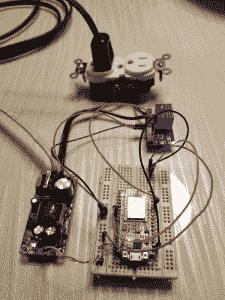
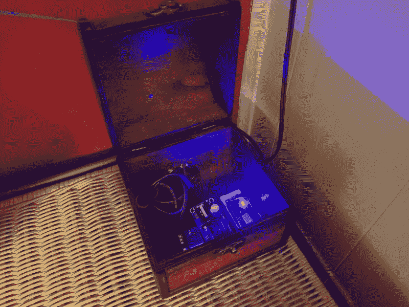

# 现成的黑客:蒸汽朋克和科技时代

> 原文：<https://thenewstack.io/off-the-shelf-hacker-of-steampunk-and-tech-time/>

黄色的纸标牌带着我在布满摊位的露天建筑上方的草地上走来走去。我停好车，穿上细条纹背心、大礼帽和树莓派蒸汽朋克会议徽章，然后下山去参加活动。

在那里，几十个小贩展示了各种各样的仪表、阀门、小发明和待售的维多利亚服装。人们穿着短裤、苏格兰短裙、紧身胸衣和皮衣四处走动，度过美好时光。一些人甚至挥舞着装饰华丽的射线枪。每个人都彬彬有礼，正如你在这样的活动中所期待的那样。世界著名的 Cog Is Dead 乐队在附近的草地上的舞台上演奏。尽管天气很热，但在伦宁格的蒸汽朋克工业展度过一个阳光灿烂的周日下午还是很有趣的。

我此行的一个原因是想看看有多少现成的技术已经移植到蒸汽朋克生态系统中。你可能会认为，蒸汽朋克工业展中明显开明的艺术家和工程师会全心全意地利用现代电子设备和现成零件的魔力，为他们激进的未来主义创作带来酷炫的想象力。

正如我所怀疑的，展会上有相当多的技术，只是从大约一百年前开始的。

## 难对付的人

尽管经过 10 到 15 年的稳步发展，用现成的微控制器、传感器和致动器实现自动化，同时使其变得有用，仍然是一项相当困难的任务。

佛罗里达中部乡村的蒸汽朋克工业秀并不是一个孤立的案例。

摩根·豪斯尔最近写了一篇名为“[为什么新技术很难推销](https://www.collaborativefund.com/blog/tech/)”的文章，对这种情况给出了深刻的见解。

Housel 概述了新技术通常需要一段时间才能融入主流的六大原因。总结:

1.这项技术还没有准备好迎接黄金时代。
2。保守派希望保持现状，反对新的竞争。
3。人们不喜欢被告知老方法不如新方法好。
4。新技术带来新文化，所以老年人可能会认为这是社会的衰落。
5。这是一直以来的做法，而且效果很好。
6。新技术需要想象力和思维。

随着我们向世界推出我们的项目和发明，大多数现成的黑客都经历过这些问题。

Alexa 语音控制部件

第一和第六对我来说很突出。

“还没准备好迎接黄金时间”的一个很好的例子可能是我的 [Alexa 今年早些时候指挥的 ESP8266 light 项目](https://thenewstack.io/off-the-shelf-hacker-control-your-home-projects-with-amazon-alexa/)。该设备是一个 NodeMCU 板(ESP8266-12e 型号)，连接到一个电源和一个继电器板。8266 固件包括连接到我的家庭网络的说明，并能够通过我桌子上的亚马逊点从亚马逊云获得命令。

如图所示，这个小玩意在我家客厅的桌子上放了一个月。黄金时段准备好了吗？在我看来不是，尽管你必须从某个地方开始。插座上的 110 伏端子暴露在外，整个作品妨碍了桌子上的任何活动。

当电子设备工作时，阻碍进步的是外壳。我和妻子花了几周时间才就存放零件的箱子达成一致。我们最终发现了一个有趣的小蒸汽朋克百宝箱看起来有铰链盖的盒子。这是一个简单的填充部件的事情，给输入线加一个插头，然后把另一端接到顶灯上。盒子谦逊地放在角落里的一个小架子上，不碍事。

Alexa 语音控制盒

那时它准备好黄金时间了吗？也许吧。

当我插上这个小发明的电源后，有趣的事情发生了，当时它还在桌子上，我向家人展示了它是如何工作的。我告诉他们使用“Alexa，打开家庭活动室的灯”来打开，并使用类似的行来关闭它。

几天后，整个家庭可以毫无问题地开关电灯。甚至一个不和我们住在一起的家庭成员在来访时也开始使用语音控制。现在对每个人来说都很自然。如果你对着餐厅里的圆点大喊大叫，它甚至会起作用。

这项技术已经退居幕后，我们家的人已经接受它成为他们的日常事务。那么，到底什么时候准备好黄金时段？这是一个同样棘手的问题。

[https://www.youtube.com/embed/91KQCIbnoIA?feature=oembed](https://www.youtube.com/embed/91KQCIbnoIA?feature=oembed)

视频

## 坚持下去，最终可能会实现

在蒸汽朋克秀上，现代科技并没有完全失去一切。当我四处走动时，我碰到了与物理计算相关的“想象”和“思考”。

在见到马特后，他是不对称创作公司展台的所有者，他热情地看着我在 T2 展示我的蒸汽朋克会议徽章。他听说过 Linux 和 Raspberry Pi，对我在显示器上播放的触摸屏和老式宣传视频印象深刻。他问了几个恰当的短语问题，所以我知道我们在谈论相同的波长。

另一个戴着木髓头盔的小贩向我展示了他的一顶漂亮的定制皮制礼帽，顶部有几根位置巧妙的 LED 灯串。我问他是否有计划使用 Arduino 来制作灯光动画。他说他正在考虑，尽管他担心增加的重量。

最后，页面顶部的特征图像显示了一台电报机。这位白发苍苍的老发明家早年曾是一名电报员。他建造了这台机器作为展示品，它已经在一些博物馆展出。他只是想教育年轻人，确保旧技术不会消失在历史中。工艺太棒了。

好的一面是，所有这些极富创造力的蒸汽机车都运用了一点额外的想象力，考虑当前的技术可能如何让他们的产品和业务变得更好。

在这些活动中，奇怪的、不寻常的、完全怪异的事情是意料之中的。对我来说，蒸汽朋克人群并不真正喜欢将伺服系统、步进器、超声波传感器和微控制器集成到他们的设计中，这有点自相矛盾。作为一个局外人，一个推销物理计算设备的工程师，和这些创意人员在一起，感觉有点奇怪。我想总得有人去做。我已经习惯了。

我能说的另一件事是，我看到类似的事情在不同程度上发生在机器人俱乐部、创客空间和技术会议上。可用、易于编程的微控制器才出现了大约十年，让我们面对现实吧，在许多看似复杂的主题和技能组合中，有一个相当广泛的学习曲线。

然而，随着人们习惯了这项技术并开始意识到它，我认为这将是一件好事。作为一名现成的黑客，承诺和坚持是非常重要的品质。

继续传播消息，给它多一点时间。

在[doc@drtorq.com](mailto:doc@drtorq.com)或 407-718-3274 联系[现成技术](/tag/Off-The-Shelf-Hacker)咨询、演讲出场、委托项目。

<svg xmlns:xlink="http://www.w3.org/1999/xlink" viewBox="0 0 68 31" version="1.1"><title>Group</title> <desc>Created with Sketch.</desc></svg>