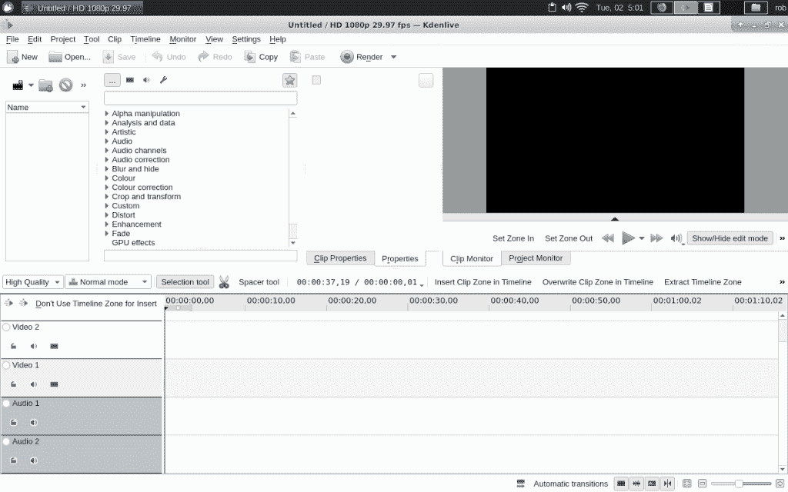
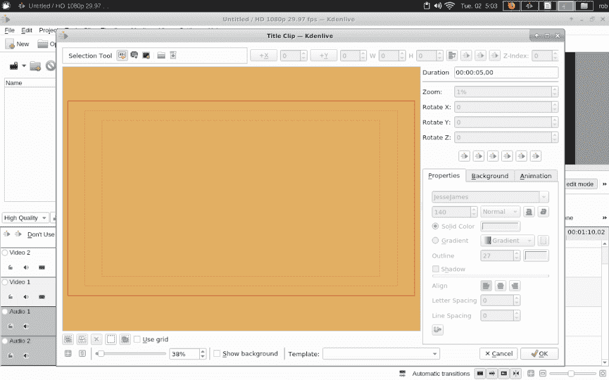
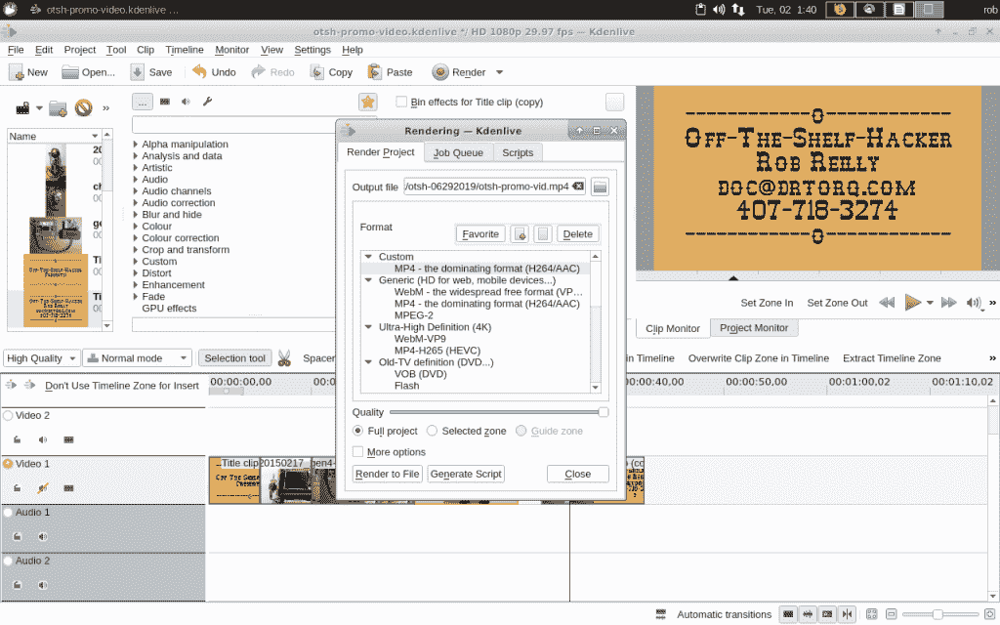

# 现成的黑客:用 Kdenlive 制作开源视频

> 原文：<https://thenewstack.io/off-the-shelf-hacker-open-source-video-production-with-kdenlive/>

试图向他人推销你的想法和项目需要推广。

我在活动现场走动，用我定制的蒸汽朋克会议徽章作为面向前方的便携式广告牌来宣传我的技术演讲。第五代徽章有一个 Raspberry Pi 2，一个 3.5 英寸的彩色液晶触摸屏，能够运行简短的信息视频，没有冻结或闪烁。绝对吸引眼球。

我用 [kdenlive](https://kdenlive.org/en/) 来制作技术演示视频。虽然你可以在必要的时候在徽章(Raspberry Pi)上拼凑一个视频，但在现代的 Linux 笔记本上做起来更容易、更快。然后完成后把它转移到徽章上。视频宣传片工作伟大的树莓 Pi 机器。你可以在你的技术展台或技术讲座的入口处使用 Pi 驱动的大屏幕上的视频。在开始演讲之前，在投影仪屏幕上播放一段简短的介绍视频可以作为一个有益的热身。也许你可以为公司大厅的大屏幕做一个很酷的技术宣传片。别忘了把它们放到 YouTube 上。

电视广告大约 30 秒，所以我跟随他们，把我的视频保持在 30 秒到两分钟的范围内。这使文件大小保持合理，并且易于在工卡上使用。我们今天要讨论的视频大小约为 4MB。请记住，视频越长，渲染的时间就越长，即使是在快速的笔记本上。

让我们看看如何使用 kdenlive 制作一个基本的技术推广视频。

## 初始概念

我的典型宣传片视频有三个部分，一个标题序列，一些内容和闭幕学分。视频循环播放。

标题序列出现在视频的开头，使用文本向观众介绍促销内容。让我们建造一个。

在 Linux 笔记本上启动 kdenlive。

kdenlive 主屏幕

从屏幕左上方的剪辑下拉菜单中单击“添加标题剪辑”。它看起来像一个小电影带，就在主文件菜单项的下面。标题剪辑编辑器将会出现，您可以点击中间的文本来键入您自己的消息。

Kdenlive 剪辑编辑器弹出窗口

剪辑编辑器上有很多选项。我通常会把字体改成蒸汽朋克。让你的字体与你的营销/广告主题相匹配。您也可以使用窗口右侧的菜单和选项卡来更改字体颜色、位置和大小。在我们的示例剪辑中，我使用黑色作为字体颜色，背景为橙黄色。单击“属性”选项卡旁边的“背景”选项卡，设置剪辑背景颜色。默认情况下，颜色是透明的，所以除非你向右移动滑块，否则你看不到结果。使用 255 值表示无透明度。

您也可以在屏幕右上方的框中设置剪辑的持续时间。十到十五秒效果很好。保持文本简单直接也更好。观看剪辑的人应该能够很快抓住你的信息，而不是试图理解一个段落。简洁、紧凑的标题规则。

当你对标题剪辑满意时，点击右下角的 OK 保存你的工作。剪辑编辑器将消失，您可以抓取新剪辑并将其向下移动到视频 1 时间线。

确保偶尔使用“文件”标签保存您的项目。如今 Kdenlive 可靠多了，尽管做了大量的工作却因为没有偶尔点击保存而丢失是一件很遗憾的事情。

## 添加剪辑

现在让我们将一张照片插入视频时间轴。选择“剪辑”下拉菜单下的“添加剪辑”。将弹出一个文件列表，允许您选择照片或视频剪辑。今天，我们只关注照片。

选择一张照片并单击“确定”将照片的缩略图带入剪辑列表窗口。从列表中选择照片，并将其拖至视频时间线。左键单击剪辑将允许您在时间轴上左右移动剪辑。如果您想要将照片放在现有照片之间，您可以将剪辑移到右边或暂时移到另一个时间线。左键点击，手光标将抓住一张照片，所以你可以移动它。释放鼠标按钮，将照片放到您选择的位置。

在示例视频中，我选择了我的五个臭名昭著的蒸汽朋克小工具作为主要内容。每个照片剪辑的默认持续时间是五秒钟。如果您想要增加特定照片的持续时间，您必须移动剪辑，以便有扩展的空间。同样，如果你想缩短一个照片剪辑，你必须将剪辑一起滑动以占据空白空间。除非你想在视频中找一个屏幕空白的地方。确保你有足够的空间，然后双击一张照片，调出“持续时间”菜单。调整时间长度，然后点按“好”进行更改。根据需要调整夹子间距。

## 用演职员表剪辑进行无耻的自我宣传

除非人们知道如何联系你或你的公司，否则宣传视频有什么用？这就是最终演职员表剪辑的目的。

返回剪辑菜单，右键单击标题序列剪辑。从菜单中选择“复制剪辑”双击复制的剪辑以显示剪辑编辑器。双击文本，编辑您的标语、姓名、电子邮件和电话号码。我喜欢我的文本中心对齐。为此，在编辑器的右下角有一个“对齐”按钮。我还喜欢在文本的中间、上方和下方添加一些连字符和小写字母“o”。你可以抓取文本并在编辑器中移动它，使它在屏幕上居中。当一切正常时，点击 OK 返回 kdenlive 时间线。现在只需将致谢名单拖到时间线的末尾。

定期浏览整个视频，以查看它在“项目监视器”窗口中的外观。对视频满意后，使用渲染按钮渲染输出文件。最后，将视频文件复制到您的目标机器上并运行它。

kdenlive 渲染窗口

这个视频花了大约四分钟渲染，质量滑块一直到右边，在我老化的双核华硕笔记本电脑上。

这是完成的样本视频。

https://youtu.be/39pdxrineMw

## 包裹

使用 kdenlive，制作一个可以在 Pi 驱动的会议徽章或数字标牌上显示的简单视频非常快。我们只接触了一些开始的技巧。您可以从简单开始，然后从那里开始构建。Kdenlive 是一个功能强大的视频编辑器，它有许多有趣的特性，只要稍加想象，你就能充分利用这些特性。

请务必看一下示例视频，快速了解今天的工作。在接下来的文章中，我们将看看如何使标题剪辑变得陈旧和粗糙，以符合我正在进行的蒸汽朋克项目主题的精神。我们还将探索各种过渡，如剪辑之间的黑色渐变。这些改进让完成的视频更加完美和专业。视频非常适合讲科技故事或宣传你的下一个演讲。

*赶【Torq 博士的 [现成黑客专栏](https://thenewstack.io/tag/off-the-shelf-hacker/)，每周六，只上新栈！在[doc@drtorq.com](mailto:doc@drtorq.com)或 407-718-3274 直接联系他咨询、演讲出场和委托项目。*

<svg xmlns:xlink="http://www.w3.org/1999/xlink" viewBox="0 0 68 31" version="1.1"><title>Group</title> <desc>Created with Sketch.</desc></svg>