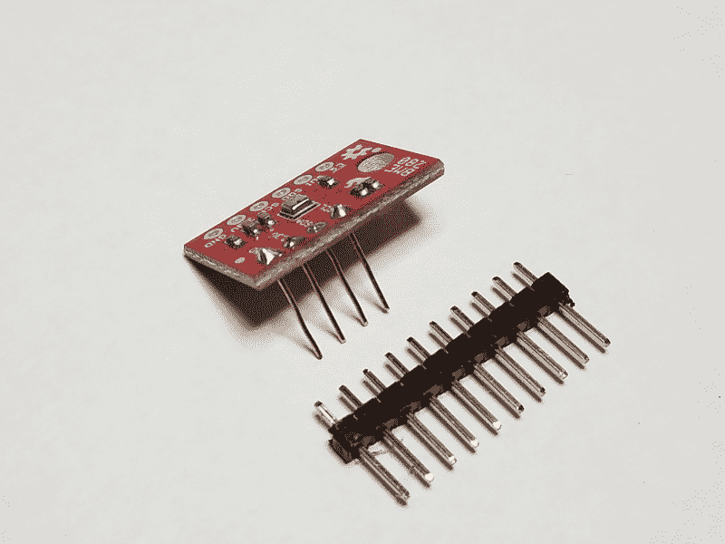
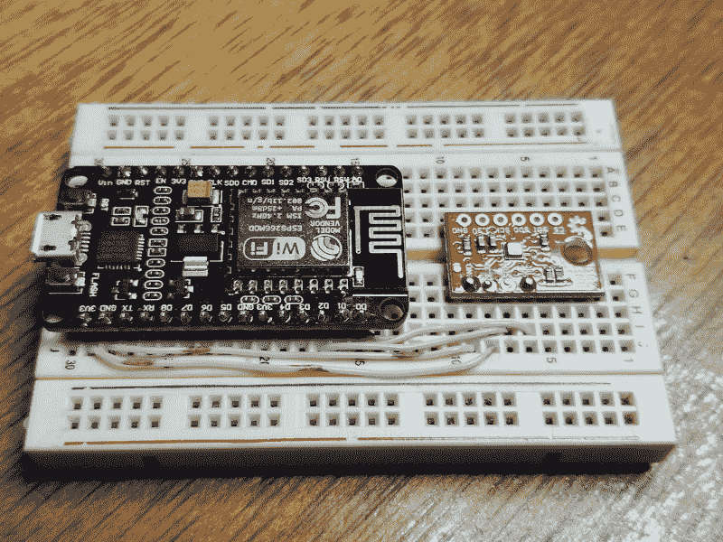

# 现成的黑客:便携式大气读数与火花分线板

> 原文：<https://thenewstack.io/off-the-shelf-hacker-portable-atmospheric-readings-with-a-sparkfun-breakout-board/>

邮递员上周从 Sparkfun 送来了一个 BME280 大气分线板。它测量当地的气压、湿度、海拔和温度。这种传感器可以测量室外天气状况，帮助排除室内环境的故障，甚至可以作为无人机(UAV)上的导航传感器。这块板大约要 20 美元。

我想我会将 BME280 板与 NodeMCU 微控制器结合在一起，并将数据发送到我的“台式电脑”，也称为[蒸汽朋克会议徽章](https://www.oreilly.com/library/view/oscon-2018-/9781492026075/video321504.html)。该徽章采用电池供电，配有几个 USB 端口，使其成为临时和便携式测量工作的快速简便的平台。前阵子我们已经介绍过一个[外部高温传感器](https://thenewstack.io/off-the-shelf-hacker-throw-a-thermocouple-on-the-grill/)。

## 为什么要使用 NodeMCU？

NodeMCU 现在几乎是我的首选 Arduino 克隆。它的长度大约与 Arduino Nano 相同，宽度比 Arduino Nano 宽四分之一，内置 Wi-Fi 和大约 1MB 的程序空间。它的功能与普通的 Arduino 非常相似，并且可以很容易地用标准的 Arduino 交互开发环境(IDE)进行编程。我从 Banggood 以 14 美元的价格购买了三个装的 NodeMCU 板。同样，我花了大约 11 美元买了三包 Arduino Nano 克隆产品，用于不需要 Wi-Fi 的项目。我已经在很多项目中使用了 Nano 克隆，它们通过 USB 或串行线发送数据也很好。

您可以在 NodeMCU 板上使用 Lua 编程语言，开箱即用。我的偏好是在项目中使用 Arduino IDE 和库。确保将板类型设置为 NodeMCU 1.0 (ESP-12E 模块)。默认波特率是 9600。我通常在我所有的项目上运行 115200。

由于我刚刚获得了与会议徽章一起工作的传感器的基本功能，我将在另一个时间离开 Wi-Fi 部分。分阶段开发项目更容易。明智的做法是让一个阶段稳定地工作，然后在以后的版本中添加新的功能和特性。

### 将 BME280 连接到 NodeMCU 板

BME280 有两种不同的接口，I2C 和 SPI。SPI 需要六根线。I2C 装置只需要四根电线。我和 I2C 一起去的。

我不再在电路板上焊接四或六引脚接头，而是选择剥去一些 22 号实芯线的绝缘层，用于试验板引脚。这项技术很简单，它提供了移除“引脚”和将连接线直接焊接到电路板上的选项，因为该项目具有更永久的原型或演示状态。将大约 1/2 英寸的裸线穿过电路板上的孔，向下推入试验板。在板级将电线焊接在 BME 280 的顶部。然后剪掉一点多余的电线。对所有四个引脚都这样做。当您将电路板从试验板上移开时，移除常规连接的接头要困难得多。



22 号线“引脚”焊接到 BME280 板上，带有标准的 0.1 英寸引脚接头以供参考

两块板之间的连接并不复杂。我刚刚在 NodeMCU 板和 BME 280 之间运行了 22 号实心线(这次是绝缘的)。您也可以使用标准的 6 英寸针式原型跳线，尽管这不会是一个整洁的安装。



展示 NodeMCU 板和 BME280 之间连接的试验板

## 代码

你可以从很多地方获得 BME 280 在 Arduino 上运行的代码。我从 GitHub 下载了 Sparkfun BME 280 库。这个库有许多例子，包括一个基本大气数据和一个当地气压。基本数据示例对于检查传感器是否工作非常有用。我使用当地压力代码来校准传感器以适应当地条件。两个例子在 NodeMCU 板上运行都没有问题。

```
/*
  Adjust the local Reference Pressure
  Nathan Seidle @ SparkFun Electronics
  March 23, 2018

  Feel like supporting our work? Buy a board from SparkFun!
  https://www.sparkfun.com/products/14348 - Qwiic Combo Board
  https://www.sparkfun.com/products/13676 - BME280 Breakout Board

'Sea level' pressure changes with high and low pressure weather movement. 
  This sketch demonstrates how to change sea level 101325Pa to a different value.
  See Issue 1: https://github.com/sparkfun/SparkFun_BME280_Arduino_Library/issues/1

  Google 'sea level pressure map' for more information:
  http://weather.unisys.com/surface/sfc_con.php?image=pr&amp;inv=0&amp;t=cur
  https://www.atmos.illinois.edu/weather/tree/viewer.pl?launch/sfcslp

  29.92 inHg = 1.0 atm = 101325 Pa = 1013.25 mb
*/

#include 

#include "SparkFunBME280.h"
BME280 mySensor;

void setup()
{
  Serial.begin(9600);
  Serial.println("Example showing alternate I2C addresses");

  Wire.begin();
  Wire.setClock(400000);  //Increase to fast I2C speed!

  mySensor.beginI2C();

  mySensor.setReferencePressure(101710);  //Adjust the sea level pressure used for altitude calculations
}

void loop()
{
  Serial.print("Humidity: ");
  Serial.print(mySensor.readFloatHumidity(),  0);

  Serial.print(" Pressure: ");
  Serial.print(mySensor.readFloatPressure(),  0);

  Serial.print(" Locally Adjusted Altitude: ");
  //Serial.print(mySensor.readFloatAltitudeMeters(), 1);
  Serial.print(mySensor.readFloatAltitudeFeet(),  1);

  Serial.print(" Temp: ");
  //Serial.print(mySensor.readTempC(), 2);
  Serial.print(mySensor.readTempF(),  2);

  Serial.println();

  delay(200);
}

```

代码很简单。它使用库设置设备，然后调用各种数据值并打印结果。我喜欢使用英国的测量单位，并注释掉公制数值线。我们还需要根据当地条件调整**setreferencepression**值。我们将在下一节讨论这个问题。

编译后的代码上传到 NodeMCU 板后，您可以使用 Arduino IDE 中的串行终端或 Linux 桌面上的常规终端来重置板并读取值。使用我们的标准 **stty** 和 **cat** 命令。

`linux-notebook% stty -raw -icrnl -F /dev/ttyUSB0 115200
linux-notebook% cat /dev/ttyUSB0`

在 Raspberry Pi 会议徽章上使用 NodeMCU-BME280 器件组合非常简单。启动徽章，将 NodeMCU USB 线插入 Pi，并在终端窗口中运行 **stty/cat** 命令组合。数据将在屏幕上滚动。使用 CTRL-C 停止读取数据。

[https://www.youtube.com/embed/gkMe32cdPgQ?feature=oembed](https://www.youtube.com/embed/gkMe32cdPgQ?feature=oembed)

视频

## 校准很棘手

找到正确的**设置参考压力**对我来说仍然是一门“黑色艺术”。显然，我们希望我们的项目有准确的气压和海拔读数。我住在奥兰多国际机场(OIA)附近，所以我想他们当地的大气数据可以用来校准我的传感器。该机场的海拔被列为海拔 96 英尺。我所在的城镇在维基百科上也显示了同样的高度。我在两者之间，不是在山上或洼地上，所以这个数字对我来说似乎是合理的。

假设根据他们当前的测量，当地 OIA 海平面气压为 1015.8，海拔为 96 英尺。

如果我使用 1013800 的**setreferenceppressure**，我会得到 101380 的 BME280 测量值(除以 100 以与 OIA 读数一致)和 0.0 英尺高度。

另一方面，如果我们使用 101710 的**setreferenceppressure**，我会得到 101377 的 BME280 测量值和 90.7 英尺的高度。这个高度接近 OIA 的实际高度。1015.8 的气压(OIA 当地)与 BME280 测得的 1013.77 稍有出入。

同时在我的 Galaxy 8+手机上使用 GPS 测量气压和海拔高度。它给出的读数是 101490 (1014.90)和 35.6 英尺的高度。

我所在位置的正确**setreferencepression**数字是多少？传感器在室内，空调温度约为 81 华氏度，而室外温度为 84 华氏度，这有什么关系吗？

把所有这些放在一起，读数之间有相当大的差异。哪个是正确的？现在我不知道，这说明了构建物理计算设备的困难之一。你总是要问自己，你的数据“看起来”是否正确。如果没有，我们显然需要更深入的了解。那需要时间和努力去学习。

## 更进一步

在摆弄 BME280 之前，我对实际和测量的大气压力、湿度、温度等之间的关系知之甚少。显而易见的是，将传感器校准到实际的本地条件非常重要，在将该技术应用到日常设备和项目之前，需要充分了解和验证这一点。

BME 280 和 Raspberry Pi 会议徽章“胸顶”电脑的基本操作工作正常。现在的问题是通过测试和调整来校准和获得数据的可信度，以使设置有用。

*赶【Torq 博士的 [现成黑客专栏](https://thenewstack.io/tag/off-the-shelf-hacker/)，每周六，只上新栈！在[doc@drtorq.com](mailto:doc@drtorq.com)或 407-718-3274 联系他咨询、演讲、委托项目。*

<svg xmlns:xlink="http://www.w3.org/1999/xlink" viewBox="0 0 68 31" version="1.1"><title>Group</title> <desc>Created with Sketch.</desc></svg>