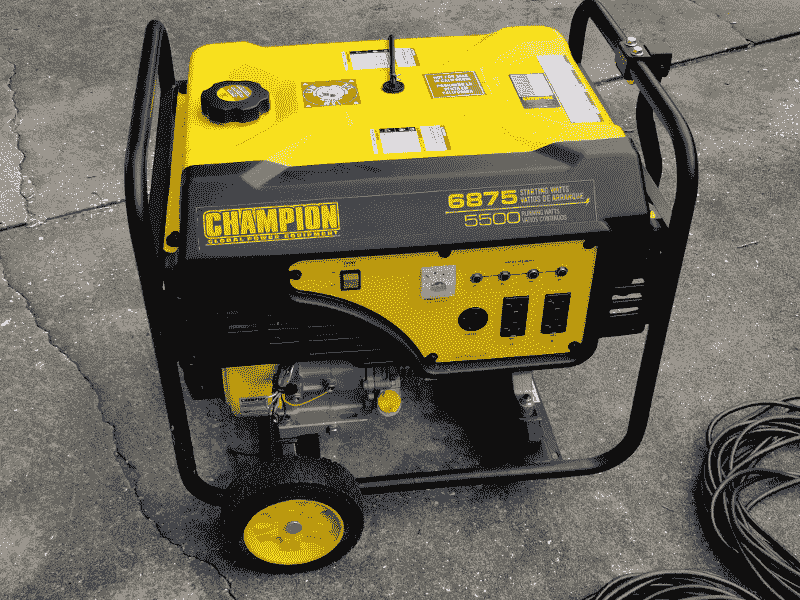
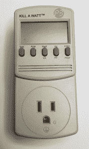
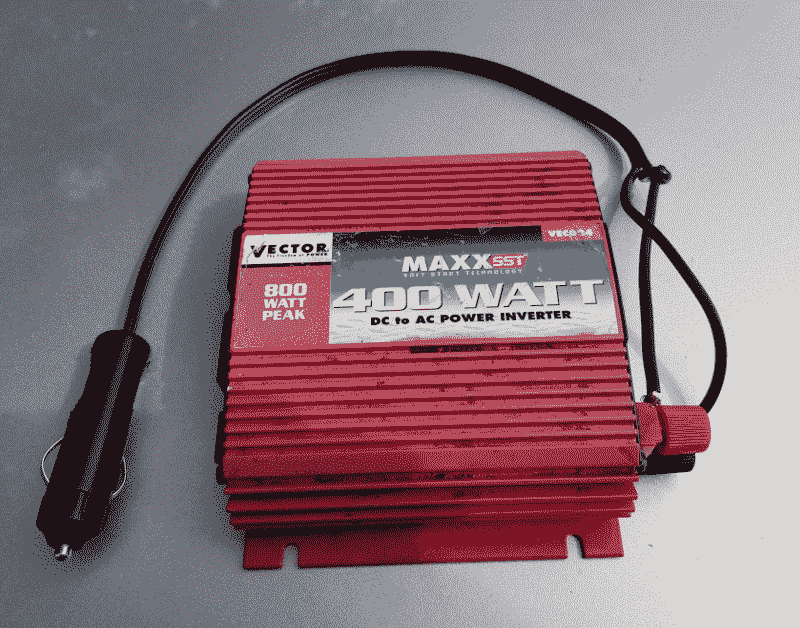

# 现成的黑客:另一场飓风的电源黑客

> 原文：<https://thenewstack.io/off-the-shelf-hacker-power-hacks-for-another-hurricane/>

“我们有发电机，所以空调还会工作，对吗？，”女儿问。“不，我们不会有任何空调，”我说。“我们将能够运行冰箱、几个风扇、灯、电视、路由器/wifi 和笔记本电脑。而且，我们只运行一两个小时，然后关闭几个小时，所以我们有燃料进行长途旅行。发电机不够大，不能驱动空调。”

“嗯，如果停电的话，我要去旅馆，”她回答说。

“我知道，亲爱的。现代世界的生活太艰难了，”我翻着白眼说道。

过去几天我们一直在为飓风道林做准备。我们已经储备了汽油、饮用水、食品柜里的食物等等。此外，我修剪了技术上非常重要的电缆/互联网连接周围的灌木丛和树枝。当查理在 2004 年横扫奥兰多时，我们的有线电视和高速互联网中断了两周。呀！

从那以后，我们学到了很多。本周，我想谈谈“便携式操作”，以及在没有电力需求时，现成的黑客如何满足他们的电力需求。无论是自然灾害还是在遥远的森林中，生活并不一定很糟糕，因为你没有 120 伏的电。

## 发电机 101

[两年前](/off-shelf-hacker-geek-hurricane-hacks/)，一场飓风让我们停电四天。如果需要的话，我们在盒子里放了一台发电机。我们做到了。我邻居树上的一根树枝折断了我家后面电线杆上变压器的供电线。这是一个简单的修复重新连接在一起的电线。尽管我很想伸出手去补补，但不幸的是，那周我的斗车还在店里。此外，修理高架住宅供电服务可能最好留给专业人士。

我们购买的发电机是一台[Champion Power Products 5500 瓦机组](https://www.championpowerequipment.com/product/100340-5500-watt-generator/)，在拖拉机供应公司的价格是 600 美元加税。它在 50%负载下的广告燃料消耗量约为 0.7 加仑/小时。这意味着我们可以在 5 加仑的油箱上运行高达 2750 瓦的负载约 7 小时。燃料容量为 6 加仑。确保尽早在家装店、Northern Tool 和其他商店购买发电机，以避免抢购。

5000 瓦便携式汽油发电机

发电机燃料消耗很重要，尤其是在飓风或其他天气事件期间资源有限的情况下。暴风雨期间没有电力供应当然是危险的。不知道停电会持续多久需要一种保守的、自律的心态和节奏。

发电机油箱里有 5 加仑，两个煤气罐里有 10 加仑多一点。五加仑的塑料煤气罐是抢手货，因为它们相当容易操作。再大一点的话，它们就会变得太重，举不起来，倒不倒，还会弄得一团糟。我们花了大约 36 美元买发电机汽油。我们不用在发电机里的东西，会在暴风雨后进入汽车和割草机里。

[https://www.youtube.com/embed/sXV1E9jO6Jg?feature=oembed](https://www.youtube.com/embed/sXV1E9jO6Jg?feature=oembed)

视频

加起来，如果负载保持在 2700 瓦以下，我们总共有大约 21 小时的连续电力。运行发电机几个小时以保持冰箱工作，然后在奥兰多忍受热带夏末的潮湿和炎热，这有助于您尽可能长时间地使用可用气体。自然，较低的负荷会使气体持续更长时间。

你如何保持在 2700 瓦以下？你怎么知道你用了多少能量呢？

## 给你自己买一个瓦特杀手锏

到目前为止，最简单的关注你的电力消耗的方法是使用一个[杀死瓦特计](https://www.amazon.com/P3-P4400-Electricity-Usage-Monitor/dp/B00009MDBU)。这个 21 美元的小玩意可以显示任何插入它的东西所消耗的瓦特数，最高可达 1875 瓦特。你也可以有选择地显示电压，安培数，线路频率和千瓦时。很方便的是，只需将断电器连接到主延长线的末端，就可以进入房间。然后，负载被插入到断电电源中。你可以拿起一个秒杀瓦特来监控第二条延长线。

一瓦特功率计

去年，一个令人高兴的发现是，使用的功率实际上比我预期的要低。我记得，冰箱/冰柜、32 英寸大屏幕、电缆盒、电缆调制解调器/路由器、几个箱式风扇、几台 Linux 笔记本电脑和几个 LED 或紧凑型荧光灯加起来大约 1000 瓦。现代大屏幕(LCD 和 LED)技术比旧的阴极射线管(CRT)电视耗电少得多。同样，LED 灯比传统的白炽灯耗电少得多。在紧急行动中利用这些优势。自然，保持冰箱运转对于冷饮和确保食物新鲜至关重要。

上次风暴后，能做饭真是太好了。我们在外面临时搭建的桌子上使用了一个 1500 瓦的电烤盘和一个小的六杯咖啡机。由于冠军发电机有四个 120 伏的插座，很容易将烤架直接插入前面板上。我们没有监控烹饪设备的功率。在晚上，我们用一盏 50 瓦的 LED 通用灯来做饭。根据我的经验，煎锅非常适合做早餐、午餐和晚餐。你必须提供你自己的烹饪技巧和想象力来让你的船员开心。记住，当情况变得艰难时，美味的食物肯定会鼓舞士气。

我们已经讲述了便携式电源、照明和烹饪的基础知识。现在让我们来看看通信。

## 电动银行和你的车

现代手机能够通过 WiFi 或蜂窝网络连接到互联网。只要你的手机有电，你就有可能与外界联系。近年来，手机基站得到了加强，通常都有备用电源，以应对最恶劣的天气。现在我们只需要保持手机运行。你甚至可以用[频谱应用](https://www.spectrum.net/page/spectrum-tv-app/)观看天气频道和当地新闻频道。

电力银行是一种选择。我紧张的女儿去塔吉特买了一个 4000 毫安的备用电源。我有自制的 15，000 mAh 电池组(用于机器人头骨)，一个额外的无名的 5，000 mAh 电池组和一个来自 Radio Shack 的小型 2，200 mAh 电池组。

当发电机运行时，电池组和手机很容易充电，所以这变成了一个简单的物流过程。专用电源板使连接所有充电器变得简单。

另一个选择是使用汽车电源插座。十年前，我在家得宝花了大约 50 美元买了一个 400 瓦(峰值 800 瓦)的逆变器。在去中西部的旅途中，我用它给一台为孩子们播放 DVD 的笔记本电脑供电。现在它作为发电机的低功率备份。

家得宝 400 瓦逆变器

去年，当手机电量不足时，我只是让家人把充电器插到逆变器的电源插座上，而不是运行发电机。他们也可以在等待或打电话时和其中一个粉丝一起凉快一下。偶尔让汽车运行 15 分钟左右，足以补充充电器和风扇消耗的电量。

如果需要，逆变器可以轻松运行几个 LED 灯和一两个风扇。功率超过 150 瓦的任何东西都需要直接连接到汽车电池，而不是通过插入式汽车电源插座。否则，你可能会烧断电源插座的保险丝。使用 Kill-A-Watt 来监视您的负载。

## 遵命，船长，全速前进

截至周二中午，道林已经降级为 2 级飓风(持续风速为 96 至 109 英里/小时)，周三早上奥兰多可能会有热带风暴。在这一点上，我不期待任何停电。如果赛道离我们更近，我们仍然准备快速切换到“紧急操作”模式。

当你有时间的时候，准备和采取行动对你的舒适甚至生存有直接的影响。飓风是严重的，需要尊重。幸运的是，现成的黑客往往组织良好，能够逻辑地预测未来可能出现的情况，并有动力去完成需要完成的事情。

是的，当然，传统的飓风 18 包(这一次米勒高生活)是在冰箱里冷藏。

*赶【Torq 博士的 [现成黑客专栏](/tag/off-the-shelf-hacker/)，每周六，只上新栈！在[doc@drtorq.com](mailto:doc@drtorq.com)或 407-718-3274 直接联系他咨询、演讲出场和委托项目。*

<svg xmlns:xlink="http://www.w3.org/1999/xlink" viewBox="0 0 68 31" version="1.1"><title>Group</title> <desc>Created with Sketch.</desc></svg>