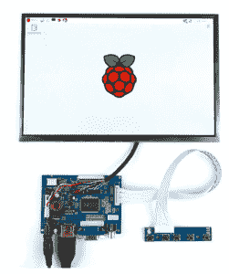
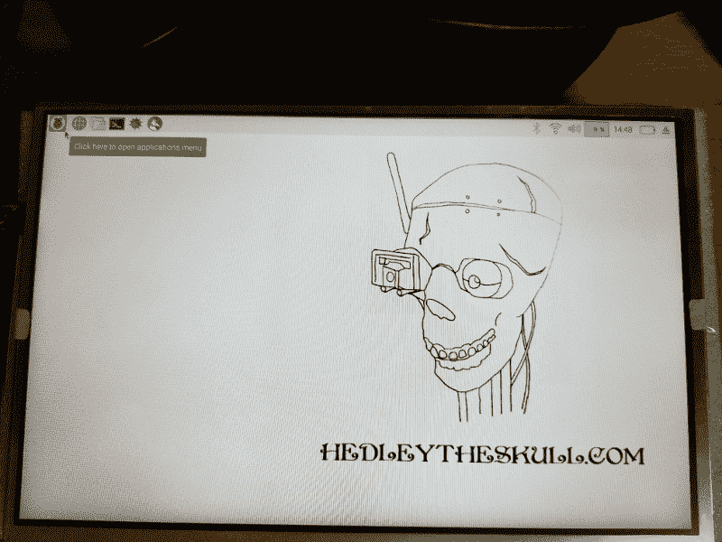

# 现成的黑客:用树莓皮运行液晶显示器

> 原文：<https://thenewstack.io/off-the-shelf-hacker-run-a-lcd-display-with-a-raspberry-pi/>

15，000 mAh 锂离子电池和 [10.1 英寸彩色 LCD HDMI 显示器](https://www.banggood.com/10_1-Inch-1280x800-HD-Display-TFT-LCD-Module-Kit-For-Raspberry-Pi-p-1109750.html?rmmds=buy&cur_warehouse=CN)已于上周到货，因此，想象一下我终于有了一种便携式方式来与 Raspberry Pi 或任何其他支持 HDMI 的设备进行交互，而无需墙上插座或外部 Linux 笔记本电脑，我会有多兴奋。

一个高分辨率的 LCD 显示屏对于【Torq 博士式的持续开发来说意义重大。我在会议发言人休息室、我的家庭办公室、我爸爸的家里和其他地方从事物理计算项目，比如 Panera Bread。即使是我的 19 英寸 LG 显示器也太大了，以至于在组装我的小工具时无法携带。LG 也需要插在墙上的插座上。

10 英寸的电池供电液晶显示器，我将把它变成一个坚固的蒸汽朋克主题移动显示器，这正是我在现场(有时是字面上的)物理计算开发工作中所需要的。

## 拆箱显示

这款裸露的液晶显示器来自中国，装在一个纸箱里，夹在两块闭孔泡沫之间。该盒子还包含匹配的驱动器板、小型显示器控制板、控制板电缆和将显示器钩到驱动器板上的电缆。显示器电缆的电线非常细，连接器非常脆弱，因此处理时应小心。

我不得不笑。说明？我们不需要讨厌的指示。事实上，里面根本没有任何文件。哦，好吧。无论如何，现成的黑客最终会写出方向。插上所有的电缆只花了一会儿时间。

显示驱动板通过一根 25 英尺的 HDMI 电缆连接到赫德利的树莓 Pi 3 上。我点了这个和一点 18 寸的线，和显示器同时点的。长电缆负责将赫德利放置在离投影仪一定距离的地方，而短电缆将用于近距离演示，例如当显示器就在他旁边时。

驱动板还可以处理 VGA 和复合视频输入。如果我想为项目复活旧的“古董”PC 板或查看来自硬连线摄像机的视频源，这将非常方便。

从中国订购零件，至少是向美国订购零件，有一点是你永远不知道它们会在什么时候送到。我希望一切通常在两到四周内完成。

## 给显示器供电

液晶面板有两种供电方式，15，000 锂离子电池或壁式电源。

15000 毫安时的锂离子电池配有 12.6 伏的壁式电源。不幸的是，Banggood 运送的欧洲型号有两个圆形尖头，而不是美国使用的双刀片式。我可能会找一个欧洲到美国的适配器，或者在某个时候插入一个标准的美国电源插头。适配器可能是最简单的，因为我很想带赫德利去欧洲科技会议之旅。在《T4》过去的一篇文章中，我报道了在欧洲给[的胰腺机器人](https://thenewstack.io/stackie-pancakebot-steampunk-pals-hit-silicon-valley/)供电的挑战。运行[赫德利](https://thenewstack.io/off-the-shelf-hacker-hedley-the-robotic-skull-tours-portland/)，我的机器人说话头骨，和他的小显示器呈现了类似的情况。

好的一面是，我有一个备用的 12 伏壁式电源插头，它有正确的电源接头，可以给电池充电。这是一个大电池，充满电可能需要大约 20 个小时。电池直接插入 LCD 驱动板上的电源端口。当主板连接到电源时，绿色 LED 会亮起。

12 伏的壁式电源本身也能很好地为显示器供电。

## 桌面怎么样？

我很高兴地报告，屏幕明亮清晰。1280×800 的分辨率非常棒，开箱即用。较低的分辨率需要你左右滚动才能看到整个屏幕。更高的分辨率，你需要一个放大镜来阅读小文本。

我想为赫德利设计一个小型便携式显示器的主要原因是，通过他的 [JeVois 智能传感器](http://jevois.org/)让他以第一人称观看所看到的东西。电池供电的显示器将真正有助于我们在波特兰的下班后酒吧演示。我没有调整好设置，让赫德利在光线不足的环境下跟踪我。该显示屏允许我在演示过程中优化 [guvcview](http://guvcview.sourceforge.net/) 设置。

看看赫德利的“骷髅顶”展览。看起来像任何其他桌面，当然，它是。

赫德利头骨的“头骨顶部”展示

该显示器将方便地向一到三个人的小观众展示赫德利如何对 JeVois 传感器中的不同人工智能算法做出反应。每种算法都与您选择的视频观看应用中选择的特定摄像机分辨率相关。桌面上有一个弹出窗口，用于选择分辨率和 JeVois 算法。我通常在命令行中使用所选的分辨率运行 [luvcview](http://manpages.ubuntu.com/manpages/trusty/man1/luvcview.1.html) 。不管浏览器程序是什么，在常规大小的桌面界面上调整设置都是简单快捷的。

## 下一步是什么？

下周[赫德利和我将在明尼阿波利斯](https://minn18.mapyourshow.com/7_0/sessions/session-details.cfm?ScheduleID=31)[嵌入式系统会议上展示](https://escminn.com/)。我们总是很高兴与读者交谈，所以如果你在会议上，一定要停下来打个招呼。

当我回来的时候，为 LCD 显示器建造一个坚固的便携式蒸汽朋克外壳将是当务之急。我还有[三节点 MCU ESP8266 板](https://www.banggood.com/NodeMcu-Lua-WIFI-Internet-Things-Development-Board-Based-ESP8266-CP2102-Wireless-Module-p-1097112.html?rmmds=buy&cur_warehouse=CN)放在我的桌子上，等待安装在一些新项目中。

*每周三查看 Torq 博士的[现成黑客专栏](https://thenewstack.io/tag/Off-The-Shelf-Hacker)，仅在新堆栈上。*

<svg xmlns:xlink="http://www.w3.org/1999/xlink" viewBox="0 0 68 31" version="1.1"><title>Group</title> <desc>Created with Sketch.</desc></svg>