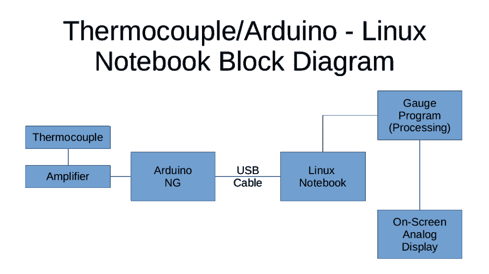
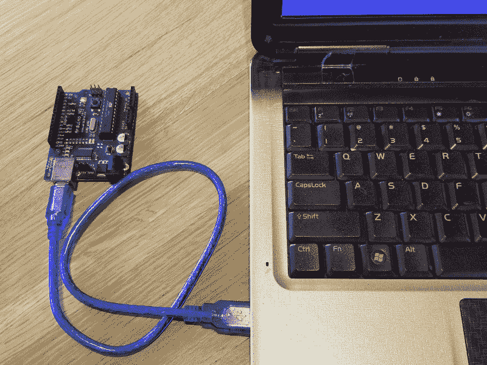

# 现成的黑客:用 Arduino 模拟传感器数据

> 原文：<https://thenewstack.io/off-the-shelf-hacker-simulate-sensor-data-with-an-arduino/>

用一个传感器和一个 Arduino 微控制器捕获真实世界的测量值，然后将这些读数推送到一台 Linux 计算机上，在模拟仪表程序上显示或用于其他用途，现在已经相当普遍。



我们读取传感器，将值换算成实际值，然后将数据打印到 USB 端口。Linux 显示机器上的一个配套程序可以吸收数据，并根据传感器读数做一些类似旋转屏幕上模拟仪表指针的事情。

有时传感器还不可用。它可能是来自中国的众所周知的慢船(或飞机)或其他什么东西。好消息是，您可以在 Arduino 传感器设备上用最少的代码“模拟”数据。这样，在等待传感器到来的同时，您就可以在 Linux 机器上开发自己的仪表或其他程序了。你的仪表程序认为它在读取真实的传感器数据。

本周我们将探讨一些简单的方法来模拟屏幕上仪表、读数、刻度盘和其他用途的数据。

## 超快速硬件数据模拟

您可以在几分钟内在 Arduino 上构建一个基本硬件数据模拟器。编写一些代码，将一串值打印到串行端口，上传到您身边的任何旧 Arduino，当它重新启动时，开始读取 USB 电缆另一端的数据。下面是一些强力代码，以 1/2 秒的间隔，从 0 到 100，以 10 为增量上下扫描值。

```
【void】【setup】 【Serial】begin (115200 ))( )( )( )( )( )( )( )( )( )( )( )( )( )( )( )( )( )( )( )( )( )( )( )( )( )( )( )( )( )( )( )( )( )( )( )( )( )( )( )( )( )( )( )( )( )( )( )( )( )( )( )( )( )( )( )( )( )( )( )( )( )( )( )( )( )( )( )( )( )( )( )( )( )( )( )( )( )( )( )( )( )( )( )( )( )( )( )( )( )( )( )( )( )( )( )( )( )( )( )(println (“0”);
【延迟】(500 )
串行println (“10”)
【延迟】(500 )
串行println (“20” )【延迟】(500 )
串行println (“30”)
延迟(500 )
串行println (“40”)【延迟】(500 )
串行println (“50”)
【延迟】(500 )
串行println (“40” )
【延迟】(500 )串行println (“30” )
【延迟】(500 )
串行println (“20”)
500】
串行println (“10”)
【延迟】(500 )(T228) (T229) (T229) 
```

编写、编译和上传只花了五分钟。更好的是，你只需要一个 Arduino 和一根 USB 线。



Arduino NG 生成模拟数据并将其发送到 Linux 笔记本

在 Linux 计算机端，使用 cat 命令检查模拟数据操作很容易。我们经常使用这种技术。出于习惯，我首先运行 *stty* 命令来确保 USB 端口工作正常。在 Linux 终端中执行这些。

```
stty-raw-ICR nl-F/dev/TT yusb115200
cat 
```

上周在测试[热电偶项目时，我只能通过抓住探针的末端或将其放入热水中来改变温度几度。该设备可以测量高达 900 华氏度的温度。更全面的测试可能会提供上限和下限的数据，而不仅仅是下限的狭窄范围。我可以使用硬件数据模拟器。](https://thenewstack.io/off-the-shelf-hacker-throw-a-thermocouple-on-the-grill/)

## 稍微复杂一点的方法

一个稍微复杂一点的模拟以半秒的间隔从 0 单步执行到 100 步。这产生了更平滑的针扫描。当该值达到 100 时，它会在一秒钟的延迟后跳回零，然后不断重复。

```
【I】(A) (A) (A) (A) (A) (A) (A) (A) (A) (A) (A) (A) (A) (A) (A) (A) (A) (A) (A) (A) (A) (A) (A) (A) (A) (A) (A) (A) (A) (A) (A) (A) (A) (A) (A) (A) (A) (A) (A) (A) (A) (A) (A) (A) (A) (A) (A) (A) (A) (A) (A) (A) (A) (A) (A) (A) (A) (A) (A) (A) (A) (A) (A) (A) (A) (A) (Abegin (115200 ))(我)(们)(都)(不)(知)(道)(,)(我)(们)(还)(不)(知)(道)(,)(我)(们)(还)(不)(知)(道)(,)(我)(们)(还)(不)(知)(道)(,)(我)(们)(还)(不)(知)(道)(,)(我)(们)(还)(不)(知)(道)(,)(我)(们)(还)(不)(知)(道)(,)(我)(们)(还)(不)(知)(道)(。(T57) (T58) (T59) (T59) (T62) (T63) (T63) (T64) (T65) (T65) (T66) (T65) (T65) (T65) (T65) (T65) (T66) (T67) (T68) (T68) (T68) (T65) (T65) (T65) (T65) (T65) (T65) (T65) (T65) (T65) (T65) (T65) (T65) (T65) (T65) (T65) (T65) (T65) (T65) (T65) (T65) (T65) (T65) (T65) (T65) (T65) (T65) (T65) (T65) (T65)println (i )
i ++;
延迟(100 ))(那)(就)(是)(我)(们)(的)(一)(个)(人)(,)(我)(们)(都)(不)(知)(道)(了)(,)(我)(们)(还)(不)(知)(道)(,)(我)(们)(还)(是)(不)(知)(道)(,)(我)(们)(还)(不)(知)(道)(,)(我)(们)(还)(是)(不)(知)(道)(。
串行print (“重启”)
【延迟】(1000 )(A) (A) (A) (A) (A) (A) (A) (A) (A) (A) (A) (A) (A) (A) (A) (A) (A) (A) (A) (A) (A) (A) (A) (A) (A) (A) (A) (A) (A) (A) (A) (A) (A) (A) (A) (A) (A) (A) (A) (A) (A) (A) (A) (A) (A) (A) (A) (A) (A) (A) (A) (A) (A) (A) (A) (A) (A) (A) (A) (A) (A) (A) (A) (A) (A) (A) (A 
```

这段代码也简单有效。

[https://www.youtube.com/embed/KDj89op-7g8?feature=oembed](https://www.youtube.com/embed/KDj89op-7g8?feature=oembed)

视频

当然，我们需要缩放 sim 数据和处理仪表程序，以处理 0 到 900 的热电偶温度范围，同时适当改变显示机器侧的表盘。你明白了。

## 扩展模型

使用“sim 卡数据”功能，您可以做很多很酷的事情。

也许你有多个仪表读取多个传感器。您可以将这些值打包在一个输出行中，使用逗号作为数据分隔符。当然，在仪表显示程序方面，我们需要将每一行数据解析成它们各自的值，并将它们发送给相应的仪表例程。

对于不同的仪表分辨率，您可以使用更小或更大的步长。较小的值会使指针更平滑、更缓慢地扫过。也许你想放弃延迟值或数值范围以获得更快的响应。使用 trig 函数来控制波形数据流的“I”值如何？

而且，我们并不局限于模拟数字数据。我们可以很容易地发送文本测试数据。在 Arduino 代码中，只需将文本用双引号括起来。例如:

```
   println  ( “也可以发文字”)；

```

## 后续步骤

我们只是触及了使用 Arduino 通过 USB 电缆发送模拟数据的表面。读者可以很容易地拿一个 Arduino Nano，构建一个适合放在小盒子里的微型“sim”或诊断设备。纳米非常便宜。您甚至可以使用几个电位计和开关来改变输出数据，而不必每次都重新上传 Arduino 固件。这里有很多可能性。

*赶[Torq 博士的](https://twitter.com/robreilly) [现成黑客专栏](https://thenewstack.io/tag/off-the-shelf-hacker/)，每周六，只上新栈！在[doc@drtorq.com](mailto:doc@drtorq.com)或 407-718-3274 直接联系他进行咨询、演讲和委托项目。*

<svg xmlns:xlink="http://www.w3.org/1999/xlink" viewBox="0 0 68 31" version="1.1"><title>Group</title> <desc>Created with Sketch.</desc></svg>