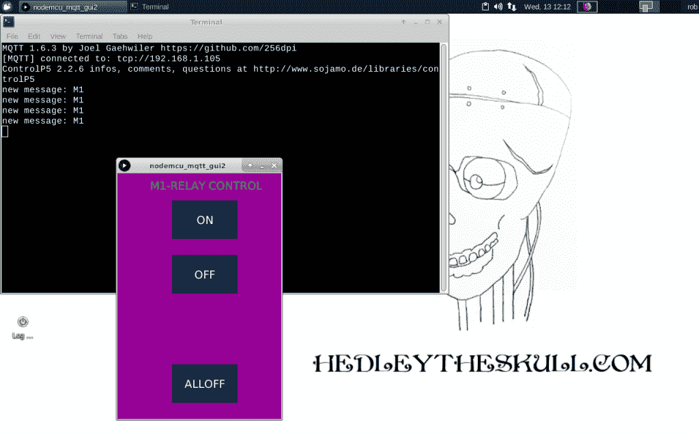

# 现成的黑客:院子传感器的超级简单的应用程序

> 原文：<https://thenewstack.io/off-the-shelf-hacker-super-simple-app-for-the-yard-sensor/>

我们已经在被动红外(PIR)码传感器上工作了一段时间，主要是在硬件和软件方面。[上周](/off-the-shelf-hacker-microcontroller-wireless-messaging-with-mqtt/)我们讨论了 NodeMCU WiFi 模块的固件，该模块允许设备[向代理发送和接收 MQTT 消息](http://mqtt.org/)以及打开或关闭中继。除了自动记录“入侵”日志(当有人走过传感器时)，我还需要一种简单的方法来从我的 Linux 笔记本上打开和关闭室外院子的泛光灯。用其他设备操作灯光也很有趣。

MQTT 极大地简化了我们开发机器对机器通信过程的方式。一旦你让你的客户(院子里的传感器)和经纪人(我的 Linux 笔记本)设置好了，让事情发生只是一个简单的来回发送消息的问题，做你的命令。

今天，我们将看看一个用[处理](https://processing.org/)编写的超级简单的基于面板的应用程序。这种语言反映了我们为 Arduinos 编写的代码，并且有大量的库可以满足各种编程需求。我们将使用一个专门用于图形用户界面的库，比如按钮和滑块。处理应用程序可以在 Linux 笔记本和 Raspberry Pi 计算机之间移植。

让我们开始吧。

## 重要的事情先来

所有 MQTT 设置都需要一个代理。代理协调 MQTT 消息。可以把它想象成一个消息服务器。您将消息发布到代理上的特定主题，然后订阅该主题的任何 MQTT 客户机在消息发送后都会收到消息。你可以让一群客户端订阅同一个主题，只要有新消息发布，它就会出现在每个客户端上。

对于这个快速原型，我只是为代理使用了我的 Ubuntu 18.10 版本上现有的 Mosquitto 安装。不久前，我还在一台芯片计算机上建立了一个 Mosquitto MQTT 经纪人，并称之为“玻璃下的 Mosquitto”项目。不幸的是，芯片最近停止工作了。公司也破产了。去想想。

我仍然需要一个专门的 MQTT 代理来处理我当前所有“刚刚脱离原型”的项目，所以我将在下一篇文章中概述在备用的 Raspberry Pi 上构建一个。也许我会把芯片换成更新的树莓派。我可以称之为“玻璃下的覆盆子蚊子”项目。

如果您知道自己在做什么，可以在任何常见的 Linux 系统上使用 apt-get 进行快速而简单的设置。

```
  抢 %   须藤apt-getinstallmosquito

```

我们也可以使用在线 MQTT 代理，不过现在，我会把我所有的消息保存在我的本地网络上。Mosquitto 有一个[测试经纪人](https://test.mosquitto.org/)， [Adafruit](https://io.adafruit.com/) 和 [Hive](https://www.hivemq.com/) 都有线上经纪人。还有[其他](https://diyprojects.io/8-online-mqtt-brokers-iot-connected-objects-cloud/)。

## 构建一个简单的基于面板的应用

过去，我们在许多工作中使用了处理。这是一种非常适合休闲编程的语言。最近，处理代码帮助我制作了我的机器人头骨，[赫德利](/off-the-shelf-hacker-conversations-with-hedley-the-robotic-skull/)说话并移动他的下巴。

开始处理并安装 ControlP5 库。在“草图”选项卡下，单击“导入库”菜单项，并从子菜单中选择“添加库”。在搜索框中键入“control p5 ”,然后按回车键。单击“安装按钮”。您可能还需要加载 MQTT 发布/订阅库。

我使用了一些例子来拼凑这个原型。通过在处理 IDE 上单击“文件”，然后单击“示例”来查找示例。在“控件 5”下的“贡献的库”中查找我使用的是“ControlP5button”，我还使用了“贡献库”中“MQTT”标题下的“发布/订阅”示例。

```
import controlP5.*; //import ControlP5 library
import mqtt.*;

MQTTClient client;

ControlP5 cp5;  //create ControlP5 object
PFont font;

void setup(){  //same as arduino program

  size(300,  450);    //window size, (width, height)

  client  =  new MQTTClient(this);
  client.connect("mqtt://192.168.1.105",  "m1");
  client.subscribe("mqtt");

  //lets add buton to empty window

  cp5  =  new ControlP5(this);
  font  =  createFont("calibri light bold",  20);    // custom fonts for buttons and title

  cp5.addButton("on") //"red" is the name of button
    .setPosition(100,  50)  //x and y coordinates of upper left corner of button
    .setSize(120,  70)      //(width, height)
    .setFont(font)
  ; 

  cp5.addButton("off") //"yellow" is the name of button
    .setPosition(100,  150)  //x and y coordinates of upper left corner of button
    .setSize(120,  70)      //(width, height)
    .setFont(font)
  ;

  cp5.addButton("alloff") //"alloff" is the name of button
    .setPosition(100,  350)  //x and y coordinates of upper left corner of button
    .setSize(120,  70)      //(width, height)
    .setFont(font)
  ;
}

void draw(){  //same as loop in arduino

  background(150,  0  ,  150);  // background color of window (r, g, b) or (0 to 255)

  //lets give title to our window
  fill(0,  255,  0); //text color (r, g, b)
  textFont(font);
  text("M1-RELAY CONTROL",  60,  30);  // ("text", x coordinate, y coordinat)
}

//lets add some functions to our buttons
//so when you press any button, it sends particular char over serial port

void on(){
  client.publish("inTopic",  "2");
}

void off(){
  client.publish("inTopic",  "0");
}

void alloff(){
  client.publish("inTopic",  "0");
}

void messageReceived(String topic,  byte[]  payload)  {
  println("new message: "  +  new String(payload));
}

```

代码相当简单。它使用 192.168.1.105 IP 地址连接到我的 Linux 笔记本上的 MQTT 代理。调整您的代码以指向您的代理 IP 地址。我用“M1”标识来表示产生数据的设备。其他调车场传感器将具有类似的 id，如“M2”或“M3”。你可以很容易地将你的设备命名为“东南传感器”、“东北传感器”等等。

接下来，按钮被初始化，并在后台等待按下。当按下其中一个按钮时，代码跳转到“on”、“off”或“alloff”功能，并在 MQTT 代理上向“inTopic”主题发布适当的消息。

确保您的 Linux 笔记本电脑在网络上，并且院子传感器已接通电源并正在运行。点击“运行”箭头启动程序。将出现一个新面板，带有“开”、“关”和“全部关闭”按钮。点击“开”按钮，给继电器通电。单击“关闭”将其关闭。



Linux 桌面上简单的院子灯应用程序

您也可以将它作为独立程序运行。转到“文件”，然后“导出应用程序”，选择“Linux”作为平台。我喜欢使用“embedded Java for Linux(64 位)”选项来避免任何外部 Java 库问题。处理 IDE 将询问您要将文件保存在哪里。选择一个位置，然后就可以运行“application.linux64”目录下的 shell 脚本了。在我的例子中，shell 脚本被命名为 **nodemcu_mqtt_gui2** 。程序的目录是**/home/rob//sketchbook 3/node MCU _ mqtt _ gui2/application . Linux 64**。

在命令行中，切换到 application.linuxXX 目录并运行以下命令。

```
  抢 %  。/node MCU _ mqtt _ gui2

```

面板将在桌面上弹出，您可以使用按钮打开和关闭继电器。注意，您的 MQTT 代理可能与我使用的 IP 地址不同。使用“ifconfig”获取您的本地 IP 地址。

在终端中运行该程序还可以通过在屏幕上打印“新消息:M1”来查看 PIR 传感器何时接收到热物体。

## 下一步是什么？

这个处理程序，对控制车场灯光传感器继电器来说是非常基本的。真的没有安全措施，它只开启一个继电器。

有很大的改进潜力。我可能会使用这个程序作为一个更加复杂的控制项目的基础。那个有八个接力赛。

你想看什么新功能？

<svg xmlns:xlink="http://www.w3.org/1999/xlink" viewBox="0 0 68 31" version="1.1"><title>Group</title> <desc>Created with Sketch.</desc></svg>