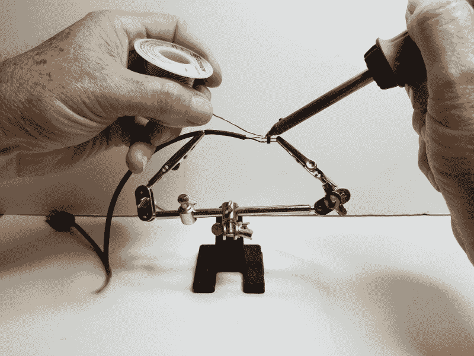
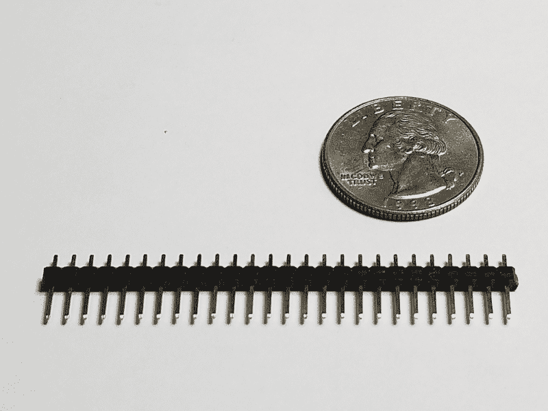
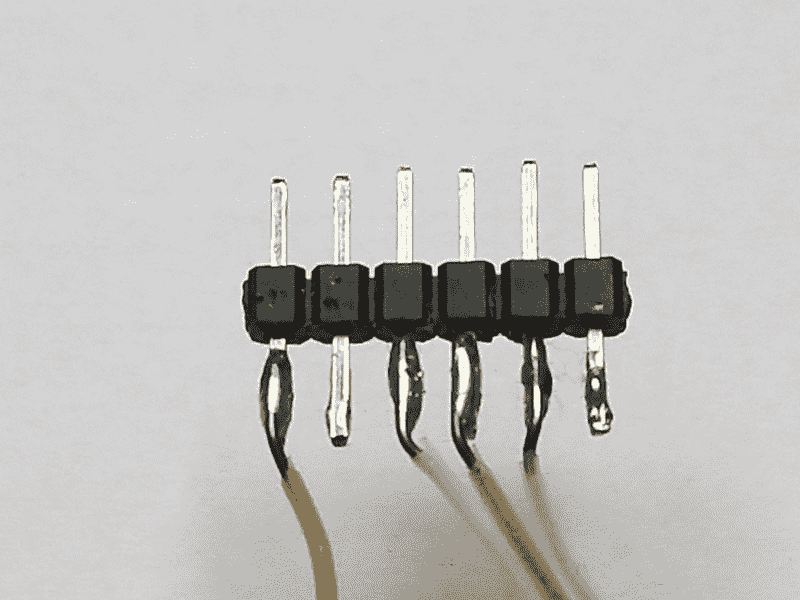

# 现成的黑客:焊接艺术

> 原文：<https://thenewstack.io/off-the-shelf-hacker-the-art-of-soldering/>

很久以前，我为现成的黑客讲述了焊接基础知识。试验板非常适合原型制作和概念验证，同时可以轻松地用短跳线将所有东西连接在一起。如果你使用试验板，很多时候你不需要焊接任何东西。

如果你正在设计更“永久”的原型，远离试验板，使用所有焊接连接，会得到一个坚固、可靠、更便携的结构。虽然焊接每个可见的连接很好，但你仍然需要处理许多 DIY/Maker 电路板上的头部连接。

这一次，我将分享我的技术焊接小股实芯电线到男性头引脚。该过程使得将电线插入 Arduino 接头变得容易。它还适用于仍然需要进入试验板的电线，而不必使用跳线。如果你是焊接新手，这是快速获得宝贵实践的好方法，同时处理小而精确的焊点。

对于有经验的现成黑客来说，将小导线焊接到插头引脚似乎是显而易见的。请记住，我们的读者中有很多新手，他们正在努力克服“LED 灯”的困难。不时传授一些省力的小技巧是有好处的，这样可以保持高涨的热情，并有助于学习动手的手艺。

## 从试验板到引脚

许多现成的黑客项目通过接头将电线连接到印刷电路板。

例如，全尺寸的传统 Arduino 板具有两排 0.1 英寸(2.54 毫米)的母接头，用于连接通用输入/输出、电源和其他接口。连接非常简单，只需将跳线的一端插入接头连接，并将另一端插入试验板上的孔中。

您也可以将裸线的一端插入 Arduino 母接口。有时，如果我不想让这个项目成为一个杂乱无章的跳线鸟巢，我会以这种方式使用裸线。虽然如果你移动任何电路板或电线，它们往往会拔出来。对于需要运输和展示给观众的小玩意来说，这尤其成问题。为了可靠性和易于改装，将电线焊接到一个单独的公引脚或多引脚接头，然后可以插入母 Arduino 接头是可行的方法。单个公插脚非常适合单线。带有多线连接的成排公插头也非常好用，有助于确保电线处于正确的位置。下面是我如何将一根 24 号线焊接到一个标准的 0.1 英寸(2.54 毫米)插头上。

我通常用右手拿着烙铁，左手拿着焊药卷。

帮助手钻机，焊接，烙铁和定位

## 这项技术

从要焊接到插头插脚的电线上剥去大约 1/8 英寸的绝缘层。将钢丝夹入[“第三手”钻机](https://www.harborfreight.com/helping-hands-60501.html)的一侧。对我来说，这是左边。如果你真的想变得漂亮，看看这个[“四手”装置](https://www.amazon.com/QuadHands-Helping-Hands-Third-Soldering/dp/B00GIKVP5K/ref=pd_lpo_vtph_469_tr_t_2?_encoding=UTF8&psc=1&refRID=9YQ3Q4P8NS65VVYGEVQ2)。使用[小烙铁(25 瓦左右)](https://www.radioshack.com/products/radioshack-25w-soldering-iron)将热烙铁头短暂接触焊丝，同时插入焊料末端。需要稳定的双手和一点点的练习才能将焊料整齐地涂在金属丝的顶端。不要把熨斗放在电线上太久，否则绝缘层会使电线收缩，在末端留下一个很长的空白。你可能需要使用侧刀修剪电线回到我推荐的 1/8 英寸长的裸露电线湿了焊料。用焊料润湿表面被称为“镀锡”。

接下来，将 0.1 英寸插头夹入第三只手的另一侧，使短边朝向电线。使用同样的“接触烙铁末端和焊接技术”来给接头销的短边上锡。那应该是朝向电线的一边。根据需要，一个 0.1 英寸的插头销可以从[大块插头销](https://www.banggood.com/10-Pcs-40-Pin-2_54mm-Single-Row-Male-Pin-Header-Strip-For-Arduino-p-918427.html?rmmds=search&cur_warehouse=CN)上折断。我在旧零件箱里备有现成的。

多针插头

现在，您可以调整第三只手来定位电线末端和接头销，使它们紧密接触。小心地，将烙铁的尖端带到接头处，轻轻地接触引脚和导线。焊料应该在两者之间流动，并产生光滑的结果。通常只需要轻轻一碰。嗯，手也很稳。通过练习，你甚至不用用另一只手添加任何焊料。

[https://www.youtube.com/embed/lkmkQWrjEVY?feature=oembed](https://www.youtube.com/embed/lkmkQWrjEVY?feature=oembed)

视频

显然，我应该在拍摄视频前少喝一杯咖啡。

也可以使用第三只手、烙铁和焊料将多根电线连接到一排插头插脚。我喜欢在最终定位之前剥去所有电线和匹配的插头插脚。在接头的两端连接电线有助于在中间获得正确的长度，特别是在制作电缆时。在先前连接的地方进行焊接有点困难。下图说明了多线/公接头排引脚连接。

多线引脚接头和导线

## 更进一步

将小导线焊接到接头引脚上可能看起来微不足道。没有坚固的焊点，你的项目就不会可靠和坚固。哦，当然每个人都在转向回流炉和 DIY 印刷电路板。你猜怎么着？你仍然需要锡的微小组件得到重新流动。

在你现成的黑客技能组合中加入电线到头部的技巧，将会确保你的项目在面对观众和有压力的情况下也能发挥作用。在你的项目中使用可插拔的管脚也可以很容易的把东西拆开来进行修改和再利用。

*赶【Torq 博士的 [现成黑客专栏](https://thenewstack.io/tag/off-the-shelf-hacker/)，每周六，只上新栈！直接联系他，在[doc@drtorq.com](mailto:doc@drtorq.com)或 407-718-3274 咨询和委托项目。*

<svg xmlns:xlink="http://www.w3.org/1999/xlink" viewBox="0 0 68 31" version="1.1"><title>Group</title> <desc>Created with Sketch.</desc></svg>