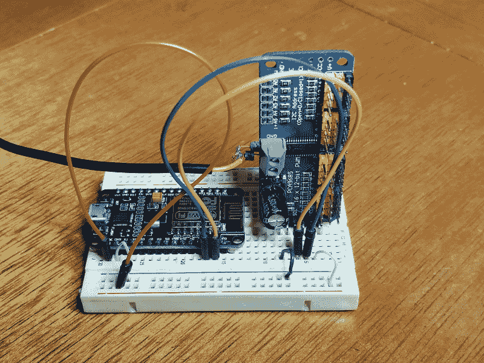

# 现成的黑客:伟大的机器人伺服困境

> 原文：<https://thenewstack.io/off-the-shelf-hacker-the-great-robot-servo-dilemma/>

我的项目，机器人头骨赫德利，有一个可以前后摇动头部的伺服系统。我很快会添加一个使旧头向前和向后倾斜。如果赫德利可以转动他的左眼，或者抬起和放下一条眉毛，那不是更有趣吗？所有的专家都认为，机器人应该有适当的表达能力，以便在它们的人类主人旁边和谐地工作。

我发现一个巨大的技术挑战是控制机器人中“X”个伺服系统。

头部和一个眼球的平移和倾斜相当于四个伺服系统。记得赫德利的右眼窝里有 JeVois 智能视觉传感器。简单的上/下眉毛运动需要另一个伺服系统。现在我们有五个了。显然，Arduino 或 Raspberry Pi 本身无法有效地协调少至五个伺服系统。如果我们想添加更多的眉毛或另一只眼睛呢？

本周我将使用 16 通道伺服/PWM 板制作原型。这个设备位于你的机器人伺服系统和你的机器人微控制器大脑之间，通过 I2C 总线进行通信。所有伺服计时都由电路板处理，因此微控制器只需编写伺服系统应该移动的位置和时间。编写我们的“机器人歌舞表演”也是一个复杂的过程。今天，我们将让电路板开始工作，并深入了解在机器人控制应用中需要考虑哪些因素。

## 连接到节点 MCU

I2C 总线内置于大多数现代微控制器中，包括 Arduino 和 Raspberry Pi。上周，我们探索了使用 I2C 总线来完成 [BME280 大气传感器故事](https://thenewstack.io/off-the-shelf-hacker-portable-atmospheric-readings-with-a-sparkfun-breakout-board/)。它使用两条数据线，一条连接+5 伏和地，所以总共有四条线。伺服控制器董事会谈论 I2C。

我最近从 Banggood 买了一个[三包 PCA9685 16X12 位伺服/PWM 控制器板，价格约为 12 美元。](https://www.banggood.com/3Pcs-PCA9685-16-Channel-12-bit-PWM-Servo-Motor-Driver-I2C-Module-For-Arduino-Robot-p-1188110.html?rmmds=search&cur_warehouse=USA)

在之前的故事中，我使用 NodeMCU 板作为“Arduino”每块主板大约 4 美元，为什么要使用其他东西呢，尤其是考虑到你可以通过相当简单的固件升级来激活 WiFi 连接。将 NodeMCU 连接到伺服板很容易，我使用了试验板来快速完成这项工作。伺服板的一端有一个公接头，所以我简单地将其垂直插入试验板，并在两块板之间连接跳线。快速连接和原理验证是原型制作的关键。从 NodeMCU 到伺服板的连接如下。3.3 伏至 VCC，GND 至 GND，D1 至 SLC，D2 至 SDA。

不能从 NodeMCU 上的 5 伏管脚运行伺服板。它会产生过多的电流，导致不稳定的行为。最好的方法是连接一个至少能提供 1 安培电流的 5 伏壁式电源。我有一个旧的三洋手机型号，容量为 950 毫安。够近了。电缆上的内部导体连接到伺服板上的正极螺丝端子，而编织导体连接到负极端子。平移和颚伺服引线分别与伺服头 0 和 1 配对。将固件上传到 NodeMCU 板后，将 USB 电缆插入标准的 5 伏壁式电源插座。



带 NodeMCU 和伺服控制器的试验板

## 开始测试代码

我从 SunFounder 网站复制了示例程序，并做了一些修改。查看 PCA9685 页面，了解伺服系统如何与脉宽调制(PWM)配合工作的有趣的复习说明。

在试图编译和运行你的伺服程序之前，一定要在 Arduino IDE 中安装 Adafruit PWM 伺服驱动库。我用的是 2.0.0 版。

```
#include 

// called this way, it uses the default address 0x40
Adafruit_PWMServoDriver pwm  =  Adafruit_PWMServoDriver();

#define MIN_PULSE_WIDTH       650
#define MAX_PULSE_WIDTH       2350
#define DEFAULT_PULSE_WIDTH   1500
#define FREQUENCY             50
// our servo # counter
uint8_t servonum  =  0;

void setup()  {
  Serial.begin(115200);
  Serial.println("16 channel Servo test!");
  pwm.begin();
  pwm.setPWMFreq(FREQUENCY);  // Analog servos run at ~60 Hz updates
}

void loop()  {
  pwm.setPWM(0,  0,  pulseWidth(60));  // panning the skull
  Serial.println("90");
  delay(500);

  pwm.setPWM(0,  0,  pulseWidth(100));
  Serial.println("100");
  delay(500);

  pwm.setPWM(0,  0,  pulseWidth(120));
  Serial.println("120");
  delay(500);

  pwm.setPWM(0,  0,  pulseWidth(100));
  Serial.println("100");
  delay(500);

  pwm.setPWM(0,  0,  pulseWidth(60));
  Serial.println("90");
  delay(500);

  pwm.setPWM(1,  0,  pulseWidth(95));  // open jaw
  Serial.println("90");
  delay(500);

  pwm.setPWM(1,  0,  pulseWidth(120));  // closed jaw againt teeth
  delay(500);

}

int pulseWidth(int angle)
{
  int pulse_wide,  analog_value;
  pulse_wide =  map(angle,  0,  180,  MIN_PULSE_WIDTH,  MAX_PULSE_WIDTH);
  analog_value  =  int(float(pulse_wide)  /  1000000  *  FREQUENCY *  4096);
  Serial.println(analog_value);
  Serial.println();
  return analog_value;
}

```

我们从常见的变量、初始化和库引用开始。类似地，设置从串行通信开始，并执行库调用以打开 PWM 通道。

接下来， **pwm.setPWM()** 功能使用 **pulseWidth()** 功能将角度转换为脉冲宽度，将指定的伺服移动到所需的角度位置。然后在移动之间有半秒钟的延迟，整个序列重复。伺服 0 是平移伺服，1 是钳夹伺服。

在这种情况下，赫德利来回移动他的头，然后在主循环的每个循环中开合他的下巴。

请记住，你可能应该开始与几个松散的伺服重视伺服控制器板。让一切正常工作，然后计算出实际机器人伺服系统的开始和停止位置。例如，我查阅了过去的实验笔记，发现赫德利的张角和闭角分别是 95 度和 120 度。当我把伺服板连接到赫德利的伺服系统时，我最初使用了 90 和 115 来确保我没有把伺服系统撞进它们的机械极限，因此可能会把内部齿轮剥离。第一次运行伺服程序时，要随时准备拔掉电源插头。

在确认我不会打破任何东西后，在将控制板插入实际的机器人伺服系统后，我很容易地慢慢移动到一个稍微关闭的下巴和一个没有击中赫德利颈骨的开放位置。

[https://www.youtube.com/embed/iZgjfLO5Ifg?feature=oembed](https://www.youtube.com/embed/iZgjfLO5Ifg?feature=oembed)

视频

## 下一步是什么

现在我们知道了棋盘在工作，伺服系统在移动，是时候弄清楚如何轻松地配置一场“表演”了，这样赫德利可以移动他的头，张开他的嘴，说话，这样一切看起来都很真实。

我也许可以建立一个遵循“脚本”的处理程序，这样我就可以在一次技术演讲中与赫德利互动。我还不确定如何运行音频分析(将下颚与音频同步)程序，同时移动平移/倾斜伺服系统。

我甚至不确定音频分析程序是否会通过伺服控制板运行。该领域的实验可能是下一个议程。

无论如何，构建机器人和物理计算系统是富有挑战性和乐趣的。我很高兴能与读者分享我的发现、成功和偶尔的失误。

*赶【Torq 博士的 [现成黑客专栏](https://thenewstack.io/tag/off-the-shelf-hacker/)，每周六，只上新栈！在[doc@drtorq.com](mailto:doc@drtorq.com)或 407-718-3274 联系他进行咨询、演讲和委托项目。*

<svg xmlns:xlink="http://www.w3.org/1999/xlink" viewBox="0 0 68 31" version="1.1"><title>Group</title> <desc>Created with Sketch.</desc></svg>