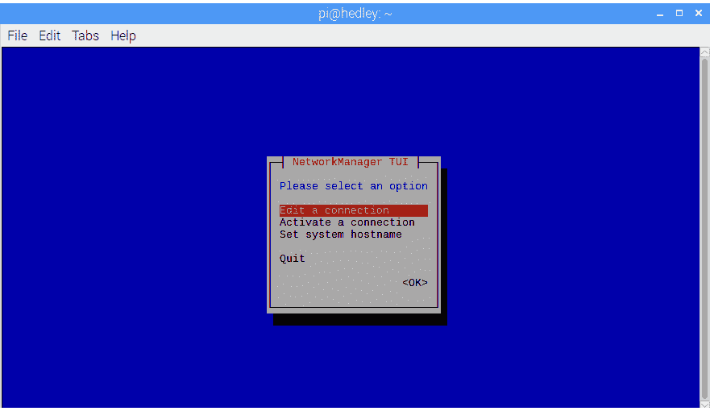

# 现成的黑客:有线和无头的树莓派

> 原文：<https://thenewstack.io/off-the-shelf-hacker-the-wired-and-headless-raspberry-pi/>

我想在一个没有 120 伏电源插座的地方演示一个树莓 Pi 3 项目。没问题，只需将 Pi 插入 USB 手机模块，我们就可以开始了，对吗？问题是，我还必须使用几个桌面应用程序进行演示。这通常由显示器和无线键盘来处理。

没有显示器你怎么运行桌面程序？

通过 Wi-Fi 或路由器的有线连接登录到 Raspberry Pi，并使用 [ssh](https://www.ssh.com/ssh/protocol/) 从另一台联网的机器上执行应用程序是很常见的。没有 Wi-Fi，没有网络，没有路由器怎么办？好消息是，你可以用一根[备用以太网电缆](https://www.amazon.com/InstallerParts-CAT5E-Ethernet-Cable-Black/dp/B008ILCY1G/ref=sr_1_10?s=pc&ie=UTF8&qid=1533651101&sr=1-10&keywords=6ft+cat+5+cable)将一个 Pi 连接到你的 Linux 笔记本电脑，甚至是另一个带微型 LCD 显示屏的 Pi。这就是所谓的点对点网络，也是我们今天要讨论的内容。我们也会成为[无头](https://en.wikipedia.org/wiki/Headless_computer)。

## 基本设置

实际上，您需要使用监视器和键盘/鼠标垫在您的目标 Raspberry Pi 上进行初始对等网络设置。一旦一切正常，你就可以运行 Pi headless(没有显示器或键盘)并访问外部机器上的所有程序。对等网络技术可以在任何带有 RJ-45 以太网端口的 Raspberry Pi 上工作。

特别是 Pi 3，它还内置了 Wi-Fi 收音机。我们的修改设置不会影响现有的 Wi-Fi 配置，所以当你回到一个友好的 AP 的范围内时，只需 ssh 通过 Wi-Fi 进行远程登录。

为了方便起见，我将有线连接配置为点对点连接，因为当连接到 Wi-Fi 接入点时，我通常不需要它来连接互联网。

启动 Pi 并确保您已连接到 Wi-Fi 接入点(AP)。检查工具栏右上角的小 Wi-Fi 指示器。它应该显示熟悉的电弧信号线。您也可以单击该符号，在您的 AP 名称旁边应该会有一个复选标记。如果没有，请连接到您的本地 AP。

接下来，使用基于 curses 的 NetworkManager 前端程序来配置对等网络。

## 什么是基于诅咒的？

Linux 有几种用户界面模式。一个是桌面。应用程序以图标的形式出现，并在运行时显示各种窗口。桌面可能在顶部有一个任务栏和颜色装饰来控制窗口。

还有就是命令行。命令行在终端中运行。它可以在桌面上的终端窗口中，也可以在串行终端上，没有桌面环境。你输入命令并使用回车键来执行它们。

另一个用户界面叫做 [curses](https://en.wikipedia.org/wiki/Ncurses) 或者最近的新 curses (ncurses)。curses 应用程序创建了一种文本菜单驱动的数据输入方式。您可以使用箭头键和 tab 键在菜单中移动。Curses 可以在桌面环境下工作，也可以不在桌面环境下工作，但是它比命令行更容易使用。您甚至可以通过 ssh 使用它。因为它是基于文本的，所以您不需要像通常运行远程桌面应用程序那样在 ssh 中使用“-X”选项。

在这种情况下，我们使用一个名为 [nmtui](https://developer.gnome.org/NetworkManager/stable/nmtui.html) 的程序来改变以太网电缆上点对点网络的网络参数。Nmtui 是[网络管理器包](https://developer.gnome.org/NetworkManager/stable/NetworkManager.html)的一部分，所以你应该可以使用 Raspbian 的最新标准版本。

首先在 Pi 上打开一个终端，并从命令行运行 nmtui。典型的诅咒式显示将出现在监视器上。所有的 curses 应用程序看起来都像这样:



nmtui 主菜单

箭头指向“<edit a="" connection="">”菜单项，并按回车键。将出现一个新窗口，并且“有线连接 1”项目应以红色突出显示。切换到“<edit>”菜单项，并再次点击回车。</edit></edit>


编辑连接菜单

下一个屏幕显示配置文件和设备名称以及各种其他参数。向下箭头至“<= IPv4 CONFIGURATION>”选项，然后按回车键。


配置文件和设备菜单

一个新的列表将会弹出。


IPv4 配置弹出菜单

向下箭头至“<shared>”，然后按回车键。“IPv4 配置”项现在将显示“<shared>”。切换到右边的“确定”，然后按回车键。向下移动到“<back>”并按回车键。</back></shared></shared>

您现在应该回到主网络管理器 TUI 窗口。向下箭头到“退出”，最后一次按回车键。

差不多就是这样。如果您想返回使用常规有线以太网，比如说互联网访问，只需返回 IPv4 配置值，回到“自动”

现在使用 [ifconfig](https://linux.die.net/man/8/ifconfig) 查看 Pi 3 上运行的网络接口。如果你想成为新学校，使用 [ip 命令](https://blog.ubuntu.com/2017/07/07/if-youre-still-using-ifconfig-youre-living-in-the-past)。

您应该会在顶部看到有线以太网设备，其次是 lo 设备，底部是 Wi-Fi (wlan0)设备。我的 Pi 的有线连接显示为 10.42.0.1 IP 地址。Wi-Fi 设备连接为 192.168.1.107。这些是相当标准的 IP 地址。

您的网络接口应该类似于下面的屏幕截图。


树莓 Pi 3 的 ifconfig 结果

## 有线和无头

将以太网电缆的一端插入 Raspberry Pi 的端口，另一端插入您的 Linux 笔记本。笔记本应该立即连接到新的有线对等网络，并将任务栏上的网络管理器图标更改为向上/向下箭头。

滑到 Linux 笔记本上，打开一个终端。在此计算机上运行 ifconfig 以检查网络接口。请注意，有线以太网地址现在与 Pi 具有相似的 IP 地址。Pi 地址大约是 10.42.0.1，Linux 笔记本大约是 10.42.0.224。把 Pi 想象成服务器，所以它的末尾会有一个 1。

这很棒，因为当你在现场时，你不必像通过 Wi-Fi 那样四处搜索树莓 Pi 3 的 IP 地址。

此外，现代有线以太网端口可以使用两端都有 RJ-45 连接器的标准跳线。不需要像过去那样的[“交叉”电缆](https://en.wikipedia.org/wiki/Ethernet_crossover_cable)。

接下来，使用 ssh 从笔记本登录到 Pi。比如:

```
drtorq-notebook%  ssh  -X  pi@10.42.0.1

```

输入密码，我们现在应该在无头码头上直播了。当你在野外时，WiFi 连接无法工作，因为它没有连接到已知的接入点。别理它。

连接到 Pi 后，我们可以随心所欲地运行桌面应用程序。我的项目需要 guvcview 和 luvcview。他们都工作得很好。与 WiFi 相比，它们通过机器之间的有线连接也非常快。

在您的下一个超便携的 Raspberry Pi 项目中尝试一下这种技术。我想你会发现它非常有用。

由[美嘉](https://unsplash.com/photos/43E513RKDug?utm_source=unsplash&utm_medium=referral&utm_content=creditCopyText)在 [Unsplash](https://unsplash.com/search/photos/headless?utm_source=unsplash&utm_medium=referral&utm_content=creditCopyText) 上拍摄的特征图像。

<svg xmlns:xlink="http://www.w3.org/1999/xlink" viewBox="0 0 68 31" version="1.1"><title>Group</title> <desc>Created with Sketch.</desc></svg>