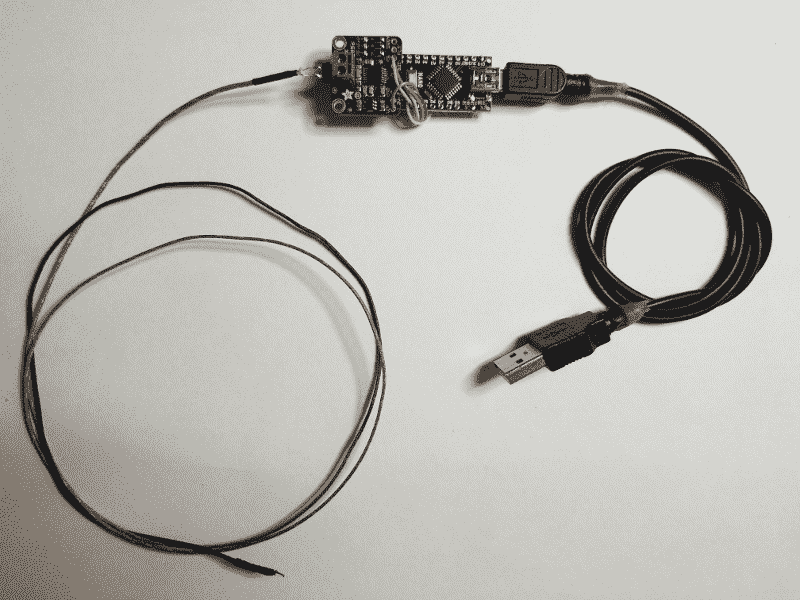
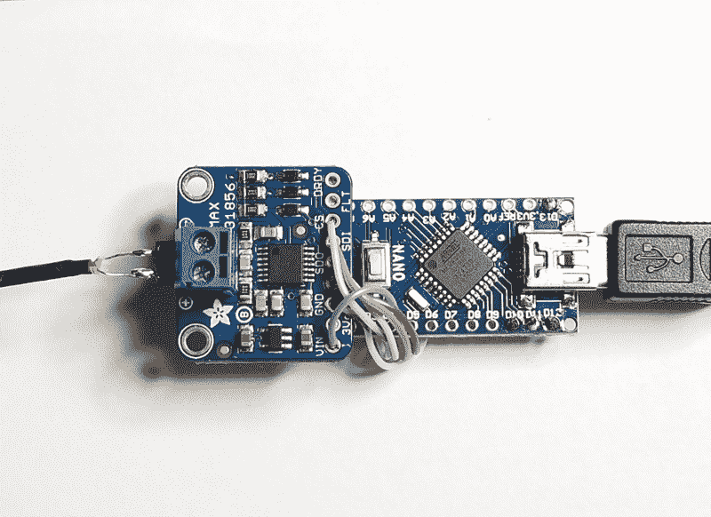

# 现成的黑客:在烤架上扔一个热电偶

> 原文：<https://thenewstack.io/off-the-shelf-hacker-throw-a-thermocouple-on-the-grill/>

计划是升级旧的高温热电偶装备，然后讨论将它与显示读数的屏幕模拟仪表集成。这份用 [Processing](https://processing.org/) 编写的量表看起来很棒，符合我构建的可穿戴设备和便携式系统的美学。它可以在个人电脑或我的 Linux 笔记本上运行。

嗯，我偏离了测试新的和改进的热电偶模块，一个测量 500 华氏度及以上温度的组件。心血来潮，我将修改后的设备插入我的[树莓派蒸汽朋克徽章](https://www.designnews.com/gadget-freak/linux-steampunk-conference-badge/188204818057638)上的 USB 端口，并将整个作品传送到我的 BBQ 烤架上。徽章运行 Raspbian Linux，有一个 3.5 英寸的彩色触摸屏和一个 5 伏的手机电源组。我们在为母亲节做汉堡，我想看看我是否能很好地了解木炭烤架内的实际烹饪温度。

因此，我们将在不久的将来介绍屏幕模拟仪表设置。



采用 Arduino Nano 的全新改良型热电偶 USB 模块

在热电偶/格栅建造和测试会议中，出现了一些有趣的“真实世界”观察结果，我想与读者分享。

第一个观察:我女儿的男朋友似乎对我古怪的发明者印象深刻。你说了几个点来迁就我，孩子。继续努力。

## 构建传感器模块

新的“高温 USB 传感器模块”使用了一个[热电偶](https://www.adafruit.com/product/270)，一个通用[放大器](https://www.adafruit.com/product/3263)，一个 [Arduino Nano](https://www.banggood.com/ATmega328P-Nano-V3-Controller-Board-Compatible-Arduino-p-940937.html?rmmds=detail-left-hotproducts__1&cur_warehouse=USA) 和一根 USB 电缆。

最初的热电偶项目有点笨拙。它拥有所有相同的部件，除了一个全尺寸的 Arduino NG 板作为微控制器，而不是今天的小型化 Arduino Nano。最小化是我的项目超越 1.0 版本级别的最高进化目标。它是出于需要而诞生的。我总是不得不为我的技术会议演示拖着一大堆装备。削减重量、尺寸和复杂性减少了故障，对旧的背部来说容易得多。升级到“纳米”零件版本有助于形成整洁紧凑的思维模式。



热电偶特写——Arduino Nano USB 模块

转换到 Nano 并不难。由于 22 号实芯线已经直接焊接到放大器板上，因此只需一次切断一根实芯线，并将其从 Arduino NG 板上移开即可。这样我就不用再去查找引脚了。如果您是从零开始构建，这里有一些联系。

导线足够坚硬，可以将放大器板固定在 Nano 的上方或下方。很快，我会设计一个蒸汽朋克主题的小盒子来保护板子。

## 使用高温传感器模块进行测量

使用该模块非常简单。我将 USB 连接器插入蒸汽朋克徽章上的一个端口，运行一个脚本来查看读数。

在 Linux 机器上通过 USB 获取数据有时有点古怪。偶尔，你会插上电源线，毫不费力地得到一串漂亮的数字。其他时候你会坐在那里想为什么什么都没发生。对我来说，这通常意味着端口设置关闭。运行“stty”命令可以解决这个问题。

在会议徽章上，我只是写了一个小脚本程序，在用“cat”命令读取值之前运行 stty。

```
stty  -raw  -icrnl  -F  /dev/ttyUSB0  115200
cat  /dev/ttyUSB0

```

我将代码保存到一个名为 hitemp.sh 的文本文件中，使其可执行，然后将其复制到徽章上的“桌面”目录中。现在，我只需在触摸屏上点击文件，在终端上运行它，就能看到温度读数流过。

通过 USB 传输数据可以很容易地将数值输入到屏幕模拟仪表处理程序中，我们将在另一篇文章中讨论。

[https://www.youtube.com/embed/86wuqpeofTk?feature=oembed](https://www.youtube.com/embed/86wuqpeofTk?feature=oembed)

视频

## 烧烤的教训

对于硬件原型，我总是建议在真实环境中进行测试。换句话说，在实验室之外。在一个炎热的周日下午，用 BBQ 烤架进行测试在当时似乎是一件合理的事情。总之，对于一个现成的黑客来说。

用胶带、电线和胶水串在一起的小工具，即使在 2.0 或 3.0 版本中，也经常为设备的未来可用性指出潜在的棘手问题。每一次发展都解决并产生了可能需要解决的新挑战。

例如，热电偶板上的输入引脚一度接触到蒸汽朋克徽章上的一个黄铜指旋螺钉。读数表上出现了“超出范围”的信息。我首先注意到这条信息，然后发现针脚短路了。将针脚从指旋螺钉上移开，数据恢复正常。多酷啊。热电偶板实际上可以告诉你出了什么问题。更妙的是，板子没炸。同样，当我不小心将热电偶探针从输入引脚断开时，会出现“热电偶开路故障”消息。我重新连接了导线，数值回到了正常范围。

我们将不得不考虑在新项目中加入模块故障自报告特性。

> 几秒钟之内，读数达到 600，然后 700，然后 800，并一直持续下去。当读数超过 901 时，我迅速打开盖子，拔出探针。

显然，需要在热电偶输入引脚周围添加一些热缩管，以加强和隔离与电路板的连接。也许还应该考虑某种用于商业“生产”热电偶的标准插座。

发生的另一件事是，我不小心测试了热电偶范围的高端。热电偶末端的质量非常小。毕竟，这只是两根不同的电线焊接在一起。

最初，热电偶端放在加热格栅的顶部，盖子轻轻关闭。读数立刻上升到华氏 350 度，内置的机械烤架温度计显示为 275 度。请记住，它安装在烤架罩的最顶端。加热格栅在木炭上方大约 8 英寸的垂直位置。炉栅也在取暖烤架和煤块之间。

接下来，让我们来看看一个汉堡面临怎样的火热死亡。我们将探头端放在格栅(烧烤)表面的顶部，观察数据读数。

几秒钟之内，读数达到 600，然后 700，然后 800，并一直持续下去。当读数超过 901 时，我迅速打开盖子，拔出探针。K 型热电偶在高达华氏 900 度时仍能正常工作。幸运的是，没有发生任何不好的事情，读数很快恢复到正常水平。测量是在热的天然木炭上方大约 4 英寸处，在炉栅的顶部进行的。

不用说，我需要一个温度更高的热电偶。这里有一些额定温度高达 1800 摄氏度，也就是 3270 华氏度！我的烤架可能没有那么脆，尽管看看它在华氏 900 度以上的温度下到底能烤多脆会很有趣。

## 继续做饭

偏离计划是发现新事物的好方法。今天的物理计算硬件模块是更大项目和应用的构建模块。充分利用实验室中的混合和搭配，找到新的应用，发现自己的新事物。

我们即将庆祝[人类登上月球](https://en.wikipedia.org/wiki/Moon_landing)50 周年。那是一个巨大的项目规划过程，即使在今天，对我来说似乎也难以理解。他们通过尝试事情，看看什么有效，然后做出调整以获得积极的结果。

所有级别的现成黑客都可以做同样的事情。神奇在于做和尝试。

*赶【Torq 博士的 [现成黑客专栏](https://thenewstack.io/tag/off-the-shelf-hacker/)，每周六，只上新栈！直接联系他或给他留言咨询、演讲和委托项目，电话:[doc@drtorq.com](mailto:doc@drtorq.com)或 407-718-3274。*

<svg xmlns:xlink="http://www.w3.org/1999/xlink" viewBox="0 0 68 31" version="1.1"><title>Group</title> <desc>Created with Sketch.</desc></svg>