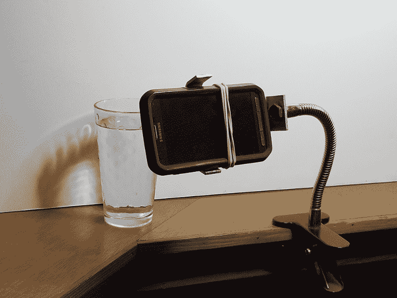

# 现成的黑客:在你的下一个技术视频中使用画中画

> 原文：<https://thenewstack.io/off-the-shelf-hacker-use-picture-in-picture-in-your-next-tech-video/>

演示热电偶等物理计算工具与屏幕仪表交互的一种有趣方式是使用“画中画”(PiP)视频合成技术。

截至发稿时，我还没有准备好上周故事的视频，所以我只是随着屏幕上的节拍上下移动。读者不得不相信热电偶实际上是工作的。确实如此。今天，我们将做一个制作视频的快速教程，详细介绍如何在 [Kdenlive](https://kdenlive.org/en/) 开源视频编辑器中使用“画中画”技术。

## 你需要夹子

完成的视频是整个 Linux 桌面的，血糖仪在处理 IDE 下运行。工作热电偶的小嵌入视频叠加在大视频的右下角。另一个例子可能是当我们来回推动屏幕上的滑块时，显示伺服激活机制的移动。我用华硕笔记本进行视频编辑，因为树莓派对这类工作来说有点动力不足。您当然可以在 Pi 上显示完成的剪辑。

我们需要一个上下移动的仪表的截屏剪辑，以及一个小工具(热电偶)进出热水的单独视频。本质上这是一个双摄像头的过程。

捕捉屏幕上的仪表非常简单，在最近关于[在视频](https://thenewstack.io/off-the-shelf-hacker-capture-a-screen-demo-on-video/)上捕捉屏幕演示的文章中有所涉及。小工具片段是在我的[三星 Galaxy S8+智能手机](https://www.samsung.com/global/galaxy/galaxy-s8/)上拍摄的。需要一个“免提”支架，因为不可能同时操作热电偶、协调所有视频处理和手持智能手机摄像头。很久以前，我为 Galaxy 手机制作了一个鹅颈支架，用于参加电话会议和为我的演讲提案拍摄短视频。

旧款 Galaxy S5 智能手机的鹅颈支架

Galaxy 手机用一根大橡皮筋固定在底座上，整个装置夹在我桌子边缘的唇边。手机被定向为水平拍摄视频。这里不需要 1000 美元！

## 同步两个视频程序

在命令行运行 [stty](https://linux.die.net/man/1/stty) 以确保数据可用于[加工](https://processing.org/)量规程序。开始处理并加载热电偶仪表程序。当你将热电偶探头放入和取出热水时，测试仪表指针上下移动。

启动[简单屏幕记录器](https://www.maartenbaert.be/simplescreenrecorder/)。指定保存视频文件的文件名和目录。先不要开始录音。我们需要同步录制屏幕与录制小工具剪辑。

在 Galaxy 手机上启动视频录制程序。定位摄像机，使玻璃和热电偶出现在框架的中心。确保该程序设置为捕获视频，而不是照片。

点击 Galaxy 手机上的“录制”按钮，开始录制小工具剪辑。立即点击 Linux 笔记本上 SimpleScreenRecorder 程序的“开始录制”按钮。最小化录制窗口，使其不在桌面框架中。

拿起热电偶，在热水中浸泡几次。桌面上的计量器应该上下移动。

单击 SimpleScreenRecorder 录制窗口上的取消最小化按钮，并按下“暂停录制”按钮以停止屏幕捕捉。单击窗口底部的“保存录像”按钮，将剪辑写出到文件中。

接下来，单击 Galaxy 视频程序上的“录制”按钮，停止录制小工具剪辑。保存文件并将其转移到 Linux 笔记本上。电子邮件非常适合在不同的机器上给自己发送照片或视频。对于较大的文件，通过插入手机和笔记本的 USB 线发送。

现在笔记本上有了这两个文件，我们可以将它们合并成一个视频文件。

## 把图片放在图片里

在 Linux 笔记本上启动 Kdenlive。

在剪辑列表区域点击“添加剪辑”菜单标签。从文件列表中选择嵌入的视频剪辑。抓取视频并将其放在 2 号视频时间轴上。

再次单击“添加剪辑”选项卡，并从文件列表中选择屏幕截图视频。抓取视频并将其放在 1 号视频时间轴上。

突出显示视频 1 号时间轴。在剪辑监视器中播放视频，直到您看到指示器开始向上移动。这应该相当于将热电偶浸入热水中。记下时间线的位置。现在选择视频 2 号时间轴。抓住并滑动视频，使热电偶浸入水中与仪表向上移动同步。您可以观察剪辑监视器，并使用时间线位置指示器将两个剪辑非常紧密地对齐。

接下来，在仍然突出显示视频时间线 2 的同时，右键单击并选择“添加过渡”，然后选择“合成”单击橙色复合过渡框的右/左边缘，穿过两条时间线，并调整其大小以适合时间线 2(嵌入的小工具剪辑)。将时间线位置指示线移到重叠片段上的任何位置。再次单击橙色复合转场框，在剪辑监视器窗口中调出复合转场配置窗口以及视频帧周围的红色框。抓住红色框的一角，将小工具剪辑窗口缩小到合理的大小。抓住红色框的中心，将窗口移动到桌面捕获视频剪辑的右下部分。使用时间线位置指示线和剪辑监视器来查看桌面视频与叠加的小工具视频的外观。你可能需要调整一下周围的一切，让它同步起来，看起来不错。

最后，点击 Kdenlive 屏幕顶部的“渲染”按钮。设置输出文件名，并按下窗口底部的“渲染到文件”按钮。几分钟后，会出现一个 MP4 文件，你可以用 mplayer 播放或者上传到 YouTube。

这是视频，前面插了一个标题页。在渲染输出文件之前，我还静音了两个剪辑中的音频。

[https://www.youtube.com/embed/R2EtkzGr4Wo?feature=oembed](https://www.youtube.com/embed/R2EtkzGr4Wo?feature=oembed)

视频

## 那是一个包裹

将两个视频组合成一个复合演示剪辑似乎需要很多步骤。一旦你这样做了几次，你会发现很多地方你可以简化这个过程，并为你的技术视频演示游戏添加一些专业的东西。使用 MP4 格式(H264/ACC)渲染可以以合理的文件大小提供高质量的视频。

Galaxy 是一款很棒的手机，非常适合为文章拍摄视频或照片。你在 OTSH 上看到的所有照片和视频都来自 Galaxy 智能手机，要么是现已退役的 S5 Active，要么是我目前的 S8+。我在想，我可能会尝试几个多摄像机剪辑的旧 S5，因为它是付费的，现在只是收集灰尘。仍然可以作为相机使用。这是另一个故事的主题。

*赶【Torq 博士的 [现成黑客专栏](https://thenewstack.io/tag/off-the-shelf-hacker/)，每周六，只上新栈！在[doc@drtorq.com](mailto:doc@drtorq.com)或 407-718-3274 直接联系他咨询、演讲出场和委托项目。*

<svg xmlns:xlink="http://www.w3.org/1999/xlink" viewBox="0 0 68 31" version="1.1"><title>Group</title> <desc>Created with Sketch.</desc></svg>