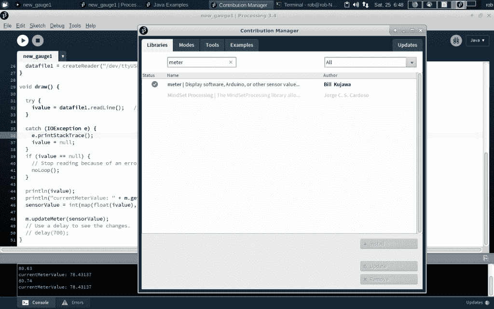

# 现成的黑客:使用 Processing 的仪表库来构建仪表

> 原文：<https://thenewstack.io/off-the-shelf-hacker-use-processings-meter-library-to-build-gauges/>

我用[处理编程语言](https://processing.org/)拼凑了几个仪表接口。在其中一个例子中，我通过编程从[线条、弧线和文本](/off-shelf-hacker-use-processing-build-screen-gauge/)中构建了标尺元素。在另一个项目中，我在屏幕上放了一个仪表的[图像，然后围绕中心支点](/off-shelf-hacker-give-screen-gauges-new-face/)旋转指针的图像。每种方法都有其优势和挑战。

Processing 有很多很酷的库。今天我们将探索我发现的一个处理库，它可以制作非常漂亮的现代仪表。它使用编程的仪表元素构建方法，并且有大量的参数，您可以根据自己的需要进行调整。只需设置一个值，仪表显示就会改变。这比我在程序代码中调整大小、颜色和标尺行为的原始方案更容易使用。

## 在加工过程中安装仪表库

我在 Linux 笔记本和 Raspberry Pi 3 上都使用了处理版本 3.4，所以你可能希望至少升级到那个级别。当前版本是 3.5.3。

开始处理并转到 Sketch 选项卡，将鼠标悬停在 Import Library 菜单项上，然后从列表顶部选择 Add Library。将出现“贡献管理器”窗口。

在搜索框中键入“米”，然后按回车键。应该会出现 Bill Kujawa 的仪表库。选择它并按下右下角的安装按钮。安装完成后关闭窗口。



显示血糖仪库的处理库贡献管理器屏幕

我从示例部分中的“整圈测量仪”程序开始，作为我的测量仪的基础。单击文件–>示例–>贡献的库–>计量器。在列表中，选择“整圆流量计”。

## 关于输入数据的一句话

我尝试过的将数据从微控制器传输到 Linux 笔记本电脑或 Raspberry Pi 上的处理仪表程序的方法是通过 USB 端口。当然，Arduinos 可以通过 USB 电缆传输数据，也可以用它来供电。

我还使用热电偶/放大器装置来提供数据流。我们在最近的故事中用过。这个小发明可以测量高达 900 华氏度的温度。我任意选择零作为仪表将显示的最低值。我们从微控制器读取“数据”,因此您可以选择任何值开始和结束。这些值可以很容易地显示为一个百分比，比如从 0%到 100%，只需对处理代码稍加修改。指向“低”、“中”或“高”的仪表指针可能适用于某些情况。

让我们看看代码。

## 代码

一旦安装了这个库，它就只是获取数据，设置显示参数，然后调用仪表显示函数。

```
import meter.*;

Meter  m;
int sensorValue;
String ivalue  =  "0";
BufferedReader datafile1;

void setup()  {

  size(600,  300);
  background(150,  255,  100);

  m  =  new Meter(this,  90,  15,  false);  // full circle - true, 1/2 circle - false  

  m.setMinScaleValue(0);
  m.setMaxScaleValue(1000);

  // Display digital meter value.
  m.setDisplayDigitalMeterValue(true);
  m.setTitle("Thermocouple Temp");

  String[]  scaleLabels  =  {"0",  "100",  "200",  "300",  "400",  "500",  "600",  "700",  "800",  "900",  "   1000"};
  m.setScaleLabels(scaleLabels);
  m.setShortTicsBetweenLongTics(9);

  datafile1  =  createReader("/dev/ttyUSB0");
}

void draw()  {

  try  {
    ivalue  =  datafile1.readLine(); // after startup pull in serial data
  }

  catch  (IOException  e)  {
    e.printStackTrace();
    ivalue  =  null;
  }
  if  (ivalue  ==  null)  {
    // Stop reading because of an error or file is empty
    noLoop();  
  }

  println(ivalue);
  println("currentMeterValue: "  +  m.getCurrentMeterValue());
  sensorValue  =  int(map(float(ivalue),  float(0),  float(1000),  float(0),  float(256)));

  m.updateMeter(sensorValue);
  // Use a delay to see the changes.
  // delay(700);
}

```

虽然处理代码遵循正常的初始化变量、“设置”和“绘制”格式，但仍有一些地方需要特别注意。

“m”是要显示的每个仪表的高级变量。使用“m.set[parameter name]”形式的变量设置参数。例如，显示在仪表顶部的标题文本显示为“m.setTitle("热电偶温度")；”在代码中。在我查看“SetAllValues”脚本之前，参数的变量名并不直观。在这里您可以找到参数的名称和典型值。一旦你掌握了使用变量的窍门，你就需要熟悉可能的值，并看看它在显示屏上是什么样子。在大多数情况下，我使用默认值，并且只在代码中放入我更改过的值。

我添加的是“catch”函数周围的线条。似乎如果不包含查找 IOException 情况的代码，就会在程序执行过程中出错。我第一次运行没有 catch 函数的程序，得到了 IOException 错误。不知何故，我记得在另一个例子中见过错误处理程序。将代码复制粘贴到我的脚本中…问题就解决了。

我不是全职程序员，我依赖于记忆看似随机的战略信息，这些信息在未来可能会有用。这是现成的黑客似乎随着时间的推移而发展起来的“直觉”技能之一。不要质疑为什么，甚至不要质疑我们是如何做的，只要用它来完成工作。确保在您的实验笔记中捕捉到“真知灼见”,以供后代参考。

我还使用标准的“map”处理函数来缩放输入值，以适应 0 到 180 度的仪表面，从 0 到 1000。您需要根据您使用的传感器输入数据进行调整。请记住，Arduino 代码可能会在处理显示代码之前进行一些数据缩放。

最后，请注意，我在 scaleLabels 变量中的“1000”前面包含了一些额外的空格。标签正对着厚厚的黑色半弧规图形，看起来局促。空格给了它一个与其他标签一致的外观。

在运行处理程序之前，不要忘记在终端中插入传感器并使用通常的 stty 命令，以便 USB 端口配置正确。否则，您可能会看到仪表，但没有任何数据通过 USB 线传入。

```
rob% stty  -raw  -icrnl  -F  /dev/ttyUSB0  115200

```

这里有一个温度计的短片，通过 USB 连接热电偶输入。

[https://www.youtube.com/embed/8QbiA7XSGN0?feature=oembed](https://www.youtube.com/embed/8QbiA7XSGN0?feature=oembed)

视频

布局非常干净高效。这些仪表非常适合屏幕仪表盘，尤其是带有多个传感器的仪表盘。

## 下一步是什么

我还没有发现很多用于 Arduino 和/或处理传感器项目的仪表或量表库。我猜，很多人只是将传感器读数发送到他们 Arduino 上的一个小 LCD 上。

一个可能值得探索的领域是在 ESP8266 上实现代码，通过 WiFi 将传感器数据发送到联网的 Linux 机器上的处理仪表程序。一个应用程序可能是独立的，就像某种 Linux 笔记本到无人机传感器，在野外使用。或者，我们可以在野外或建筑物顶部安装一个无线传感器，通过本地网络连接到处理仪表。

*赶【Torq 博士的 [现成黑客专栏](https://thenewstack.io/tag/off-the-shelf-hacker/)，每周六，只上新栈！在[doc@drtorq.com](mailto:doc@drtorq.com)或 407-718-3274 直接联系他咨询、演讲出场和委托项目。*

<svg xmlns:xlink="http://www.w3.org/1999/xlink" viewBox="0 0 68 31" version="1.1"><title>Group</title> <desc>Created with Sketch.</desc></svg>